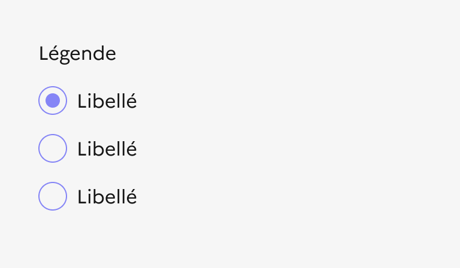

## Bouton radio

Le bouton radio est un élément d’interaction avec l’interface permettant à l’usager de réaliser un choix unique parmi plusieurs options.

:::dsfr-doc-tab-navigation

- [Présentation](../index.md)
- [Démo](../demo/index.md)
- Design
- [Code](../code/index.md)
- [Accessibilité](../accessibility/index.md)

:::

:::dsfr-doc-anatomy{imageWidth=384 col=12}

::dsfr-doc-pin[Une légende]{required=true add='décrivant le contexte du groupe de boutons radio'}

::dsfr-doc-pin[Une description additionnelle]{add='pour la légende'}

::dsfr-doc-pin[Un bouton radio]{required=true}

::dsfr-doc-pin[Un libellé]{required=true add='associé à chaque bouton'}

::dsfr-doc-pin[Un texte additionnel]{add='accompagnant chaque bouton / libellé'}

:::

### Variations

**Liste horizontale**

Privilégier les listes verticales aux listes horizontales, plus difficiles à lire pour l’utilisateur.

::dsfr-doc-storybook{storyId=radios-group--inline-group}

Cette variation horizontale est donc à utiliser uniquement lorsqu’il n’y a que 2 options possibles ou que les libellés des entrées sont courts.

**Liste avec texte d’aide**

Il est recommandé d’ajouter un texte d’aide qui accompagne les boutons radio afin de faciliter le choix de l’utilisateur. Ces précisions peuvent être apportées de deux façons :

- Par l’ajout d’un texte sous le titre du groupe de boutons radio, afin d’apporter une précision à l’intitulé du groupe.

::dsfr-doc-storybook{storyId=radios-group--hint}

- Par l’ajout d’un texte sous le libellé de chaque bouton radio, afin d’apporter une précision à chaque élément.

::dsfr-doc-storybook{storyId=radios-group--hint-group}

**Boutons radio riches**

Utiliser les boutons radio riches pour permettre à l’usager de sélectionner une option unique dans une liste d’options illustrées.

À la différence des boutons radio simples, le [pictogramme](../../../../../core/_part/doc/pictogram/index.md) du bouton radio riche permet d’illustrer et d’accompagner l’usager dans son choix.

Celui-ci est personnalisable.

**Liste horizontale**

- Avec description

::dsfr-doc-storybook{storyId=radios-group--radios-rich-inline-hint-group}

- Sans description

::dsfr-doc-storybook{storyId=radios-group--radios-rich-inline-group}

- Sans pictogramme

::dsfr-doc-storybook{storyId=radios-group--radios-rich-no-image-inline-group}

**Liste verticale**

- Avec description

::dsfr-doc-storybook{storyId=radios-group--radios-rich-hint-group}

- Sans description

::dsfr-doc-storybook{storyId=radios-group--radios-rich-group}

- Sans pictogramme

::dsfr-doc-storybook{storyId=radios-group--radios-rich-no-image-group}

### Tailles

Le bouton radio est proposé en taille MD par défaut (24px) afin d’optimiser son ergonomie et son accessibilité en ayant une zone cliquable confortable.

::dsfr-doc-storybook{storyId=radios-group--size-md}

Il existe également une version en taille SM (16 px) correspondant à la taille standard proposée par les navigateurs.

::dsfr-doc-storybook{storyId=radios-group--size-sm}

### États

**Etat d’erreur**

L'état d’erreur est signalé par un changement de couleur ainsi que l’affichage d’une ligne rouge (cf. couleurs fonctionnelles : le rouge est la couleur de l’état erreur) et d’un message d’erreur en-dessous du composant.

::dsfr-doc-storybook{storyId=radios-group--status-error}

**Etat de succès**

L'état de succès est signalé par un changement de couleur ainsi que l’affichage d’une ligne verte (cf. couleurs fonctionnelles : le vert est la couleur de l’état succès) et d’un message de succès en-dessous du composant.

::dsfr-doc-storybook{storyId=radios-group--status-valid}

**Etat désactivé**

L'état désactivé indique que l’utilisateur ne peux pas interagir avec le bouton radio.

::dsfr-doc-storybook{storyId=radios-group--disabled}

### **Personnalisation**

Les boutons radio ne sont pas personnalisables. Toutefois, certains éléments sont optionnels - voir [la structure du composant](#bouton-radio).

::::dsfr-doc-guidelines

:::dsfr-doc-guideline[✅ À faire]{col=6 valid=true}

Utiliser uniquement la couleur bleu pour les boutons radio.

:::

:::dsfr-doc-guideline[❌ À ne pas faire]{col=6 valid=false}

Ne pas personnaliser la couleur des boutons radio.

:::

::::

::::dsfr-doc-guidelines

:::dsfr-doc-guideline[✅ À faire]{col=6 valid=true}

Utiliser uniquement une typographie noire.

:::

:::dsfr-doc-guideline[❌ À ne pas faire]{col=6 valid=false}

Ne pas personnaliser la couleur des textes.

:::

::::
