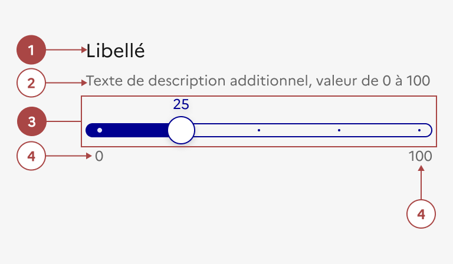

## Curseur

Le curseur est un élément d’interaction avec l’interface permettant à l’usager de délimiter manuellement une sélection par rapport à une valeur minimale et maximale.

:::dsfr-doc-tab-navigation

- [Présentation](../index.md)
- [Démo](../demo/index.md)
- Design
- [Code](../code/index.md)
- [Accessibilité](../accessibility/index.md)

:::

:::dsfr-doc-anatomy{imageWidth=384 col=12}

::dsfr-doc-pin[Un libellé]{required=true add='associé au curseur'}

::dsfr-doc-pin[Un texte de description additionnel]

::dsfr-doc-pin[Une piste avec poignée et valeur sélectionnée]{required=true}

::dsfr-doc-pin[Une valeur minimale et maximale]

:::

### Variations

**Curseur simple**

::dsfr-doc-storybook{storyId=range--range}

- Utiliser le curseur simple pour permettre à l’usager de choisir une plage, en partant d’un minimum fixe prédéfini.

**Curseur double**

::dsfr-doc-storybook{storyId=range--range args="{ isDouble: true }"}

- Utiliser le curseur double pour permettre à l’usager de choisir une plage, sans valeur prédéfinie.

**Curseur cranté**

::dsfr-doc-storybook{storyId=range--range args="{ isStep: true }"}

- Utiliser le curseur cranté pour permettre à l’usager de choisir une plage, en contraignant les valeurs possibles.

**Sans indicateurs minimum et maximum**

::dsfr-doc-storybook{storyId=range--range args="{ indicators: false }"}

**Avec préfixe et suffixe**

::dsfr-doc-storybook{storyId=range--range args="{ prefix: prefix, suffix: suffix }"}

### Tailles

Le curseur est disponible en 2 tailles :

- SM pour small
- MD pour medium

En desktop, la taille minimum est de 180 px et la taille maximum est de 588 px.

En mobile, la taille minimum est de 136 px et la taille maximum est de 288 px mais il est conseillé de préférer la version MD.

### États

**État désactivé**

L’état désactivé indique que l'usager ne peut pas interagir avec le curseur.

::dsfr-doc-storybook{storyId=range--range args="{ disabled: true }"}

> [!WARNING]
> N’utiliser cet état que très ponctuellement, pour indiquer à l’usager qu’il doit procéder à une action en amont par exemple.

**Etat d’erreur**

L'état d’erreur est signalé par un changement de couleur du libellé ainsi que l’affichage d’une ligne rouge (cf. couleurs fonctionnelles : le rouge est la couleur de l’état erreur) et d’un message d’erreur en-dessous du composant.

::dsfr-doc-storybook{storyId=range--range args="{ status: error }"}

**Etat de succès**

L'état de succès est signalé par un changement de couleur du libellé ainsi que l’affichage d’une ligne verte (cf. couleurs fonctionnelles : le vert est la couleur de l’état succès) et d’un message de succès en-dessous du composant.

### Personnalisation

Le curseur n’est pas personnalisable.

Toutefois, certains éléments sont optionnels - [voir la structure du composant](#curseur).

::::dsfr-doc-guidelines

:::dsfr-doc-guideline[❌ À ne pas faire]{col=6 valid=false}

Ne pas personnaliser la couleur de la piste.

:::

:::dsfr-doc-guideline[❌ À ne pas faire]{col=6 valid=false}

Ne pas personnaliser la forme de la poignée.

:::

::::

### Maillage

- [Champ de saisie](../../../../input/_part/doc/index.md)
- [Liste déroulante](../../../../select/_part/doc/index.md)
- [Bouton radio](../../../../radio/_part/doc/index.md)
- [Case à cocher](../../../../checkbox/_part/doc/index.md)