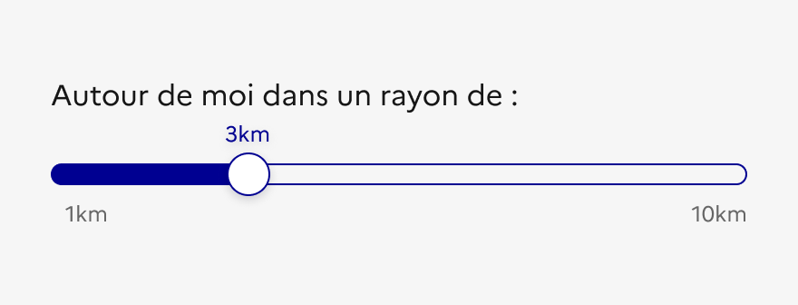
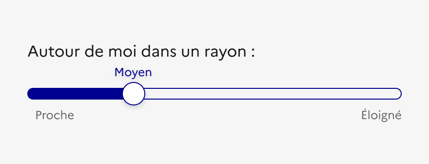
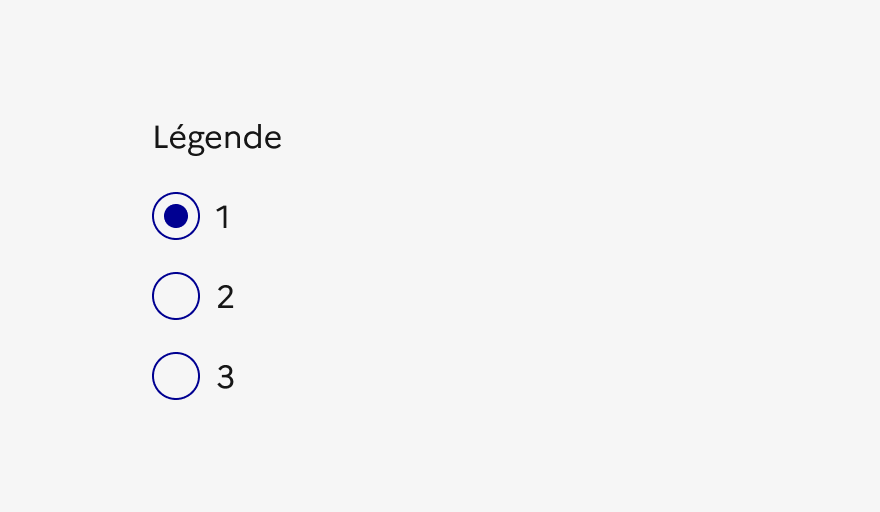
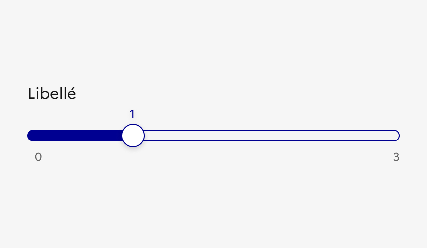
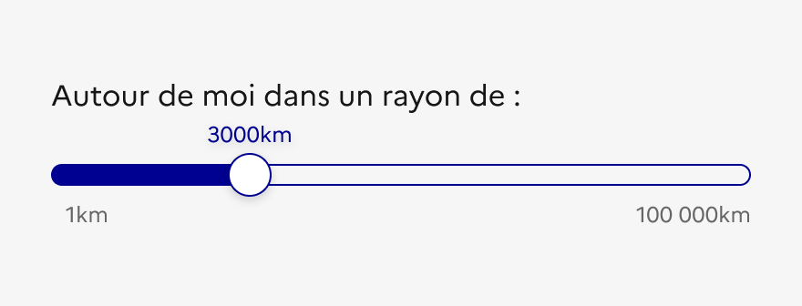
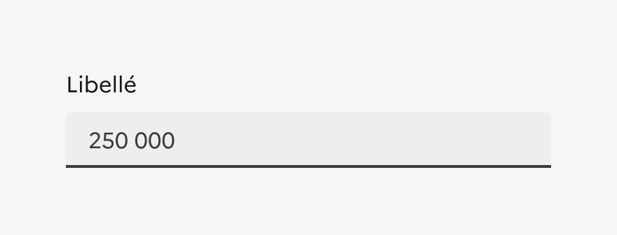

## Curseur

Le curseur est un élément d’interaction avec l’interface permettant à l’usager de délimiter manuellement une sélection par rapport à une valeur minimale et maximale.

:::dsfr-doc-tab-navigation

- Présentation
- [Démo](./demo/index.md)
- [Design](./design/index.md)
- [Code](./code/index.md)
- [Accessibilité](./accessibility/index.md)

:::

::dsfr-doc-storybook{storyId=range--range}

### Quand utiliser ce composant ?

**Utiliser un curseur lorsque la valeur saisie est imprécise ou à déterminer**, par exemple, la luminosité d’un écran. Il sert à montrer en temps réel l’impact des options choisies et à éclairer la prise de décision.

> [!NOTE]
> Préférer un [champ de saisie](../../../input/_part/doc/index.md) ou une [liste déroulante](../../../select/_part/doc/index.md) lorsque la valeur à renseigner est précise, comme une année de naissance par exemple, ou que le nombre de valeurs spécifiques parmi lesquelles choisir est important.

Le curseur n’a pas vocation à communiquer un état d’avancement quelconque. Pour ce type d’usage, utiliser l’[indicateur d’étapes](../../../stepper/_part/doc/index.md).

### Comment utiliser ce composant ?

- **Eviter d’intégrer un curseur au sein d’un formulaire**, sauf cas exceptionnel.
- **Lier l’usage du curseur à une actualisation du résultat en temps réel**, en fonction de la valeur sélectionnée. Par exemple, en tant que filtre déterminant l’affichage de donnée dans une liste ou un tableau.
- **Considérer que la valeur du curseur est toujours en nombre**. Des unités peuvent ensuite y être ajoutées (k€, €, kg, etc).

::::dsfr-doc-guidelines

:::dsfr-doc-guideline[✅ À faire]{col=6 valid=true}

Proposer une fourchette de valeurs exclusivement en nombre.

:::

:::dsfr-doc-guideline[❌ À ne pas faire]{col=6 valid=false}

Ne pas proposer des valeurs littérales et approximatives.

:::

::::

- **Proposer des échelles de valeur adaptées,** ni trop petites ni trop larges.

::::dsfr-doc-guidelines

:::dsfr-doc-guideline[✅ À faire]{col=6 valid=true}

Utiliser des cases à cocher ou des boutons radios, en cas d’échelle de valeur trop petite.

:::

:::dsfr-doc-guideline[❌ À ne pas faire]{col=6 valid=false}

Ne pas proposer une échelle de valeur non-adaptée, ici trop petite.

:::

::::

::::dsfr-doc-guidelines

:::dsfr-doc-guideline[✅ À faire]{col=6 valid=true}

Proposer des échelles de valeur adaptées, ni trop petites ni trop larges.

:::

:::dsfr-doc-guideline[❌ À ne pas faire]{col=6 valid=false}

Ne pas proposer une échelle de valeur non-adaptée, ici trop grande.

:::

::::

- **Utiliser le curseur lorsque vous avez l’espace de le faire**, notamment lorsque l’échelle de valeur est large. Si l’espace est limité, un [champ de saisie](../../../input/_part/doc/index.md) est certainement un meilleur choix.

::::dsfr-doc-guidelines

:::dsfr-doc-guideline[✅ À faire]{col=6 valid=true}

Utiliser un champ de saisie est certainement un meilleur choix lorsque l’échelle de valeur est large et l’espace limité.

:::

::::

### Règles éditoriales

Le curseur n’est régit par aucune règle éditoriale spécifique.
