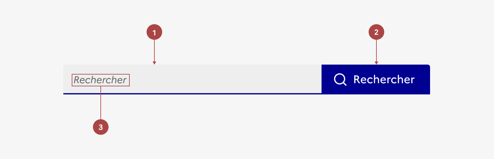
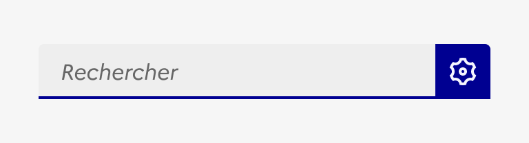

## Barre de recherche

La barre de recherche est un système de navigation permettant à l'usager d’accéder rapidement à un contenu en lançant une recherche sur un mot clé ou une phrase.

:::dsfr-doc-tab-navigation

- [Présentation](../index.md)
- [Démo](../demo/index.md)
- Design
- [Code](../code/index.md)
- [Accessibilité](../accessibility/index.md)

:::

:::dsfr-doc-anatomy{col=12}

::dsfr-doc-pin[Un champ]{required=true}

::dsfr-doc-pin[Un bouton]{required=true}

::dsfr-doc-pin[Un texte d’exemple]{required=true}

:::

### Variations

La barre de recherche n’a pas de variation.

### Tailles

La barre de recherche est disponible en 2 tailles :

- MD pour medium

::dsfr-doc-storybook{storyId=search--default}

- LG pour large

::dsfr-doc-storybook{storyId=search--size-lg}

La largeur de la barre de recherche s’adapte à la taille de son conteneur.

> [!NOTE]
> La taille du bouton est toujours définie par son libellé. Ici, c’est donc bien la taille du champ de saisie qui évolue jusqu’à prendre la totalité de la largeur du conteneur.

- **Choisir la barre de recherche MD** lorsqu'il y a des contraintes d'espace dans vos interfaces. Le cas d’usage principal est l’accès à la recherche globale depuis l’en-tête. Il peut également être spécifique à certains composants dans le cas de recherche contextuelle (exemple : recherche pour filtrer des listes ou à l’intérieur d’un tableau de données).
- **Choisir la barre de recherche LG** pour présenter un moteur de recherche global à l’intérieur d'une page (exemple : mise en avant de la recherche depuis la page d’accueil, moteur de recherche sur la liste de résultats de recherche etc.).

> [!NOTE]
> En responsive version mobile et tablette, il est obligatoire d’utiliser le format MD qui est le plus adapté.

Si vous utilisez le format LG en desktop, le composant sera donc automatiquement redimensionné au format MD.

### États

La barre de recherche n’est sujette à aucun changement d’état.

### Personnalisation

La barre de recherche n’est pas personnalisable.

::::dsfr-doc-guidelines

:::dsfr-doc-guideline[❌ À ne pas faire]{col=6 valid=false}

Ne pas personnaliser la couleur du bouton de recherche

:::

:::dsfr-doc-guideline[❌ À ne pas faire]{col=6 valid=false}

Ne pas personnaliser la couleur du liseré de la barre de recherche.

:::

::::

::::dsfr-doc-guidelines

:::dsfr-doc-guideline[❌ À ne pas faire]{col=12 valid=false}

Ne pas personnaliser le pictogramme du bouton de recherche.

:::

::::

### Maillage

- [En-tête](../../../../header/_part/doc/index.md)
