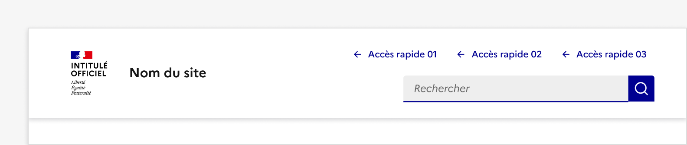
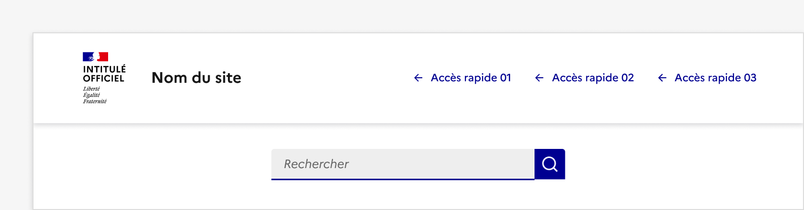
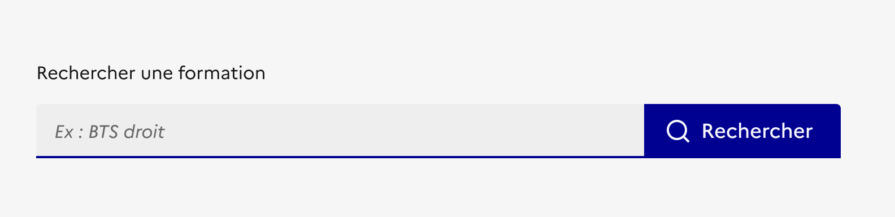

## Barre de recherche

La barre de recherche est un système de navigation permettant à l'usager d’accéder rapidement à un contenu en lançant une recherche sur un mot clé ou une phrase.

:::dsfr-doc-tab-navigation

- Présentation
- [Démo](./demo/index.md)
- [Design](./design/index.md)
- [Code](./code/index.md)
- [Accessibilité](./accessibility/index.md)

:::

::dsfr-doc-storybook{storyId=search--search}

### Quand utiliser ce composant

Utiliser la barre de recherche pour proposer une recherche globale (au sein d’un site) ou une recherche contextuelle (au sein d’une page, d’un composant dédié etc.).

### Comment utiliser ce composant

- **Proposer une barre de recherche assez large pour afficher 27 caractères minimum**. Cela permet à l’usager de saisir plusieurs termes qui restent visibles au sein du champ. Il peut ainsi facilement vérifier sa recherche avant de la soumettre.

::::dsfr-doc-guidelines

:::dsfr-doc-guideline[✅ À faire]{col=6 valid=true}

Proposer une barre de recherche de largeur correcte permettant d’afficher 27 caractères minimum.

:::

:::dsfr-doc-guideline[❌ À ne pas faire]{col=6 valid=false}

Ne pas utiliser de barre de recherche trop étroite où les 27 caractères ne sont pas lisibles.

:::

::::

- **Intégrer la barre de recherche globale à l’en-tête** (cf. composant “[En-tête](../../../header/_part/doc/index.md)”) pour qu’elle soit accessible depuis l’ensemble des pages de votre site. Dans ce cas, la recherche doit se faire sur tout le contenu du site.

::::dsfr-doc-guidelines

:::dsfr-doc-guideline[✅ À faire]{col=12 valid=true}

Intégrer la barre de recherche globale à l’en-tête du site.

:::

:::dsfr-doc-guideline[❌ À ne pas faire]{col=12 valid=false}

Ne pas placer la barre de recherche globale ailleurs que dans l’en-tête ou modifier son positionnement au sein de l’en-tête.

:::

::::

- **Valoriser la barre de recherche globale sur la page d’accueil** dès lors qu’elle constitue le point de départ de la navigation pour l’usager. Dans ce cas, elle doit être présentée comme l’élément le plus important de votre page d’accueil.
- **Ne pas afficher deux barres de recherches sur un même écran**

### Règles éditoriales

- **Rédiger un libellé de champ de saisie clair et concis**. L’usager doit comprendre facilement le contexte de la recherche (globale, par type de contenu, etc.)

::::dsfr-doc-guidelines

:::dsfr-doc-guideline[✅ À faire]{col=6 valid=true}

Rédiger un libellé de champ de saisie clair permettant à l’usager de comprendre le contexte de la recherche.

:::

::::

- **Conserver le libellé “Rechercher” pour le bouton de recherche**. Il est clair pour l’usager et respecte les règles éditoriales préconisées pour le contenu des boutons.
