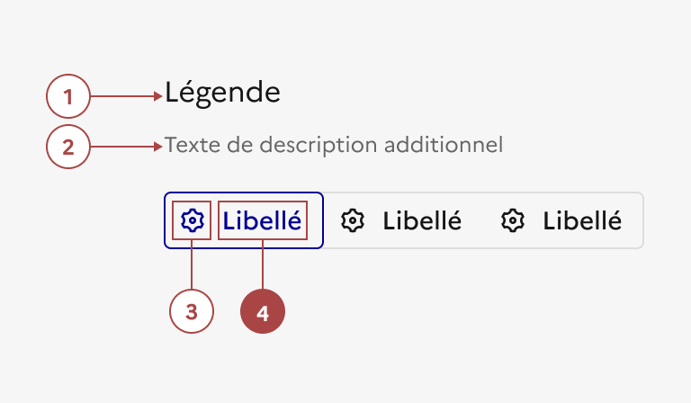
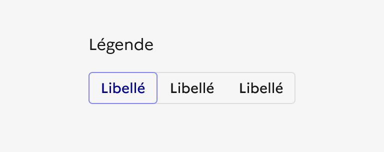

## Contrôle segmenté

Le contrôle segmenté est un élément d’interaction avec l’interface permettant à l'usager de choisir un type de vue parmi plusieurs options d'affichage disponibles.

:::dsfr-doc-tab-navigation

- [Présentation](../index.md)
- [Démo](../demo/index.md)
- Design
- [Code](../code/index.md)
- [Accessibilité](../accessibility/index.md)

:::

:::dsfr-doc-anatomy{imageWidth=384 col=12}

::dsfr-doc-pin[Une légende]{add='placé au-dessus ou à coté du composant'}

::dsfr-doc-pin[Un texte de description]{add='accompagnant la légende'}

::dsfr-doc-pin[Une icône]{add='placée à gauche du libellé uniquement'}

::dsfr-doc-pin[Un libellé explicite et court]{add='pour chaque segment' required=true}

:::

### Variations

Par défaut, le contrôle segmenté s’affiche horizontalement, en desktop comme en mobile. Toutefois, lorsque le contenu des segments est trop long, il bascule en affichage vertical. C’est pourquoi il est conseillé d’utiliser des libellés courts.

**Contrôle segmenté avec icônes**

::dsfr-doc-storybook{storyId=segmented--with-icon}

**Contrôlé segmenté avec légende**

- Placée au-dessus du composant (par défaut)

::dsfr-doc-storybook{storyId=segmented--default}

- Placée sur la même ligne que le composant

::dsfr-doc-storybook{storyId=segmented--legend-inline}

**Contrôlé segmenté avec légende et texte de description**

::dsfr-doc-storybook{storyId=segmented--hint}

### Tailles

Le contrôle segmenté est disponible en 2 tailles :

- SM pour small

::dsfr-doc-storybook{storyId=segmented--default args="{ size: sm }"}

- MD pour medium

::dsfr-doc-storybook{storyId=segmented--default}

> [!NOTE]
> Afin de garder une harmonie visuelle, en présence d’autres composants (type bouton, champs de saisie etc.), il est important de choisir la même taille que ces derniers (exemple : un bouton SM et un contrôle segmenté SM, côte à côte).

### États

**État actif**

L'état actif est signalé par un contour bleu.

**État désactivé**

L'état désactivé est signalé par le disabled-grey.

### Personnalisation

Le contrôle segmenté n’est pas personnalisable.

Toutefois, certains éléments sont optionnels - voir [la structure du composant](../../../../segmented/_part/doc/index.md).

::::dsfr-doc-guidelines

:::dsfr-doc-guideline[✅ À faire]{col=6 valid=true}

Ne pas changer la couleur de bordure et/ou de fond du contrôle segmenté.

:::

:::dsfr-doc-guideline[❌ À ne pas faire]{col=6 valid=false}

Ne pas changer la couleur du contour lorsque le segment est sélectionné.

:::

::::

### Maillage

- [Formulaires](../../../../form/_part/doc/index.md)
