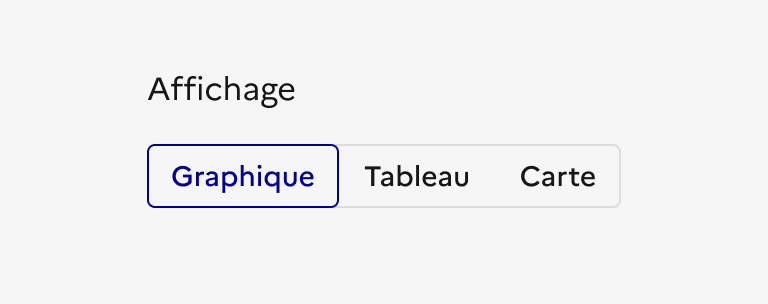
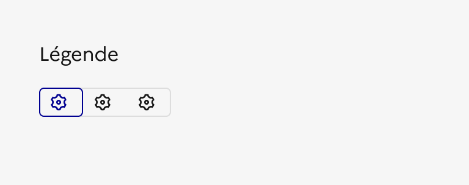
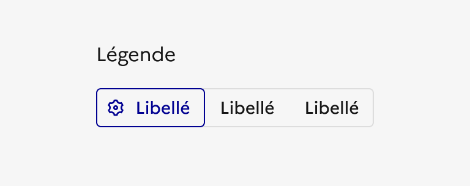

## Contrôle segmenté

Le contrôle segmenté est un élément d’interaction avec l’interface permettant à l'usager de choisir un type de vue parmi plusieurs options d'affichage disponibles.

:::dsfr-doc-tab-navigation

- Présentation
- [Démo](./demo/index.md)
- [Design](./design/index.md)
- [Code](./code/index.md)
- [Accessibilité](./accessibility/index.md)

:::

::dsfr-doc-storybook{storyId=segmented--segmented}

### Quand utiliser ce composant ?

Utiliser le contrôle segmenté pour proposer différents types d’affichage d’une même vue (exemple : liste versus carte).

> [!NOTE]
> Le contrôle segmenté n’est pas un système de filtre et ne doit donc pas être utilisé comme tel. Préférer des tags sélectionnables ou listes déroulantes, selon les cas d’usage.

### Comment utiliser ce composant ?

- **Minimiser le nombre de segments proposés.** Il est recommandé de se limiter à 2 ou 3 bien que le maximum possible soit de 5.
- **Définir une valeur par défaut** qui sera la vue présentée à l’usager lors de son arrivée sur la page.

::::dsfr-doc-guidelines

:::dsfr-doc-guideline[✅ À faire]{col=6 valid=true}

Sélectionner une valeur par défaut lorsque vous proposez le contrôle segmenté.

:::

:::dsfr-doc-guideline[❌ À ne pas faire]{col=6 valid=false}

Ne pas proposer le contrôle segmenté sans valeur par défaut. Il faut obligatoirement une vue pré-sélectionnée pour l’usager.

:::

- **Conserver un libellé pour chaque segment** afin de rendre l’action réalisée par l’usager explicite. L’utilisation d’un segment avec une icône seule n’est pas autorisée.

:::dsfr-doc-guideline[✅ À faire]{col=6 valid=true}

Conserver le libellé pour chaque segment. L’action réalisée par l’usager doit être explicite.

:::

:::dsfr-doc-guideline[❌ À ne pas faire]{col=6 valid=false}

Ne pas proposer de segments sans libellé, avec icône seule.

:::

- **Harmoniser les segments** en utilisant le même format pour tous (avec ou sans icône). Il n'est pas autorisé de mélanger des segments de formats différents dans le même composant.

:::dsfr-doc-guideline[✅ À faire]{col=6 valid=true}

Harmoniser les segments en utilisant le même format pour tous.

:::

:::dsfr-doc-guideline[❌ À ne pas faire]{col=6 valid=false}

Ne pas mélanger des segments de formats différents.

:::

::::

- **Le changement de vue a une conséquence directe sur la page consultée**, un seul segment peut être sélectionné à la fois.

### Règles éditoriales

- **Rédiger des libellés de segment clairs et concis**. L’usager doit comprendre facilement ses options.
- Des libellés courts permettent également d’éviter que les éléments ne passent en vertical.
