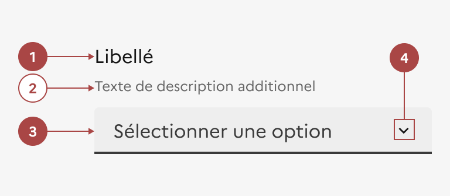

## Liste déroulante

La liste déroulante est un élément d’interaction avec l’interface permettant à l’usager de choisir un élément dans une liste donnée.

:::dsfr-doc-tab-navigation

- [Présentation](../index.md)
- [Démo](../demo/index.md)
- Design
- [Code](../code/index.md)
- [Accessibilité](../accessibility/index.md)

:::

:::dsfr-doc-anatomy{imageWidth=384 col=12}

::dsfr-doc-pin[Un libellé]{required=true}

::dsfr-doc-pin[Une description additionnelle]

::dsfr-doc-pin[Un champ]{required=true}

::dsfr-doc-pin[Un chevron orienté vers le bas]{add="indiquant que la liste se déroule" required=true}

:::

### Variations

**Liste déroulante avec texte d’aide**

::dsfr-doc-storybook{storyId=select--hint}

Il est recommandé d’ajouter un texte d’aide sous le libellé de la liste déroulante afin de faciliter le choix de l’usager.

### Tailles

La largeur de la liste déroulante s’adapte à la taille de son conteneur.

### États

**Etat d’erreur**

L'état d’erreur est signalé par un changement de couleur ainsi que l’affichage d’une ligne rouge (cf. couleurs fonctionnelles : le rouge est la couleur de l’état erreur) et d’un message d’erreur en-dessous du composant.

::dsfr-doc-storybook{storyId=select--select args="{ status: error }"}

**Etat de succès**

L'état de succès est signalé par un changement de couleur ainsi que l’affichage d’une ligne verte (cf. couleurs fonctionnelles : le vert est la couleur de l’état succès) et d’un message de succès en-dessous du composant.

::dsfr-doc-storybook{storyId=select--select args="{ status: valid }"}

**Etat désactivé**

L'état désactivé indique que l’usager ne peux pas interagir avec la liste déroulante.

::dsfr-doc-storybook{storyId=select--select args="{ disabled: true }"}

Cet état peut être utilisé pour empêcher l'utilisateur d'interagir avec la liste jusqu'à ce qu'une autre action soit terminée.

### Personnalisation

La liste déroulante n’est pas personnalisable.

Toutefois, certains éléments sont optionnels - voir [la structure du composant](#liste-déroulante).

::::dsfr-doc-guidelines

:::dsfr-doc-guideline[✅ À faire]{col=6 valid=true}

Utiliser uniquement une typographie noire.

:::

:::dsfr-doc-guideline[❌ À ne pas faire]{col=6 valid=false}

Ne pas personnaliser la couleur des textes.

:::

::::
