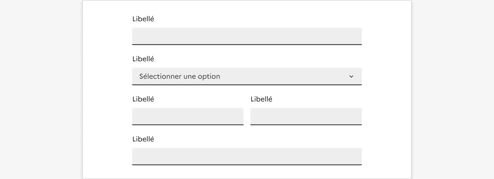

## Liste déroulante

La liste déroulante est un élément d’interaction avec l’interface permettant à l’usager de choisir un élément dans une liste donnée.

:::dsfr-doc-tab-navigation

- Présentation
- [Démo](./demo/index.md)
- [Design](./design/index.md)
- [Code](./code/index.md)
- [Accessibilité](./accessibility/index.md)

:::

::dsfr-doc-storybook{storyId=select--select}

### Quand utiliser ce composant ?

Utiliser la liste déroulante pour permettre à l’usager de sélectionner une unique option dans une liste.

> [!NOTE]
> Bien différencier les listes déroulantes des boutons radio ou cases à cocher. Les listes déroulantes sont à privilégier lorsque l’usager doit choisir un seul élément parmi 6 à 15 choix possibles et que l’espace d’affichage des options est limité.

Évitez l’usage de listes déroulantes lorsqu’elles comportent peu de propositions. Dans ce cas, optez pour [des boutons radio](../../../radio/_part/doc/index.md), dont la compréhension est plus simple pour les usagers.

Si plusieurs choix sont possibles, optez pour [des cases à cocher](../../../checkbox/_part/doc/index.md), plus simples à utiliser que l’option multiple de la liste déroulante (nécessitant une combinaison avec la touche ctrl).

### Comment utiliser ce composant ?

- **Contextualiser l’usage de la liste déroulante**, notamment lorsqu’elle est utilisée en dehors d’un panneau de filtres ou d’un formulaire. L’usager doit comprendre l’action proposée.

::::dsfr-doc-guidelines

:::dsfr-doc-guideline[✅ À faire]{col=12 valid=true}

Contextualiser l’usage de la liste déroulante afin de permettre à l’usager de comprendre l’action proposée.

:::

::::

### Règles éditoriales

La liste déroulante suit les mêmes règles éditoriales que le composant [bouton radio](../../../radio/_part/doc/index.md).
