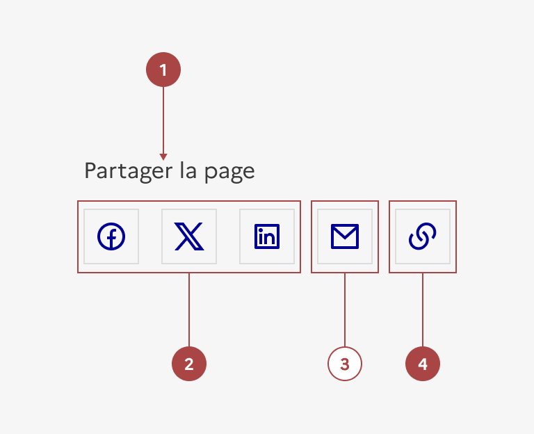
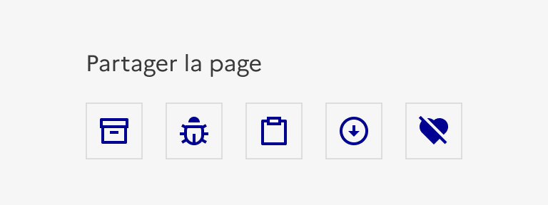

## Partage

Le partage est un groupe d’éléments d’interaction avec l’interface permettant à l’usager de partager le contenu consulté via différents canaux.

:::dsfr-doc-tab-navigation

- [Présentation](../index.md)
- [Démo](../demo/index.md)
- Design
- [Code](../code/index.md)
- [Accessibilité](../accessibility/index.md)

:::

:::dsfr-doc-anatomy{imageWidth=384 col=12}

::dsfr-doc-pin[Un libellé « Partager la page »]{required=true}

::dsfr-doc-pin[Un ou plusieurs bouton(s) de partage sur les réseaux sociaux]{required=true add='Facebook et/ou X et/ou LinkedIn et/ou Instagram et/ou autre'}

::dsfr-doc-pin[Un bouton d’envoi par mail]

::dsfr-doc-pin[Un bouton pour copier le lien de la page]{required=true}

:::

### Variations

Le partage ne propose aucune variation.

### Tailles

La largeur du partage s’adapte à son contenu.

### États

**État désactivé**

L’état désactivé indique que l'usager ne peut pas interagir avec les boutons.

::dsfr-doc-storybook{storyId=share--disabled}

> [!NOTE]
> Le code d’intégration des boutons et liens de partage proposé ici correspond à de simples liens externes vers les services de partage.
>
> Si vous souhaitez utiliser les différentes intégrations (javascript) proposées par les différents réseaux sociaux, vous devrez très probablement les intégrer à votre gestionnaire de consentement afin que l’usager puisse accepter ou non les cookies déposés.
>
> Par défaut, les services devant être désactivés, les boutons sont donc passés en inactif et une mention d’information s’affiche pour rediriger l’usager vers la modale de consentement.

### Personnalisation

Le partage n’est pas personnalisable, à l’exception du choix des réseaux sociaux proposés.

N’hésitez pas à [contacter l’équipe DSFR](path:/help) si vous avez besoin d’ajouter d’autres boutons de réseaux sociaux.

::::dsfr-doc-guidelines

:::dsfr-doc-guideline[❌ À ne pas faire]{col=6 valid=false}

Ne pas personnaliser les icônes des réseaux sociaux.

:::

::::

### Maillage

- [Bouton](../../../../button/_part/doc/index.md)
