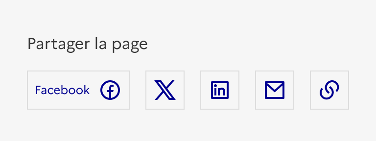
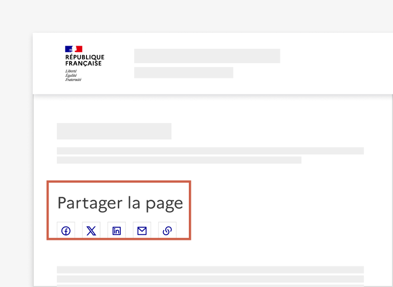
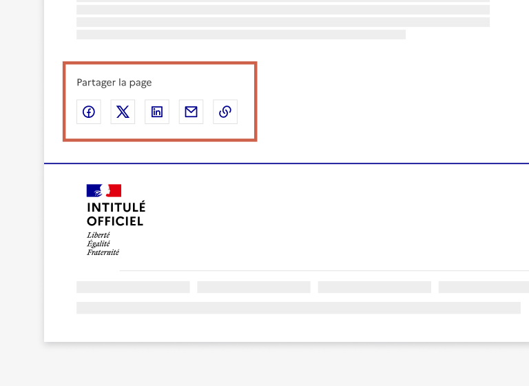

## Partage

Le partage est un groupe d’éléments d’interaction avec l’interface permettant à l’usager de partager le contenu consulté via différents canaux.

:::dsfr-doc-tab-navigation

- Présentation
- [Démo](./demo/index.md)
- [Design](./design/index.md)
- [Code](./code/index.md)
- [Accessibilité](./accessibility/index.md)

:::

::dsfr-doc-storybook{storyId=share--share}

### Quand utiliser ce composant ?

**Utiliser le partage pour permettre à l’usager de partager facilement le contenu qu’il consulte** à d’autres usagers, via les réseaux sociaux, par le biais d’un envoi par mail ou en copiant simplement le lien de la page.

### Comment utiliser ce composant ?

- **Conserver des boutons et liens d’icônes seules**. Ces derniers sont assez explicites pour ne pas avoir a être accompagnés de libellés visible.

::::dsfr-doc-guidelines

:::dsfr-doc-guideline[❌ À ne pas faire]{col=6 valid=false}

Ne pas ajouter le nom du réseau en libellé du bouton, en plus de l’icône.

:::

::::

- **Positionner le partage en haut ou en bas** de vos pages de contenu riches.

::::dsfr-doc-guidelines

:::dsfr-doc-guideline[✅ À faire]{col=6 valid=true}

Positionner le partage en haut de page.

:::

:::dsfr-doc-guideline[✅ À faire]{col=6 valid=true}

Positionner le partage en bas de page.
:::

::::

- **Rationaliser le nombre d’éléments proposés** afin que le partage reste sur une même ligne et ne prenne pas trop de place. Il est recommandé de ne pas excéder 5 boutons (3 liens pour les réseaux sociaux et les deux boutons de partage, par exemple).

### Règles éditoriales

Le partage n’est régit par aucune règle éditoriale spécifique.
