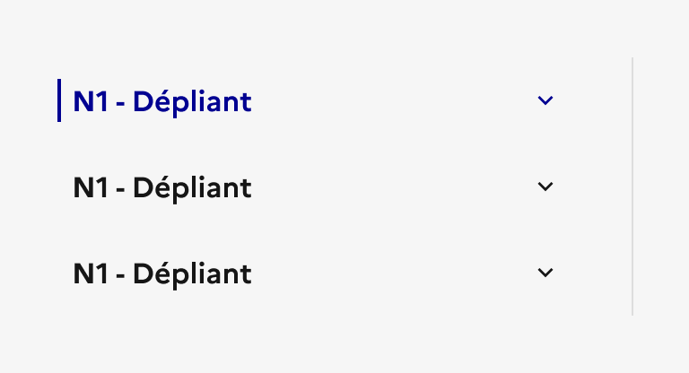

## Menu latéral

Le menu latéral est un système de navigation secondaire présentant une liste verticale de liens placée à côté du contenu.

:::dsfr-doc-tab-navigation

- [Présentation](../index.md)
- [Démo](../demo/index.md)
- Design
- [Code](../code/index.md)
- [Accessibilité](../accessibility/index.md)

:::

:::dsfr-doc-anatomy{col=12}

::dsfr-doc-pin[Le titre de la rubrique]

::dsfr-doc-pin[Un chevron orienté vers le bas]{add='indiquant que la section du menu peut s‘ouvrir. Il est orienté vers le haut quand la section peut se refermer' required=true}

::dsfr-doc-pin[Un séparateur]{required=true}

::dsfr-doc-pin[Une bordure lorsque l’item est en état “courant”]{required=true}

::dsfr-doc-pin[Des liens directs ou dépliants]{add="à minima pour le niveau 1" required=true}

:::

### Variations

**Menu latéral avec un seul niveau d’arborescence (accès direct)**

::dsfr-doc-storybook{storyId=sidemenu--link}

Il est composé d’une liste de liens vers les pages de la rubrique courante.

**Menu latéral avec deux niveaux d’arborescence**

::dsfr-doc-storybook{storyId=sidemenu--sidemenu}

Il permet d’afficher les niveaux secondaires d’une rubrique. Le clic sur le premier niveau fait apparaitre la liste des liens lui étant rattachée.

**Menu latéral avec trois niveaux d’arborescence**

::dsfr-doc-storybook{storyId=sidemenu--submenu-sidemenu}

Il permet d’afficher les niveaux 1, 2 et 3 imbriqués d’une rubrique.

**Menu latéral fixe**

Le menu latéral peut également s’afficher de manière fixe sur votre page, afin de rester visible tout au long de la navigation de l’utilisateur sur la page ouverte.

**Menu latéral fixe, affiché sur 100% de la hauteur de page**

Enfin vous pouvez afficher un menu latéral fixe sur 100% de la hauteur de votre page.

**Responsive**

::dsfr-doc-storybook{storyId=sidemenu--sidemenu width=375}

En version mobile, le menu latéral est masqué par défaut et est remplacé par le bouton ‘Dans cette rubrique'. Au clic sur ce dernier, le menu se déplie et affiche l’ensemble de la liste de liens.

### Tailles

Le menu latéral prend une largeur fixe de 3 colonnes.

### États

**État au clic**

L’état au clic correspond au comportement constaté par l’usager une fois une section du menu latéral ouverte, après avoir cliqué sur le premier niveau de navigation.

**État au survol**

L’état au survol correspond au comportement constaté par l’usager lorsqu’il survole une section ou un lien du menu latéral avec sa souris. Il existe 2 états au survol :

- Lorsque la section est fermée ou qu’il s’agit d’un lien direct

- Lorsque la section est ouverte

**État actif**

L’état actif correspond au comportement constaté par l’usager après avoir cliqué sur un des liens du menu latéral. Il renseigne sur la page courante en cours de consultation.

### Personnalisation

Le menu latéral n’est pas personnalisable.

Toutefois, certains éléments sont optionnels - voir [la structure du composant](#menu-latéral).

::::dsfr-doc-guidelines

:::dsfr-doc-guideline[✅ À faire]{col=6 valid=true}

Utiliser uniquement la couleur bleu pour la page active du menu latéral.

:::

:::dsfr-doc-guideline[❌ À ne pas faire]{col=6 valid=false}

Ne pas personnaliser la couleur de la page active du menu latéral.

:::

::::

### Maillage

- [Sommaire](../../../../summary/_part/doc/index.md)
- [Fil d’Ariane](../../../../breadcrumb/_part/doc/index.md)
