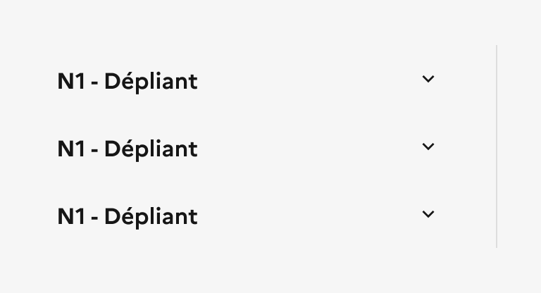
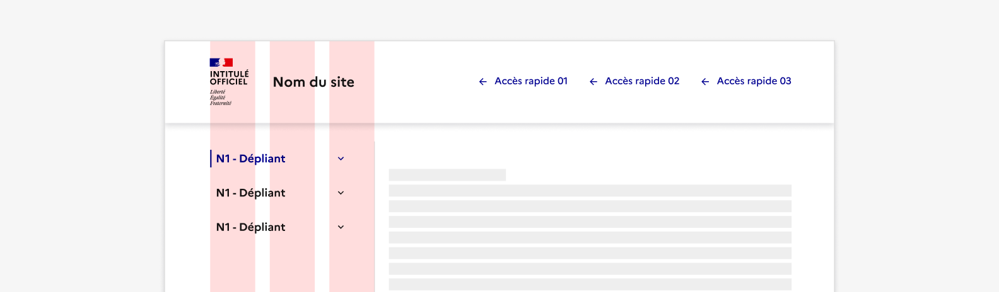
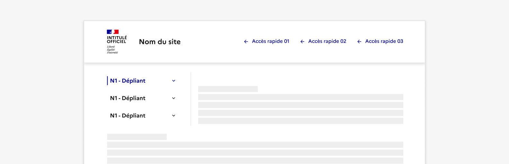

## Menu latéral

Le menu latéral est un système de navigation secondaire présentant une liste verticale de liens placée à côté du contenu.

:::dsfr-doc-tab-navigation

- Présentation
- [Démo](./demo/index.md)
- [Design](./design/index.md)
- [Code](./code/index.md)
- [Accessibilité](./accessibility/index.md)

:::

::dsfr-doc-storybook{storyId=sidemenu--sidemenu}

### Quand utiliser ce composant ?

Proposer le menu latéral pour permettre à l’usager de naviguer entre les différentes pages d’une rubrique ou d’un même thème.

Il est recommandé d’utiliser le menu latéral sur des sites ayant un niveau de profondeur assez important (2 niveaux de navigation ou plus).

> [!WARNING]
> Bien différencier le menu latéral du sommaire. Le [sommaire](../../../summary/_part/doc/index.md) est utilisé pour naviguer entre les différentes sections d’une même page. Il ne présente pas des liens mais des ancres.

### Comment utiliser ce composant ?

- **Proposer des pages n’étant pas déjà rattachées à la navigation principale** au sein du menu latéral. Il ne s’agit pas d’une redite mais bien d’une navigation secondaire et complémentaire.
- **Indiquer à l’usager où il se trouve dans la hiérarchie de navigation** en affichant la page active. Pour cela, l’élément de menu correspondant à la page courante doit être en état “actif”.

::::dsfr-doc-guidelines

:::dsfr-doc-guideline[✅ À faire]{col=6 valid=true}

Indiquer la page active au sein du menu latéral pour que l’usager sache où il se trouve.

:::

:::dsfr-doc-guideline[❌ À ne pas faire]{col=6 valid=false}

Ne pas laisser l’usager déduire sa position au sein du menu latéral.

:::

- **Placer le menu latéral à gauche ou à droite de la page**, selon le besoin. Quel que soit son positionnement, il prend une largeur de 3 colonnes sur toute la hauteur de la page.

:::dsfr-doc-guideline[✅ À faire]{col=12 valid=true}

Positionner le menu latéral à gauche ou à droite du contenu, sur une largeur de 3 colonnes, sur toute la hauteur de la page.

:::

:::dsfr-doc-guideline[❌ À ne pas faire]{col=12 valid=false}

Ne pas repasser le contenu de la page sur une grille de 12 colonnes en présence d’un menu latéral.

:::

- **Réintégrer les éléments de navigation du menu latéral dans le menu burger** si vous choisissez de le cacher en version mobile.

### Règles éditoriales

- **Garder le même nom de rubrique dans le menu et dans le contenu**, pour donner un repère à l’usager.

:::dsfr-doc-guideline[✅ À faire]{col=12 valid=true}

Avoir le même nom de rubrique dans le contenu et au sein du menu latéral.

:::

:::dsfr-doc-guideline[❌ À ne pas faire]{col=12 valid=false}

Ne pas changer le nom de la rubrique au sein du menu latéral pour ne pas perdre l’usager.

:::
::::

- **Raccourcir les titres des liens au sein du menu latéral par rapport aux titres véritables des pages** si ces derniers apparaissent trop longs.
