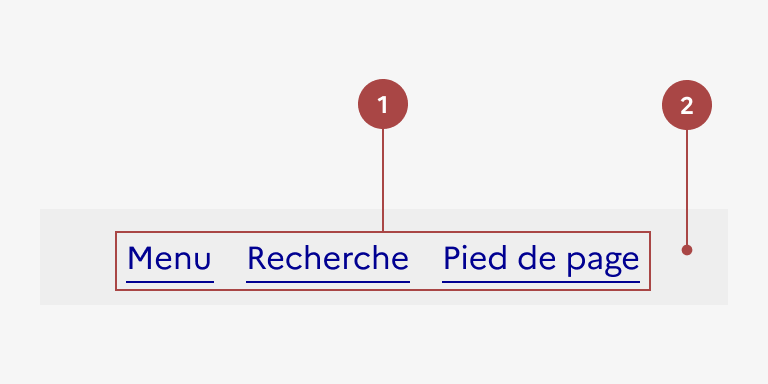
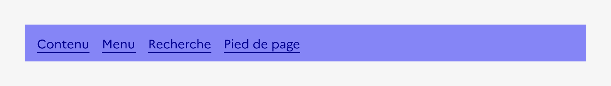

## Liens d'évitement

Les liens d’évitement sont un système de navigation secondaire permettant à l’usager naviguant au clavier, ou équipé d’un lecteur d'écran, d’accéder plus rapidement à des zones précises de la page.

:::dsfr-doc-tab-navigation

- [Présentation](../index.md)
- [Démo](../demo/index.md)
- Design
- [Code](../code/index.md)
- [Accessibilité](../accessibility/index.md)

:::

:::dsfr-doc-anatomy{imageWidth=384 col=12}

::dsfr-doc-pin[Un ou plusieurs liens simples]{required=true}

::dsfr-doc-pin[Un fond gris]{required=true}

:::

### Variations

Les liens d’évitement ne propose aucune variation.

### Tailles

La largeur des liens d’évitement s’adapte à leur contenu, tout en étant dépendante de la taille du conteneur principal de la page.

### États

**Etat au focus**

L’état au focus correspond au comportement constaté par l’usager lorsqu’il sélectionne un lien via la navigation au clavier.

### Personnalisation

Les liens d’évitement ne sont pas personnalisables.

::::dsfr-doc-guidelines

:::dsfr-doc-guideline[❌ À ne pas faire]{col=6 valid=false}

Ne pas personnaliser la couleur de fond des liens d’évitement.

:::

::::
