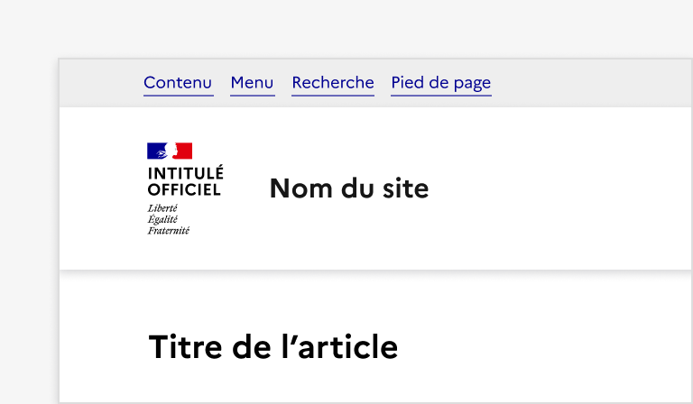
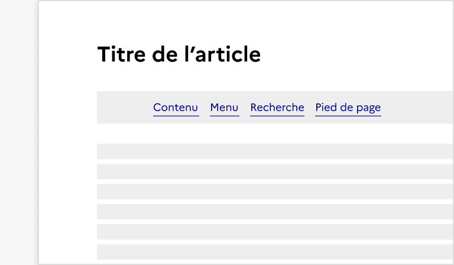
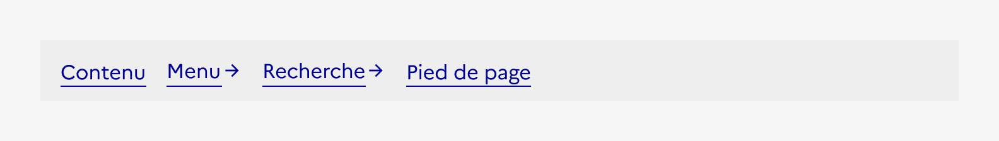
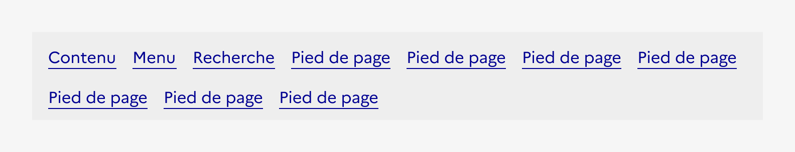

## Liens d'évitement

Les liens d’évitement sont un système de navigation secondaire permettant à l’usager naviguant au clavier, ou équipé d’un lecteur d'écran, d’accéder plus rapidement à des zones précises de la page.

:::dsfr-doc-tab-navigation

- Présentation
- [Démo](./demo/index.md)
- [Design](./design/index.md)
- [Code](./code/index.md)
- [Accessibilité](./accessibility/index.md)

:::

::dsfr-doc-storybook{storyId=skiplink--skiplink}

*Appuyez sur la touche tab pour faire apparaître les liens d'évitement.*

### Quand utiliser ce composant ?

**Intégrer des liens d’évitement est une obligation** pour l’ensemble des sites.

Ils garantissent la navigation au clavier ou par un lecteur d’écran et aident les usagers à accéder rapidement à des fonctionnalités importantes (contenu, menu, recherche, pied de page etc.).

### Comment utiliser ce composant ?

- **Placer systématiquement les liens d’évitement en tout début de page.** Ils doivent figurer parmi les premiers éléments accessibles au clavier.

::::dsfr-doc-guidelines

:::dsfr-doc-guideline[✅ À faire]{col=6 valid=true}

Positionner les liens d’évitement au dessus du header.

:::

:::dsfr-doc-guideline[❌ À ne pas faire]{col=6 valid=false}

Ne pas positionner les liens d’évitement ailleurs qu’au dessus du header.

:::

::::

- **Masquer le composant par défaut**. Il apparaît en haut de page uniquement lorsqu’un de ses liens reçoit le focus (navigation clavier).
- **Proposer uniquement des liens simples** au sein du composant.

:::dsfr-doc-guideline[✅ À faire]{col=12 valid=true}

Ne pas proposer des liens d’évitement avec icônes.

:::

- **Uniformiser le contenu, la position et la forme des liens d’évitement** à travers l’ensemble du site.
- **Limiter le nombre de liens d’évitement proposés** afin d’en garantir l’efficacité.

:::dsfr-doc-guideline[❌ À ne pas faire]{col=12 valid=false}

Ne pas proposer un nombre trop important de liens d’évitement.

- **Choisir les liens affichés en fonction des éléments clés présents dans le site**. Le lien minimum est “Accéder au contenu”, les autres liens doivent être choisis au cas par cas, en fonction des fonctionnalités/zones clés.

### Règles éditoriales

- **Privilégier des liens courts et explicites** garantissant la compréhension de l’usager.
