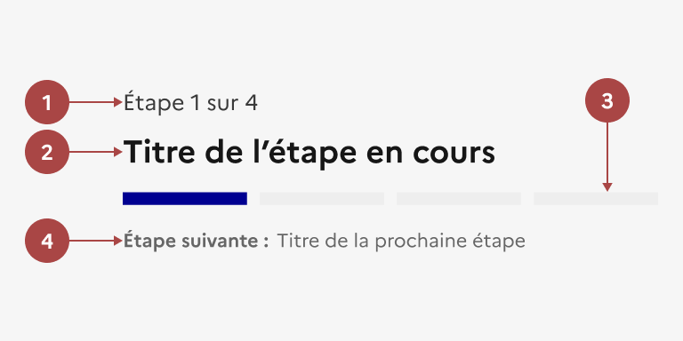

## Indicateur d'étapes

L’indicateur d'étapes est un élément éditorial permettant d’accompagner l’usager au sein d’un formulaire ou une démarche en plusieurs étapes.

:::dsfr-doc-tab-navigation

- [Présentation](../index.md)
- [Démo](../demo/index.md)
- Design
- [Code](../code/index.md)
- [Accessibilité](../accessibility/index.md)

:::

:::dsfr-doc-anatomy{imageWidth=384 col=12}

::dsfr-doc-pin[Le numéro de l'étape en cours et le nombre d'étapes total]{required=true}

::dsfr-doc-pin[Le titre de l'étape en cours]{required=true}

::dsfr-doc-pin[Une barre de progression]{required=true add='qui contient autant de sections qu’il y a d’étapes, avec les étapes validées et en cours indiquées en bleu'}

::dsfr-doc-pin[Le titre de l'étape suivante]{required=true}

:::

> [!NOTE]
> Aucun des éléments de l’indicateur d'étapes n’est cliquable.

### Variations

L’indicateur d’étapes ne propose aucune variation.

### Tailles

La largeur de l’indicateur d’étapes s’adapte à la taille de son conteneur.

### États

L’indicateur d’étapes n’est sujet à aucun changement d’état.

### Personnalisation

L’indicateur d’étapes n’est pas personnalisable.

::::dsfr-doc-guidelines

:::dsfr-doc-guideline[✅ À faire]{col=6 valid=true}

Conserver la barre de progression en l’état.

:::

:::dsfr-doc-guideline[❌ À ne pas faire]{col=6 valid=false}

Ne pas personnaliser la couleur ou le design de la barre de progression.

:::

::::

### Maillage

- [Formulaires](../../../../form/_part/doc/index.md)
- [Champ de saisie](../../../../input/_part/doc/index.md)
