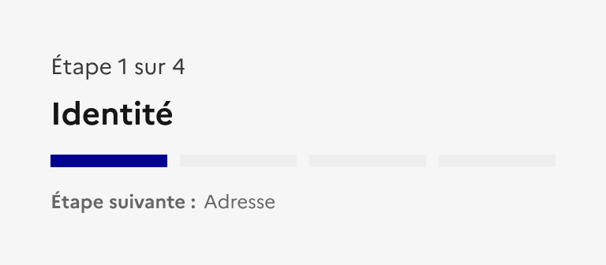
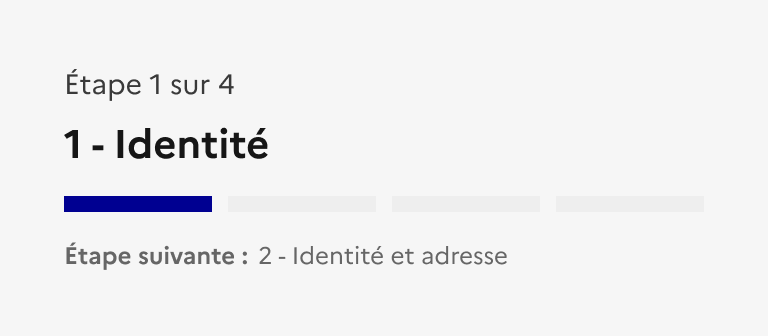

## Indicateur d'étapes

L’indicateur d'étapes est un élément éditorial permettant d’accompagner l’usager au sein d’un formulaire ou une démarche en plusieurs étapes.

:::dsfr-doc-tab-navigation

- Présentation
- [Démo](./demo/index.md)
- [Design](./design/index.md)
- [Code](./code/index.md)
- [Accessibilité](./accessibility/index.md)

:::

::dsfr-doc-storybook{storyId=stepper--stepper}

### Quand utiliser ce composant ?

**Utiliser l’indicateur d’étapes dans le cadre d’un processus linéaire**, tel un formulaire ou une démarche en ligne, pour indiquer à l’usager où il se trouve dans le parcours.

> [!NOTE]
> L’indicateur d’étapes ne permet pas de naviguer d’une étape à l’autre. Pour cela, préférer l’usage des [boutons](../../../button/_part/doc/index.md).

### Comment utiliser ce composant ?

- **Positionner systématiquement l’indicateur d’étapes en haut de page** afin qu’il soit immédiatement visible.
- **Proposer une page d’introduction en début de formulaire ou de démarche**, pour présenter les différentes étapes. L’indicateur d’étapes ne figure pas sur cette première page.
- **Identifier avec soin les champs demandés aux usagers et les rassembler dans des sections similaires**. Plus le parcours est long, plus le risque d’abandon est élevé et le nombre maximal d’étapes proposées par le composant est de 8.
- **Clôturer le formulaire ou la démarche par une étape de confirmation**, afin de notifier l’usager de la fin du parcours. Sur cette dernière étape, le titre de l’étape suivante ne doit pas être affiché.

### Règles éditoriales

- **Rédiger des titres d’étapes clairs et unique**. L’usager doit comprendre facilement le cheminement de la démarche.

::::dsfr-doc-guidelines

:::dsfr-doc-guideline[✅ À faire]{col=6 valid=true}

Aiguiller l’usager sur les différentes étapes composant la démarche en proposant des titres explicites.

:::

:::dsfr-doc-guideline[❌ À ne pas faire]{col=6 valid=false}

Ne pas répéter des titres d’étapes ou indiquer le numéro de l’étape dans le titre, celui-ci étant déjà indiquer dans un champ spécifique.

:::

::::
