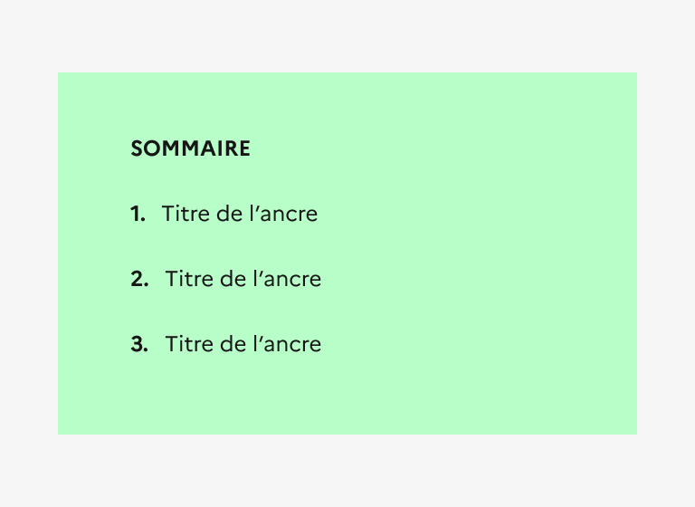

## Sommaire

Le sommaire est un système de navigation secondaire présentant une liste d’ancres placée au-dessus du contenu correspondant.

:::dsfr-doc-tab-navigation

- [Présentation](../index.md)
- [Démo](../demo/index.md)
- Design
- [Code](../code/index.md)
- [Accessibilité](../accessibility/index.md)

:::

:::dsfr-doc-anatomy{imageWidth=384 col=12}

::dsfr-doc-pin[Un titre “Sommaire”]{required=true}

::dsfr-doc-pin[Un numéro d’ancre]{required=true}

::dsfr-doc-pin[Des libellés d’ancres]{required=true}

::dsfr-doc-pin[Un fond gris]{required=true}

:::

### Variations

Le sommaire ne propose aucune variation.

### Tailles

La largeur du sommaire s’adapte à la taille de son conteneur.

Toutefois, il est recommandé de ne pas excéder une largeur de 8 colonnes, s’agissant d’un composant à intégrer au sein de pages de contenu riche.

### États

**État au survol**

L’état au survol correspond au comportement constaté par l’usager lorsqu’il survole une ancre du sommaire avec sa souris.

### Personnalisation

Le sommaire n’est pas personnalisable.

::::dsfr-doc-guidelines

:::dsfr-doc-guideline[✅ À faire]{col=6 valid=true}

Utiliser uniquement le fond de couleur grise.

:::

:::dsfr-doc-guideline[❌ À ne pas faire]{col=6 valid=false}

Ne pas personnaliser la couleur de fond du sommaire.

:::

::::

::::dsfr-doc-guidelines

:::dsfr-doc-guideline[✅ À faire]{col=6 valid=true}

Conserver l’apparence des ancres en l’état.

:::

:::dsfr-doc-guideline[❌ À ne pas faire]{col=6 valid=false}

Ne pas personnaliser la couleur ou la typographie des ancres.

:::

::::

### Maillage

- [Menu latéral](../../../../sidemenu/_part/doc/index.md)
- [Fil d’Ariane](../../../../breadcrumb/_part/doc/index.md)
