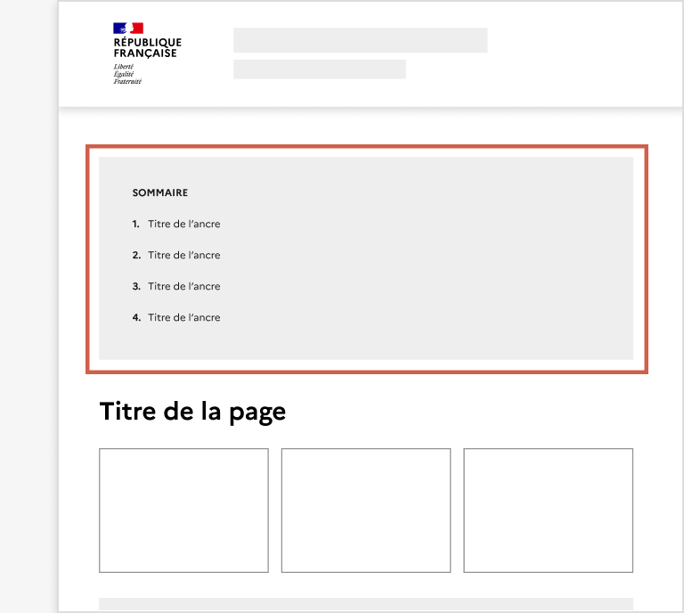
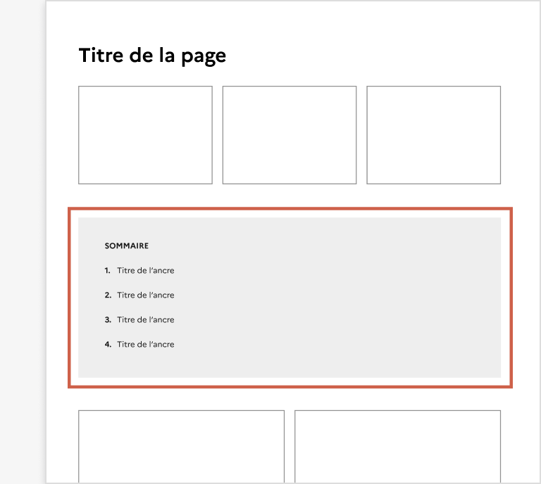
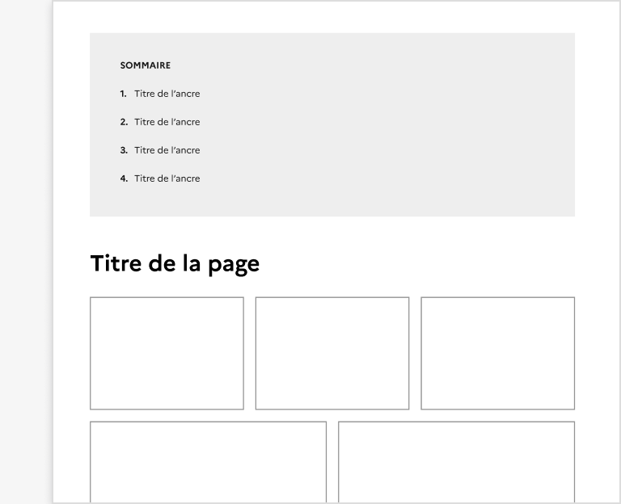
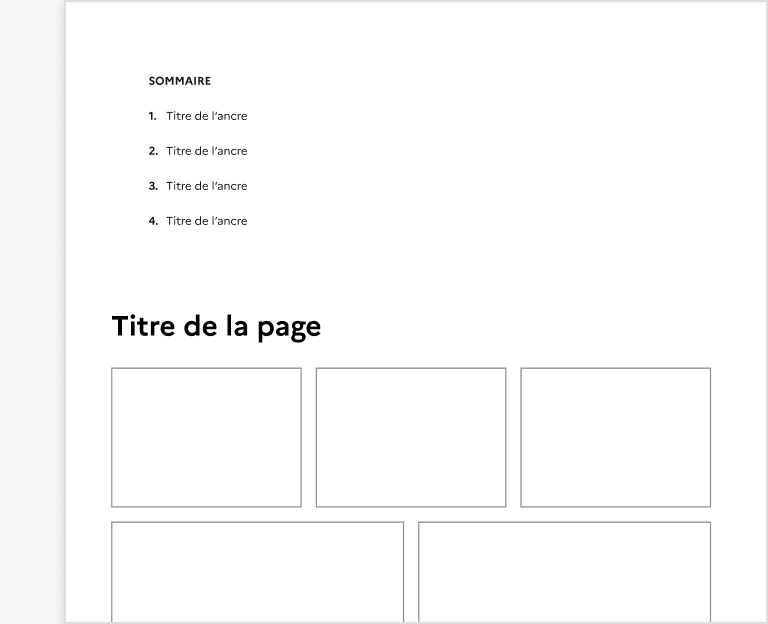
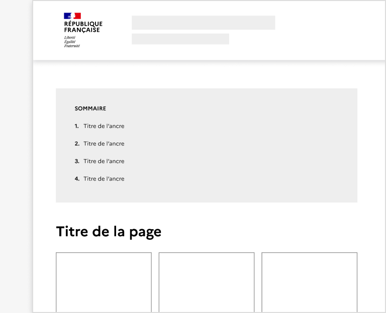
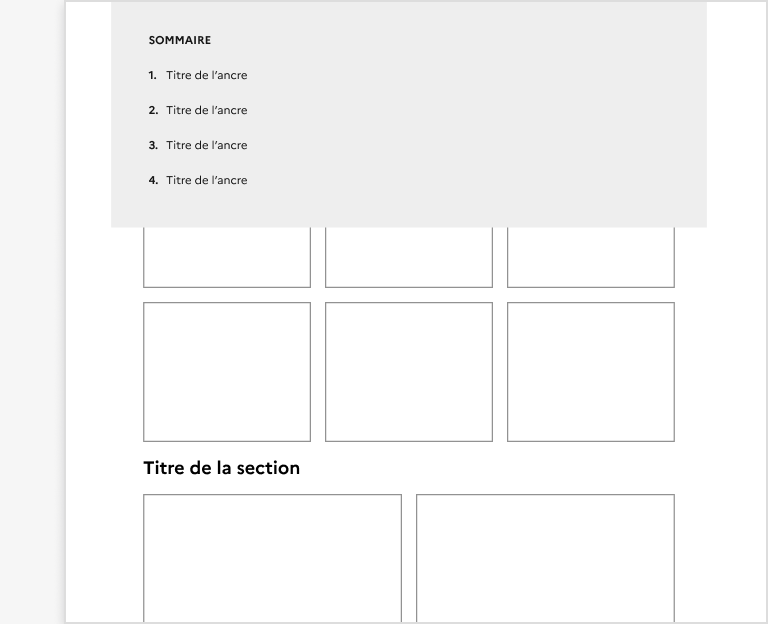
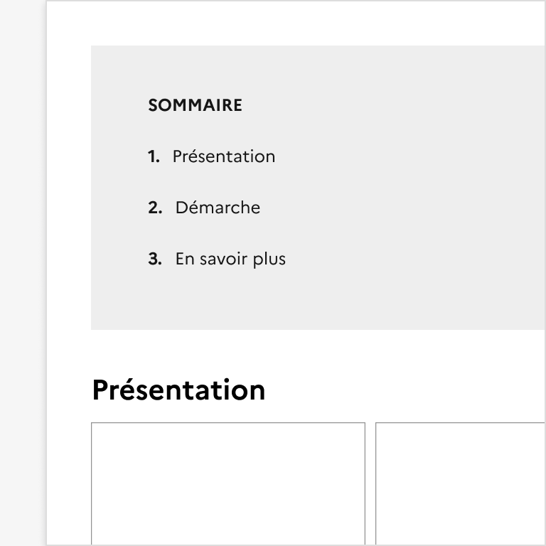
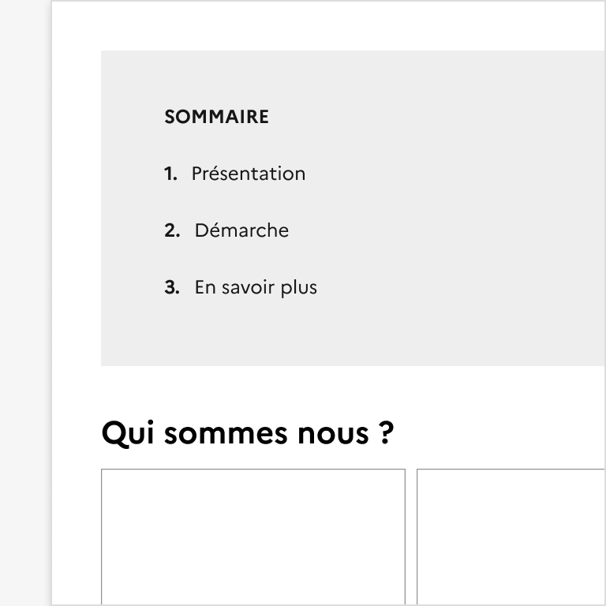

## Sommaire

Le sommaire est un système de navigation secondaire présentant une liste d’ancres placée au-dessus du contenu correspondant.

:::dsfr-doc-tab-navigation

- Présentation
- [Démo](./demo/index.md)
- [Design](./design/index.md)
- [Code](./code/index.md)
- [Accessibilité](./accessibility/index.md)

:::

::dsfr-doc-storybook{storyId=summary--summary}

### Quand utiliser ce composant ?

Proposer le sommaire pour permettre à l’usager d’avoir un aperçu du contenu consulté et de naviguer entre les différentes sections d’une page.

Il est recommandé d’utiliser le sommaire dans une page de contenu longue ou à forte densité.

> [!WARNING]
> Bien différencier le sommaire du menu latéral. Le [menu latéral](../../../sidemenu/_part/doc/index.md) est utilisé pour naviguer entre différentes pages d’une rubrique ou d’un même thème. Il ne présente pas des ancres mais des liens.

### Comment utiliser ce composant ?

- **Placer le sommaire en haut de page**, juste avant le corps de texte. Si un chapô est présent en début de page, le sommaire s’affiche entre le chapô et le contenu éditorial.

::::dsfr-doc-guidelines

:::dsfr-doc-guideline[✅ À faire]{col=6 valid=true}

Placer le sommaire en haut de page, avant le corps de texte.

:::

:::dsfr-doc-guideline[❌ À ne pas faire]{col=6 valid=false}

Ne pas intégrer le sommaire au sein du contenu éditorial lui-même.

:::

::::

- **Positionner le titre du sommaire au-dessus de la liste d’ancres**.
- **Reprendre les titres de section de la page (H1 et H2) sous forme d’ancre** vers le contenu correspondant. Au clic sur un lien, l’utilisateur est redirigé dans la page, au niveau de la section cherchée.
- **Conserver le fond de couleur du sommaire,** destiné à le séparer visuellement du contenu.

::::dsfr-doc-guidelines

:::dsfr-doc-guideline[✅ À faire]{col=6 valid=true}

Garantir une distinction visuelle entre sommaire et le contenu éditorial.

:::

:::dsfr-doc-guideline[❌ À ne pas faire]{col=6 valid=false}

Ne pas supprimer le fond de couleur, au risque d’altérer la bonne compréhension de l’usager.

:::

::::

- **Garantir le positionnement du sommaire en haut de page**. Il ne s’agit pas d’un élément fixé qui reste visible au défilement de la page.

::::dsfr-doc-guidelines

:::dsfr-doc-guideline[✅ À faire]{col=6 valid=true}

Conserver le sommaire en haut de page.

:::

:::dsfr-doc-guideline[❌ À ne pas faire]{col=6 valid=false}

Ne pas rendre le sommaire sticky.

:::

::::

### Règles éditoriales

- **Reprendre le texte exact de chaque titre de section** comme libellé des ancres du sommaire.

::::dsfr-doc-guidelines

:::dsfr-doc-guideline[✅ À faire]{col=6 valid=true}

Nommer les ancres du sommaire comme les titres des sections de la page vers lesquelles elles renvoient.

:::

:::dsfr-doc-guideline[❌ À ne pas faire]{col=6 valid=false}

Ne pas proposer des titres différents entre les ancres du sommaire et les sections de la page.

:::

::::
