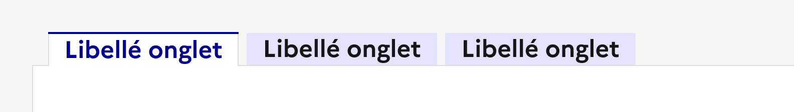

## Onglet

Le système d’onglets permet de structurer et de présenter plusieurs sections de contenu liées, en affichant une seule section à la fois dans un espace limité.

:::dsfr-doc-tab-navigation

- [Présentation](../index.md)
- [Démo](../demo/index.md)
- Design
- [Code](../code/index.md)
- [Accessibilité](../accessibility/index.md)

:::

:::dsfr-doc-anatomy{col=12}

::dsfr-doc-pin[Un libellé d’onglet]{required=true add='cliquable, qui permet d’afficher la zone de contenu associée'}

::dsfr-doc-pin[Une bordure pour l’onglet en état “courant”]{required=true}

::dsfr-doc-pin[Une icône]{required=false add='à gauche du titre'}

::dsfr-doc-pin[Un fond blanc]{required=true}

::dsfr-doc-pin[Une zone de contenu]{required=true}

:::

### Variations

**Responsive**

::dsfr-doc-storybook{storyId=tabs--tabs width=375}

En mobile, les onglets affichent un scroll horizontal qui permet d’accéder à l’ensemble des sections.

### Tailles

La largeur du composant s’adapte à la taille de son conteneur. Si le nombre d’onglets dépasse la largeur du conteneur, un scroll horizontal permet de naviguer entre les différents onglets.

::dsfr-doc-storybook{storyId=tabs--tabs width=576}

Il est toutefois recommandé de ne pas excéder une largeur de 8 colonnes, s’agissant d’un composant à intégrer au sein de pages de contenu.

Par ailleurs, la largeur des onglets eux-mêmes s’adapte à la taille de leur contenu. C’est pourquoi il est recommandé de proposer des titres concis, afin de permettre la juxtaposition de l’ensemble des onglets, sans forcer le scroll horizontal.

### États

**État au clic**

L’état au clic correspond au comportement constaté par l’usager une fois un onglet sélectionné, après avoir cliqué dessus.

**État au survol**

L’état au survol correspond au comportement constaté par l’usager lorsqu’il survole les onglets.

### Personnalisation

Les onglets ne sont pas personnalisables.

Toutefois, certains éléments sont optionnels et les icônes peuvent être changées - voir la [structure du composant](../../../../tab/_part/doc/index.md).

::::dsfr-doc-guidelines

:::dsfr-doc-guideline[✅ À faire]{col=6 valid=true}

Utiliser uniquement la couleur de fond par défaut des onglets.

:::

:::dsfr-doc-guideline[❌ À ne pas faire]{col=6 valid=false}

Ne pas personnaliser la couleur de fond des onglets.

:::

::::

::::dsfr-doc-guidelines

:::dsfr-doc-guideline[✅ À faire]{col=6 valid=true}

Utiliser uniquement la taille de typographie prévue pour le titre des onglets.

:::

:::dsfr-doc-guideline[❌ À ne pas faire]{col=6 valid=false}

Ne pas augmenter la taille de typographie du titre des onglets.

:::

::::

#### Maillage

- [Accordéon](../../../../accordion/_part/doc/index.md)
- [Modale](../../../../modal/_part/doc/index.md)
