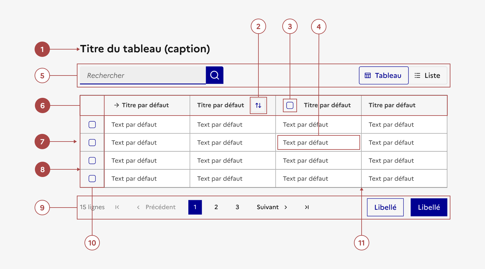

## Tableau

Le tableau permet de présenter une liste structurée de données textuelles et/ou numériques dans le but de simplifier l’analyse et la comparaison d’informations pour l’usager.

:::dsfr-doc-tab-navigation

- [Présentation](../index.md)
- [Démo](../demo/index.md)
- Design
- [Code](../code/index.md)
- [Accessibilité](../accessibility/index.md)

:::

:::dsfr-doc-anatomy{col=12}

::dsfr-doc-pin[Un titre]{required=true add="qui peut être positionné en haut (par défaut), en bas ou hors écran (balise caption)"}

::dsfr-doc-pin[Un bouton de tri par colonne]

::dsfr-doc-pin[Une case à cocher de sélection de colonne]

::dsfr-doc-pin[Une ou plusieurs données]{add="par cellule"}

::dsfr-doc-pin[Une barre d’actions haute]{add="pouvant contenir (uniquement et dans cet ordre) - le nombre de lignes sélectionnées, une barre de recherche, des boutons d’actions liés à la sélection de lignes et un contrôle segmenté"}

::dsfr-doc-pin[Une ligne d’en-tête de colonne]{required=true}

::dsfr-doc-pin[Plusieurs lignes de corps]{required=true}

::dsfr-doc-pin[Des bordures horizontales entre les lignes]{required=true}

::dsfr-doc-pin[Une barre d’actions basse]{add="pouvant contenir (uniquement et dans cet ordre) - le nombre total de lignes du tableau, une liste déroulante, une pagination et des boutons d’actions agissants sur tout le tableau"}

::dsfr-doc-pin[Une colonne de sélection de ligne]{add="toujours ferrée à gauche"}

::dsfr-doc-pin[Des bordure verticales entre les colonnes]{add="uniquement obligatoire dans le cas d’un tableau complexe"}

:::

### Variations

**Tableau non scrollable**

::dsfr-doc-storybook{storyId=table--no-scroll}

**Tableau avec retour à la ligne automatique dans les cellules**

::dsfr-doc-storybook{storyId=table--multiline}

**Tableau avec largeur de colonnes minimales**

::dsfr-doc-storybook{storyId=table--multiline-col-min-size}

**Tableau avec première colonne fixée**

::dsfr-doc-storybook{storyId=table--fixed-column}

**Tableau complexe avec cellules fusionnées**

::dsfr-doc-storybook{storyId=table--complex-table}

**Tableau avec filtre et différents types de données**

::dsfr-doc-storybook{storyId=table--miscellaneous-table}

### Variantes esthétiques

**Bordures horizontales (par défaut)**

::dsfr-doc-storybook{storyId=table--default}

**Bordures horizontales et verticales**

::dsfr-doc-storybook{storyId=table--vertical-borders}

### Densité

Le tableau prend automatiquement la taille de son conteneur.

Ce conteneur peut être scrollable horizontalement. Ceci est courant sur les écrans plus petits où il peut être impossible d'afficher le tableau complet sur l'écran de l'appareil. Le conteneur est donc responsive par défaut.

Toutefois, prenez garde à ce que les informations clés soient visibles au premier coup d’œil même sur un écran de petite taille.

Par défaut, la largeur des cellules s’adapte automatiquement à leur contenu. En revanche, il existe 3 niveaux de densité :

**SM pour small**

::dsfr-doc-storybook{storyId=table--size-sm}

**MD pour medium**

::dsfr-doc-storybook{storyId=table--size-sm}

**LG pour large**

::dsfr-doc-storybook{storyId=table--size-lg}

Ainsi si la taille des composants intégrés dans les cellules ne change pas, cela vous permet toutefois de varier la densité d’affichage de votre tableau en fonction de son contenu.

### Ligne sélectionnable

::dsfr-doc-storybook{storyId=table--selectable-table-selected-line}

> [!NOTE]
> Les états désactivé, focus et cliqué sont propres aux composants intégrés au sein des cellules.

### Personnalisation

Le tableau n’est pas personnalisable.

Toutefois, l’ensemble des composants imbriqués (icône, pictogramme, tag, badge, bouton, lien, champ de saisie, infobulle, interrupteur et liste déroulante) peuvent être personnalisés selon leurs propres règles de personnalisation.

Par ailleurs, certains éléments sont optionnels - voir [la structure du composant](#tableau).
