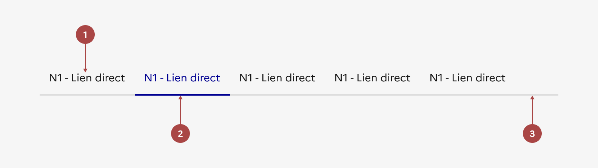

## Navigation tertiaire

> [!NOTE]
> **Ce composant est en version bêta.** Il n'existe pas en code et son design ou ses fonctionnalités peuvent encore être amenés à évoluer. N'hésitez pas à nous partager vos cas d'usage ou retours qui le concerne via notre formulaire de contact ou notre Tchap pour que nous puissions les étudier.

Retrouvez ces composants sur Figma [dans un fichier dédié bêta disponible sur Community](https://www.figma.com/community/file/1096003483468520396).

La navigation tertiaire est un système de navigation permettant un troisième niveau de navigation au sein d’une section de contenu.

:::dsfr-doc-tab-navigation

- [Présentation](../index.md)
- Design

:::

:::dsfr-doc-anatomy{col=12}

::dsfr-doc-pin[Un libellé du lien direct]{required=true}

::dsfr-doc-pin[Un soulignement]{required=true add="pour indiquer la page active"}

::dsfr-doc-pin[Un séparateur]{required=true}

:::

### Variations

La navigation tertiaire ne propose aucune variation.

### Tailles

La navigation tertiaire prend une largeur fixe de 8 colonnes.

### États

**État au survol**

L’état au survol correspond au comportement constaté par l’usager lorsqu’il survole une entrée de la navigation tertiaire.

**État au clic**

L’état au clic correspond au comportement constaté par l’usager après avoir cliqué sur une entrée de la navigation tertiaire.

**État actif**

L’état actif correspond au comportement constaté par l’usager après avoir cliqué sur un des liens de la navigation tertiaire. Il renseigne sur la page courante en cours de consultation.

### Personnalisation

La navigation tertiaire n’est pas personnalisable.

- Utiliser uniquement la couleur bleu pour les sections de la navigation tertiaire.
- Ne pas personnaliser la couleur des sections de la navigation tertiaire.
- Utiliser le soulignement prévu à cet effet pour indiquer la page active au sein de la navigation tertiaire.
- Ne pas personnaliser l’état actif de la page courante.
