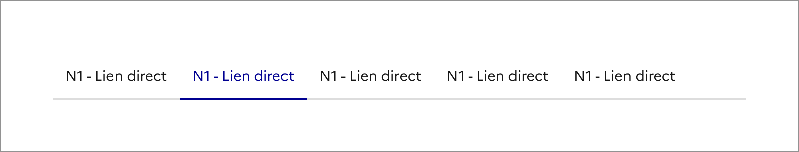
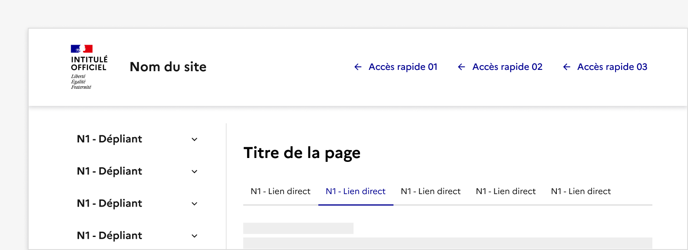
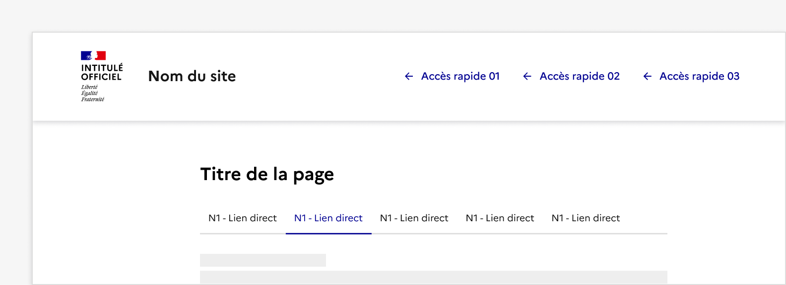

## Navigation tertiaire

> [!NOTE]
> **Ce composant est en version bêta.** Il n'existe pas en code et son design ou ses fonctionnalités peuvent encore être amenés à évoluer. N'hésitez pas à nous partager vos cas d'usage ou retours qui le concerne via notre formulaire de contact ou notre Tchap pour que nous puissions les étudier.

Retrouvez ces composants sur Figma [dans un fichier dédié bêta disponible sur Community](https://www.figma.com/community/file/1096003483468520396).

La navigation tertiaire est un système de navigation permettant un troisième niveau de navigation au sein d’une section de contenu.

:::dsfr-doc-tab-navigation

- Présentation
- [Design](./design/index.md)

:::

### Quand utiliser ce composant ?

Proposer une navigation tertiaire pour permettre à l’usager de naviguer entre les différentes pages d’une rubrique ou d’un même thème.

Il est recommandé d’utiliser une navigation tertiaire sur des sites ayant un niveau de profondeur assez important (3 niveaux de navigation ou plus) car elle vient compléter la navigation secondaire.

**A noter :** Bien différencier la navigation tertiaire des onglets.

Le [système d’onglets](../../../tab/_part/doc/index.md) n’est pas une navigation mais permet de mettre en forme du contenu. De ce fait, il peut être utiliser sans la contrainte du menu latéral.

### Comment utiliser ce composant ?

- **Utiliser exclusivement la navigation tertiaire en complément d’une navigation secondaire (menu latéral)**.

::::dsfr-doc-guidelines

:::dsfr-doc-guideline[✅ À faire]{col=12 valid=true}

Proposer la navigation tertiaire en complément d’une navigation secondaire telle que le menu latéral.

:::

:::dsfr-doc-guideline[❌ À ne pas faire]{col=12 valid=false}

Ne pas utiliser la navigation tertiaire en l’absence d’une navigation secondaire.

:::

::::

- **Proposer des pages n’étant pas déjà rattachées aux navigations principale ou secondaire (menu latéral)** au sein de la navigation tertiaire. Il ne s’agit pas d’une redite mais bien d’une navigation complémentaire aux navigations préexistantes.
- **Indiquer à l’usager** la page active au sein de la navigation tertiaire. Pour cela, l’élément correspondant à la page courante doit être en état “actif”.
- **Placer systématiquement la navigation tertiaire sous le titre de la rubrique.** Elle s’étend sur une largeur fixe de 8 colonnes, quelque soit le nombre de liens.

### Règles éditoriales

- **Intégrer le titre de la rubrique par défaut**, pour donner un repère à l’usager.
- **Raccourcir les libellés au sein de la navigation tertiaire,** par rapport aux titres véritables des pages, si ces derniers apparaissent trop longs.
