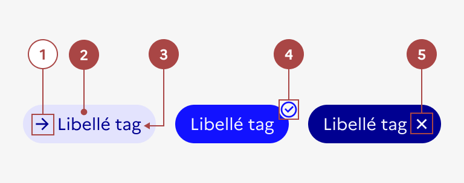

## Tag

Le tag est un élément d’indication ou d’interaction (selon les contextes) permettant de catégoriser, classer, organiser les contenus d’un site à l’aide de mots clés. Il aide les usagers à rechercher et à trouver facilement une information.

:::dsfr-doc-tab-navigation

- [Présentation](../index.md)
- [Démo](../demo/index.md)
- Design
- [Code](../code/index.md)
- [Accessibilité](../accessibility/index.md)

:::

:::dsfr-doc-anatomy{imageWidth=384 col=12}

::dsfr-doc-pin[Une icône]

::dsfr-doc-pin[Un fond de couleur]{required=true}

::dsfr-doc-pin[Un libellé]{required=true}

::dsfr-doc-pin[Une coche]{required=true add="uniquement s'il s'agit d'un tag sélectionnable en état cliqué"}

::dsfr-doc-pin[Une croix]{required=true add="uniquement s'il s'agit d'un tag supprimable"}

:::

### Variations

**Tag non cliquable**

::dsfr-doc-storybook{storyId=tag--size-md}

**Tag cliquable**

::dsfr-doc-storybook{storyId=tag--tag-clickable}

**Tag sélectionnable**

::dsfr-doc-storybook{storyId=tag--tag-pressable}

**Tag supprimable**

::dsfr-doc-storybook{storyId=tag--tag-dismissible}

> [!NOTE]
> Cette variation n’autorise pas l’utilisation d’icône, autre que la croix de suppression présente par défaut.

**Groupe de tags**

::dsfr-doc-storybook{storyId=tags-group--size-md}

Tous les tags peuvent être utilisés à plusieurs dans des groupes de tags. Dans ce cas-là ils appliquent des espacement préalablement définis par le DSFR.

### Tailles

Toutes les variations de tags sont disponibles en 2 tailles, pour pouvoir s’adapter au contexte d’affichage :

- SM pour small

::dsfr-doc-storybook{storyId=tag--size-sm}

- MD pour medium - taille par défaut

::dsfr-doc-storybook{storyId=tag--size-md}

À noter que pour le groupe de tags en taille SM, le padding autour du tag est plus important que lorsqu’il est utilisé seul pour faciliter le clic en mobile.

### États

Le tag non cliquable est le seul qui n’est sujet à aucun changement d’état.

**Etat au survol**

L’état au survol correspond au comportement constaté par l’usager lorsqu’il survole le tag avec sa souris.

- Tag cliquable

- Tag sélectionnable

- Tag supprimable

**Etat cliqué**

L’état au clic correspond au comportement constaté par l’usager une fois un tag sélectionné, après avoir cliqué dessus.

- Tag sélectionnable

### Personnalisation

Seule la couleur des tags cliquables peut être personnalisée, parmi les couleurs illustratives autorisées uniquement.

:::fr-table[Tableau personnalisation design]{valign=top multiline=true caption=false}

|  Éléments | Indice thème clair | Indice thème clair |
|:-----|:-----|:-----|
| **Fond** | Indice **925**  exemple : `$pink-tuile-925` | Indice **125**  exemple : `$pink-tuile-125` |
| **Texte et icône**| Indice **sun**  exemple : `$pink-tuile-sun-425` | Indice **moon**  exemple : `$pink-tuile-moon-750` |

:::

La personnalisation des tags doit se faire avec parcimonie et avec un objectif précis (permettre d'en faire ressortir un type ou le sens, par exemple).

> [!NOTE]
> Si vous personnalisez la couleur illustrative des badges, attention à la couleur d’arrière-plan sur laquelle ils sont positionnés à travers l’ensemble du site.

::::dsfr-doc-guidelines

:::dsfr-doc-guideline[✅ À faire]{col=6 valid=true}

Personnaliser uniquement la couleur des tags cliquables.

:::

:::dsfr-doc-guideline[❌ À ne pas faire]{col=6 valid=false}

Ne pas proposer les autres variations de tags en couleur.

:::

:::dsfr-doc-guideline[✅ À faire]{col=6 valid=true}

Associer le tag cliquable à une couleur pour valoriser l’information transmise, ici le type de support.

:::

:::dsfr-doc-guideline[❌ À ne pas faire]{col=6 valid=false}

Ne pas dépasser une ou deux couleurs de tags par page.

:::

:::dsfr-doc-guideline[✅ À faire]{col=6 valid=true}

Ajouter une icône au tag au besoin.

:::

:::dsfr-doc-guideline[❌ À ne pas faire]{col=6 valid=false}

Ne pas cumuler la croix du tag supprimable (icône par défaut) avec une seconde icône.

:::

::::
