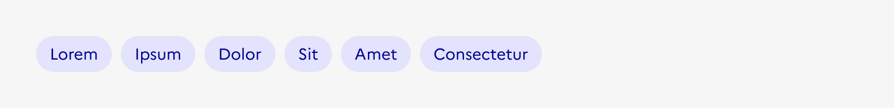
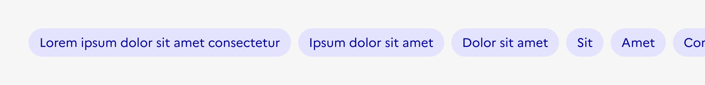

## Tag

Le tag est un élément d’indication ou d’interaction (selon les contextes) permettant de catégoriser, classer, organiser les contenus d’un site à l’aide de mots clés. Il aide les usagers à rechercher et à trouver facilement une information.

:::dsfr-doc-tab-navigation

- Présentation
- [Démo](./demo/index.md)
- [Design](./design/index.md)
- [Code](./code/index.md)
- [Accessibilité](./accessibility/index.md)

:::

::dsfr-doc-storybook{storyId=tag--tag}

### Quand utiliser ce composant ?

- **Utiliser le tag en l’associant à un contenu** (carte, en-tête etc.) pour le catégoriser (par thème, sujet, type de contenu etc). Dans ce contexte, le tag peut être cliquable ou non cliquable.

> [!NOTE]
> Bien différencier le tag du [badge](../../../badge/_part/doc/index.md). Le tag ne sert pas à donner le statut du contenu auquel il est associé. 
> Il ne sert pas non plus à donner des informations de complément à la catégorisation (auteur, date, lieu par exemple). Pour ce faire, utiliser l’élément « détail » prévu sur [les cartes](../../../card/_part/doc/index.md), et la typo XS « mention » pour les page de contenu.

- **Utiliser le tag en tant que filtre**, dans une page liste ou de recherche par exemple. Dans ce contexte, le tag peut être sélectionnable ou supprimable.

### Comment utiliser ce composant ?

- **Utiliser le tag non cliquable** pour afficher une information sur un contenu.
- **Utiliser le tag cliquable** pour donner accès à une page avec des contenus associés à ce tag (liste de contenus, liste de résultats de recherche etc).
- **Utiliser le tag sélectionnable** pour permettre d’activer ou désactiver un filtre.
- **Utiliser le tag supprimable** pour permettre de désactiver un filtre. Il sert de rappel à un filtre qui a préalablement été coché dans une sidebar ou une liste déroulante.
- **Limiter le nombre de tags proposés au sein d’un groupe** pour ne pas noyer l’usager d’informations ou, dans le contexte de filtres, lui permettre de rapidement scanner la liste disponible.
- **Préférer l’usage de tags supprimables associés à une liste déroulantes** plutôt que d’un groupe de tags sélectionnables lorsque leur nombre excède 6 tags.

::::dsfr-doc-guidelines

:::dsfr-doc-guideline[✅ À faire]{col=12 valid=true}

Utiliser des tags supprimables associés à une liste déroulante dès lors qu’il y a plus de 6 options possibles.

:::

:::dsfr-doc-guideline[❌ À ne pas faire]{col=12 valid=false}

Ne pas utiliser plus de 6 tags sélectionnables pour un même filtre.

:::

::::

::::dsfr-doc-guidelines

:::dsfr-doc-guideline[❌ À ne pas faire]{col=6 valid=false}

Ne pas utiliser un tag pour mettre en forme du contenu.

:::

::::

### Règles éditoriales

- **Préférer des libellés courts et clairs** pour que l’information relayée par le tag soit facilement identifiable de l’usager.
- **Construire des libellés en base d’un mot-clé ou d’une expression** permettant de catégoriser le contenu auquel les tags sont associés.

::::dsfr-doc-guidelines

:::dsfr-doc-guideline[✅ À faire]{col=12 valid=true}

Penser des libellés pertinents, qui vont à l’essentiel.

:::

:::dsfr-doc-guideline[❌ À ne pas faire]{col=12 valid=false}

Ne pas proposer des libellés longs et complexes.

:::

::::