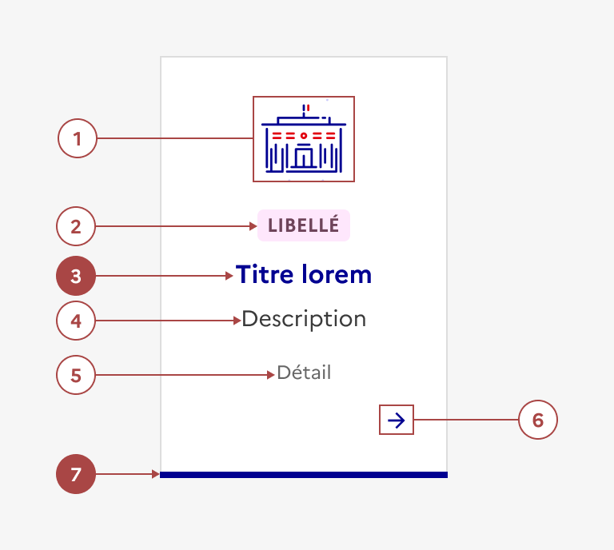
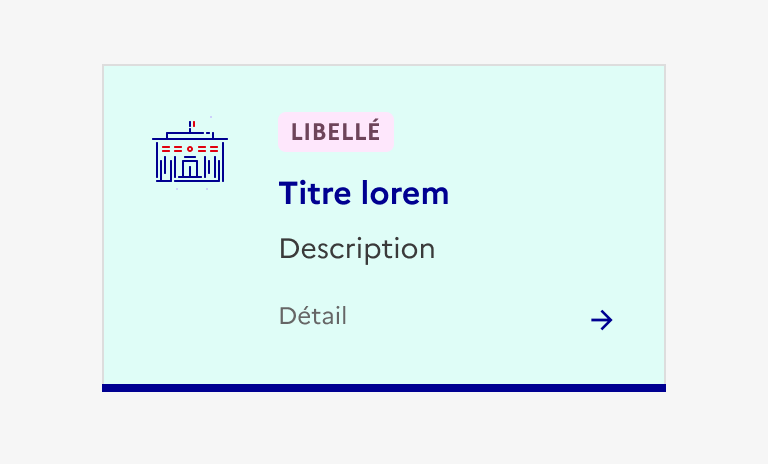
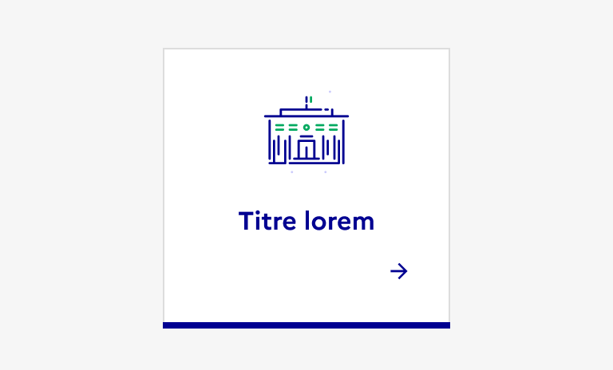
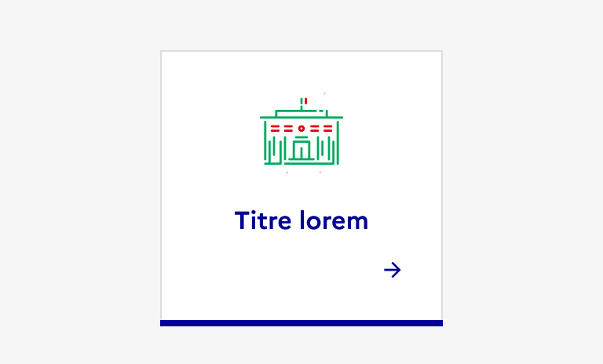
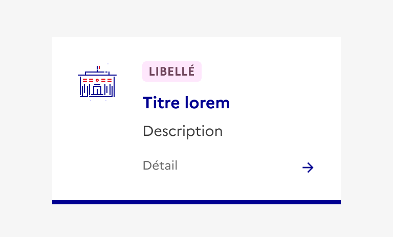
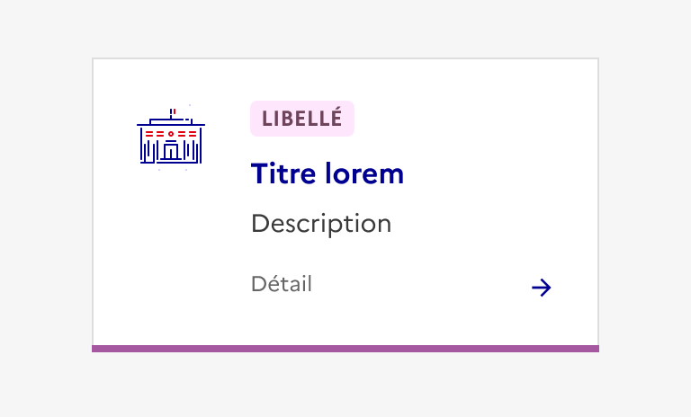

## Tuile

La tuile est un élément d’interaction avec l’interface permettant de rediriger l’usager vers des pages de contenu.

:::dsfr-doc-tab-navigation

- [Présentation](../index.md)
- [Démo](../demo/index.md)
- Design
- [Code](../code/index.md)
- [Accessibilité](../accessibility/index.md)

:::

:::dsfr-doc-anatomy{imageWidth=384 col=12}

::dsfr-doc-pin[Un pictogramme]

::dsfr-doc-pin[Une première zone de détail]{add="composée d’une précision sous forme de tags (cliquables ou non) ou de badges (jusqu'à 4 éléments)"}

::dsfr-doc-pin[Un titre reprenant celui de l’objet visé]{add='(page de destination, action réalisée, site etc.)' required=true}

::dsfr-doc-pin[Une description]

::dsfr-doc-pin[Une deuxième zone de détail]{add='composée d’un texte'}

::dsfr-doc-pin[Une icône illustrative]{add='(par défaut, une flèche)'}

::dsfr-doc-pin[Une bordure]{add='bleue lorsque la tuile est cliquable et noire lorsqu’elle est non cliquable' required=true}

:::

### Variations

**Tuile horizontale**

- Cliquable

::dsfr-doc-storybook{storyId=tile--horizontal}

- Non cliquable

::dsfr-doc-storybook{storyId=tile--no-link}

**Tuile verticale**

- Cliquable

::dsfr-doc-storybook{storyId=tile--default}

- Non cliquable

::dsfr-doc-storybook{storyId=tile--horizontal-no-link}

**Tuile de téléchargement**

::dsfr-doc-storybook{storyId=tile--download}

- Utiliser la tuile de téléchargement pour mettre à disposition de l’usager un fichier en téléchargement.
- Le titre de la tuile de téléchargement reprend le nom du fichier et doit systématiquement être précédé de la mention “Télécharger”.
- La seconde zone de détail affiche obligatoirement le format et le poids du fichier.
- L’icône de téléchargement est ici obligatoire.

**Variantes esthétiques**

- Tuile avec fond gris
- Tuile avec ombre portée
- Tuile sans bordure
- Tuile sans fond

### Tailles

La tuile est disponible en 2 tailles :

- SM pour small

::dsfr-doc-storybook{storyId=tile--size-sm}

En desktop, elle occupe un maximum de 3 à 4 colonnes de large.

- MD pour medium

::dsfr-doc-storybook{storyId=tile--default}

En desktop, elle occupe entre 4 et 6 colonnes de large.

En version mobile, les deux tailles SM et MD occupent l’intégralité de la largeur de la grille.

Par ailleurs, la hauteur de la tuile s’adapte à son contenu.

### États

**État désactivé**

L’état désactivé indique que l'usager ne peut pas interagir avec la tuile.

::dsfr-doc-storybook{storyId=tile--default-story args="{ disabled: true }"}

**État au survol**

L’état au survol correspond au comportement constaté par l’usager lorsqu’il survole la tuile avec sa souris.

### Personnalisation

La tuile comporte des variantes esthétiques (voir section “Variations”).

L’ensemble des composants imbriqués ([pictogramme](../../../../../core/_part/doc/pictogram/index.md) et [badge](../../../../badge/_part/doc/index.md)) peuvent également être personnalisés selon leurs propres règles de personnalisation.

Par ailleurs, certains éléments sont optionnels - voir [la structure du composant](#tuile).

::::dsfr-doc-guidelines

:::dsfr-doc-guideline[✅ À faire]{col=6 valid=true}

Proposer une tuile avec un fond par défaut.

:::

:::dsfr-doc-guideline[❌ À ne pas faire]{col=6 valid=false}

Ne pas personnaliser le fond de la tuile avec une autre couleur illustrative.

:::

:::dsfr-doc-guideline[✅ À faire]{col=6 valid=true}

Choisir la couleur secondaire du pictogramme parmi celles disponibles dans les couleurs illustratives.

:::

:::dsfr-doc-guideline[❌ À ne pas faire]{col=6 valid=false}

Ne pas personnaliser la couleur primaire du pictogramme.

:::

:::dsfr-doc-guideline[✅ À faire]{col=6 valid=true}

S’affranchir du contour de la tuile.

:::

:::dsfr-doc-guideline[❌ À ne pas faire]{col=6 valid=false}

Ne pas supprimer ou personnaliser la couleur de la bordure qui traduit le caractère cliquable ou non cliquable de la tuile.

:::

::::
