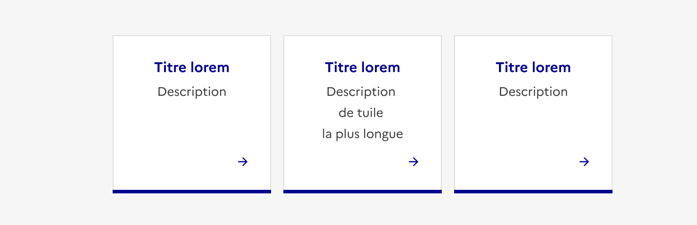
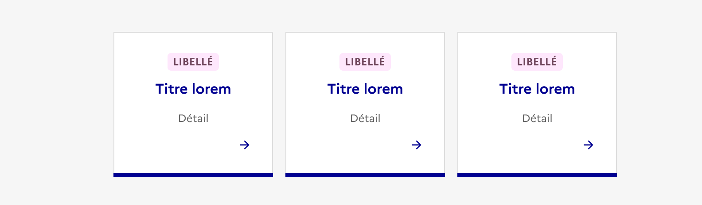
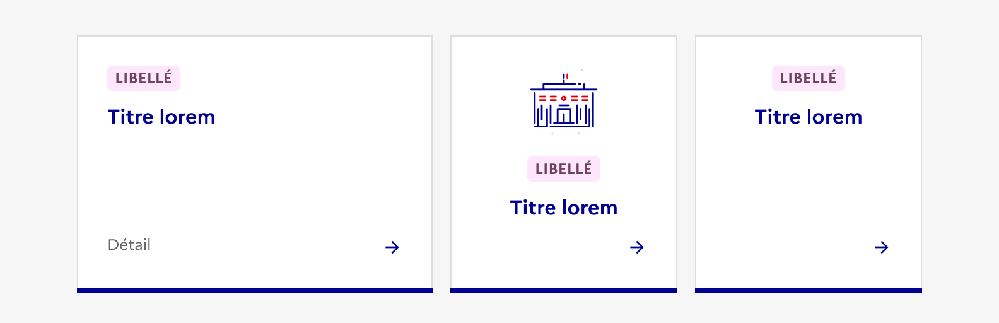

## Tuile

La tuile est un élément d’interaction avec l’interface permettant de rediriger l’usager vers des pages de contenu.

:::dsfr-doc-tab-navigation

- Présentation
- [Démo](./demo/index.md)
- [Design](./design/index.md)
- [Code](./code/index.md)
- [Accessibilité](./accessibility/index.md)

:::

::::fr-grid

:::fr-col{col=12 colMd=6}

::dsfr-doc-storybook{storyId=tile--tile}

:::

::::

### Quand utiliser ce composant ?

Utiliser la tuile pour créer un raccourci ou un point d’entrée vers des pages de contenu.

La tuile n’a pas vocation à être utilisée pour mettre en avant l’action principale d’une page.

>[!NOTE]
> Bien différencier la tuile de la [carte](../../../card/_part/doc/index.md). La carte permet d’avoir un aperçu du contenu des pages vers lesquelles elle renvoie.

### Comment utiliser ce composant ?

- **Utiliser les tuiles pour créer des collections ou listes d’éléments similaires**. La tuile n’est jamais présentée de manière isolée.
- **Harmoniser la hauteur des tuiles par ligne**, en prenant la plus importante comme référence, lorsque celles-ci sont disposées au sein d’une liste ou d’une collection.

::::dsfr-doc-guidelines

:::dsfr-doc-guideline[✅ À faire]{col=12 valid=true}

Contraindre toutes les tuiles d’une même ligne à la même hauteur.

:::

:::dsfr-doc-guideline[❌ À ne pas faire]{col=12 valid=false}

Ne pas créer de disparité dans la hauteur des tuiles d’une même ligne.

:::

::::

- **Proposer des tuiles de même structure** lorsque celles-ci composent une liste ou une collection.

::::dsfr-doc-guidelines

:::dsfr-doc-guideline[✅ À faire]{col=12 valid=true}

Conserver un contenu commun au sein des tuiles qui forment un même ensemble.

:::

:::dsfr-doc-guideline[❌ À ne pas faire]{col=12 valid=false}

Ne pas proposer des contenus différents entre chacune des tuiles d’un même ensemble.

:::

::::

- **Préférer les tuiles horizontales** lorsque les titres sont longs.
- **Conserver l’intégralité de la tuile cliquable** lorsque vous proposez cette variation.

### Règles éditoriales

- **Rédiger des titres et descriptions synthétiques**.
- **Proposer des contenus distincts pour chaque tuile**, en évitant de réutiliser plusieurs fois le même pictogramme.
- **Être vigilant sur les dimensions des illustrations utilisées** afin de garantir leur adaptation aux différents types d’affichages responsive.
