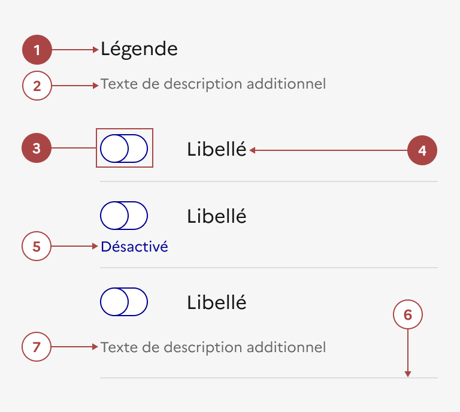

## Interrupteur

L’interrupteur est un élément d’interaction avec l’interface qui permet à l’usager de faire un choix entre deux états opposés (activé / désactivé).

:::dsfr-doc-tab-navigation

- [Présentation](../index.md)
- [Démo](../demo/index.md)
- Design
- [Code](../code/index.md)
- [Accessibilité](../accessibility/index.md)

:::

:::dsfr-doc-anatomy{imageWidth=384 col=12}

::dsfr-doc-pin[Une légende décrivant le contexte]{required=true add="uniquement dans le cadre d'un groupe d'interrupteurs"}

::dsfr-doc-pin[Une description additionnelle pour la légende]

::dsfr-doc-pin[Un interrupteur]{required=true}

::dsfr-doc-pin[Un libellé]{required=true add="associé à l'interrupteur"}

::dsfr-doc-pin[Un texte "état" décrivant l'état de l'interrupteur (activé / désactivé)]{add="placé en dessous du bouton et conseillé afin de faciliter la compréhension de l'usager"}

::dsfr-doc-pin[Un séparateur]

::dsfr-doc-pin[Un texte additionnel]{add="accompagnant chaque interrupteur / libellé"}

:::

### Variations

**Interrupteur simple**

::dsfr-doc-storybook{storyId=toggle--toggle}

**Interrupteur avec description**

::dsfr-doc-storybook{storyId=toggle--description}

**Interrupteur avec état**

::dsfr-doc-storybook{storyId=toggle--state}

**Groupe d’interrupteurs**

Utiliser l’interrupteur en groupe pour constituer une liste d’actions de même nature.

::dsfr-doc-storybook{storyId=toggle-group--toggle-group}

Lorsqu’il est utilisé en groupe, l’interrupteur doit toujours respecter le même format. Si le premier interrupteur affiche l'état, une description, ou le séparateur optionnel, alors l’ensemble des interrupteurs du groupe devront également afficher ces éléments.

**Groupe d’interrupteurs avec séparateurs**

::dsfr-doc-storybook{storyId=toggle-group--border-group}

### Tailles

La largeur de l’interrupteur s’adapte à la taille de son conteneur. Si l’interrupteur se trouve dans un conteneur large avec le bouton à droite du libellé, attention à ce qu’il ne s’en détache pas visuellement.

### États

**État d’erreur**

L'état d’erreur est signalé par un changement de couleur ainsi que l’affichage d’une ligne rouge (cf. couleurs système : le rouge est la couleur de l’état erreur) et d’un message d’erreur en-dessous du composant.

::dsfr-doc-storybook{storyId=toggle--error}

**Etat de succès**

L'état de succès est signalé par un changement de couleur ainsi que l’affichage d’une ligne verte (cf. couleurs système : le vert est la couleur de l’état succès) et d’un message de succès en-dessous du composant.

::dsfr-doc-storybook{storyId=toggle--valid}

**État désactivé**

L’état désactivé indique que l'usager ne peut pas interagir avec le bouton.

::dsfr-doc-storybook{storyId=toggle--disabled}

Dans le cas d’un interrupteur, il permet d’afficher un choix déjà effectué et/ou ne pouvant être modifié par l’usager.

### Personnalisation

Les interrupteurs ne sont pas personnalisables.

Toutefois, certains éléments sont optionnels - voir [la structure du composant](../../../../toggle/_part/doc/index.md).

::::dsfr-doc-guidelines

:::dsfr-doc-guideline[✅ À faire]{col=6 valid=true}

Utiliser uniquement la couleur bleu pour les interrupteurs.

:::

:::dsfr-doc-guideline[❌ À ne pas faire]{col=6 valid=false}

Ne pas personnaliser la couleur des interrupteurs.

:::

::::

::::dsfr-doc-guidelines

:::dsfr-doc-guideline[✅ À faire]{col=6 valid=true}

Conserver la coche lorsque l’interrupteur est activé.

:::

:::dsfr-doc-guideline[❌ À ne pas faire]{col=6 valid=false}

Ne pas supprimer ou personnaliser l’icône de l’interrupteur.

:::

::::
