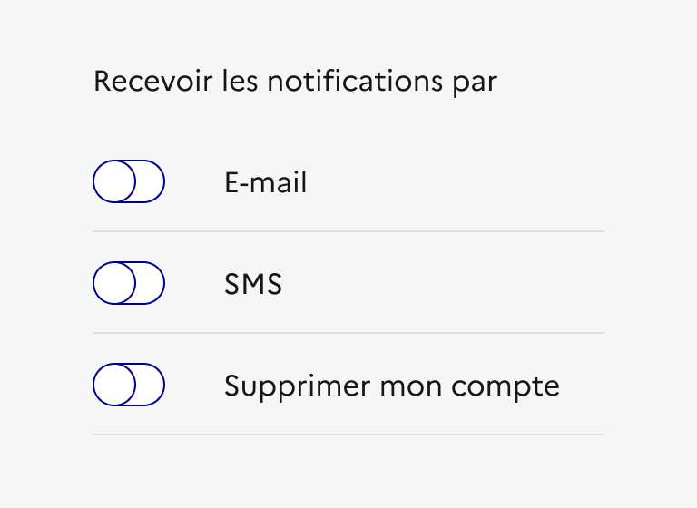
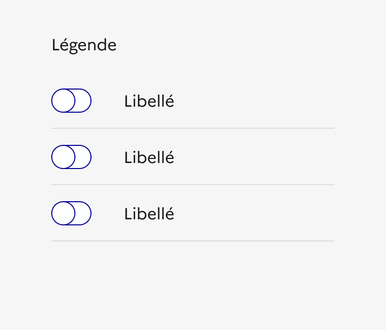
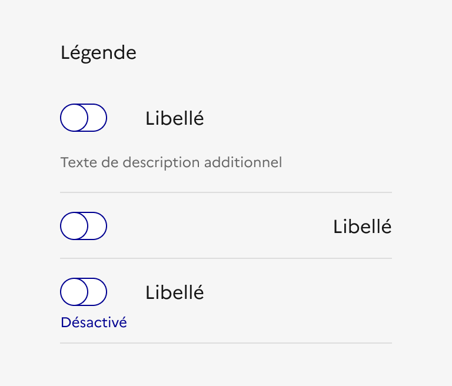

## Interrupteur

L’interrupteur est un élément d’interaction avec l’interface qui permet à l’usager de faire un choix entre deux états opposés (activé / désactivé).

:::dsfr-doc-tab-navigation

- Présentation
- [Démo](./demo/index.md)
- [Design](./design/index.md)
- [Code](./code/index.md)
- [Accessibilité](./accessibility/index.md)

:::

::dsfr-doc-storybook{storyId=toggle--toggle}

### Quand utiliser ce composant ?

Privilégier l’usage des interrupteurs pour paramétrer des fonctionnalités transverses (exemple : activation / désactivation des notifications), d’autant que le changement d'état de l’interrupteur a un effet immédiat et ne nécessite pas de validation.

### Comment utiliser ce composant ?

- **Veiller à ce que l’interrupteur et son libellé soient visuellement proches** afin d’en simplifier la compréhension et l’accessibilité (notamment pour les usagers naviguant avec une loupe d’écran).
- **Prioriser la composition interrupteur à gauche et libellé à droite** qui est la plus commune et la plus intelligible.
- **Utiliser l’interrupteur en groupe** pour constituer une liste d’actions de même nature.

::::dsfr-doc-guidelines

:::dsfr-doc-guideline[✅ À faire]{col=6 valid=true}

Utiliser l’interrupteur en groupe pour constituer une liste d’actions de même nature.

:::

:::dsfr-doc-guideline[❌ À ne pas faire]{col=6 valid=false}

Ne pas regrouper des interrupteurs qui n’ont rien à voir.

:::

::::

- **Respecter un format unique pour tous les interrupteurs d’un même groupe** (bouton à gauche et libellé à droite, ajout d’une description,statut etc.) ****

::::dsfr-doc-guidelines

:::dsfr-doc-guideline[✅ À faire]{col=6 valid=true}

Respecter un format unique pour tous les interrupteurs d’un même groupe.

:::

:::dsfr-doc-guideline[❌ À ne pas faire]{col=6 valid=false}

Ne pas proposer des formats différents entre les interrupteurs d’un même groupe.

:::

::::

### Règles éditoriales

- **Rédiger un libellé clair, explicite et concis** pour faciliter la compréhension de l’usager.
- **Accompagner le libellé d’une description** lorsque celui-ci ne permet pas, à lui seul, de comprendre l’action requise par l’usager.

::::dsfr-doc-guidelines

:::dsfr-doc-guideline[✅ À faire]{col=6 valid=true}

Accompagner le libellé d’une description lorsqu’il ne permet pas, à lui seul, de comprendre l’action requise par l’usager.

:::

::::

- **Ajouter un titre au composant** pour clarifier le cadre dans lequel il est utilisé.

::::dsfr-doc-guidelines

:::dsfr-doc-guideline[✅ À faire]{col=6 valid=true}

Ajouter un titre au composant pour clarifier le cadre dans lequel il est utilisé.

:::

::::
