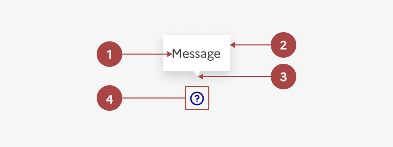

## Infobulle

L’infobulle (ou bulle d’aide, aide contextuelle) est un élément d’indication permettant d’afficher un contenu complémentaire lié à un élément précis de l’interface.

Elle est cachée par défaut et s’affiche par-dessus le reste de la page lors du survol ou au clic de l’élément associé.

:::dsfr-doc-tab-navigation

- [Présentation](../index.md)
- [Démo](../demo/index.md)
- Design
- [Code](../code/index.md)
- [Accessibilité](../accessibility/index.md)

:::

:::dsfr-doc-anatomy{imageWidth=384 col=12}

::dsfr-doc-pin[Un texte simple]{add="sans formatage riche" required=true}

::dsfr-doc-pin[Un cadre]{required=true}

::dsfr-doc-pin[Une flèche pointant vers l’élément associé]{required=true}

::dsfr-doc-pin[Une zone de déclenchement]{add="sous forme de bouton tertiaire sans contour avec icône, dans le cas d’un déclenchement au clic" required=true}

:::

### Variations

L’infobulle compte deux variations, suivant le type de déclenchement.

**Déclenchement au clic (ou information contextuelle)**

::dsfr-doc-storybook{storyId=tooltip--tooltip-click-button}

- Privilégier cette variation si le contexte le permet.
- Adosser l’icône représentant le point d’interrogation et permettant de déclencher l’infobulle à l’élément auquel elle se rapporte.

**Déclenchement au survol (ou au focus)**

::dsfr-doc-storybook{storyId=tooltip--tooltip}

- Réserver son usage aux cas où il n’est pas possible d’afficher l’information autrement ou qu’il n’y a pas la place d’intégrer une zone de déclenchement, et aux parcours majoritairement en desktop car elle ne s’affiche pas en mobile.

### Tailles

La taille de l’infobulle s’adapte à son contenu.

### États

L’infobulle n’est sujette à aucun changement d’état.

### Personnalisation

L’infobulle n'est pas personnalisable.

::::dsfr-doc-guidelines

:::dsfr-doc-guideline[✅ À faire]{col=6 valid=true}

Ne pas personnaliser la couleur de fond de l’infobulle.

:::

:::dsfr-doc-guideline[❌ À ne pas faire]{col=6 valid=false}

Ne pas personnaliser l’icône de l’infobulle.

:::

::::
