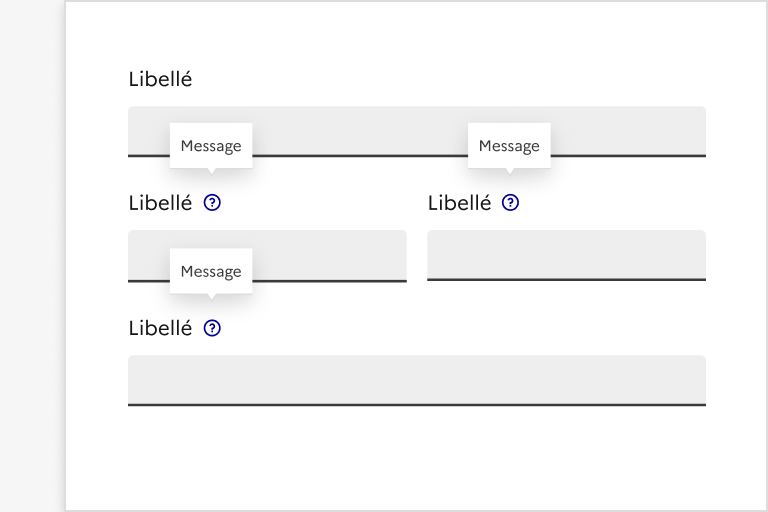

## Infobulle

L’infobulle (ou bulle d’aide, aide contextuelle) est un élément d’indication permettant d’afficher un contenu complémentaire lié à un élément précis de l’interface.

Elle est cachée par défaut et s’affiche par-dessus le reste de la page lors du survol ou au clic de l’élément associé.

:::dsfr-doc-tab-navigation

- Présentation
- [Démo](./demo/index.md)
- [Design](./design/index.md)
- [Code](./code/index.md)
- [Accessibilité](./accessibility/index.md)

:::

::dsfr-doc-storybook{storyId=tooltip--tooltip}

### Quand utiliser ce composant ?

**Utiliser l’infobulle uniquement lorsqu’il n’est pas possible d’afficher l’information directement dans le contenu de la page**, sans la cacher dans une bulle. L’information contenue dans l’infobulle ne doit pas être essentielle à la bonne compréhension du parcours par l’usager.

**A noter :** Privilégier son usage sur des sites principalement consultés sur desktop. Elle est à éviter sur des sites enregistrant une forte fréquentation mobile car certaines de ses variations ne s’affiche pas sur mobile.

Dans ce cas, plutôt qu’une infobulle, il est possible d’utiliser une [alerte](../../../alert/_part/doc/index.md), un [accordéon](../../../accordion/_part/doc/index.md), une [mise en avant](../../../callout/_part/doc/index.md) ou même une zone personnalisée.

### Comment utiliser ce composant ?

- **Utiliser l’infobulle pour apporter des précisions non essentielles** sur un élément de la page.

::::dsfr-doc-guidelines

:::dsfr-doc-guideline[✅ À faire]{col=6 valid=true}

Utiliser une infobulle pour préciser un libellé dans un formulaire, par exemple.

:::

:::dsfr-doc-guideline[❌ À ne pas faire]{col=6 valid=false}

Ne pas répéter des éléments déjà visibles dans une infobulle.

:::

- **Conserver un format de texte simple** n’incluant pas de mise en forme riche (gras, italique etc.)

:::dsfr-doc-guideline[✅ À faire]{col=6 valid=true}

Ne pas inclure de graisse ou d’italique au texte de l’infobulle.

:::

- **Exclure tous types d’interactions** (boutons, liens etc.) **ou de médias** au sein de l’infobulle.

:::dsfr-doc-guideline[❌ À ne pas faire]{col=6 valid=false}

Ne pas ajouter de lien au sein de l’infobulle.

:::

- **Limiter le nombre d’infobulles** proposé dans une même page.
- **Empêcher l’ouverture de plusieurs infobulles** dans un même affichage.

:::dsfr-doc-guideline[✅ À faire]{col=6 valid=true}

Permettre l’ouverture d’une seule infobulle à la fois.

:::

:::dsfr-doc-guideline[❌ À ne pas faire]{col=6 valid=false}

Ne pas permettre l’ouverture de plusieurs infobulles en simultanée.

:::

- **Utiliser une flèche pour lier la zone de texte à l’élément associé** afin que l’usager comprenne à quoi l’infobulle se réfère.

:::dsfr-doc-guideline[✅ À faire]{col=6 valid=true}

Utiliser une flèche pour lier la zone de texte à l’élément associé. L’usager doit comprendre à quoi l’infobulle se réfère.

:::

:::dsfr-doc-guideline[❌ À ne pas faire]{col=6 valid=false}

Ne pas dissocier la zone de texte à l’élément associé.

:::

::::

### Règles éditoriales

- **Rédiger un texte concis et explicite** garantissant la compréhension de l’usager.
- **Privilégier un texte court** pour ne démultiplier la taille de l’infobulle.

::::dsfr-doc-guidelines

:::dsfr-doc-guideline[✅ À faire]{col=6 valid=true}

Proposer un texte court afin que la taille de l’infobulle reste équilibrée.

:::

:::dsfr-doc-guideline[❌ À ne pas faire]{col=6 valid=false}

Ne pas proposer de texte trop long, qui déformerait l’infobulle.

:::

::::