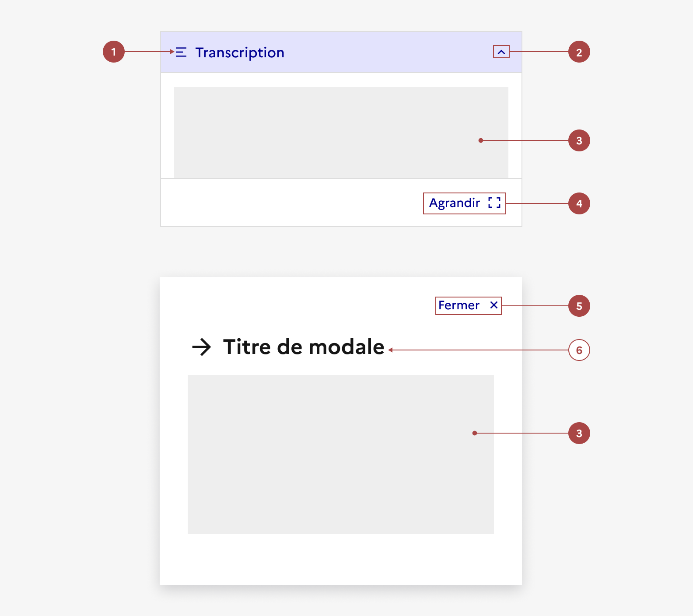

## Transcription

La transcription est un élément d’interaction avec l’interface permettant à l’usager d'afficher ou de masquer le texte traduisant un contenu média au sein d’une page.

:::dsfr-doc-tab-navigation

- [Présentation](../index.md)
- [Démo](../demo/index.md)
- Design
- [Code](../code/index.md)
- [Accessibilité](../accessibility/index.md)

:::

:::dsfr-doc-anatomy{col=12}

::dsfr-doc-pin[Un libellé “Transcription”]{required=true add='avec icône'}

::dsfr-doc-pin[Un chevron orienté vers le bas]{required=true add="indiquant que la transcription peut s'ouvrir. Il est orienté vers le haut quand la transcription peut se refermer"}

::dsfr-doc-pin[Un contenu]{required=true}

::dsfr-doc-pin[Un bouton “Agrandir“]{required=true add='pour ouvrir la transcription en modale'}

::dsfr-doc-pin[Un bouton “Fermer”]{required=true add='pour refermer la modale'}

::dsfr-doc-pin[Un titre de modale]{add='avec ou sans icône'}

:::

### Variations

La transcription ne propose aucune variation.

Toutefois, au delà de son format accordéon, il est également possible de la consulter en plein écran dans une vue dédiée, via l’ouverture d’une modale.

Les deux vues sont ici complémentaires.

### Tailles

La transcription reprend l’apparence et le fonctionnement d’un [accordéon](../../../../accordion/_part/doc/index.md).

Toutefois, la hauteur de celui-ci est fixe pour permettre aux usagers d’avoir accès à la transcription en même temps que le média associé.

Sous forme de modale, la transcription profite des mêmes tailles que celles disponibles pour le [composant modale](../../../../modal/_part/doc/index.md) lui-même.

### États

L’accordéon, dans le contexte d'une transcription, est soumis aux mêmes états que le [composant accordéon](../../../../accordion/_part/doc/index.md) lui-même.

### Personnalisation

Au même titre que les composants [accordéon](../../../../accordion/_part/doc/index.md) et [modale](../../../../modal/_part/doc/index.md) qui la constituent, la transcription n’est pas personnalisable.

Toutefois, certains éléments sont optionnels - voir [la structure du composant](../../../../transcription/_part/doc/index.md).
