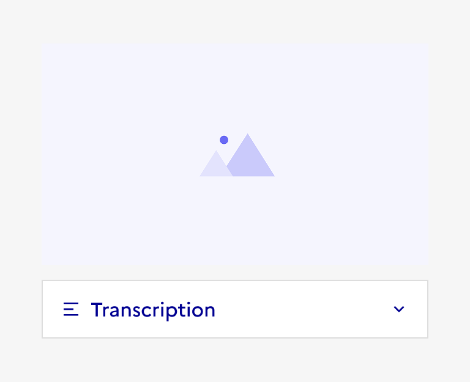
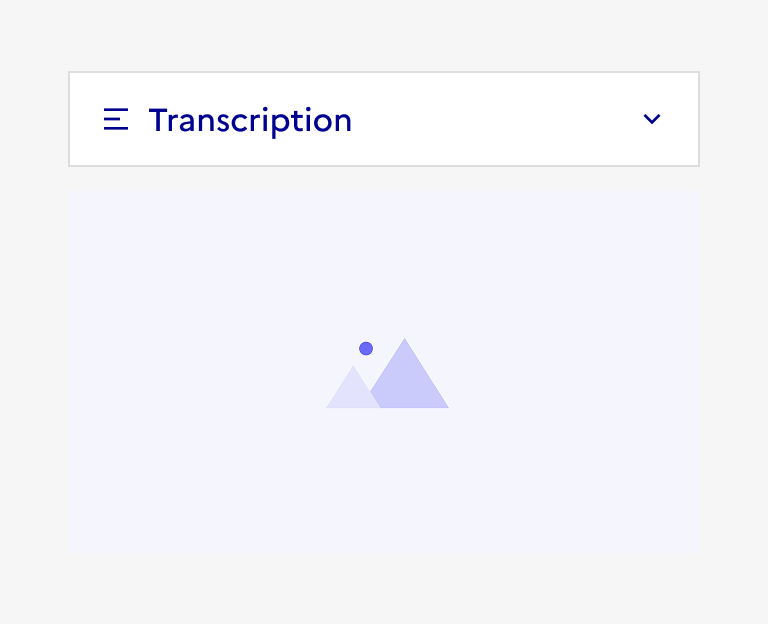

## Transcription

La transcription est un élément d’interaction avec l’interface permettant à l’usager d'afficher ou de masquer le texte traduisant un contenu média au sein d’une page.

:::dsfr-doc-tab-navigation

- Présentation
- [Démo](./demo/index.md)
- [Design](./design/index.md)
- [Code](./code/index.md)
- [Accessibilité](./accessibility/index.md)

:::

::dsfr-doc-storybook{storyId=transcription--transcription}

### Quand utiliser ce composant ?

Proposer une transcription pour accompagnée un [contenu média](../../../content/_part/doc/index.md), en la plaçant directement sous ce dernier, dans une zone à déployer au clic.

### Comment utiliser ce composant ?

- **Garantir que la zone à déployer et le contenu tiennent sur un même écran**, sans nécessiter de défilement.
- **Afficher la transcription sur la même page que le contenu média** pour permettre la lecture simultanée.
- **Masquer la transcription quand celle-ci est longue**, dans une zone à développer au clic ou sur une page séparée (modale) atteinte via un lien.

::::dsfr-doc-guidelines

:::dsfr-doc-guideline[✅ À faire]{col=6 valid=true}

Ajouter la transcription directement sous le contenu média associé, accessible simultanément.

:::

:::dsfr-doc-guideline[❌ À ne pas faire]{col=6 valid=false}

Ne pas positionner la transcription avant le contenu média ou trop loin, pour que les deux soient consultés en même temps.
:::

::::

### Règles éditoriales

- **Proposer une transcription textuelle pertinente et accessible**.
