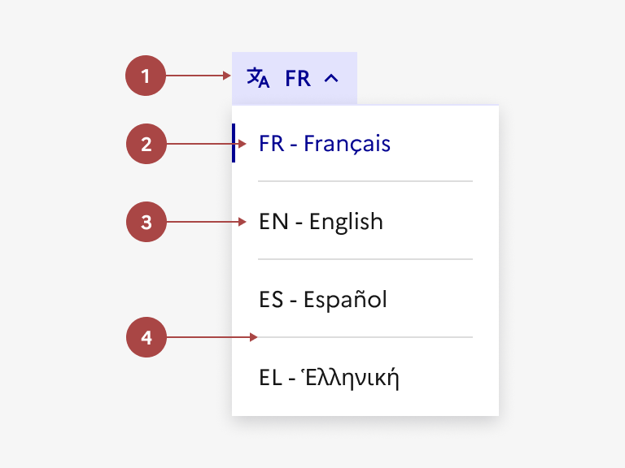
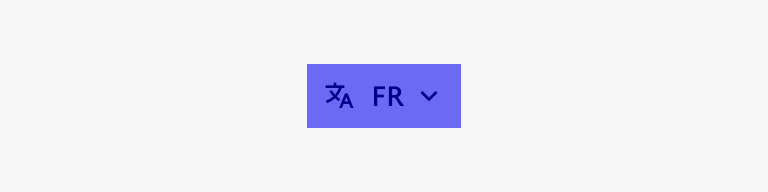
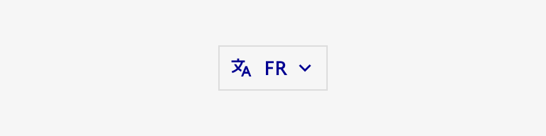
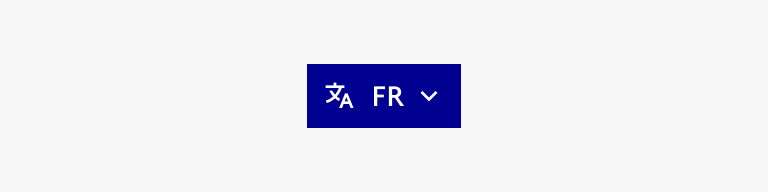

## Sélecteur de langues

Le sélecteur de langues est un élément d’interaction avec l’interface permettant à l’usager de choisir la langue dans laquelle est affiché le contenu du site.

:::dsfr-doc-tab-navigation

- [Présentation](../index.md)
- [Démo](../demo/index.md)
- Design
- [Code](../code/index.md)
- [Accessibilité](../accessibility/index.md)

:::

:::dsfr-doc-anatomy{imageWidth=384 col=12}

::dsfr-doc-pin[Un bouton tertiaire avec icône]{required=true}

::dsfr-doc-pin[L’item de la langue active]{required=true}

::dsfr-doc-pin[Une liste déroulante des autres langues disponibles]{required=true}

::dsfr-doc-pin[Un séparateur]{add="entre chaque proposition de langue" required=true}

:::

### Variations

**Bouton avec bordure**

::dsfr-doc-storybook{storyId=translate--button-tertiary}

**Bouton sans bordure**

::dsfr-doc-storybook{storyId=translate--button-tertiary-no-outline}

En desktop, la langue active est affichée dans le bouton sans son nom en toutes lettres (dans un souci de place) puis la liste déroulante reprend la langue active avant d’afficher les options.

En mobile, la langue active est affichée en entier mais n’est pas répétée dans la liste déroulante.

### Tailles

Le sélecteur de langues propose une taille unique, non personnalisable.

### États

**Etat au clic**

L’état au clic correspond au comportement constaté par l’usager une fois la liste déroulante ouverte, après avoir cliqué sur le bouton.

**Etat au survol**

L’état au survol correspond au comportement constaté par l’usager lorsqu’il survole le bouton avec sa souris. Il existe 2 états au survol :

- Lorsque le bouton est non cliqué

- Lorsque le bouton est cliqué

### Personnalisation

Le sélecteur de langues n’est pas personnalisable.

Toutefois, certains éléments sont optionnels - voir [la structure du composant](#sélecteur-de-langue).

::::dsfr-doc-guidelines

:::dsfr-doc-guideline[✅ À faire]{col=6 valid=true}

Garder un fond transparent pour le sélecteur de langues.

:::

:::dsfr-doc-guideline[❌ À ne pas faire]{col=6 valid=false}

Ne pas appliquer de fond au sélecteur de langues.

:::

:::dsfr-doc-guideline[✅ À faire]{col=6 valid=true}

Personnaliser le sélecteur de langues en y ajoutant une bordure.

:::

:::dsfr-doc-guideline[❌ À ne pas faire]{col=6 valid=false}

Ne pas proposer une autre variation de bouton pour le sélecteur de langues.

:::

::::
