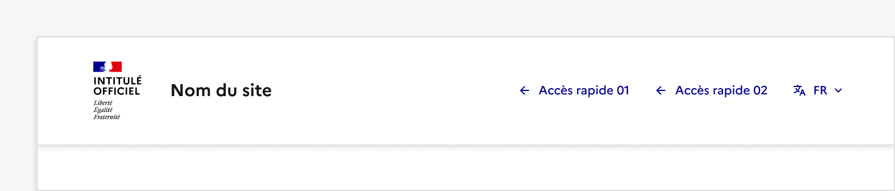
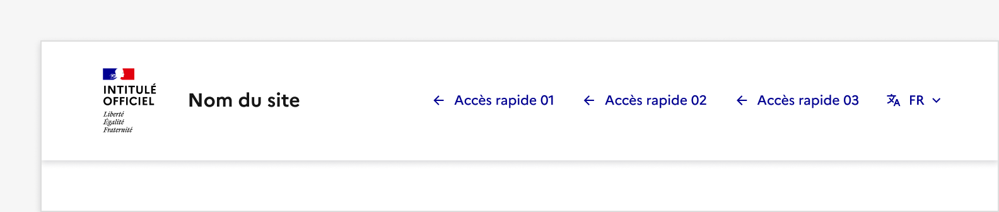
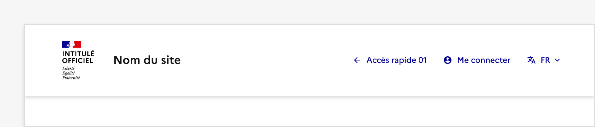
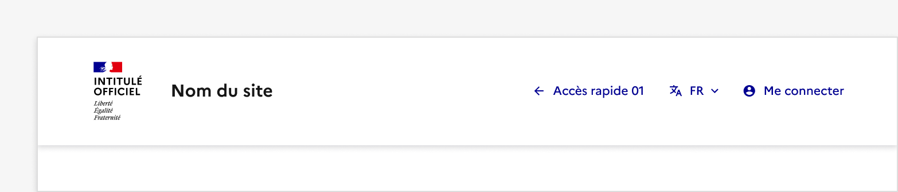
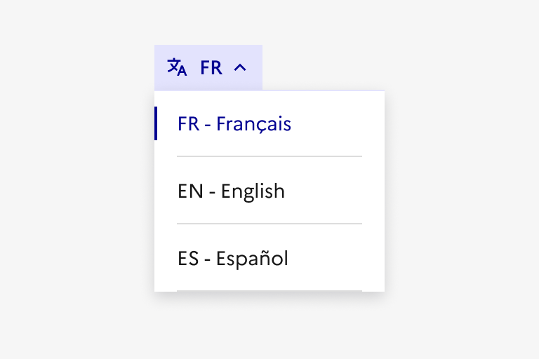
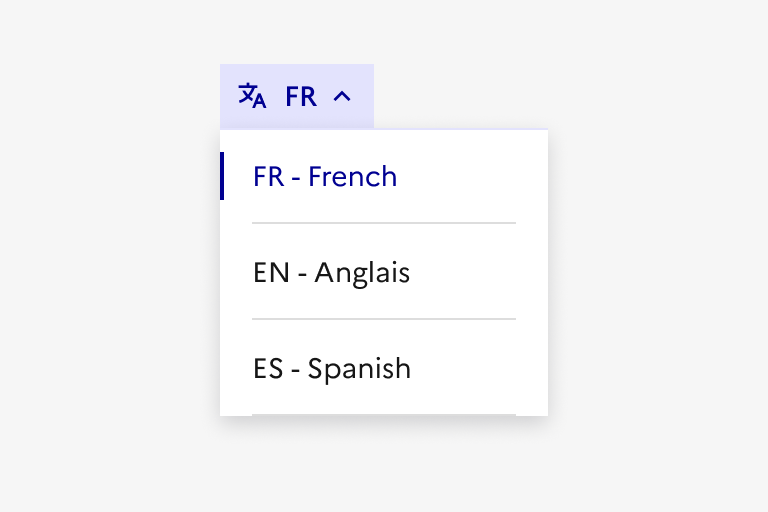

## Sélecteur de langues

Le sélecteur de langues est un élément d’interaction avec l’interface permettant à l’usager de choisir la langue dans laquelle est affiché le contenu du site.

:::dsfr-doc-tab-navigation

- Présentation
- [Démo](./demo/index.md)
- [Design](./design/index.md)
- [Code](./code/index.md)
- [Accessibilité](./accessibility/index.md)

:::

::dsfr-doc-storybook{storyId=translate--translate}

### Quand utiliser ce composant ?

**Utiliser le sélecteur de langues dès lors qu’un site est disponible en plusieurs langues.**

> [!NOTE]
> Son usage est préconisé à partir de trois langues au moins (en général, il s’agira du français et deux autres langues), bien qu’il est techniquement possible d’utiliser le sélecteur de langue pour un site en deux langues.
Cependant, en vertu de [la loi n° 94-665 du 4 août 1994 relative à l'emploi de la langue française](https://www.legifrance.gouv.fr/loda/id/JORFTEXT000000349929/2022-06-17/), et conformément à [la politique gouvernementale constante en faveur du plurilinguisme](https://www.legifrance.gouv.fr/jorf/id/JORFTEXT000000411109), nous recommandons fortement de proposer une traduction en deux langues au moins (en plus du français).

### Comment utiliser ce composant ?

- **Intégrer le sélecteur de langues dans l’en-tête du site**, en lieu et place d’un accès rapide parmi les 3 disponibles. Lorsqu’il est présent, il est forcément sur l’accès rapide le plus à droite (le dernier en mobile), à part quand un bouton tertiaire encadré y est déjà présent (par exemple : “Connexion”).

::::dsfr-doc-guidelines

:::dsfr-doc-guideline[✅ À faire]{col=12 valid=true}

Proposer le sélecteur de langues en remplacement d’un des accès rapides parmi les trois disponibles.

:::

:::dsfr-doc-guideline[❌ À ne pas faire]{col=12 valid=false}

Ne pas ajouter un accès rapide en plus pour y intégrer le sélecteur de langues.

:::

:::dsfr-doc-guideline[✅ À faire]{col=12 valid=true}

Placer systématiquement le sélecteur de langues sur l’emplacement le plus à droite des accès rapides.

:::

:::dsfr-doc-guideline[❌ À ne pas faire]{col=12 valid=false}

Ne pas proposer le sélecteur de langues sur un emplacement autre que celui le plus à droite des accès rapides.

:::

::::

- **Proposer autant de langues que souhaité** tout en considérant que les symboles dans les librairies ne prévoient que jusqu'à huit langues maximum.

### Règles éditoriales

- **Indiquer une langue par [son code ISO](https://fr.wikipedia.org/wiki/Liste_des_codes_ISO_639-1) puis son nom en toutes lettres, dans la langue cible**.

::::dsfr-doc-guidelines

:::dsfr-doc-guideline[✅ À faire]{col=6 valid=true}

Indiquer chaque langue par son code ISO et son nom en toutes lettres, dans la langue cible.

:::

:::dsfr-doc-guideline[❌ À ne pas faire]{col=6 valid=false}

Ne pas dissocier le nom indiqué de la langue cible.