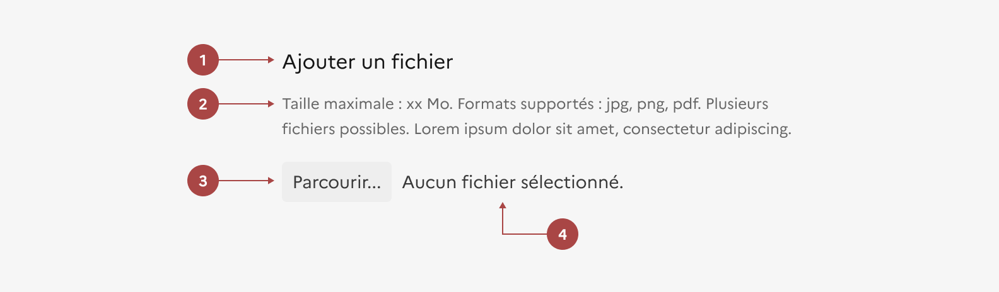

## Ajout de fichier

L’ajout de fichier est un élément d’interaction avec l’interface qui permet à l’usager de sélectionner et d’envoyer un ou plusieurs fichiers.

:::dsfr-doc-tab-navigation

- [Présentation](../index.md)
- [Démo](../demo/index.md)
- Design
- [Code](../code/index.md)
- [Accessibilité](../accessibility/index.md)

:::

:::dsfr-doc-anatomy{col=12}

::dsfr-doc-pin[Un libellé]{required=true add='exprimant clairement l’action attendue pour l’usager (par défaut “Ajouter un fichier")'}

::dsfr-doc-pin[Un texte explicatif]{required=true add='précisant les contraintes au niveau du ou des fichiers attendus (format, poids, nombre de fichiers possible etc.)'}

::dsfr-doc-pin[Un bouton “Parcourir”]{required=true add='le texte dépendant du navigateur utilisé'}

::dsfr-doc-pin[Le nom du ou des fichiers]{required=true add='par défaut “Aucun fichier sélectionné”'}

:::

Au clic sur “Parcourir”, la boite de dialogue de sélection de fichier s’affiche. Les noms des fichiers sélectionnés viennent s’afficher à la place du texte par défaut.

### Variations

**Ajout multiple**

Utiliser l’ajout multiple dès lors que l’usager doit sélectionner plus d’un fichier.

::dsfr-doc-storybook{storyId=upload--multiple}

### Tailles

L’ajout de fichier est disponible dans une seule taille. Sa largeur n’est pas contrainte, toutefois, dans le respect des bonnes pratiques UX, il est recommandé de conserver les éléments textuels sur une largeur de 8 colonnes maximum.

### États

**Etat d’erreur**

L'état d’erreur est signalé par un changement de couleur (cf. couleurs système : le rouge est la couleur de l’état erreur) et l’affichage d’un message d’erreur en-dessous du composant.

::dsfr-doc-storybook{storyId=upload--error}

**Etat désactivé**

L’état désactivé indique que l'usager ne peut pas interagir avec le bouton.

::dsfr-doc-storybook{storyId=upload--disabled}

> [!NOTE]
> **N’utiliser cet état que très ponctuellement**, pour indiquer à l’usager qu’il doit procéder à une action en amont par exemple.

### Personnalisation

L’ajout de fichier n’est pas personnalisable.

::::dsfr-doc-guidelines

:::dsfr-doc-guideline[❌ À ne pas faire]{col=6 valid=false}

Ne pas personnaliser la couleur du bouton par défaut.

:::

:::dsfr-doc-guideline[❌ À ne pas faire]{col=6 valid=false}

Ne pas personnaliser la couleur des textes d’accompagnement.

:::

::::

### Maillage

- [Formulaire](../../../../form/_part/doc/index.md)
