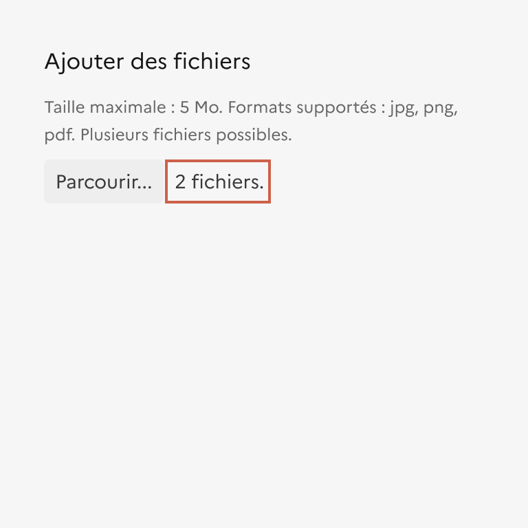

## Ajout de fichier

L’ajout de fichier est un élément d’interaction avec l’interface qui permet à l’usager de sélectionner et d’envoyer un ou plusieurs fichiers.

:::dsfr-doc-tab-navigation

- Présentation
- [Démo](./demo/index.md)
- [Design](./design/index.md)
- [Code](./code/index.md)
- [Accessibilité](./accessibility/index.md)

:::

::dsfr-doc-storybook{storyId=upload--upload}

### Quand utiliser ce composant ?

Proposer l’ajout de fichier uniquement si l’envoi d’un ou plusieurs fichier est essentiel à votre service.

### Comment utiliser ce composant ?

- **Intégrer l’ajout de fichier à un formulaire** pour permettre le chargement de fichiers.

::::dsfr-doc-guidelines

:::dsfr-doc-guideline[✅ À faire]{col=12 valid=true}

Cas d’usage au sein d’un formulaire.

:::

::::

- **Afficher le format, poids et autres consignes pour que le fichier soit conforme** à ce qui est attendu.
- **Préciser les erreurs rencontrées** lors de l’envoi de fichier (format, poids etc.)

::::dsfr-doc-guidelines

:::dsfr-doc-guideline[✅ À faire]{col=6 valid=true}

Traduire précisément l’erreur pour qu’elle soit clairement identifiable.

:::

::::

- **Utiliser l’ajout de fichiers multiples** lorsque l’usager doit sélectionner des fichiers de mêmes natures et respectant les mêmes contraintes.

::::dsfr-doc-guidelines

:::dsfr-doc-guideline[✅ À faire]{col=6 valid=true}

Utiliser l’ajout multiple de fichiers si les fichiers à sélectionner sont de mêmes natures et/ou respectent les mêmes contraintes.

:::

::::

- **Préférer plusieurs champs d’ajout de fichier unique** lorsque l’usager doit sélectionner des fichiers de différentes natures, avec des contraintes spécifiques.

::::dsfr-doc-guidelines

:::dsfr-doc-guideline[✅ À faire]{col=6 valid=true}

Préférer plusieurs champs d’ajout de fichier si les fichiers à sélectionner sont de différentes natures et/ou ont des contraintes spécifiques.

:::

:::dsfr-doc-guideline[❌ À ne pas faire]{col=6 valid=false}

Ne pas proposer plusieurs champs d’ajout de fichier si les fichiers à sélectionner sont de mêmes natures et/ou respectent les mêmes contraintes.

:::

::::

### Règles éditoriales

Il est à noter que le navigateur ajoute automatiquement un message à coté du bouton d’ajout de fichier. Ce message n’est pas modifiable et dépend du navigateur utilisé.

Ce message indique le nom du fichier ajouté ou le nombre de fichiers ajoutés lorsqu’il y en a plusieurs.

La langue de ce texte dépend de la langue configurée sur le navigateur de l’utilisateur.