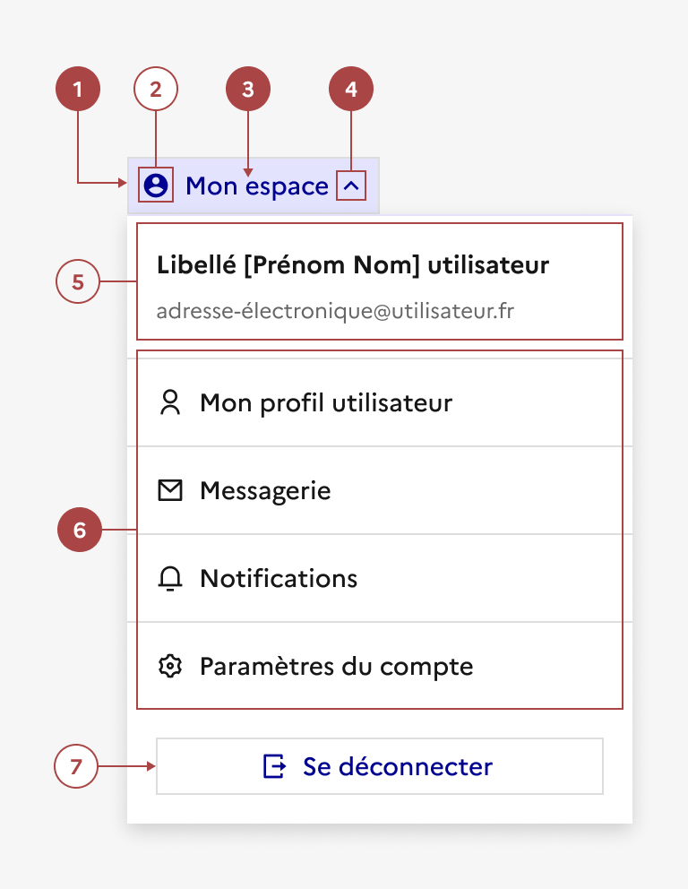

## En-tête connectée

> [!NOTE]
> **Ce composant est en version bêta.** Il n'existe pas en code et son design ou ses fonctionnalités peuvent encore être amenés à évoluer. N'hésitez pas à nous partager vos cas d'usage ou retours qui le concerne via notre formulaire de contact ou notre Tchap pour que nous puissions les étudier.

Retrouvez ces composants sur Figma [dans un fichier dédié bêta disponible sur Community](https://www.figma.com/community/file/1096003483468520396).

L’en-tête connectée est une déclinaison de l’en-tête et propose un menu déroulant contenant des options parmi lesquelles un usager peut naviguer vers les pages liées à son compte.

Un texte de description est présent dans le conteneur, indiquant les nom, prénom et adresse email de l’usager et est accompagné d’un bouton de déconnexion.

:::dsfr-doc-tab-navigation

- [Présentation](../index.md)
- Design

:::

:::dsfr-doc-anatomy{imageWidth=384 col=12}

::dsfr-doc-pin[Un bouton tertiaire]{required=true add="en taille SM uniquement, avec ou sans contour"}

::dsfr-doc-pin[Une icône]{add="placée à gauche du libellé"}

::dsfr-doc-pin[Un libellé de bouton orienté utilisateur]{required=true}

::dsfr-doc-pin[Un chevron]{required=true add="placé à droite du libellé"}

::dsfr-doc-pin[Un libellé et un texte de description de l’utilisateur]

::dsfr-doc-pin[Une liste de liens de navigation]{required=true}

::dsfr-doc-pin[Un bouton de déconnexion]

:::

Le menu déroulant n’a pas vocation à remplacer ou refléter l’intégralité du contenu lié au compte ou aux informations personnelles. Veillez à respecter les catégories déjà présentes et ne pas dépasser 6 entrées.

### Variations

L’en-tête connectée ne propose aucune variation.

### Tailles

L’en-tête connectée propose une taille SM uniquement.

### États

**État au survol**

L’état au survol correspond au comportement constaté par l’usager lorsqu’il survole l’en-tête connecté avec sa souris.

**État au clic**

L’état au clic correspond au comportement constaté par l’usager lorsqu’il clique sur l’en-tête connectée.

### Personnalisation

L’en-tête connectée n’est pas personnalisable.

- Ne pas personnaliser l’icône.
- Ne pas personnaliser le libellé et le texte de description relatif à l’utilisateur.
- Ne pas personnaliser le bouton de déconnexion.

### Maillage

- [En-tête](../../../../header/_part/doc/index.md)