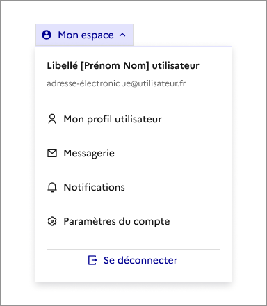
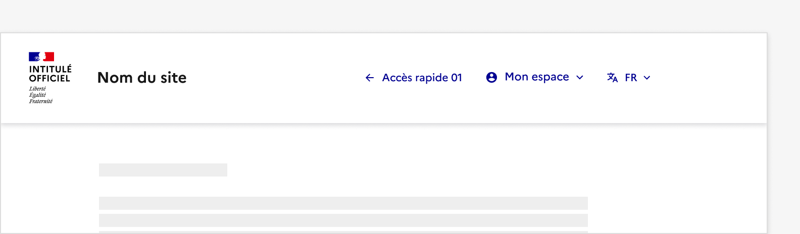
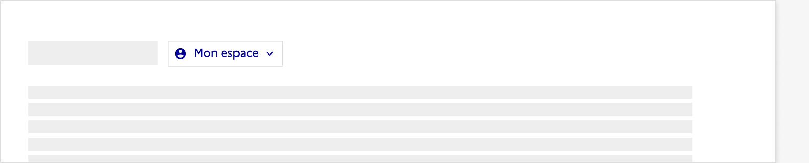

## En-tête connectée

> [!NOTE]
> **Ce composant est en version bêta.** Il n'existe pas en code et son design ou ses fonctionnalités peuvent encore être amenés à évoluer. N'hésitez pas à nous partager vos cas d'usage ou retours qui le concerne via notre formulaire de contact ou notre Tchap pour que nous puissions les étudier.

Retrouvez ces composants sur Figma [dans un fichier dédié bêta disponible sur Community](https://www.figma.com/community/file/1096003483468520396).

L’en-tête connectée est une déclinaison de l’en-tête et propose un menu déroulant contenant des options parmi lesquelles un usager peut naviguer vers les pages liées à son compte.

Un texte de description est présent dans le conteneur, indiquant les nom, prénom et adresse email de l’usager et est accompagné d’un bouton de déconnexion.

:::dsfr-doc-tab-navigation

- Présentation
- [Design](./design/index.md)

:::

### Quand utiliser ce composant ?

Utiliser l’en-tête connectée pour permettre à l’usager d’avoir des informations sur son compte, pour grouper des actions ou des liens de navigation.

Le menu déroulant dans l’en-tête est présent lorsque l’usager s’est connecté sur une page dédiée.

### Comment utiliser ce composant ?

- **Utiliser l’en-tête connectée pour grouper des liens de navigation** vers des pages internes de l’usager.
- **Utiliser l’en-tête connectée uniquement si la place disponible permet d’accueillir le bouton du menu déroulant**. Il est recommandé de ne pas la cumuler avec un grand nombre de liens d’accès rapide ou en présence du bouton des paramètres d’affichage.

::::dsfr-doc-guidelines

:::dsfr-doc-guideline[✅ À faire]{col=12 valid=true}

Positionner l’en-tête connectée à l’emplacement d’un des accès rapide.

:::

:::dsfr-doc-guideline[❌ À ne pas faire]{col=12 valid=false}

Ne pas proposer l’en-tête connectée en dehors des accès rapides

:::

::::

- **Conserver un fonctionnement simple**. N'imbriquer pas de menus déroulants, par exemple.

### Règles éditoriales

- **Utiliser des libellés courts, concis et faciles à comprendre**.
- **Eviter de proposer des options qui s’étendent sur plusieurs lignes**.