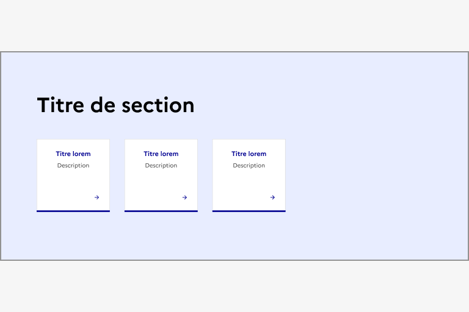
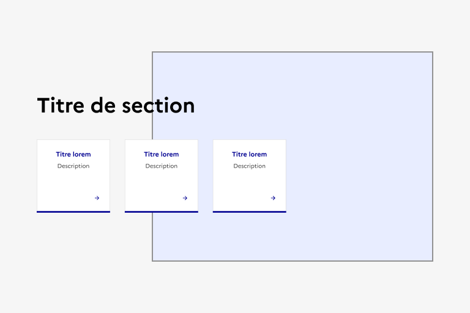
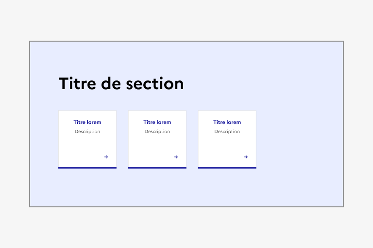
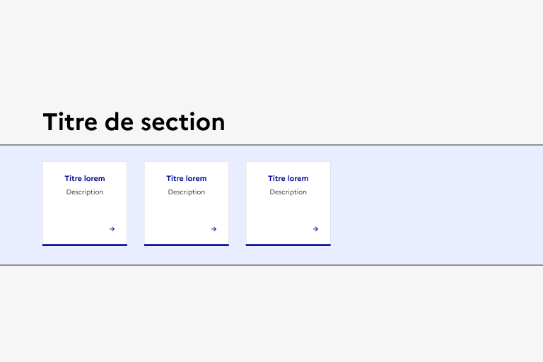
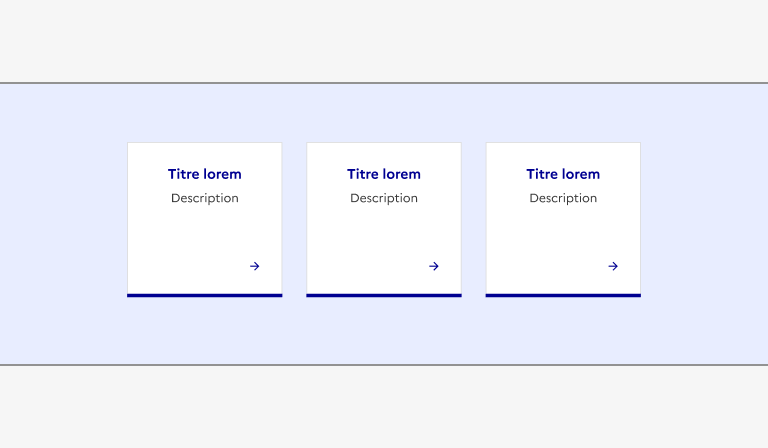
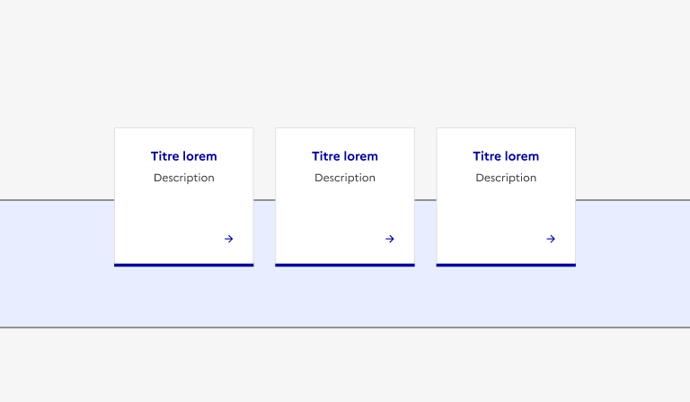

# Les principes à respecter

Le Système de Design de l’État vise à transformer l’ensemble de l’écosystème des sites de l’Etat. La variété des interfaces qu’il adresse est immense et les publics concernés encore plus. Il faut donc garder cela en tête et s’assurer de respecter quelques principes lorsque que l’on conçoit une interface avec :

## Les bonnes pratiques

### Aller à l’essentiel

Minimaliste par nature, **le DSFR permet de créer des interfaces claires et compréhensibles pour tous**. Comme l’État, il a pour mission d'apporter clarté et confiance dans la vie des gens. Dans vos projets, veillez donc à éliminer toute complexité inutile pour fournir une expérience utilisateur optimale.

### Être inclusif

Comme l’État, **le DSFR ambitionne d’être universel** et de ne laisser aucun citoyen de côté car il ou elle serait en situation de handicap, n’utiliserait pas un appareil dernier cri ou la dernière version d’un navigateur. Il est donc conçu pour être accessible et l’ensemble de ses composants, régulièrement audités, sont **conformes à 100% du RGAA.** Dans vos projets, prenez également en compte les bonnes pratiques d’accessibilité et cherchez la simplicité pour adresser tous les publics.

### Rester formel

L’image de marque de l’État et la représentation que s’en fait le citoyen proviennent d’un héritage et d’emblèmes qui traversent l’histoire, comme la Marianne, le drapeau français ou notre devise. **Le DSFR s’inscrit en droite ligne de ce patrimoine, en marquant la présence de l’État** dans tous les services numériques mis à la disposition des citoyens. Préserver ce formalisme, même dans les interfaces qui nécessitent de la proximité avec les usagers ou un positionnement plus léger, est essentiel.

### En application

1. Que vous utilisiez ou non les composants de la librairie, le respect des [fondamentaux](../index.md) du DSFR est obligatoire : ils sont le seul moyen d’assurer la cohérence des interfaces de l’État ;
2. Vous avez l’obligation d’utiliser les [composants](../../../../component/_part/doc/index.md) du DSFR s’ils existent dans la librairie, en respectant scrupuleusement leurs règles d’utilisation ;
3. Vous pouvez créer vos propres composants seulement s’ils n’existent pas dans la librairie
4. Si vous pensez qu’un composant n’existe pas, pensez à interroger la communauté. Il y a de fortes chances qu’il ait déjà été créé par une autre équipe.
5. Si vous créez un composant et si vous pensez qu’il pourrait être utile à d’autres équipes, pensez à nous le partager pour qu’il soit réintégré à la librairie.

## Le détail des fondamentaux

Le Système de Design de l’état ne se limite pas à ses composants. Les composants sont une concrétisation possible des éléments et règles qui régissent le DSFR en amont. Mais ces règles encadrent et permettent bien d’autres choses. Il est important de les comprendre pour exploiter le DSFR au mieux.

### La palette de couleurs

La palette de 24 couleurs est issue de la [Marque de l’État](https://www.info.gouv.fr/marque-de-letat). Cette charte, créée en 2017, vise à harmoniser et renforcer la reconnaissance de la parole de l’État quel que soit le support, numérique compris.
Dans le DSFR ces couleurs sont réparties en 4 familles : primaires, neutres, systèmes et illustratives dont les usages sont [détaillés sur cette page](../color/index.md).

Le respect de la palette et de leur application amène de la cohérence entre les interfaces et permet d’offrir une expérience optimale à l’utilisateur. Les principes importants à retenir sont :

1. **Le fond du site doit être blanc**  

    Spécificité légale : La loi du 29 juillet 1881, indique dans son article 15, chapitre III (modifié par la loi n° 2004-1343 du 9 décembre 2004) que seules les affiches des actes émanant de l’autorité administrative peuvent être imprimées sur papier blanc.

    Le fond de votre site doit être blanc par défaut. Il est possible de créer des ruptures avec des fonds de couleurs alternatives mais cette notion est importante à respecter pour la clarté, l’accessibilité et la facilité d’usage de votre interface.  

2. **L’utilisation de fonds de couleur alternatifs**  

    Vous pouvez délimiter des sections de votre site par des fonds de couleurs. Dans ce cas, l’entièreté des éléments contenus dans la section doit y être clairement inclue.  

    ::::dsfr-doc-guidelines

    :::dsfr-doc-guideline[✅ À faire]{col=6 valid=true}

    

    Proposer un fond de couleur en pleine largeur, englobant l’entièreté des éléments de la section.

    :::

    :::dsfr-doc-guideline[❌ À ne pas faire]{col=6 valid=false}

    

    Ne pas appliquer un fond de couleur partiel sur une section.

    :::

    ::::

    ::::dsfr-doc-guidelines

    :::dsfr-doc-guideline[✅ À faire]{col=6 valid=true}

    

    Proposer un fond de couleur sur 12 colonnes, englobant l’entièreté des éléments de la section.

    :::

    :::dsfr-doc-guideline[❌ À ne pas faire]{col=6 valid=false}

    

    Ne pas positionner certains éléments de la section en dehors du fond de couleur.

    :::

    ::::

    Pour préserver la structure du site, les fonds alternatifs doivent être entourés de blanc, deux fonds alternatifs ne peuvent pas se suivre.  

3. **Pas de composants interactifs à cheval sur des fonds de couleurs**  

    Pour conserver l’affordance des composants et leur bonne compréhension par tous les utilisateurs, ils doivent rester sur un fond uni. Une rupture dans la couleur de fond pourrait compromettre leur aspect ou perturber leur compréhension.  

    ::::dsfr-doc-guidelines

    :::dsfr-doc-guideline[✅ À faire]{col=6 valid=true}

    

    Proposer un fond de couleur qui englobe les composants interactifs d’une section.

    :::

    :::dsfr-doc-guideline[❌ À ne pas faire]{col=6 valid=false}

    

    Ne pas positionner des composants interactifs à cheval sur un fond de couleur, au risque d’altérer leur bonne compréhension.

    :::

    ::::

### La typographie

Les typographies Marianne® et Spectral sont [les typographies officielles de la charte de l'État](https://www.info.gouv.fr/marque-de-letat/la-typographie). Leur usage crée une cohérence entre les interfaces et offre une expérience rassurante à l’utilisateur. Les styles et usages sont détaillés [sur cette page](../typography/index.md).

**Tout usage d’autres typographies est interdit.**

### La grille et les alignements

La grille amenée par le DSFR permet de créer des pages structurées simplement et de façon homogène d’un site à l’autre. Les utilisateurs doivent pouvoir gagner en habitude et en repères lorsqu’ils utilisent les services de l’État sur Internet.

**Gardez le contenu dans la grille, n’ajoutez pas d’éléments flottants ou en dehors des zones de contenu prévues.**

### Les contenus médias

Le DSFR encadre l’utilisation des images et vidéos, la liste des formats et ratios possibles est sur [la page dédiée]( ../media/index.md). De façon générale, utilisez des images et vidéos qui véhiculent un message clair en veillant à homogénéiser leur style graphique.

**Attention à n’utiliser exclusivement que des images, photos et vidéos libres de droit ou à vous acquitter des droits.**

### Icône et pictogrammes

Pour mieux accompagner l’utilisateur sur votre site ou vos besoins d’illustrations, nos icônes et pictogrammes sont à votre disposition.

Les icônes, sont des symboles visuels qui font partie prenante de l’interface et de l’expérience utilisateurs. Elles sont en grande partie issues de la librairie [Remix Icons](https://remixicon.com/) dans laquelle vous pouvez allez chercher ce que nous n’aurions pas déjà intégré.

Les pictogrammes sont des représentations visuelles explicites à portée plus illustrative pour aider l’utilisateur à se repérer. La bibliothèque de pictogramme est entièrement dessinée par l’équipe du DSFR et la communauté, [n’hésitez pas à y contribuer]( ../pictogram/index.md) !

### Système d'ombres et d'élévation

Le DSFR a sa propre logique de gestion des éléments dans la profondeur. Les principes d'élévation sont détaillés sur cette page, mais la majorité de votre interface doit rester aussi “plate” que possible et ne faire appel à des superpositions qu’à des fins précises de conversion au sein des Zones d’expressions visuelles.

**Les règles d’élévation sont importantes à respecter car elles sont étroitement imbriquées avec le mode sombre.**

### Mode sombre

Le DSFR est nativement pensé en mode clair et sombre. En respectant les fondamentaux et les composants vous vous assurez de pouvoir proposer un mode d’affichage alternatif pour les utilisateurs qui le souhaitent ou en auraient besoin.

**Toute personnalisation qui ne respecte pas les tokens et leur bon usage va compromettre le bon rendu du mode sombre.**
