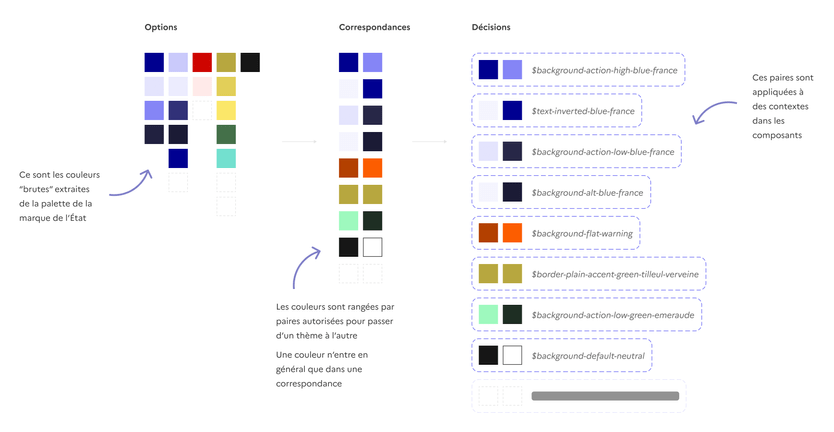

# Couleurs - Utilisation dans le DSFR

La palette de couleurs du Système de Design de l'État n’est pas utilisée à l'état brut dans les composants : elle sert de fondation à une nomenclature contextuelle, exprimée par des design tokens de décision.

> [!NOTE]
> On distingue deux typologies de “design token” que nous utilisons pour les couleurs : option et décision. Les “options” sont les tokens de couleurs hors contexte, la palette brute à votre disposition. En pratique, les “décisions” recensent les usages contextuels de ces options dans le Système de Design (par exemple, sur un fond, une bordure, un texte).

## Convention de nommage des tokens

La nomenclature des tokens de décisions est la suivante :

CONTEXTE - USAGE - VARIANTE - COULEUR

Par exemple : BACKGROUND - ACTION - LOW - BLUE-FRANCE soit **`$background-action-low-blue-france`**

- Le contexte est choisi parmi les suivants : fond, bordure, texte (les icônes sont assimilées au texte quand elles y sont associées), et illustration
- L’usage fait référence à la fonction signifiée par l’élément, que ce soit un potentiel (action), un état (actif, désactivé, erreur, succès, etc.) ou une hiérarchie (défaut, titre, libellé, contraste, etc.)
- La variante (optionnel) nuance l’importance de l'élément lorsque c’est nécessaire : important (high) ou mineur (low).
- La couleur indique quelle famille de couleurs est utilisée par le token : les neutres (nuances de gris), le bleu France, une des couleurs système.

Chaque token fait référence à deux couleurs de la palette d’options : une pour le thème clair, et une pour le thème sombre. Il y a une unique paire de nuances pour chaque couleur. Dans notre exemple du token `$background-action-low-blue-france`, il s’agit du couple `$blue-france-925` et `$blue-france-125`.

[Arborescence de tous les tokens de décision (sur Figma)](https://www.figma.com/file/yo9dg7nZb69TAd2Hh9N1xK/Tokens-v2)

## La palette de décisions

### Les couleurs de fond

:::fr-table[Les couleurs de fond]{valign=top multiline=true caption=false}

| Description de l’usage | Token | Thème clair | Thème sombre |
| :----- | :-----| :-----| :----- |
| Fond de blocs ou de sections  Exemple : pied de page | `$background-alt-grey` | `$grey-975` | `$grey-75` |
| Fond de bloc de page aux couleurs de l’État  Exemple : lettre d’information et réseaux sociaux. | `$background-alt-blue-france` | `$blue-france-975` | `$blue-france-75` |
| Fond de composant contrastant  Exemples : mise en avant, champ de saisie | `$background-contrast-grey` | `$grey-950` | `$grey-100` |
| Fond de composant en relief  Exemples : en-tête, menu déroulant | `$background-elevated-grey` | `$grey-1000` | `$grey-75` |
| Fond de composant cliquable important et portant l’identité de l’État  Exemple : bouton primaire | `$background-action-high-blue-france` | `$blue-france-sun-113` | `$blue-france-625` |
| Fond de composant cliquable mineur et portant l’identité de l’État  Exemple : tag cliquable | `$background-action-low-blue-france` | `$blue-france-925` | `$blue-france-125` |
| Fond de composant actif et portant l’identité de l’État  Exemple : pagination | `$background-active-blue-france` | `$blue-france-sun-113` | `$blue-france-625` |
| Fond de composant ouvert et portant l’identité de l’État  Exemple : élément de navigation | `$background-open-blue-france` | `$blue-france-925` | `$blue-france-125` |
| Fond de composant désactivé  Exemples : boutons, tag | `$background-disabled-grey` | `$grey-925` | `$grey-125` |
| Fond de composant en état d’erreur  Exemple : alerte | `$background-flat-error` | `$error-425` | `$error-625` |
| Fond de composant en état d’avertissement  Exemple : alerte | `$background-flat-warning` | `$warning-425` | `$warning-625` |
| Fond de composant en état de succès  Exemple : alerte | `$background-flat-success` | `$success-425` | `$success-625` |
| Fond de composant en état d’information  Exemple : alerte | `$background-flat-info` | `$info-425` | `$info-625` |
| Fonds de page et de composant par défaut  Exemples : pied de page, modale, onglet | `$background-default-grey` | `$grey-1000` | `$grey-50` |

:::

### Les couleurs de texte

> [!NOTE]
> Quand elles sont associées à du texte, les icônes sont assimilées à celui-ci.

:::fr-table[Les couleurs de texte]{valign=top multiline=true caption=false}

| Description de l’usage | Token | Thème clair | Thème sombre |
| :----- | :----- | :----- | :----- |
| Titre ou élément équivalent  Exemples : titres éditoriaux, titre de tableau | `$text-title-grey` | `$grey-50` | `$grey-1000` |
| Titre portant l’identité de l’État | `$text-title-blue-france` | `$blue-france-sun-113` | `$blue-france-625` |
| Corps de texte | `$text-default-grey` | `$grey-200` | `$grey-850` |
| Texte de mentions ou de détail | `$text-mention-grey` | `$grey-425` | `$grey-625` |
| Texte de libelléExemple : éléments de formulaire | `$text-label-grey` | `$grey-50` | `$grey-1000` |
| Texte cliquable important et portant l’identité de l’État  Exemple : bouton secondaire | `$text-action-high-blue-france` | `$blue-france-sun-113` | `$blue-france-625` |
| Texte cliquable importantExemple : accordéon, élément de navigation | `$text-action-high-grey` | `$grey-50` | `$grey-1000` |
| Texte ou icône contrastant en nuances de gris  Exemple : alerte | `$text-inverted-grey` | `$grey-1000` | `$grey-50` |
| Texte ou icône contrastant portant l’identité de l’État  Exemples : bouton primaire, pagination, tag | `$text-inverted-blue-france` | `$blue-france-975` | `$blue-france-113` |
| Texte actif portant l’identité de l’État  Exemples : élément de navigation, interrupteur | `$text-active-blue-france` | `$blue-france-sun-113` | `$blue-france-625` |
| Texte actif neutre  Exemple : fil d’Ariane | `$text-active-grey` | `$grey-50` | `$grey-1000` |
| Texte désactivé | `$text-disabled-grey` | `$grey-625` | `$grey-425` |
| Texte ou icône en état d’erreur  Exemples : champ de saisie, élément de formulaire | `$text-default-error` | `$error-425` | `$error-625` |
| Texte ou icône en état de succès  Exemples : champ de saisie, élément de formulaire | `$text-default-success` | `$success-425` | `$success-625` |

:::

### Les couleurs d’illustrations

:::fr-table[Les couleurs d'illustrations]{valign=top multiline=true caption=false}

| Description de l’usage | Token | Thème clair | Thème sombre |
| :----- | :----- | :----- | :----- |
| Couleur dominante d’illustration (60%)  Exemple : illustration des options de paramètres d’affichage | `$artwork-major-blue-france` | `$blue-france-sun-113` | `$blue-france-625` |
| Icône portant l’identité de l’État ou couleur mineure d’illustration (30%)  Exemple : citation | `$artwork-minor-blue-france` | `$blue-france-main-525` | `$blue-france-main-525` |

:::

## Les usages

Il est recommandé d’utiliser autant que possible les tokens de décision lors de la création d'écrans à partir du Système de Design de l'État:

- Si le bon token n’existe pas, se référer aux couleurs d’options, en prenant garde à respecter les correspondance thème clair / thème sombre. Vous pouvez aussi nous signaler votre nouveau cas d’usage sur Slack , avec un ticket ou lors des bureaux !
- Les tokens sont présents dans libraires Sketch et Figma, ainsi que dans le code, avec à chaque fois de petites spécificités liées à l’outil.
- Certains éléments portant des tokens de décision peuvent être accentués, c’est-à-dire changés de couleur parmi la palette illustrative. Référez-vous à la documentation de chaque composant pour connaître les couleurs utilisables !

### Accentuation des composants

L’accentuation des composants est réglementée : un tableau récapitulatif des éléments qu’il est possible d’accentuer sur chaque composant est détaillé dans la page de documentation (paragraphe ‘Personnalisation > Couleurs d’accent’).

À l’heure actuelle, seuls les composants suivants sont ouverts à l’accentuation :

- Carte (Fond blanc ou gris)
- Citation (Icône)
- Mise en avant (Fond et bordure)
- Mise en exergue (Bordure)
- Tableau (Fond et bordure)
- Tag (Fond , texte et icône)
- Tuile (Fond blanc ou gris)

D’autres composants seront ajoutés à ce périmètre au fur et à mesure des mises à jour du Système de Design de l'État. N’hésitez pas à nous faire des suggestions sur le sujet, sur le Slack ou [en ouvrant un ticket](https://gouvfr.atlassian.net/servicedesk/customer/portals).
