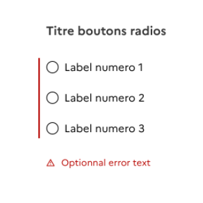

Les icônes fonctionnelles sont des symboles visuels qui accompagnent l’utilisateur dans ses actions et qui aident à sa compréhension de l’interface.

## Utilisation des icônes

Nous mettons à votre disposition une sélection d’icônes issue de la librairie Remix Icons (libre de droits). Il s’agit, pour l’essentiel, des icônes utilisées par les composants du DSFR. Si l’icône recherchée est absente de notre sélection, vous pouvez compléter en recherchant d’abord dans [Remix Icons](https://remixicon.com/).

### Pour les designers

Les icônes sont disponibles dans la section Fondamentaux des librairies Sketch et Figma.

### Pour les développeurs

Les icônes placées dans **src/core/icon** sont exportées dans dist/icons. Les icônes sont utilisées directement en CSS via leur chemin relatif. Il est de ce fait possible d’utiliser des icônes en utilisant directement la classe CSS associée, reprenant le nom de l’icône SVG, précédée du préfixe fr-icon ou fr-fi (déprécié).
Exemple : `.fr-icon-error-fill`, `.fr-fi-account-fill`.

> [!NOTE]
> Avec la version 1.5.0, les icônes ne sont plus chargées via une police d’icônes dans la css. De plus, les classes utilitaires d’icones ne sont plus dans core mais, à part, dans un nouveau dossier dist/utility. Il est donc nécéssaire d’importer le nouveau fichier d’icônes pour conserver leurs fonctionnement.

Les icônes sont maintenant rangées en catégories (system, business, map…), avec un fichier css pour chacune. Il est donc possible d’importer uniquement les catégories d’icônes désirées pour alléger la CSS.

Le chargement des icônes se fait directement via l’ajout du fichier CSS.

Il est possible d'utiliser plusieurs fichiers : dist/utility/icons/icons.css, dist/utility/utility.css ou plus spécifiquement par catégorie, ex: dist/utility/icons/icons-buildings/icon-buildings.css.

> [!NOTE]
> **Pour les développeurs**
>
> L’utilisation des utility.css et icons.css peuvent remonter des erreurs dans webpack (Maximum call stack size exceeded). Afin de contourner le problème, utilisez les fichiers de catégories.

Il est ensuite possible d’utiliser les classes d’icônes correspondantes,
**directement sur un composant** qui permet d’ajouter une icône, par exemple un bouton :

```HTML
<button class="fr-btn fr-icon-checkbox-circle-line fr-btn--icon-left">
  Label bouton MD
</button>
```

ou bien de manière autonome, en utilisant de préférence une balise span.

## Sélection d’icônes

Les icônes doivent être utilisées pour attirer l'attention sur les actions, les ensembles de contenus importants ou les zones clés, il faut éviter d’en utiliser trop sur une même page pour ne pas créer de confusion. Un concept doit être représenté par la même icône sur l'ensemble du site et de l'écosystème numérique de l'État.
Les icônes ci-dessous sont pour la plupart issues de la librairie Remixicon.
Les icônes classées dans dsfr sont soit des icônes créées spécialement, soit des icônes issues de Remixicon ayant été renommées afin de plus coller à l’usage.

L’ancienne nomenclature des classes en fr-fi (remplacée par fr-icon) est dépréciée mais toujours fonctionnelle.

### Building

<div class="dsfr-doc-preview">
  <span class="fr-icon-ancient-gate-fill" aria-hidden="true"></span>
  <span class="fr-icon-ancient-gate-line" aria-hidden="true"></span>
  <span class="fr-icon-ancient-pavilion-fill" aria-hidden="true"></span>
  <span class="fr-icon-ancient-pavilion-line" aria-hidden="true"></span>
  <span class="fr-icon-bank-fill" aria-hidden="true"></span>
  <span class="fr-icon-bank-line" aria-hidden="true"></span>
  <span class="fr-icon-building-fill" aria-hidden="true"></span>
  <span class="fr-icon-building-line" aria-hidden="true"></span>
  <span class="fr-icon-community-fill" aria-hidden="true"></span>
  <span class="fr-icon-community-line" aria-hidden="true"></span>
  <span class="fr-icon-government-fill" aria-hidden="true"></span>
  <span class="fr-icon-government-line" aria-hidden="true"></span>
  <span class="fr-icon-home-4-fill" aria-hidden="true"></span>
  <span class="fr-icon-home-4-line" aria-hidden="true"></span>
  <span class="fr-icon-hospital-fill" aria-hidden="true"></span>
  <span class="fr-icon-hospital-line" aria-hidden="true"></span>
  <span class="fr-icon-hotel-fill" aria-hidden="true"></span>
  <span class="fr-icon-hotel-line" aria-hidden="true"></span>
  <span class="fr-icon-store-fill" aria-hidden="true"></span>
  <span class="fr-icon-store-line" aria-hidden="true"></span>
</div>

:::fr-accordion[### Extrait de code]{id='icons-building-accordion'}

```HTML
<span class="fr-icon-ancient-gate-fill" aria-hidden="true"></span>
<span class="fr-icon-ancient-gate-line" aria-hidden="true"></span>

<span class="fr-icon-ancient-pavilion-fill" aria-hidden="true"></span>
<span class="fr-icon-ancient-pavilion-line" aria-hidden="true"></span>

<span class="fr-icon-bank-fill" aria-hidden="true"></span>
<span class="fr-icon-bank-line" aria-hidden="true"></span>

<span class="fr-icon-building-fill" aria-hidden="true"></span>
<span class="fr-icon-building-line" aria-hidden="true"></span>

<span class="fr-icon-community-fill" aria-hidden="true"></span>
<span class="fr-icon-community-line" aria-hidden="true"></span>

<span class="fr-icon-government-fill" aria-hidden="true"></span>
<span class="fr-icon-government-line" aria-hidden="true"></span>

<span class="fr-icon-home-4-fill" aria-hidden="true"></span>
<span class="fr-icon-home-4-line" aria-hidden="true"></span>

<span class="fr-icon-hospital-fill" aria-hidden="true"></span>
<span class="fr-icon-hospital-line" aria-hidden="true"></span>

<span class="fr-icon-hotel-fill" aria-hidden="true"></span>
<span class="fr-icon-hotel-line" aria-hidden="true"></span>

<span class="fr-icon-store-fill" aria-hidden="true"></span>
<span class="fr-icon-store-line" aria-hidden="true"></span>
```

:::

### Business

<div class="dsfr-doc-preview">
  <span class="fr-icon-archive-fill" aria-hidden="true"></span>
  <span class="fr-icon-archive-line" aria-hidden="true"></span>
  <span class="fr-icon-attachment-fill" aria-hidden="true"></span>
  <span class="fr-icon-attachment-line" aria-hidden="true"></span>
  <span class="fr-icon-award-fill" aria-hidden="true"></span>
  <span class="fr-icon-award-line" aria-hidden="true"></span>
  <span class="fr-icon-bar-chart-box-fill" aria-hidden="true"></span>
  <span class="fr-icon-bar-chart-box-line" aria-hidden="true"></span>
  <span class="fr-icon-bookmark-fill" aria-hidden="true"></span>
  <span class="fr-icon-bookmark-line" aria-hidden="true"></span>
  <span class="fr-icon-briefcase-fill" aria-hidden="true"></span>
  <span class="fr-icon-briefcase-line" aria-hidden="true"></span>
  <span class="fr-icon-calendar-2-fill" aria-hidden="true"></span>
  <span class="fr-icon-calendar-2-line" aria-hidden="true"></span>
  <span class="fr-icon-calendar-event-fill" aria-hidden="true"></span>
  <span class="fr-icon-calendar-event-line" aria-hidden="true"></span>
  <span class="fr-icon-calendar-fill" aria-hidden="true"></span>
  <span class="fr-icon-calendar-line" aria-hidden="true"></span>
  <span class="fr-icon-cloud-fill" aria-hidden="true"></span>
  <span class="fr-icon-cloud-line" aria-hidden="true"></span>
  <span class="fr-icon-copyright-fill" aria-hidden="true"></span>
  <span class="fr-icon-copyright-line" aria-hidden="true"></span>
  <span class="fr-icon-customer-service-fill" aria-hidden="true"></span>
  <span class="fr-icon-customer-service-line" aria-hidden="true"></span>
  <span class="fr-icon-flag-fill" aria-hidden="true"></span>
  <span class="fr-icon-flag-line" aria-hidden="true"></span>
  <span class="fr-icon-global-fill" aria-hidden="true"></span>
  <span class="fr-icon-global-line" aria-hidden="true"></span>
  <span class="fr-icon-line-chart-fill" aria-hidden="true"></span>
  <span class="fr-icon-line-chart-line" aria-hidden="true"></span>
  <span class="fr-icon-links-fill" aria-hidden="true"></span>
  <span class="fr-icon-links-line" aria-hidden="true"></span>
  <span class="fr-icon-mail-fill" aria-hidden="true"></span>
  <span class="fr-icon-mail-line" aria-hidden="true"></span>
  <span class="fr-icon-mail-open-fill" aria-hidden="true"></span>
  <span class="fr-icon-mail-open-line" aria-hidden="true"></span>
  <span class="fr-icon-medal-fill" aria-hidden="true"></span>
  <span class="fr-icon-medal-line" aria-hidden="true"></span>
  <span class="fr-icon-pie-chart-2-fill" aria-hidden="true"></span>
  <span class="fr-icon-pie-chart-2-line" aria-hidden="true"></span>
  <span class="fr-icon-pie-chart-box-fill" aria-hidden="true"></span>
  <span class="fr-icon-pie-chart-box-line" aria-hidden="true"></span>
  <span class="fr-icon-printer-fill" aria-hidden="true"></span>
  <span class="fr-icon-printer-line" aria-hidden="true"></span>
  <span class="fr-icon-profil-fill" aria-hidden="true"></span>
  <span class="fr-icon-profil-line" aria-hidden="true"></span>
  <span class="fr-icon-projector-2-fill" aria-hidden="true"></span>
  <span class="fr-icon-projector-2-line" aria-hidden="true"></span>
  <span class="fr-icon-send-plane-fill" aria-hidden="true"></span>
  <span class="fr-icon-send-plane-line" aria-hidden="true"></span>
  <span class="fr-icon-slideshow-fill" aria-hidden="true"></span>
  <span class="fr-icon-slideshow-line" aria-hidden="true"></span>
  <span class="fr-icon-window-fill" aria-hidden="true"></span>
  <span class="fr-icon-window-line" aria-hidden="true"></span>
</div>

:::fr-accordion[### Extrait de code]{id='icons-business-accordion'}

```HTML
<span class="fr-icon-archive-fill" aria-hidden="true"></span>
<span class="fr-icon-archive-line" aria-hidden="true"></span>

<span class="fr-icon-attachment-fill" aria-hidden="true"></span>
<span class="fr-icon-attachment-line" aria-hidden="true"></span>

<span class="fr-icon-award-fill" aria-hidden="true"></span>
<span class="fr-icon-award-line" aria-hidden="true"></span>

<span class="fr-icon-bar-chart-box-fill" aria-hidden="true"></span>
<span class="fr-icon-bar-chart-box-line" aria-hidden="true"></span>

<span class="fr-icon-bookmark-fill" aria-hidden="true"></span>
<span class="fr-icon-bookmark-line" aria-hidden="true"></span>

<span class="fr-icon-briefcase-fill" aria-hidden="true"></span>
<span class="fr-icon-briefcase-line" aria-hidden="true"></span>

<span class="fr-icon-calendar-2-fill" aria-hidden="true"></span>
<span class="fr-icon-calendar-2-line" aria-hidden="true"></span>

<span class="fr-icon-calendar-event-fill" aria-hidden="true"></span>
<span class="fr-icon-calendar-event-line" aria-hidden="true"></span>

<span class="fr-icon-calendar-fill" aria-hidden="true"></span>
<span class="fr-icon-calendar-line" aria-hidden="true"></span>

<span class="fr-icon-cloud-fill" aria-hidden="true"></span>
<span class="fr-icon-cloud-line" aria-hidden="true"></span>

<span class="fr-icon-copyright-fill" aria-hidden="true"></span>
<span class="fr-icon-copyright-line" aria-hidden="true"></span>

<span class="fr-icon-customer-service-fill" aria-hidden="true"></span>
<span class="fr-icon-customer-service-line" aria-hidden="true"></span>

<span class="fr-icon-flag-fill" aria-hidden="true"></span>
<span class="fr-icon-flag-line" aria-hidden="true"></span>

<span class="fr-icon-global-fill" aria-hidden="true"></span>
<span class="fr-icon-global-line" aria-hidden="true"></span>

<span class="fr-icon-line-chart-fill" aria-hidden="true"></span>
<span class="fr-icon-line-chart-line" aria-hidden="true"></span>

<span class="fr-icon-links-fill" aria-hidden="true"></span>
<span class="fr-icon-links-line" aria-hidden="true"></span>

<span class="fr-icon-mail-fill" aria-hidden="true"></span>
<span class="fr-icon-mail-line" aria-hidden="true"></span>

<span class="fr-icon-mail-open-fill" aria-hidden="true"></span>
<span class="fr-icon-mail-open-line" aria-hidden="true"></span>

<span class="fr-icon-medal-fill" aria-hidden="true"></span>
<span class="fr-icon-medal-line" aria-hidden="true"></span>

<span class="fr-icon-pie-chart-2-fill" aria-hidden="true"></span>
<span class="fr-icon-pie-chart-2-line" aria-hidden="true"></span>

<span class="fr-icon-pie-chart-box-fill" aria-hidden="true"></span>
<span class="fr-icon-pie-chart-box-line" aria-hidden="true"></span>

<span class="fr-icon-printer-fill" aria-hidden="true"></span>
<span class="fr-icon-printer-line" aria-hidden="true"></span>

<span class="fr-icon-profil-fill" aria-hidden="true"></span>
<span class="fr-icon-profil-line" aria-hidden="true"></span>

<span class="fr-icon-projector-2-fill" aria-hidden="true"></span>
<span class="fr-icon-projector-2-line" aria-hidden="true"></span>

<span class="fr-icon-send-plane-fill" aria-hidden="true"></span>
<span class="fr-icon-send-plane-line" aria-hidden="true"></span>

<span class="fr-icon-slideshow-fill" aria-hidden="true"></span>
<span class="fr-icon-slideshow-line" aria-hidden="true"></span>

<span class="fr-icon-window-fill" aria-hidden="true"></span>
<span class="fr-icon-window-line" aria-hidden="true"></span>
```

:::

### Communication

<div class="dsfr-doc-preview">
  <span class="fr-icon-chat-2-fill" aria-hidden="true"></span>
  <span class="fr-icon-chat-2-line" aria-hidden="true"></span>
  <span class="fr-icon-chat-3-fill" aria-hidden="true"></span>
  <span class="fr-icon-chat-3-line" aria-hidden="true"></span>
  <span class="fr-icon-chat-check-fill" aria-hidden="true"></span>
  <span class="fr-icon-chat-check-line" aria-hidden="true"></span>
  <span class="fr-icon-chat-delete-fill" aria-hidden="true"></span>
  <span class="fr-icon-chat-delete-line" aria-hidden="true"></span>
  <span class="fr-icon-chat-poll-fill" aria-hidden="true"></span>
  <span class="fr-icon-chat-poll-line" aria-hidden="true"></span>
  <span class="fr-icon-discuss-fill" aria-hidden="true"></span>
  <span class="fr-icon-discuss-line" aria-hidden="true"></span>
  <span class="fr-icon-feedback-fill" aria-hidden="true"></span>
  <span class="fr-icon-feedback-line" aria-hidden="true"></span>
  <span class="fr-icon-message-2-fill" aria-hidden="true"></span>
  <span class="fr-icon-message-2-line" aria-hidden="true"></span>
  <span class="fr-icon-question-answer-fill" aria-hidden="true"></span>
  <span class="fr-icon-question-answer-line" aria-hidden="true"></span>
  <span class="fr-icon-questionnaire-fill" aria-hidden="true"></span>
  <span class="fr-icon-questionnaire-line" aria-hidden="true"></span>
  <span class="fr-icon-video-chat-fill" aria-hidden="true"></span>
  <span class="fr-icon-video-chat-line" aria-hidden="true"></span>
</div>

:::fr-accordion[### Extrait de code]{id='icons-communication-accordion'}

```HTML
<span class="fr-icon-chat-2-fill" aria-hidden="true"></span>
<span class="fr-icon-chat-2-line" aria-hidden="true"></span>

<span class="fr-icon-chat-3-fill" aria-hidden="true"></span>
<span class="fr-icon-chat-3-line" aria-hidden="true"></span>

<span class="fr-icon-chat-check-fill" aria-hidden="true"></span>
<span class="fr-icon-chat-check-line" aria-hidden="true"></span>

<span class="fr-icon-chat-delete-fill" aria-hidden="true"></span>
<span class="fr-icon-chat-delete-line" aria-hidden="true"></span>

<span class="fr-icon-chat-poll-fill" aria-hidden="true"></span>
<span class="fr-icon-chat-poll-line" aria-hidden="true"></span>

<span class="fr-icon-discuss-fill" aria-hidden="true"></span>
<span class="fr-icon-discuss-line" aria-hidden="true"></span>

<span class="fr-icon-feedback-fill" aria-hidden="true"></span>
<span class="fr-icon-feedback-line" aria-hidden="true"></span>

<span class="fr-icon-message-2-fill" aria-hidden="true"></span>
<span class="fr-icon-message-2-line" aria-hidden="true"></span>

<span class="fr-icon-question-answer-fill" aria-hidden="true"></span>
<span class="fr-icon-question-answer-line" aria-hidden="true"></span>

<span class="fr-icon-questionnaire-fill" aria-hidden="true"></span>
<span class="fr-icon-questionnaire-line" aria-hidden="true"></span>

<span class="fr-icon-video-chat-fill" aria-hidden="true"></span>
<span class="fr-icon-video-chat-line" aria-hidden="true"></span>
```

:::

### Design

<div class="dsfr-doc-preview">
  <span class="fr-icon-ball-pen-fill" aria-hidden="true"></span>
  <span class="fr-icon-ball-pen-line" aria-hidden="true"></span>
  <span class="fr-icon-brush-3-fill" aria-hidden="true"></span>
  <span class="fr-icon-brush-3-line" aria-hidden="true"></span>
  <span class="fr-icon-brush-fill" aria-hidden="true"></span>
  <span class="fr-icon-brush-line" aria-hidden="true"></span>
  <span class="fr-icon-contrast-fill" aria-hidden="true"></span>
  <span class="fr-icon-contrast-line" aria-hidden="true"></span>
  <span class="fr-icon-crop-fill" aria-hidden="true"></span>
  <span class="fr-icon-crop-line" aria-hidden="true"></span>
  <span class="fr-icon-drag-move-2-fill" aria-hidden="true"></span>
  <span class="fr-icon-drag-move-2-line" aria-hidden="true"></span>
  <span class="fr-icon-drop-fill" aria-hidden="true"></span>
  <span class="fr-icon-drop-line" aria-hidden="true"></span>
  <span class="fr-icon-edit-box-fill" aria-hidden="true"></span>
  <span class="fr-icon-edit-box-line" aria-hidden="true"></span>
  <span class="fr-icon-edit-fill" aria-hidden="true"></span>
  <span class="fr-icon-edit-line" aria-hidden="true"></span>
  <span class="fr-icon-ink-bottle-fill" aria-hidden="true"></span>
  <span class="fr-icon-ink-bottle-line" aria-hidden="true"></span>
  <span class="fr-icon-layout-grid-fill" aria-hidden="true"></span>
  <span class="fr-icon-layout-grid-line" aria-hidden="true"></span>
  <span class="fr-icon-mark-pen-fill" aria-hidden="true"></span>
  <span class="fr-icon-mark-pen-line" aria-hidden="true"></span>
  <span class="fr-icon-paint-brush-fill" aria-hidden="true"></span>
  <span class="fr-icon-paint-brush-line" aria-hidden="true"></span>
  <span class="fr-icon-paint-fill" aria-hidden="true"></span>
  <span class="fr-icon-paint-line" aria-hidden="true"></span>
  <span class="fr-icon-palette-fill" aria-hidden="true"></span>
  <span class="fr-icon-palette-line" aria-hidden="true"></span>
  <span class="fr-icon-pantone-fill" aria-hidden="true"></span>
  <span class="fr-icon-pantone-line" aria-hidden="true"></span>
  <span class="fr-icon-pen-nib-fill" aria-hidden="true"></span>
  <span class="fr-icon-pen-nib-line" aria-hidden="true"></span>
  <span class="fr-icon-pencil-fill" aria-hidden="true"></span>
  <span class="fr-icon-pencil-line" aria-hidden="true"></span>
  <span class="fr-icon-pencil-ruler-fill" aria-hidden="true"></span>
  <span class="fr-icon-pencil-ruler-line" aria-hidden="true"></span>
  <span class="fr-icon-sip-fill" aria-hidden="true"></span>
  <span class="fr-icon-sip-line" aria-hidden="true"></span>
  <span class="fr-icon-shapes-fill" aria-hidden="true"></span>
  <span class="fr-icon-shapes-line" aria-hidden="true"></span>
  <span class="fr-icon-table-fill" aria-hidden="true"></span>
  <span class="fr-icon-table-line" aria-hidden="true"></span>
  <span class="fr-icon-eraser-fill" aria-hidden="true"></span>
  <span class="fr-icon-eraser-line" aria-hidden="true"></span>
  </div>

:::fr-accordion[### Extrait de code]{id='icons-design-accordion'}

```HTML
<span class="fr-icon-ball-pen-fill" aria-hidden="true"></span>
<span class="fr-icon-ball-pen-line" aria-hidden="true"></span>

<span class="fr-icon-brush-3-fill" aria-hidden="true"></span>
<span class="fr-icon-brush-3-line" aria-hidden="true"></span>

<span class="fr-icon-brush-fill" aria-hidden="true"></span>
<span class="fr-icon-brush-line" aria-hidden="true"></span>

<span class="fr-icon-contrast-fill" aria-hidden="true"></span>
<span class="fr-icon-contrast-line" aria-hidden="true"></span>

<span class="fr-icon-crop-fill" aria-hidden="true"></span>
<span class="fr-icon-crop-line" aria-hidden="true"></span>

<span class="fr-icon-drag-move-2-fill" aria-hidden="true"></span>
<span class="fr-icon-drag-move-2-line" aria-hidden="true"></span>

<span class="fr-icon-drop-fill" aria-hidden="true"></span>
<span class="fr-icon-drop-line" aria-hidden="true"></span>

<span class="fr-icon-edit-box-fill" aria-hidden="true"></span>
<span class="fr-icon-edit-box-line" aria-hidden="true"></span>

<span class="fr-icon-edit-fill" aria-hidden="true"></span>
<span class="fr-icon-edit-line" aria-hidden="true"></span>

<span class="fr-icon-ink-bottle-fill" aria-hidden="true"></span>
<span class="fr-icon-ink-bottle-line" aria-hidden="true"></span>

<span class="fr-icon-layout-grid-fill" aria-hidden="true"></span>
<span class="fr-icon-layout-grid-line" aria-hidden="true"></span>

<span class="fr-icon-mark-pen-fill" aria-hidden="true"></span>
<span class="fr-icon-mark-pen-line" aria-hidden="true"></span>

<span class="fr-icon-paint-brush-fill" aria-hidden="true"></span>
<span class="fr-icon-paint-brush-line" aria-hidden="true"></span>

<span class="fr-icon-paint-fill" aria-hidden="true"></span>
<span class="fr-icon-paint-line" aria-hidden="true"></span>

<span class="fr-icon-palette-fill" aria-hidden="true"></span>
<span class="fr-icon-palette-line" aria-hidden="true"></span>

<span class="fr-icon-pantone-fill" aria-hidden="true"></span>
<span class="fr-icon-pantone-line" aria-hidden="true"></span>

<span class="fr-icon-pen-nib-fill" aria-hidden="true"></span>
<span class="fr-icon-pen-nib-line" aria-hidden="true"></span>

<span class="fr-icon-pencil-fill" aria-hidden="true"></span>
<span class="fr-icon-pencil-line" aria-hidden="true"></span>

<span class="fr-icon-pencil-ruler-fill" aria-hidden="true"></span>
<span class="fr-icon-pencil-ruler-line" aria-hidden="true"></span>

<span class="fr-icon-sip-fill" aria-hidden="true"></span>
<span class="fr-icon-sip-line" aria-hidden="true"></span>

<span class="fr-icon-shapes-fill" aria-hidden="true"></span>
<span class="fr-icon-shapes-line" aria-hidden="true"></span>

<span class="fr-icon-table-fill" aria-hidden="true"></span>
<span class="fr-icon-table-line" aria-hidden="true"></span>

<span class="fr-icon-eraser-fill" aria-hidden="true"></span>
<span class="fr-icon-eraser-line" aria-hidden="true"></span>
```

:::

### Development

<div class="dsfr-doc-preview">
  <span class="fr-icon-bug-fill" aria-hidden="true"></span>
  <span class="fr-icon-bug-line" aria-hidden="true"></span>
  <span class="fr-icon-code-box-fill" aria-hidden="true"></span>
  <span class="fr-icon-code-box-line" aria-hidden="true"></span>
  <span class="fr-icon-code-s-slash-line" aria-hidden="true"></span>
  <span class="fr-icon-cursor-fill" aria-hidden="true"></span>
  <span class="fr-icon-cursor-line" aria-hidden="true"></span>
  <span class="fr-icon-git-branch-fill" aria-hidden="true"></span>
  <span class="fr-icon-git-branch-line" aria-hidden="true"></span>
  <span class="fr-icon-git-commit-fill" aria-hidden="true"></span>
  <span class="fr-icon-git-commit-line" aria-hidden="true"></span>
  <span class="fr-icon-git-merge-fill" aria-hidden="true"></span>
  <span class="fr-icon-git-merge-line" aria-hidden="true"></span>
  <span class="fr-icon-git-pull-request-fill" aria-hidden="true"></span>
  <span class="fr-icon-git-pull-request-line" aria-hidden="true"></span>
  <span class="fr-icon-git-repository-commits-fill" aria-hidden="true"></span>
  <span class="fr-icon-git-repository-commits-line" aria-hidden="true"></span>
  <span class="fr-icon-git-repository-fill" aria-hidden="true"></span>
  <span class="fr-icon-git-repository-line" aria-hidden="true"></span>
  <span class="fr-icon-git-repository-private-fill" aria-hidden="true"></span>
  <span class="fr-icon-git-repository-private-line" aria-hidden="true"></span>
  <span class="fr-icon-terminal-box-fill" aria-hidden="true"></span>
  <span class="fr-icon-terminal-box-line" aria-hidden="true"></span>
  <span class="fr-icon-terminal-line" aria-hidden="true"></span>
  <span class="fr-icon-terminal-window-fill" aria-hidden="true"></span>
  <span class="fr-icon-terminal-window-line" aria-hidden="true"></span>
</div>

:::fr-accordion[### Extrait de code]{id='icons-development-accordion'}

```HTML
<span class="fr-icon-bug-fill" aria-hidden="true"></span>
<span class="fr-icon-bug-line" aria-hidden="true"></span>

<span class="fr-icon-code-box-fill" aria-hidden="true"></span>
<span class="fr-icon-code-box-line" aria-hidden="true"></span>

<span class="fr-icon-code-s-slash-line" aria-hidden="true"></span>
<span class="fr-icon-cursor-fill" aria-hidden="true"></span>

<span class="fr-icon-cursor-line" aria-hidden="true"></span>
<span class="fr-icon-git-branch-fill" aria-hidden="true"></span>

<span class="fr-icon-git-branch-line" aria-hidden="true"></span>
<span class="fr-icon-git-commit-fill" aria-hidden="true"></span>

<span class="fr-icon-git-commit-line" aria-hidden="true"></span>
<span class="fr-icon-git-merge-fill" aria-hidden="true"></span>

<span class="fr-icon-git-merge-line" aria-hidden="true"></span>
<span class="fr-icon-git-pull-request-fill" aria-hidden="true"></span>

<span class="fr-icon-git-pull-request-line" aria-hidden="true"></span>
<span class="fr-icon-git-repository-commits-fill" aria-hidden="true"></span>

<span class="fr-icon-git-repository-commits-line" aria-hidden="true"></span>
<span class="fr-icon-git-repository-fill" aria-hidden="true"></span>

<span class="fr-icon-git-repository-line" aria-hidden="true"></span>
<span class="fr-icon-git-repository-private-fill" aria-hidden="true"></span>

<span class="fr-icon-git-repository-private-line" aria-hidden="true"></span>
<span class="fr-icon-terminal-box-fill" aria-hidden="true"></span>

<span class="fr-icon-terminal-box-line" aria-hidden="true"></span>
<span class="fr-icon-terminal-line" aria-hidden="true"></span>

<span class="fr-icon-terminal-window-fill" aria-hidden="true"></span>
<span class="fr-icon-terminal-window-line" aria-hidden="true"></span>
```

:::

### Device

<div class="dsfr-doc-preview">
  <span class="fr-icon-bluetooth-fill" aria-hidden="true"></span>
  <span class="fr-icon-bluetooth-line" aria-hidden="true"></span>
  <span class="fr-icon-computer-fill" aria-hidden="true"></span>
  <span class="fr-icon-computer-line" aria-hidden="true"></span>
  <span class="fr-icon-dashboard-3-fill" aria-hidden="true"></span>
  <span class="fr-icon-dashboard-3-line" aria-hidden="true"></span>
  <span class="fr-icon-database-fill" aria-hidden="true"></span>
  <span class="fr-icon-database-line" aria-hidden="true"></span>
  <span class="fr-icon-device-fill" aria-hidden="true"></span>
  <span class="fr-icon-device-line" aria-hidden="true"></span>
  <span class="fr-icon-hard-drive-2-fill" aria-hidden="true"></span>
  <span class="fr-icon-hard-drive-2-line" aria-hidden="true"></span>
  <span class="fr-icon-mac-fill" aria-hidden="true"></span>
  <span class="fr-icon-mac-line" aria-hidden="true"></span>
  <span class="fr-icon-phone-fill" aria-hidden="true"></span>
  <span class="fr-icon-phone-line" aria-hidden="true"></span>
  <span class="fr-icon-qr-code-fill" aria-hidden="true"></span>
  <span class="fr-icon-qr-code-line" aria-hidden="true"></span>
  <span class="fr-icon-rss-fill" aria-hidden="true"></span>
  <span class="fr-icon-rss-line" aria-hidden="true"></span>
  <span class="fr-icon-save-3-fill" aria-hidden="true"></span>
  <span class="fr-icon-save-3-line" aria-hidden="true"></span>
  <span class="fr-icon-save-fill" aria-hidden="true"></span>
  <span class="fr-icon-save-line" aria-hidden="true"></span>
  <span class="fr-icon-server-fill" aria-hidden="true"></span>
  <span class="fr-icon-server-line" aria-hidden="true"></span>
  <span class="fr-icon-smartphone-fill" aria-hidden="true"></span>
  <span class="fr-icon-smartphone-line" aria-hidden="true"></span>
  <span class="fr-icon-tablet-fill" aria-hidden="true"></span>
  <span class="fr-icon-tablet-line" aria-hidden="true"></span>
  <span class="fr-icon-tv-fill" aria-hidden="true"></span>
  <span class="fr-icon-tv-line" aria-hidden="true"></span>
  <span class="fr-icon-wifi-fill" aria-hidden="true"></span>
  <span class="fr-icon-wifi-line" aria-hidden="true"></span>
</div>

 :::fr-accordion[### Extrait de code]{id='icons-device-accordion'}

```HTML
<span class="fr-icon-bluetooth-fill" aria-hidden="true"></span>
<span class="fr-icon-bluetooth-line" aria-hidden="true"></span>

<span class="fr-icon-computer-fill" aria-hidden="true"></span>
<span class="fr-icon-computer-line" aria-hidden="true"></span>

<span class="fr-icon-dashboard-3-fill" aria-hidden="true"></span>
<span class="fr-icon-dashboard-3-line" aria-hidden="true"></span>

<span class="fr-icon-database-fill" aria-hidden="true"></span>
<span class="fr-icon-database-line" aria-hidden="true"></span>

<span class="fr-icon-device-fill" aria-hidden="true"></span>
<span class="fr-icon-device-line" aria-hidden="true"></span>

<span class="fr-icon-hard-drive-2-fill" aria-hidden="true"></span>
<span class="fr-icon-hard-drive-2-line" aria-hidden="true"></span>

<span class="fr-icon-mac-fill" aria-hidden="true"></span>
<span class="fr-icon-mac-line" aria-hidden="true"></span>

<span class="fr-icon-phone-fill" aria-hidden="true"></span>
<span class="fr-icon-phone-line" aria-hidden="true"></span>

<span class="fr-icon-qr-code-fill" aria-hidden="true"></span>
<span class="fr-icon-qr-code-line" aria-hidden="true"></span>

<span class="fr-icon-rss-fill" aria-hidden="true"></span>
<span class="fr-icon-rss-line" aria-hidden="true"></span>

<span class="fr-icon-save-3-fill" aria-hidden="true"></span>
<span class="fr-icon-save-3-line" aria-hidden="true"></span>

<span class="fr-icon-save-fill" aria-hidden="true"></span>
<span class="fr-icon-save-line" aria-hidden="true"></span>

<span class="fr-icon-server-fill" aria-hidden="true"></span>
<span class="fr-icon-server-line" aria-hidden="true"></span>

<span class="fr-icon-smartphone-fill" aria-hidden="true"></span>
<span class="fr-icon-smartphone-line" aria-hidden="true"></span>

<span class="fr-icon-tablet-fill" aria-hidden="true"></span>
<span class="fr-icon-tablet-line" aria-hidden="true"></span>

<span class="fr-icon-tv-fill" aria-hidden="true"></span>
<span class="fr-icon-tv-line" aria-hidden="true"></span>

<span class="fr-icon-wifi-fill" aria-hidden="true"></span>
<span class="fr-icon-wifi-line" aria-hidden="true"></span>
```

:::

### Document

<div class="dsfr-doc-preview">
  <span class="fr-icon-article-fill" aria-hidden="true"></span>
  <span class="fr-icon-article-line" aria-hidden="true"></span>
  <span class="fr-icon-book-2-fill" aria-hidden="true"></span>
  <span class="fr-icon-book-2-line" aria-hidden="true"></span>
  <span class="fr-icon-booklet-fill" aria-hidden="true"></span>
  <span class="fr-icon-booklet-line" aria-hidden="true"></span>
  <span class="fr-icon-clipboard-fill" aria-hidden="true"></span>
  <span class="fr-icon-clipboard-line" aria-hidden="true"></span>
  <span class="fr-icon-draft-fill" aria-hidden="true"></span>
  <span class="fr-icon-draft-line" aria-hidden="true"></span>
  <span class="fr-icon-file-add-fill" aria-hidden="true"></span>
  <span class="fr-icon-file-add-line" aria-hidden="true"></span>
  <span class="fr-icon-file-download-fill" aria-hidden="true"></span>
  <span class="fr-icon-file-download-line" aria-hidden="true"></span>
  <span class="fr-icon-file-fill" aria-hidden="true"></span>
  <span class="fr-icon-file-line" aria-hidden="true"></span>
  <span class="fr-icon-file-pdf-fill" aria-hidden="true"></span>
  <span class="fr-icon-file-pdf-line" aria-hidden="true"></span>
  <span class="fr-icon-file-text-fill" aria-hidden="true"></span>
  <span class="fr-icon-file-text-line" aria-hidden="true"></span>
  <span class="fr-icon-folder-2-fill" aria-hidden="true"></span>
  <span class="fr-icon-folder-2-line" aria-hidden="true"></span>
  <span class="fr-icon-newspaper-fill" aria-hidden="true"></span>
  <span class="fr-icon-newspaper-line" aria-hidden="true"></span>
  <span class="fr-icon-survey-fill" aria-hidden="true"></span>
  <span class="fr-icon-survey-line" aria-hidden="true"></span>
  <span class="fr-icon-todo-fill" aria-hidden="true"></span>
  <span class="fr-icon-todo-line" aria-hidden="true"></span>
</div>

:::fr-accordion[### Extrait de code]{id='icons-document-accordion'}

```HTML
<span class="fr-icon-article-fill" aria-hidden="true"></span>
<span class="fr-icon-article-line" aria-hidden="true"></span>

<span class="fr-icon-book-2-fill" aria-hidden="true"></span>
<span class="fr-icon-book-2-line" aria-hidden="true"></span>

<span class="fr-icon-booklet-fill" aria-hidden="true"></span>
<span class="fr-icon-booklet-line" aria-hidden="true"></span>

<span class="fr-icon-clipboard-fill" aria-hidden="true"></span>
<span class="fr-icon-clipboard-line" aria-hidden="true"></span>

<span class="fr-icon-draft-fill" aria-hidden="true"></span>
<span class="fr-icon-draft-line" aria-hidden="true"></span>

<span class="fr-icon-file-add-fill" aria-hidden="true"></span>
<span class="fr-icon-file-add-line" aria-hidden="true"></span>

<span class="fr-icon-file-download-fill" aria-hidden="true"></span>
<span class="fr-icon-file-download-line" aria-hidden="true"></span>

<span class="fr-icon-file-fill" aria-hidden="true"></span>
<span class="fr-icon-file-line" aria-hidden="true"></span>

<span class="fr-icon-file-pdf-fill" aria-hidden="true"></span>
<span class="fr-icon-file-pdf-line" aria-hidden="true"></span>

<span class="fr-icon-file-text-fill" aria-hidden="true"></span>
<span class="fr-icon-file-text-line" aria-hidden="true"></span>

<span class="fr-icon-folder-2-fill" aria-hidden="true"></span>
<span class="fr-icon-folder-2-line" aria-hidden="true"></span>

<span class="fr-icon-newspaper-fill" aria-hidden="true"></span>
<span class="fr-icon-newspaper-line" aria-hidden="true"></span>

<span class="fr-icon-survey-fill" aria-hidden="true"></span>
<span class="fr-icon-survey-line" aria-hidden="true"></span>

<span class="fr-icon-todo-fill" aria-hidden="true"></span>
<span class="fr-icon-todo-line" aria-hidden="true"></span>
```

:::

### Editor

#### Icônes créées par l'équipe DSFR

<div class="dsfr-doc-preview">
  <span class="fr-icon-bold" aria-hidden="true"></span>
  <span class="fr-icon-highlight" aria-hidden="true"></span>
  <span class="fr-icon-quote-fill" aria-hidden="true"></span>
  <span class="fr-icon-quote-line" aria-hidden="true"></span>
</div>

:::fr-accordion[### Extrait de code]{id='icons-dsfr-accordion'}

```HTML
<span class="fr-icon-bold" aria-hidden="true"></span>

<span class="fr-icon-highlight" aria-hidden="true"></span>

<span class="fr-icon-quote-fill" aria-hidden="true"></span>

<span class="fr-icon-quote-line" aria-hidden="true"></span>
```

:::

#### Icônes proposées par RemixIcon

<div class="dsfr-doc-preview">
  <span class="fr-icon-code-view" aria-hidden="true"></span>
  <span class="fr-icon-font-size" aria-hidden="true"></span>
  <span class="fr-icon-h-1" aria-hidden="true"></span>
  <span class="fr-icon-h-2" aria-hidden="true"></span>
  <span class="fr-icon-h-3" aria-hidden="true"></span>
  <span class="fr-icon-h-4" aria-hidden="true"></span>
  <span class="fr-icon-h-5" aria-hidden="true"></span>
  <span class="fr-icon-h-6" aria-hidden="true"></span>
  <span class="fr-icon-hashtag" aria-hidden="true"></span>
  <span class="fr-icon-italic" aria-hidden="true"></span>
  <span class="fr-icon-link-unlink" aria-hidden="true"></span>
  <span class="fr-icon-link" aria-hidden="true"></span>
  <span class="fr-icon-list-ordered" aria-hidden="true"></span>
  <span class="fr-icon-list-unordered" aria-hidden="true"></span>
  <span class="fr-icon-question-mark" aria-hidden="true"></span>
  <span class="fr-icon-separator" aria-hidden="true"></span>
  <span class="fr-icon-space" aria-hidden="true"></span>
  <span class="fr-icon-subscript" aria-hidden="true"></span>
  <span class="fr-icon-superscript" aria-hidden="true"></span>
  <span class="fr-icon-table-2" aria-hidden="true"></span>
  <span class="fr-icon-translate-2" aria-hidden="true"></span>
  <span class="fr-icon-strikethrough" aria-hidden="true"></span>
  <span class="fr-icon-code-block" aria-hidden="true"></span>
  <span class="fr-icon-align-center" aria-hidden="true"></span>
  <span class="fr-icon-align-justify" aria-hidden="true"></span>
  <span class="fr-icon-align-left" aria-hidden="true"></span>
  <span class="fr-icon-align-right" aria-hidden="true"></span>
  <span class="fr-icon-format-clear" aria-hidden="true"></span>
  <span class="fr-icon-font-color" aria-hidden="true"></span>
  <span class="fr-icon-indent-decrease" aria-hidden="true"></span>
  <span class="fr-icon-indent-increase" aria-hidden="true"></span>
  <span class="fr-icon-text-direction-r" aria-hidden="true"></span>
  <span class="fr-icon-underline" aria-hidden="true"></span>
</div>

:::fr-accordion[### Extrait de code]{id='icons-remixicon-accordion'}

```HTML
<span class="fr-icon-code-view" aria-hidden="true"></span>

<span class="fr-icon-font-size" aria-hidden="true"></span>

<span class="fr-icon-h-1" aria-hidden="true"></span>

<span class="fr-icon-h-2" aria-hidden="true"></span>

<span class="fr-icon-h-3" aria-hidden="true"></span>

<span class="fr-icon-h-4" aria-hidden="true"></span>

<span class="fr-icon-h-5" aria-hidden="true"></span>

<span class="fr-icon-h-6" aria-hidden="true"></span>

<span class="fr-icon-hashtag" aria-hidden="true"></span>

<span class="fr-icon-italic" aria-hidden="true"></span>

<span class="fr-icon-link-unlink" aria-hidden="true"></span>

<span class="fr-icon-link" aria-hidden="true"></span>

<span class="fr-icon-list-ordered" aria-hidden="true"></span>

<span class="fr-icon-list-unordered" aria-hidden="true"></span>

<span class="fr-icon-question-mark" aria-hidden="true"></span>

<span class="fr-icon-separator" aria-hidden="true"></span>

<span class="fr-icon-space" aria-hidden="true"></span>

<span class="fr-icon-subscript" aria-hidden="true"></span>

<span class="fr-icon-superscript" aria-hidden="true"></span>

<span class="fr-icon-table-2" aria-hidden="true"></span>

<span class="fr-icon-translate-2" aria-hidden="true"></span>

<span class="fr-icon-strikethrough" aria-hidden="true"></span>

<span class="fr-icon-code-block" aria-hidden="true"></span>

<span class="fr-icon-align-center" aria-hidden="true"></span>

<span class="fr-icon-align-justify" aria-hidden="true"></span>

<span class="fr-icon-align-left" aria-hidden="true"></span>

<span class="fr-icon-align-right" aria-hidden="true"></span>

<span class="fr-icon-format-clear" aria-hidden="true"></span>

<span class="fr-icon-font-color" aria-hidden="true"></span>

<span class="fr-icon-indent-decrease" aria-hidden="true"></span>

<span class="fr-icon-indent-increase" aria-hidden="true"></span>

<span class="fr-icon-text-direction-r" aria-hidden="true"></span>

<span class="fr-icon-underline" aria-hidden="true"></span>
```

:::

### Finance

<div class="dsfr-doc-preview">
  <span class="fr-icon-bank-card-fill" aria-hidden="true"></span>
  <span class="fr-icon-bank-card-line" aria-hidden="true"></span>
  <span class="fr-icon-coin-fill" aria-hidden="true"></span>
  <span class="fr-icon-gift-fill" aria-hidden="true"></span>
  <span class="fr-icon-gift-line" aria-hidden="true"></span>
  <span class="fr-icon-money-euro-box-fill" aria-hidden="true"></span>
  <span class="fr-icon-money-euro-box-line" aria-hidden="true"></span>
  <span class="fr-icon-money-euro-circle-fill" aria-hidden="true"></span>
  <span class="fr-icon-money-euro-circle-line" aria-hidden="true"></span>
  <span class="fr-icon-secure-payment-fill" aria-hidden="true"></span>
  <span class="fr-icon-secure-payment-line" aria-hidden="true"></span>
  <span class="fr-icon-shopping-bag-fill" aria-hidden="true"></span>
  <span class="fr-icon-shopping-bag-line" aria-hidden="true"></span>
  <span class="fr-icon-shopping-cart-2-fill" aria-hidden="true"></span>
  <span class="fr-icon-shopping-cart-2-line" aria-hidden="true"></span>
  <span class="fr-icon-trophy-fill" aria-hidden="true"></span>
  <span class="fr-icon-trophy-line" aria-hidden="true"></span>
</div>

:::fr-accordion[### Extrait de code]{id='icons-finance-accordion'}

```HTML
<span class="fr-icon-bank-card-fill" aria-hidden="true"></span>
<span class="fr-icon-bank-card-line" aria-hidden="true"></span>

<span class="fr-icon-coin-fill" aria-hidden="true"></span>

<span class="fr-icon-gift-fill" aria-hidden="true"></span>
<span class="fr-icon-gift-line" aria-hidden="true"></span>

<span class="fr-icon-money-euro-box-fill" aria-hidden="true"></span>
<span class="fr-icon-money-euro-box-line" aria-hidden="true"></span>

<span class="fr-icon-money-euro-circle-fill" aria-hidden="true"></span>
<span class="fr-icon-money-euro-circle-line" aria-hidden="true"></span>

<span class="fr-icon-secure-payment-fill" aria-hidden="true"></span>
<span class="fr-icon-secure-payment-line" aria-hidden="true"></span>

<span class="fr-icon-shopping-bag-fill" aria-hidden="true"></span>
<span class="fr-icon-shopping-bag-line" aria-hidden="true"></span>

<span class="fr-icon-shopping-cart-2-fill" aria-hidden="true"></span>
<span class="fr-icon-shopping-cart-2-line" aria-hidden="true"></span>

<span class="fr-icon-trophy-fill" aria-hidden="true"></span>
<span class="fr-icon-trophy-line" aria-hidden="true"></span>
```

:::


### Health

<div class="dsfr-doc-preview">
  <span class="fr-icon-capsule-fill" aria-hidden="true"></span>
  <span class="fr-icon-capsule-line" aria-hidden="true"></span>
  <span class="fr-icon-dislike-fill" aria-hidden="true"></span>
  <span class="fr-icon-dislike-line" aria-hidden="true"></span>
  <span class="fr-icon-dossier-fill" aria-hidden="true"></span>
  <span class="fr-icon-dossier-line" aria-hidden="true"></span>
  <span class="fr-icon-first-aid-kit-fill" aria-hidden="true"></span>
  <span class="fr-icon-first-aid-kit-line" aria-hidden="true"></span>
  <span class="fr-icon-hand-sanitizer-fill" aria-hidden="true"></span>
  <span class="fr-icon-hand-sanitizer-line" aria-hidden="true"></span>
  <span class="fr-icon-health-book-fill" aria-hidden="true"></span>
  <span class="fr-icon-health-book-line" aria-hidden="true"></span>
  <span class="fr-icon-heart-fill" aria-hidden="true"></span>
  <span class="fr-icon-heart-line" aria-hidden="true"></span>
  <span class="fr-icon-heart-pulse-fill" aria-hidden="true"></span>
  <span class="fr-icon-heart-pulse-line" aria-hidden="true"></span>
  <span class="fr-icon-lungs-fill" aria-hidden="true"></span>
  <span class="fr-icon-lungs-line" aria-hidden="true"></span>
  <span class="fr-icon-medicine-bottle-fill" aria-hidden="true"></span>
  <span class="fr-icon-medicine-bottle-line" aria-hidden="true"></span>
  <span class="fr-icon-mental-health-fill" aria-hidden="true"></span>
  <span class="fr-icon-mental-health-line" aria-hidden="true"></span>
  <span class="fr-icon-microscope-fill" aria-hidden="true"></span>
  <span class="fr-icon-microscope-line" aria-hidden="true"></span>
  <span class="fr-icon-psychotherapy-fill" aria-hidden="true"></span>
  <span class="fr-icon-psychotherapy-line" aria-hidden="true"></span>
  <span class="fr-icon-pulse-line" aria-hidden="true"></span>
  <span class="fr-icon-stethoscope-fill" aria-hidden="true"></span>
  <span class="fr-icon-stethoscope-line" aria-hidden="true"></span>
  <span class="fr-icon-surgical-mask-fill" aria-hidden="true"></span>
  <span class="fr-icon-surgical-mask-line" aria-hidden="true"></span>
  <span class="fr-icon-syringe-fill" aria-hidden="true"></span>
  <span class="fr-icon-syringe-line" aria-hidden="true"></span>
  <span class="fr-icon-test-tube-fill" aria-hidden="true"></span>
  <span class="fr-icon-test-tube-line" aria-hidden="true"></span>
  <span class="fr-icon-thermometer-fill" aria-hidden="true"></span>
  <span class="fr-icon-thermometer-line" aria-hidden="true"></span>
  <span class="fr-icon-virus-fill" aria-hidden="true"></span>
  <span class="fr-icon-virus-line" aria-hidden="true"></span>
</div>

 :::fr-accordion[### Extrait de code]{id='icons-health-accordion'}

```HTML
<span class="fr-icon-capsule-fill" aria-hidden="true"></span>
<span class="fr-icon-capsule-line" aria-hidden="true"></span>

<span class="fr-icon-dislike-fill" aria-hidden="true"></span>
<span class="fr-icon-dislike-line" aria-hidden="true"></span>

<span class="fr-icon-dossier-fill" aria-hidden="true"></span>
<span class="fr-icon-dossier-line" aria-hidden="true"></span>

<span class="fr-icon-first-aid-kit-fill" aria-hidden="true"></span>
<span class="fr-icon-first-aid-kit-line" aria-hidden="true"></span>

<span class="fr-icon-hand-sanitizer-fill" aria-hidden="true"></span>
<span class="fr-icon-hand-sanitizer-line" aria-hidden="true"></span>

<span class="fr-icon-health-book-fill" aria-hidden="true"></span>
<span class="fr-icon-health-book-line" aria-hidden="true"></span>

<span class="fr-icon-heart-fill" aria-hidden="true"></span>
<span class="fr-icon-heart-line" aria-hidden="true"></span>

<span class="fr-icon-heart-pulse-fill" aria-hidden="true"></span>
<span class="fr-icon-heart-pulse-line" aria-hidden="true"></span>

<span class="fr-icon-lungs-fill" aria-hidden="true"></span>
<span class="fr-icon-lungs-line" aria-hidden="true"></span>

<span class="fr-icon-medicine-bottle-fill" aria-hidden="true"></span>
<span class="fr-icon-medicine-bottle-line" aria-hidden="true"></span>

<span class="fr-icon-mental-health-fill" aria-hidden="true"></span>
<span class="fr-icon-mental-health-line" aria-hidden="true"></span>

<span class="fr-icon-microscope-fill" aria-hidden="true"></span>
<span class="fr-icon-microscope-line" aria-hidden="true"></span>

<span class="fr-icon-psychotherapy-fill" aria-hidden="true"></span>
<span class="fr-icon-psychotherapy-line" aria-hidden="true"></span>

<span class="fr-icon-pulse-line" aria-hidden="true"></span>

<span class="fr-icon-stethoscope-fill" aria-hidden="true"></span>
<span class="fr-icon-stethoscope-line" aria-hidden="true"></span>

<span class="fr-icon-surgical-mask-fill" aria-hidden="true"></span>
<span class="fr-icon-surgical-mask-line" aria-hidden="true"></span>

<span class="fr-icon-syringe-fill" aria-hidden="true"></span>
<span class="fr-icon-syringe-line" aria-hidden="true"></span>

<span class="fr-icon-test-tube-fill" aria-hidden="true"></span>
<span class="fr-icon-test-tube-line" aria-hidden="true"></span>

<span class="fr-icon-thermometer-fill" aria-hidden="true"></span>
<span class="fr-icon-thermometer-line" aria-hidden="true"></span>

<span class="fr-icon-virus-fill" aria-hidden="true"></span>
<span class="fr-icon-virus-line" aria-hidden="true"></span>
```

:::

### Logos

#### Logos créés par l'équipe DSFR

<div class="dsfr-doc-preview">
  <span class="fr-icon-dailymotion-fill" aria-hidden="true"></span>
  <span class="fr-icon-dailymotion-line" aria-hidden="true"></span>
  <span class="fr-icon-tiktok-fill" aria-hidden="true"></span>
  <span class="fr-icon-tiktok-line" aria-hidden="true"></span>
</div>

:::fr-accordion[### Extrait de code]{id='logos-dsfr-accordion'}

```HTML
<span class="fr-icon-dailymotion-fill" aria-hidden="true"></span>
<span class="fr-icon-dailymotion-line" aria-hidden="true"></span>

<span class="fr-icon-tiktok-fill" aria-hidden="true"></span>
<span class="fr-icon-tiktok-line" aria-hidden="true"></span>
```

:::

#### Logos proposés par RemixIcon

<div class="dsfr-doc-preview">
  <span class="fr-icon-chrome-fill" aria-hidden="true"></span>
  <span class="fr-icon-chrome-line" aria-hidden="true"></span>
  <span class="fr-icon-edge-fill" aria-hidden="true"></span>
  <span class="fr-icon-edge-line" aria-hidden="true"></span>
  <span class="fr-icon-facebook-circle-fill" aria-hidden="true"></span>
  <span class="fr-icon-facebook-circle-line" aria-hidden="true"></span>
  <span class="fr-icon-firefox-fill" aria-hidden="true"></span>
  <span class="fr-icon-firefox-line" aria-hidden="true"></span>
  <span class="fr-icon-github-fill" aria-hidden="true"></span>
  <span class="fr-icon-github-line" aria-hidden="true"></span>
  <span class="fr-icon-google-fill" aria-hidden="true"></span>
  <span class="fr-icon-google-line" aria-hidden="true"></span>
  <span class="fr-icon-ie-fill" aria-hidden="true"></span>
  <span class="fr-icon-ie-line" aria-hidden="true"></span>
  <span class="fr-icon-instagram-fill" aria-hidden="true"></span>
  <span class="fr-icon-instagram-line" aria-hidden="true"></span>
  <span class="fr-icon-linkedin-box-fill" aria-hidden="true"></span>
  <span class="fr-icon-linkedin-box-line" aria-hidden="true"></span>
  <span class="fr-icon-mastodon-fill" aria-hidden="true"></span>
  <span class="fr-icon-mastodon-line" aria-hidden="true"></span>
  <span class="fr-icon-npmjs-fill" aria-hidden="true"></span>
  <span class="fr-icon-npmjs-line" aria-hidden="true"></span>
  <span class="fr-icon-remixicon-fill" aria-hidden="true"></span>
  <span class="fr-icon-remixicon-line" aria-hidden="true"></span>
  <span class="fr-icon-safari-fill" aria-hidden="true"></span>
  <span class="fr-icon-safari-line" aria-hidden="true"></span>
  <span class="fr-icon-slack-fill" aria-hidden="true"></span>
  <span class="fr-icon-slack-line" aria-hidden="true"></span>
  <span class="fr-icon-snapchat-fill" aria-hidden="true"></span>
  <span class="fr-icon-snapchat-line" aria-hidden="true"></span>
  <span class="fr-icon-telegram-fill" aria-hidden="true"></span>
  <span class="fr-icon-telegram-line" aria-hidden="true"></span>
  <span class="fr-icon-twitch-fill" aria-hidden="true"></span>
  <span class="fr-icon-twitch-line" aria-hidden="true"></span>
  <span class="fr-icon-twitter-x-fill" aria-hidden="true"></span>
  <span class="fr-icon-twitter-x-line" aria-hidden="true"></span>
  <span class="fr-icon-threads-fill" aria-hidden="true"></span>
  <span class="fr-icon-threads-line" aria-hidden="true"></span>
  <span class="fr-icon-twitter-fill" aria-hidden="true"></span>
  <span class="fr-icon-twitter-line" aria-hidden="true"></span>
  <span class="fr-icon-vimeo-fill" aria-hidden="true"></span>
  <span class="fr-icon-vimeo-line" aria-hidden="true"></span>
  <span class="fr-icon-vuejs-fill" aria-hidden="true"></span>
  <span class="fr-icon-vuejs-line" aria-hidden="true"></span>
  <span class="fr-icon-whatsapp-fill" aria-hidden="true"></span>
  <span class="fr-icon-whatsapp-line" aria-hidden="true"></span>
  <span class="fr-icon-youtube-fill" aria-hidden="true"></span>
  <span class="fr-icon-youtube-line" aria-hidden="true"></span>
  <span class="fr-icon-bluesky-fill" aria-hidden="true"></span>
  <span class="fr-icon-bluesky-line" aria-hidden="true"></span>
</div>

:::fr-accordion[### Extrait de code]{id='logos-remixicon-accordion'}

```HTML
<span class="fr-icon-chrome-fill" aria-hidden="true"></span>
<span class="fr-icon-chrome-line" aria-hidden="true"></span>

<span class="fr-icon-edge-fill" aria-hidden="true"></span>
<span class="fr-icon-edge-line" aria-hidden="true"></span>

<span class="fr-icon-facebook-circle-fill" aria-hidden="true"></span>
<span class="fr-icon-facebook-circle-line" aria-hidden="true"></span>

<span class="fr-icon-firefox-fill" aria-hidden="true"></span>
<span class="fr-icon-firefox-line" aria-hidden="true"></span>

<span class="fr-icon-github-fill" aria-hidden="true"></span>
<span class="fr-icon-github-line" aria-hidden="true"></span>

<span class="fr-icon-google-fill" aria-hidden="true"></span>
<span class="fr-icon-google-line" aria-hidden="true"></span>

<span class="fr-icon-ie-fill" aria-hidden="true"></span>
<span class="fr-icon-ie-line" aria-hidden="true"></span>

<span class="fr-icon-instagram-fill" aria-hidden="true"></span>
<span class="fr-icon-instagram-line" aria-hidden="true"></span>

<span class="fr-icon-linkedin-box-fill" aria-hidden="true"></span>
<span class="fr-icon-linkedin-box-line" aria-hidden="true"></span>

<span class="fr-icon-mastodon-fill" aria-hidden="true"></span>
<span class="fr-icon-mastodon-line" aria-hidden="true"></span>

<span class="fr-icon-npmjs-fill" aria-hidden="true"></span>
<span class="fr-icon-npmjs-line" aria-hidden="true"></span>

<span class="fr-icon-remixicon-fill" aria-hidden="true"></span>
<span class="fr-icon-remixicon-line" aria-hidden="true"></span>

<span class="fr-icon-safari-fill" aria-hidden="true"></span>
<span class="fr-icon-safari-line" aria-hidden="true"></span>

<span class="fr-icon-slack-fill" aria-hidden="true"></span>
<span class="fr-icon-slack-line" aria-hidden="true"></span>

<span class="fr-icon-snapchat-fill" aria-hidden="true"></span>
<span class="fr-icon-snapchat-line" aria-hidden="true"></span>

<span class="fr-icon-telegram-fill" aria-hidden="true"></span>
<span class="fr-icon-telegram-line" aria-hidden="true"></span>

<span class="fr-icon-twitch-fill" aria-hidden="true"></span>
<span class="fr-icon-twitch-line" aria-hidden="true"></span>

<span class="fr-icon-twitter-x-fill" aria-hidden="true"></span>
<span class="fr-icon-twitter-x-line" aria-hidden="true"></span>

<span class="fr-icon-threads-fill" aria-hidden="true"></span>
<span class="fr-icon-threads-line" aria-hidden="true"></span>

<span class="fr-icon-twitter-fill" aria-hidden="true"></span>
<span class="fr-icon-twitter-line" aria-hidden="true"></span>

<span class="fr-icon-vimeo-fill" aria-hidden="true"></span>
<span class="fr-icon-vimeo-line" aria-hidden="true"></span>

<span class="fr-icon-vuejs-fill" aria-hidden="true"></span>
<span class="fr-icon-vuejs-line" aria-hidden="true"></span>

<span class="fr-icon-whatsapp-fill" aria-hidden="true"></span>
<span class="fr-icon-whatsapp-line" aria-hidden="true"></span>

<span class="fr-icon-youtube-fill" aria-hidden="true"></span>
<span class="fr-icon-youtube-line" aria-hidden="true"></span>

<span class="fr-icon-bluesky-fill" aria-hidden="true"></span>
<span class="fr-icon-bluesky-line" aria-hidden="true"></span>
```

:::

#### Map

<div class="dsfr-doc-preview">
  <span class="fr-icon-anchor-fill" aria-hidden="true"></span>
  <span class="fr-icon-anchor-line" aria-hidden="true"></span>
  <span class="fr-icon-bike-fill" aria-hidden="true"></span>
  <span class="fr-icon-bike-line" aria-hidden="true"></span>
  <span class="fr-icon-bus-fill" aria-hidden="true"></span>
  <span class="fr-icon-bus-line" aria-hidden="true"></span>
  <span class="fr-icon-car-fill" aria-hidden="true"></span>
  <span class="fr-icon-car-line" aria-hidden="true"></span>
  <span class="fr-icon-caravan-fill" aria-hidden="true"></span>
  <span class="fr-icon-caravan-line" aria-hidden="true"></span>
  <span class="fr-icon-charging-pile-2-fill" aria-hidden="true"></span>
  <span class="fr-icon-charging-pile-2-line" aria-hidden="true"></span>
  <span class="fr-icon-compass-3-fill" aria-hidden="true"></span>
  <span class="fr-icon-compass-3-line" aria-hidden="true"></span>
  <span class="fr-icon-cup-fill" aria-hidden="true"></span>
  <span class="fr-icon-cup-line" aria-hidden="true"></span>
  <span class="fr-icon-earth-fill" aria-hidden="true"></span>
  <span class="fr-icon-earth-line" aria-hidden="true"></span>
  <span class="fr-icon-france-fill" aria-hidden="true"></span>
  <span class="fr-icon-france-line" aria-hidden="true"></span>
  <span class="fr-icon-gas-station-fill" aria-hidden="true"></span>
  <span class="fr-icon-gas-station-line" aria-hidden="true"></span>
  <span class="fr-icon-goblet-fill" aria-hidden="true"></span>
  <span class="fr-icon-goblet-line" aria-hidden="true"></span>
  <span class="fr-icon-map-pin-2-fill" aria-hidden="true"></span>
  <span class="fr-icon-map-pin-2-line" aria-hidden="true"></span>
  <span class="fr-icon-map-pin-user-fill" aria-hidden="true"></span>
  <span class="fr-icon-map-pin-user-line" aria-hidden="true"></span>
  <span class="fr-icon-motorbike-fill" aria-hidden="true"></span>
  <span class="fr-icon-motorbike-line" aria-hidden="true"></span>
  <span class="fr-icon-passport-fill" aria-hidden="true"></span>
  <span class="fr-icon-passport-line" aria-hidden="true"></span>
  <span class="fr-icon-restaurant-fill" aria-hidden="true"></span>
  <span class="fr-icon-restaurant-line" aria-hidden="true"></span>
  <span class="fr-icon-road-map-fill" aria-hidden="true"></span>
  <span class="fr-icon-road-map-line" aria-hidden="true"></span>
  <span class="fr-icon-sailboat-fill" aria-hidden="true"></span>
  <span class="fr-icon-sailboat-line" aria-hidden="true"></span>
  <span class="fr-icon-ship-2-fill" aria-hidden="true"></span>
  <span class="fr-icon-ship-2-line" aria-hidden="true"></span>
  <span class="fr-icon-signal-tower-fill" aria-hidden="true"></span>
  <span class="fr-icon-signal-tower-line" aria-hidden="true"></span>
  <span class="fr-icon-suitcase-2-fill" aria-hidden="true"></span>
  <span class="fr-icon-suitcase-2-line" aria-hidden="true"></span>
  <span class="fr-icon-taxi-fill" aria-hidden="true"></span>
  <span class="fr-icon-taxi-line" aria-hidden="true"></span>
  <span class="fr-icon-train-fill" aria-hidden="true"></span>
  <span class="fr-icon-train-line" aria-hidden="true"></span>
</div>


:::fr-accordion[### Extrait de code]{id='icons-map-accordion'}

```HTML
<span class="fr-icon-anchor-fill" aria-hidden="true"></span>
<span class="fr-icon-anchor-line" aria-hidden="true"></span>

<span class="fr-icon-bike-fill" aria-hidden="true"></span>
<span class="fr-icon-bike-line" aria-hidden="true"></span>

<span class="fr-icon-bus-fill" aria-hidden="true"></span>
<span class="fr-icon-bus-line" aria-hidden="true"></span>

<span class="fr-icon-car-fill" aria-hidden="true"></span>
<span class="fr-icon-car-line" aria-hidden="true"></span>

<span class="fr-icon-caravan-fill" aria-hidden="true"></span>
<span class="fr-icon-caravan-line" aria-hidden="true"></span>

<span class="fr-icon-charging-pile-2-fill" aria-hidden="true"></span>
<span class="fr-icon-charging-pile-2-line" aria-hidden="true"></span>

<span class="fr-icon-compass-3-fill" aria-hidden="true"></span>
<span class="fr-icon-compass-3-line" aria-hidden="true"></span>

<span class="fr-icon-cup-fill" aria-hidden="true"></span>
<span class="fr-icon-cup-line" aria-hidden="true"></span>

<span class="fr-icon-earth-fill" aria-hidden="true"></span>
<span class="fr-icon-earth-line" aria-hidden="true"></span>

<span class="fr-icon-france-fill" aria-hidden="true"></span>
<span class="fr-icon-france-line" aria-hidden="true"></span>

<span class="fr-icon-gas-station-fill" aria-hidden="true"></span>
<span class="fr-icon-gas-station-line" aria-hidden="true"></span>

<span class="fr-icon-goblet-fill" aria-hidden="true"></span>
<span class="fr-icon-goblet-line" aria-hidden="true"></span>

<span class="fr-icon-map-pin-2-fill" aria-hidden="true"></span>
<span class="fr-icon-map-pin-2-line" aria-hidden="true"></span>

<span class="fr-icon-map-pin-user-fill" aria-hidden="true"></span>
<span class="fr-icon-map-pin-user-line" aria-hidden="true"></span>

<span class="fr-icon-motorbike-fill" aria-hidden="true"></span>
<span class="fr-icon-motorbike-line" aria-hidden="true"></span>

<span class="fr-icon-passport-fill" aria-hidden="true"></span>
<span class="fr-icon-passport-line" aria-hidden="true"></span>

<span class="fr-icon-restaurant-fill" aria-hidden="true"></span>
<span class="fr-icon-restaurant-line" aria-hidden="true"></span>

<span class="fr-icon-road-map-fill" aria-hidden="true"></span>
<span class="fr-icon-road-map-line" aria-hidden="true"></span>

<span class="fr-icon-sailboat-fill" aria-hidden="true"></span>
<span class="fr-icon-sailboat-line" aria-hidden="true"></span>

<span class="fr-icon-ship-2-fill" aria-hidden="true"></span>
<span class="fr-icon-ship-2-line" aria-hidden="true"></span>

<span class="fr-icon-signal-tower-fill" aria-hidden="true"></span>
<span class="fr-icon-signal-tower-line" aria-hidden="true"></span>

<span class="fr-icon-suitcase-2-fill" aria-hidden="true"></span>
<span class="fr-icon-suitcase-2-line" aria-hidden="true"></span>

<span class="fr-icon-taxi-fill" aria-hidden="true"></span>
<span class="fr-icon-taxi-line" aria-hidden="true"></span>

<span class="fr-icon-train-fill" aria-hidden="true"></span>
<span class="fr-icon-train-line" aria-hidden="true"></span>
```

:::

#### Media

<div class="dsfr-doc-preview">
  <span class="fr-icon-camera-fill" aria-hidden="true"></span>
  <span class="fr-icon-camera-line" aria-hidden="true"></span>
  <span class="fr-icon-clapperboard-fill" aria-hidden="true"></span>
  <span class="fr-icon-clapperboard-line" aria-hidden="true"></span>
  <span class="fr-icon-equalizer-fill" aria-hidden="true"></span>
  <span class="fr-icon-equalizer-line" aria-hidden="true"></span>
  <span class="fr-icon-film-fill" aria-hidden="true"></span>
  <span class="fr-icon-film-line" aria-hidden="true"></span>
  <span class="fr-icon-gallery-fill" aria-hidden="true"></span>
  <span class="fr-icon-gallery-line" aria-hidden="true"></span>
  <span class="fr-icon-headphone-fill" aria-hidden="true"></span>
  <span class="fr-icon-headphone-line" aria-hidden="true"></span>
  <span class="fr-icon-image-add-fill" aria-hidden="true"></span>
  <span class="fr-icon-image-add-line" aria-hidden="true"></span>
  <span class="fr-icon-image-edit-fill" aria-hidden="true"></span>
  <span class="fr-icon-image-edit-line" aria-hidden="true"></span>
  <span class="fr-icon-image-fill" aria-hidden="true"></span>
  <span class="fr-icon-image-line" aria-hidden="true"></span>
  <span class="fr-icon-live-fill" aria-hidden="true"></span>
  <span class="fr-icon-live-line" aria-hidden="true"></span>
  <span class="fr-icon-mic-fill" aria-hidden="true"></span>
  <span class="fr-icon-mic-line" aria-hidden="true"></span>
  <span class="fr-icon-music-2-fill" aria-hidden="true"></span>
  <span class="fr-icon-music-2-line" aria-hidden="true"></span>
  <span class="fr-icon-notification-3-fill" aria-hidden="true"></span>
  <span class="fr-icon-notification-3-line" aria-hidden="true"></span>
  <span class="fr-icon-pause-circle-fill" aria-hidden="true"></span>
  <span class="fr-icon-pause-circle-line" aria-hidden="true"></span>
  <span class="fr-icon-play-circle-fill" aria-hidden="true"></span>
  <span class="fr-icon-play-circle-line" aria-hidden="true"></span>
  <span class="fr-icon-stop-circle-fill" aria-hidden="true"></span>
  <span class="fr-icon-stop-circle-line" aria-hidden="true"></span>
  <span class="fr-icon-volume-down-fill" aria-hidden="true"></span>
  <span class="fr-icon-volume-down-line" aria-hidden="true"></span>
  <span class="fr-icon-volume-mute-fill" aria-hidden="true"></span>
  <span class="fr-icon-volume-mute-line" aria-hidden="true"></span>
  <span class="fr-icon-volume-up-fill" aria-hidden="true"></span>
  <span class="fr-icon-volume-up-line" aria-hidden="true"></span>
</div>

:::fr-accordion[### Extrait de code]{id='icons-media-accordion'}

```HTML
<span class="fr-icon-camera-fill" aria-hidden="true"></span>
<span class="fr-icon-camera-line" aria-hidden="true"></span>

<span class="fr-icon-clapperboard-fill" aria-hidden="true"></span>
<span class="fr-icon-clapperboard-line" aria-hidden="true"></span>

<span class="fr-icon-equalizer-fill" aria-hidden="true"></span>
<span class="fr-icon-equalizer-line" aria-hidden="true"></span>

<span class="fr-icon-film-fill" aria-hidden="true"></span>
<span class="fr-icon-film-line" aria-hidden="true"></span>

<span class="fr-icon-gallery-fill" aria-hidden="true"></span>
<span class="fr-icon-gallery-line" aria-hidden="true"></span>

<span class="fr-icon-headphone-fill" aria-hidden="true"></span>
<span class="fr-icon-headphone-line" aria-hidden="true"></span>

<span class="fr-icon-image-add-fill" aria-hidden="true"></span>
<span class="fr-icon-image-add-line" aria-hidden="true"></span>

<span class="fr-icon-image-edit-fill" aria-hidden="true"></span>
<span class="fr-icon-image-edit-line" aria-hidden="true"></span>

<span class="fr-icon-image-fill" aria-hidden="true"></span>
<span class="fr-icon-image-line" aria-hidden="true"></span>

<span class="fr-icon-live-fill" aria-hidden="true"></span>
<span class="fr-icon-live-line" aria-hidden="true"></span>

<span class="fr-icon-mic-fill" aria-hidden="true"></span>
<span class="fr-icon-mic-line" aria-hidden="true"></span>

<span class="fr-icon-music-2-fill" aria-hidden="true"></span>
<span class="fr-icon-music-2-line" aria-hidden="true"></span>

<span class="fr-icon-notification-3-fill" aria-hidden="true"></span>
<span class="fr-icon-notification-3-line" aria-hidden="true"></span>

<span class="fr-icon-pause-circle-fill" aria-hidden="true"></span>
<span class="fr-icon-pause-circle-line" aria-hidden="true"></span>

<span class="fr-icon-play-circle-fill" aria-hidden="true"></span>
<span class="fr-icon-play-circle-line" aria-hidden="true"></span>

<span class="fr-icon-stop-circle-fill" aria-hidden="true"></span>
<span class="fr-icon-stop-circle-line" aria-hidden="true"></span>

<span class="fr-icon-volume-down-fill" aria-hidden="true"></span>
<span class="fr-icon-volume-down-line" aria-hidden="true"></span>

<span class="fr-icon-volume-mute-fill" aria-hidden="true"></span>
<span class="fr-icon-volume-mute-line" aria-hidden="true"></span>

<span class="fr-icon-volume-up-fill" aria-hidden="true"></span>
<span class="fr-icon-volume-up-line" aria-hidden="true"></span>
```

:::

#### Other

<div class="dsfr-doc-preview">
  <span class="fr-icon-leaf-fill" aria-hidden="true"></span>
  <span class="fr-icon-leaf-line" aria-hidden="true"></span>
  <span class="fr-icon-lightbulb-fill" aria-hidden="true"></span>
  <span class="fr-icon-lightbulb-line" aria-hidden="true"></span>
  <span class="fr-icon-plant-fill" aria-hidden="true"></span>
  <span class="fr-icon-plant-line" aria-hidden="true"></span>
  <span class="fr-icon-recycle-fill" aria-hidden="true"></span>
  <span class="fr-icon-recycle-line" aria-hidden="true"></span>
  <span class="fr-icon-scales-3-fill" aria-hidden="true"></span>
  <span class="fr-icon-scales-3-line" aria-hidden="true"></span>
  <span class="fr-icon-seedling-fill" aria-hidden="true"></span>
  <span class="fr-icon-seedling-line" aria-hidden="true"></span>
  <span class="fr-icon-umbrella-fill" aria-hidden="true"></span>
  <span class="fr-icon-umbrella-line" aria-hidden="true"></span>
  <span class="fr-icon-accessibility-fill" aria-hidden="true"></span>
  <span class="fr-icon-accessibility-line" aria-hidden="true"></span>
  <span class="fr-icon-ear-off-fill" aria-hidden="true"></span>
  <span class="fr-icon-ear-off-line" aria-hidden="true"></span>
  <span class="fr-icon-mental-disabilities-fill" aria-hidden="true"></span>
  <span class="fr-icon-mental-disabilities-line" aria-hidden="true"></span>
  <span class="fr-icon-sign-language-fill" aria-hidden="true"></span>
  <span class="fr-icon-sign-language-line" aria-hidden="true"></span>
  <span class="fr-icon-wheelchair-fill" aria-hidden="true"></span>
  <span class="fr-icon-wheelchair-line" aria-hidden="true"></span>
</div>

:::fr-accordion[### Extrait de code]{id='icons-other-accordion'}

```HTML
<span class="fr-icon-leaf-fill" aria-hidden="true"></span>
<span class="fr-icon-leaf-line" aria-hidden="true"></span>

<span class="fr-icon-lightbulb-fill" aria-hidden="true"></span>
<span class="fr-icon-lightbulb-line" aria-hidden="true"></span>

<span class="fr-icon-plant-fill" aria-hidden="true"></span>
<span class="fr-icon-plant-line" aria-hidden="true"></span>

<span class="fr-icon-recycle-fill" aria-hidden="true"></span>
<span class="fr-icon-recycle-line" aria-hidden="true"></span>

<span class="fr-icon-scales-3-fill" aria-hidden="true"></span>
<span class="fr-icon-scales-3-line" aria-hidden="true"></span>

<span class="fr-icon-seedling-fill" aria-hidden="true"></span>
<span class="fr-icon-seedling-line" aria-hidden="true"></span>

<span class="fr-icon-umbrella-fill" aria-hidden="true"></span>
<span class="fr-icon-umbrella-line" aria-hidden="true"></span>

<span class="fr-icon-accessibility-fill" aria-hidden="true"></span>
<span class="fr-icon-accessibility-line" aria-hidden="true"></span>

<span class="fr-icon-ear-off-fill" aria-hidden="true"></span>
<span class="fr-icon-ear-off-line" aria-hidden="true"></span>

<span class="fr-icon-mental-disabilities-fill" aria-hidden="true"></span>
<span class="fr-icon-mental-disabilities-line" aria-hidden="true"></span>

<span class="fr-icon-sign-language-fill" aria-hidden="true"></span>
<span class="fr-icon-sign-language-line" aria-hidden="true"></span>

<span class="fr-icon-wheelchair-fill" aria-hidden="true"></span>
<span class="fr-icon-wheelchair-line" aria-hidden="true"></span>
```

:::


#### System

##### Icônes créées par l'équipe DSFR

<div class="dsfr-doc-preview">
  <span class="fr-icon-arrow-left-s-fill" aria-hidden="true"></span>
  <span class="fr-icon-arrow-left-s-line" aria-hidden="true"></span>
  <span class="fr-icon-arrow-right-s-fill" aria-hidden="true"></span>
  <span class="fr-icon-arrow-right-s-line" aria-hidden="true"></span>
  <span class="fr-icon-error-fill" aria-hidden="true"></span>
  <span class="fr-icon-error-line" aria-hidden="true"></span>
  <span class="fr-icon-info-fill" aria-hidden="true"></span>
  <span class="fr-icon-info-line" aria-hidden="true"></span>
  <span class="fr-icon-success-fill" aria-hidden="true"></span>
  <span class="fr-icon-success-line" aria-hidden="true"></span>
  <span class="fr-icon-warning-fill" aria-hidden="true"></span>
  <span class="fr-icon-warning-line" aria-hidden="true"></span>
  <span class="fr-icon-theme-fill" aria-hidden="true"></span>
</div>

:::fr-accordion[### Extrait de code]{id='icons-system-dsfr-accordion'}

```HTML
<span class="fr-icon-arrow-left-s-fill" aria-hidden="true"></span>
<span class="fr-icon-arrow-left-s-line" aria-hidden="true"></span>

<span class="fr-icon-arrow-right-s-fill" aria-hidden="true"></span>
<span class="fr-icon-arrow-right-s-line" aria-hidden="true"></span>

<span class="fr-icon-error-fill" aria-hidden="true"></span>
<span class="fr-icon-error-line" aria-hidden="true"></span>

<span class="fr-icon-info-fill" aria-hidden="true"></span>
<span class="fr-icon-info-line" aria-hidden="true"></span>

<span class="fr-icon-success-fill" aria-hidden="true"></span>
<span class="fr-icon-success-line" aria-hidden="true"></span>

<span class="fr-icon-warning-fill" aria-hidden="true"></span>
<span class="fr-icon-warning-line" aria-hidden="true"></span>

<span class="fr-icon-theme-fill" aria-hidden="true"></span>
```

:::


##### Icônes proposées par RemixIcon

<div class="dsfr-doc-preview">
  <span aria-hidden="true" class="fr-icon-add-line"></span>
  <span aria-hidden="true" class="fr-icon-add-circle-fill"></span>
  <span aria-hidden="true" class="fr-icon-add-circle-line"></span>
  <span aria-hidden="true" class="fr-icon-alarm-warning-fill"></span>
  <span aria-hidden="true" class="fr-icon-alarm-warning-line"></span>
  <span aria-hidden="true" class="fr-icon-alert-fill"></span>
  <span aria-hidden="true" class="fr-icon-alert-line"></span>
  <span aria-hidden="true" class="fr-icon-arrow-down-fill"></span>
  <span aria-hidden="true" class="fr-icon-arrow-down-line"></span>
  <span aria-hidden="true" class="fr-icon-arrow-down-s-fill"></span>
  <span aria-hidden="true" class="fr-icon-arrow-down-s-line"></span>
  <span aria-hidden="true" class="fr-icon-arrow-go-back-fill"></span>
  <span aria-hidden="true" class="fr-icon-arrow-go-back-line"></span>
  <span aria-hidden="true" class="fr-icon-arrow-go-forward-fill"></span>
  <span aria-hidden="true" class="fr-icon-arrow-go-forward-line"></span>
  <span aria-hidden="true" class="fr-icon-arrow-left-fill"></span>
  <span aria-hidden="true" class="fr-icon-arrow-left-line"></span>
  <span aria-hidden="true" class="fr-icon-arrow-left-s-first-line"></span>
  <span aria-hidden="true" class="fr-icon-arrow-left-s-line-double"></span>
  <span aria-hidden="true" class="fr-icon-arrow-right-fill"></span>
  <span aria-hidden="true" class="fr-icon-arrow-right-line"></span>
  <span aria-hidden="true" class="fr-icon-arrow-right-s-last-line"></span>
  <span aria-hidden="true" class="fr-icon-arrow-right-s-line-double"></span>
  <span aria-hidden="true" class="fr-icon-arrow-right-up-line"></span>
  <span aria-hidden="true" class="fr-icon-arrow-up-fill"></span>
  <span aria-hidden="true" class="fr-icon-arrow-up-line"></span>
  <span aria-hidden="true" class="fr-icon-arrow-up-down-line"></span>
  <span aria-hidden="true" class="fr-icon-arrow-up-s-fill"></span>
  <span aria-hidden="true" class="fr-icon-arrow-up-s-line"></span>
  <span aria-hidden="true" class="fr-icon-check-line"></span>
  <span aria-hidden="true" class="fr-icon-checkbox-fill"></span>
  <span aria-hidden="true" class="fr-icon-checkbox-line"></span>
  <span aria-hidden="true" class="fr-icon-checkbox-circle-fill"></span>
  <span aria-hidden="true" class="fr-icon-checkbox-circle-line"></span>
  <span aria-hidden="true" class="fr-icon-close-line"></span>
  <span aria-hidden="true" class="fr-icon-close-circle-fill"></span>
  <span aria-hidden="true" class="fr-icon-close-circle-line"></span>
  <span aria-hidden="true" class="fr-icon-delete-fill"></span>
  <span aria-hidden="true" class="fr-icon-delete-line"></span>
  <span aria-hidden="true" class="fr-icon-download-fill"></span>
  <span aria-hidden="true" class="fr-icon-download-line"></span>
  <span aria-hidden="true" class="fr-icon-error-warning-fill"></span>
  <span aria-hidden="true" class="fr-icon-error-warning-line"></span>
  <span aria-hidden="true" class="fr-icon-external-link-fill"></span>
  <span aria-hidden="true" class="fr-icon-external-link-line"></span>
  <span aria-hidden="true" class="fr-icon-eye-fill"></span>
  <span aria-hidden="true" class="fr-icon-eye-line"></span>
  <span aria-hidden="true" class="fr-icon-eye-off-fill"></span>
  <span aria-hidden="true" class="fr-icon-eye-off-line"></span>
  <span aria-hidden="true" class="fr-icon-filter-fill"></span>
  <span aria-hidden="true" class="fr-icon-filter-line"></span>
  <span aria-hidden="true" class="fr-icon-information-fill"></span>
  <span aria-hidden="true" class="fr-icon-information-line"></span>
  <span aria-hidden="true" class="fr-icon-lock-fill"></span>
  <span aria-hidden="true" class="fr-icon-lock-line"></span>
  <span aria-hidden="true" class="fr-icon-lock-unlock-fill"></span>
  <span aria-hidden="true" class="fr-icon-lock-unlock-line"></span>
  <span aria-hidden="true" class="fr-icon-logout-box-r-fill"></span>
  <span aria-hidden="true" class="fr-icon-logout-box-r-line"></span>
  <span aria-hidden="true" class="fr-icon-menu-fill"></span>
  <span aria-hidden="true" class="fr-icon-menu-2-fill"></span>
  <span aria-hidden="true" class="fr-icon-more-fill"></span>
  <span aria-hidden="true" class="fr-icon-more-line"></span>
  <span aria-hidden="true" class="fr-icon-notification-badge-fill"></span>
  <span aria-hidden="true" class="fr-icon-notification-badge-line"></span>
  <span aria-hidden="true" class="fr-icon-question-fill"></span>
  <span aria-hidden="true" class="fr-icon-question-line"></span>
  <span aria-hidden="true" class="fr-icon-refresh-fill"></span>
  <span aria-hidden="true" class="fr-icon-refresh-line"></span>
  <span aria-hidden="true" class="fr-icon-search-fill"></span>
  <span aria-hidden="true" class="fr-icon-search-line"></span>
  <span aria-hidden="true" class="fr-icon-settings-5-fill"></span>
  <span aria-hidden="true" class="fr-icon-settings-5-line"></span>
  <span aria-hidden="true" class="fr-icon-share-fill"></span>
  <span aria-hidden="true" class="fr-icon-share-line"></span>
  <span aria-hidden="true" class="fr-icon-share-forward-fill"></span>
  <span aria-hidden="true" class="fr-icon-share-forward-line"></span>
  <span aria-hidden="true" class="fr-icon-shield-fill"></span>
  <span aria-hidden="true" class="fr-icon-shield-line"></span>
  <span aria-hidden="true" class="fr-icon-star-fill"></span>
  <span aria-hidden="true" class="fr-icon-star-line"></span>
  <span aria-hidden="true" class="fr-icon-star-s-fill"></span>
  <span aria-hidden="true" class="fr-icon-star-s-line"></span>
  <span aria-hidden="true" class="fr-icon-subtract-line"></span>
  <span aria-hidden="true" class="fr-icon-thumb-down-fill"></span>
  <span aria-hidden="true" class="fr-icon-thumb-down-line"></span>
  <span aria-hidden="true" class="fr-icon-thumb-up-fill"></span>
  <span aria-hidden="true" class="fr-icon-thumb-up-line"></span>
  <span aria-hidden="true" class="fr-icon-time-fill"></span>
  <span aria-hidden="true" class="fr-icon-time-line"></span>
  <span aria-hidden="true" class="fr-icon-timer-fill"></span>
  <span aria-hidden="true" class="fr-icon-timer-line"></span>
  <span aria-hidden="true" class="fr-icon-upload-fill"></span>
  <span aria-hidden="true" class="fr-icon-upload-line"></span>
  <span aria-hidden="true" class="fr-icon-upload-2-fill"></span>
  <span aria-hidden="true" class="fr-icon-upload-2-line"></span>
  <span aria-hidden="true" class="fr-icon-zoom-in-fill"></span>
  <span aria-hidden="true" class="fr-icon-zoom-in-line"></span>
  <span aria-hidden="true" class="fr-icon-zoom-out-fill"></span>
  <span aria-hidden="true" class="fr-icon-zoom-out-line"></span>
</div>

:::fr-accordion[### Extrait de code]{id='icons-system-remixicon-accordion'}

```HTML
<span aria-hidden="true" class="fr-icon-add-line"></span>

<span aria-hidden="true" class="fr-icon-add-circle-fill"></span>
<span aria-hidden="true" class="fr-icon-add-circle-line"></span>

<span aria-hidden="true" class="fr-icon-alarm-warning-fill"></span>
<span aria-hidden="true" class="fr-icon-alarm-warning-line"></span>

<span aria-hidden="true" class="fr-icon-alert-fill"></span>
<span aria-hidden="true" class="fr-icon-alert-line"></span>

<span aria-hidden="true" class="fr-icon-arrow-down-fill"></span>
<span aria-hidden="true" class="fr-icon-arrow-down-line"></span>

<span aria-hidden="true" class="fr-icon-arrow-down-s-fill"></span>
<span aria-hidden="true" class="fr-icon-arrow-down-s-line"></span>

<span aria-hidden="true" class="fr-icon-arrow-go-back-fill"></span>
<span aria-hidden="true" class="fr-icon-arrow-go-back-line"></span>

<span aria-hidden="true" class="fr-icon-arrow-go-forward-fill"></span>
<span aria-hidden="true" class="fr-icon-arrow-go-forward-line"></span>

<span aria-hidden="true" class="fr-icon-arrow-left-fill"></span>
<span aria-hidden="true" class="fr-icon-arrow-left-line"></span>

<span aria-hidden="true" class="fr-icon-arrow-left-s-first-line"></span>
<span aria-hidden="true" class="fr-icon-arrow-left-s-line-double"></span>

<span aria-hidden="true" class="fr-icon-arrow-right-fill"></span>
<span aria-hidden="true" class="fr-icon-arrow-right-line"></span>

<span aria-hidden="true" class="fr-icon-arrow-right-s-last-line"></span>
<span aria-hidden="true" class="fr-icon-arrow-right-s-line-double"></span>

<span aria-hidden="true" class="fr-icon-arrow-right-up-line"></span>

<span aria-hidden="true" class="fr-icon-arrow-up-fill"></span>
<span aria-hidden="true" class="fr-icon-arrow-up-line"></span>

<span aria-hidden="true" class="fr-icon-arrow-up-down-line"></span>

<span aria-hidden="true" class="fr-icon-arrow-up-s-fill"></span>
<span aria-hidden="true" class="fr-icon-arrow-up-s-line"></span>

<span aria-hidden="true" class="fr-icon-check-line"></span>

<span aria-hidden="true" class="fr-icon-checkbox-fill"></span>
<span aria-hidden="true" class="fr-icon-checkbox-line"></span>

<span aria-hidden="true" class="fr-icon-checkbox-circle-fill"></span>
<span aria-hidden="true" class="fr-icon-checkbox-circle-line"></span>

<span aria-hidden="true" class="fr-icon-close-line"></span>

<span aria-hidden="true" class="fr-icon-close-circle-fill"></span>
<span aria-hidden="true" class="fr-icon-close-circle-line"></span>

<span aria-hidden="true" class="fr-icon-delete-fill"></span>
<span aria-hidden="true" class="fr-icon-delete-line"></span>

<span aria-hidden="true" class="fr-icon-download-fill"></span>
<span aria-hidden="true" class="fr-icon-download-line"></span>

<span aria-hidden="true" class="fr-icon-error-warning-fill"></span>
<span aria-hidden="true" class="fr-icon-error-warning-line"></span>

<span aria-hidden="true" class="fr-icon-external-link-fill"></span>
<span aria-hidden="true" class="fr-icon-external-link-line"></span>

<span aria-hidden="true" class="fr-icon-eye-fill"></span>
<span aria-hidden="true" class="fr-icon-eye-line"></span>

<span aria-hidden="true" class="fr-icon-eye-off-fill"></span>
<span aria-hidden="true" class="fr-icon-eye-off-line"></span>

<span aria-hidden="true" class="fr-icon-filter-fill"></span>
<span aria-hidden="true" class="fr-icon-filter-line"></span>

<span aria-hidden="true" class="fr-icon-information-fill"></span>
<span aria-hidden="true" class="fr-icon-information-line"></span>

<span aria-hidden="true" class="fr-icon-lock-fill"></span>
<span aria-hidden="true" class="fr-icon-lock-line"></span>

<span aria-hidden="true" class="fr-icon-lock-unlock-fill"></span>
<span aria-hidden="true" class="fr-icon-lock-unlock-line"></span>

<span aria-hidden="true" class="fr-icon-logout-box-r-fill"></span>
<span aria-hidden="true" class="fr-icon-logout-box-r-line"></span>

<span aria-hidden="true" class="fr-icon-menu-fill"></span>

<span aria-hidden="true" class="fr-icon-menu-2-fill"></span>

<span aria-hidden="true" class="fr-icon-more-fill"></span>
<span aria-hidden="true" class="fr-icon-more-line"></span>

<span aria-hidden="true" class="fr-icon-notification-badge-fill"></span>
<span aria-hidden="true" class="fr-icon-notification-badge-line"></span>

<span aria-hidden="true" class="fr-icon-question-fill"></span>
<span aria-hidden="true" class="fr-icon-question-line"></span>

<span aria-hidden="true" class="fr-icon-refresh-fill"></span>
<span aria-hidden="true" class="fr-icon-refresh-line"></span>

<span aria-hidden="true" class="fr-icon-search-fill"></span>
<span aria-hidden="true" class="fr-icon-search-line"></span>

<span aria-hidden="true" class="fr-icon-settings-5-fill"></span>
<span aria-hidden="true" class="fr-icon-settings-5-line"></span>

<span aria-hidden="true" class="fr-icon-share-fill"></span>
<span aria-hidden="true" class="fr-icon-share-line"></span>

<span aria-hidden="true" class="fr-icon-share-forward-fill"></span>
<span aria-hidden="true" class="fr-icon-share-forward-line"></span>

<span aria-hidden="true" class="fr-icon-shield-fill"></span>
<span aria-hidden="true" class="fr-icon-shield-line"></span>

<span aria-hidden="true" class="fr-icon-star-fill"></span>
<span aria-hidden="true" class="fr-icon-star-line"></span>

<span aria-hidden="true" class="fr-icon-star-s-fill"></span>
<span aria-hidden="true" class="fr-icon-star-s-line"></span>

<span aria-hidden="true" class="fr-icon-subtract-line"></span>

<span aria-hidden="true" class="fr-icon-thumb-down-fill"></span>
<span aria-hidden="true" class="fr-icon-thumb-down-line"></span>

<span aria-hidden="true" class="fr-icon-thumb-up-fill"></span>
<span aria-hidden="true" class="fr-icon-thumb-up-line"></span>

<span aria-hidden="true" class="fr-icon-time-fill"></span>
<span aria-hidden="true" class="fr-icon-time-line"></span>

<span aria-hidden="true" class="fr-icon-timer-fill"></span>
<span aria-hidden="true" class="fr-icon-timer-line"></span>

<span aria-hidden="true" class="fr-icon-upload-fill"></span>
<span aria-hidden="true" class="fr-icon-upload-line"></span>

<span aria-hidden="true" class="fr-icon-upload-2-fill"></span>
<span aria-hidden="true" class="fr-icon-upload-2-line"></span>

<span aria-hidden="true" class="fr-icon-zoom-in-fill"></span>
<span aria-hidden="true" class="fr-icon-zoom-in-line"></span>

<span aria-hidden="true" class="fr-icon-zoom-out-fill"></span>
<span aria-hidden="true" class="fr-icon-zoom-out-line"></span>
```

:::

#### User

<div class="dsfr-doc-preview">
  <span class="fr-icon-account-circle-fill" aria-hidden="true"></span>
  <span class="fr-icon-account-circle-line" aria-hidden="true"></span>
  <span class="fr-icon-account-fill" aria-hidden="true"></span>
  <span class="fr-icon-account-line" aria-hidden="true"></span>
  <span class="fr-icon-account-pin-circle-fill" aria-hidden="true"></span>
  <span class="fr-icon-account-pin-circle-line" aria-hidden="true"></span>
  <span class="fr-icon-admin-fill" aria-hidden="true"></span>
  <span class="fr-icon-admin-line" aria-hidden="true"></span>
  <span class="fr-icon-group-fill" aria-hidden="true"></span>
  <span class="fr-icon-group-line" aria-hidden="true"></span>
  <span class="fr-icon-parent-fill" aria-hidden="true"></span>
  <span class="fr-icon-parent-line" aria-hidden="true"></span>
  <span class="fr-icon-team-fill" aria-hidden="true"></span>
  <span class="fr-icon-team-line" aria-hidden="true"></span>
  <span class="fr-icon-user-add-fill" aria-hidden="true"></span>
  <span class="fr-icon-user-add-line" aria-hidden="true"></span>
  <span class="fr-icon-user-fill" aria-hidden="true"></span>
  <span class="fr-icon-user-line" aria-hidden="true"></span>
  <span class="fr-icon-user-heart-fill" aria-hidden="true"></span>
  <span class="fr-icon-user-heart-line" aria-hidden="true"></span>
  <span class="fr-icon-user-search-fill" aria-hidden="true"></span>
  <span class="fr-icon-user-search-line" aria-hidden="true"></span>
  <span class="fr-icon-user-setting-fill" aria-hidden="true"></span>
  <span class="fr-icon-user-setting-line" aria-hidden="true"></span>
  <span class="fr-icon-user-star-fill" aria-hidden="true"></span>
  <span class="fr-icon-user-star-line" aria-hidden="true"></span>
</div>

:::fr-accordion[### Extrait de code]{id='icons-user-accordion'}

```HTML
<span class="fr-icon-account-circle-fill" aria-hidden="true"></span>
<span class="fr-icon-account-circle-line" aria-hidden="true"></span>

<span class="fr-icon-account-fill" aria-hidden="true"></span>
<span class="fr-icon-account-line" aria-hidden="true"></span>

<span class="fr-icon-account-pin-circle-fill" aria-hidden="true"></span>
<span class="fr-icon-account-pin-circle-line" aria-hidden="true"></span>

<span class="fr-icon-admin-fill" aria-hidden="true"></span>
<span class="fr-icon-admin-line" aria-hidden="true"></span>

<span class="fr-icon-group-fill" aria-hidden="true"></span>
<span class="fr-icon-group-line" aria-hidden="true"></span>

<span class="fr-icon-parent-fill" aria-hidden="true"></span>
<span class="fr-icon-parent-line" aria-hidden="true"></span>

<span class="fr-icon-team-fill" aria-hidden="true"></span>
<span class="fr-icon-team-line" aria-hidden="true"></span>

<span class="fr-icon-user-add-fill" aria-hidden="true"></span>
<span class="fr-icon-user-add-line" aria-hidden="true"></span>

<span class="fr-icon-user-fill" aria-hidden="true"></span>
<span class="fr-icon-user-line" aria-hidden="true"></span>

<span class="fr-icon-user-heart-fill" aria-hidden="true"></span>
<span class="fr-icon-user-heart-line" aria-hidden="true"></span>

<span class="fr-icon-user-search-fill" aria-hidden="true"></span>
<span class="fr-icon-user-search-line" aria-hidden="true"></span>

<span class="fr-icon-user-setting-fill" aria-hidden="true"></span>
<span class="fr-icon-user-setting-line" aria-hidden="true"></span>

<span class="fr-icon-user-star-fill" aria-hidden="true"></span>
<span class="fr-icon-user-star-line" aria-hidden="true"></span>
```

:::

#### Weather

<div class="dsfr-doc-preview">
  <span class="fr-icon-cloudy-2-fill" aria-hidden="true"></span>
  <span class="fr-icon-cloudy-2-line" aria-hidden="true"></span>
  <span class="fr-icon-flashlight-fill" aria-hidden="true"></span>
  <span class="fr-icon-flashlight-line" aria-hidden="true"></span>
  <span class="fr-icon-moon-fill" aria-hidden="true"></span>
  <span class="fr-icon-moon-line" aria-hidden="true"></span>
  <span class="fr-icon-fire-line" aria-hidden="true"></span>
  <span class="fr-icon-fire-fill" aria-hidden="true"></span>
  <span class="fr-icon-flood-line" aria-hidden="true"></span>
  <span class="fr-icon-flood-fill" aria-hidden="true"></span>
  <span class="fr-icon-avalanches-fill" aria-hidden="true"></span>
  <span class="fr-icon-submersion-fill" aria-hidden="true"></span>
  <span class="fr-icon-heavy-showers-fill" aria-hidden="true"></span>
  <span class="fr-icon-heavy-showers-line" aria-hidden="true"></span>
  <span class="fr-icon-snowy-fill" aria-hidden="true"></span>
  <span class="fr-icon-snowy-line" aria-hidden="true"></span>
  <span class="fr-icon-sparkling-2-fill" aria-hidden="true"></span>
  <span class="fr-icon-sparkling-2-line" aria-hidden="true"></span>
  <span class="fr-icon-temp-cold-fill" aria-hidden="true"></span>
  <span class="fr-icon-temp-cold-line" aria-hidden="true"></span>
  <span class="fr-icon-tornado-fill" aria-hidden="true"></span>
  <span class="fr-icon-tornado-line" aria-hidden="true"></span>
  <span class="fr-icon-typhoon-fill" aria-hidden="true"></span>
  <span class="fr-icon-typhoon-line" aria-hidden="true"></span>
  <span class="fr-icon-windy-fill" aria-hidden="true"></span>
  <span class="fr-icon-windy-line" aria-hidden="true"></span>
</div>


:::fr-accordion[### Extrait de code]{id='icons-weather-accordion'}

```HTML
<span class="fr-icon-cloudy-2-fill" aria-hidden="true"></span>
<span class="fr-icon-cloudy-2-line" aria-hidden="true"></span>

<span class="fr-icon-flashlight-fill" aria-hidden="true"></span>
<span class="fr-icon-flashlight-line" aria-hidden="true"></span>

<span class="fr-icon-moon-fill" aria-hidden="true"></span>
<span class="fr-icon-moon-line" aria-hidden="true"></span>

<span class="fr-icon-fire-line" aria-hidden="true"></span>
<span class="fr-icon-fire-fill" aria-hidden="true"></span>

<span class="fr-icon-flood-line" aria-hidden="true"></span>
<span class="fr-icon-flood-fill" aria-hidden="true"></span>

<span class="fr-icon-avalanches-fill" aria-hidden="true"></span>

<span class="fr-icon-submersion-fill" aria-hidden="true"></span>

<span class="fr-icon-heavy-showers-fill" aria-hidden="true"></span>
<span class="fr-icon-heavy-showers-line" aria-hidden="true"></span>

<span class="fr-icon-snowy-fill" aria-hidden="true"></span>
<span class="fr-icon-snowy-line" aria-hidden="true"></span>

<span class="fr-icon-sparkling-2-fill" aria-hidden="true"></span>
<span class="fr-icon-sparkling-2-line" aria-hidden="true"></span>

<span class="fr-icon-temp-cold-fill" aria-hidden="true"></span>
<span class="fr-icon-temp-cold-line" aria-hidden="true"></span>

<span class="fr-icon-tornado-fill" aria-hidden="true"></span>
<span class="fr-icon-tornado-line" aria-hidden="true"></span>

<span class="fr-icon-typhoon-fill" aria-hidden="true"></span>
<span class="fr-icon-typhoon-line" aria-hidden="true"></span>

<span class="fr-icon-windy-fill" aria-hidden="true"></span>
<span class="fr-icon-windy-line" aria-hidden="true"></span>
```

:::

## Tailles

Les icônes sont disponibles en quatre tailles. Il est possible de modifier la taille des icônes à l'aide de modifiers spécifiques

:::fr-table[Tailles]{valign=top scroll=false}
| **Taille** | **Token** | **Classe** | **Dimension** | **Contexte d’utilisation** |
| --- | --- | --- | --- | --- |
| XS | `$xs` | `.fr-icon--sm` | 16x16px - 1rem | À utiliser avec la typographie Extra Small (XS), et Small (SM) |
| MD | `$md `| `.fr-icon` | 24x24px - 1.5rem | À utiliser avec la typographie Medium (MD)Taille par défaut, aucun modifiers |
| LG | `$lg` | `.fr-icon--lg` | 32x32px - 2rem | À utiliser avec la typographie Large (LG) |
:::

## Règles d’utilisation

Les icônes fonctionnelles sont des symboles visuels utilisés pour représenter des idées, des objets ou des actions. Ils communiquent un message direct et attirent l'attention sur des informations importantes.

**Couleurs**

La couleur choisie pour vos icônes doit être issue [des couleurs du DSFR](../color/index.md) . Lorsqu’une icône est rattachée à un label, elle prend automatiquement la couleur de ce label.



**Alignement et marge**

L’icône doit être alignée en hauteur par rapport au libellé qui l’accompagne. Pour les marges externes, vous pouvez consulter la documentation [espacements](../spacing/index.md).

**Accessibilité**

Il est fortement déconseillé d’utiliser une icône seule mais de systématiquement l’accompagner d’un libellé explicite.

Exemples d’implémentation :

<a href="#"><span aria-hidden="true" class="fr-icon-file-pdf-line"></span>Télécharger le document PDF (397Ko)</a>

::fr-button[[Label bouton MD](#)]{icon='checkbox-circle-line' icon-place='left'}

```html
<a href="#"><span aria-hidden="true" class="fr-icon-file-pdf-line"></span>Télécharger le document PDF (397Ko)</a>
<button class="fr-btn fr-icon-checkbox-circle-line fr-btn--icon-left" title="Label bouton MD">
    Label bouton MD
</button>
```

S'il est impossible d’associer un texte visuellement alors il faut masquer l’icône et proposer un libellé aux technologies d’assistance. Exemple :

```html
<a href="#" title="Imprimer"><span aria-hidden="true" class="fr-icon-printer-line"></span><span class="sr-only" rel="noopener noreferrer">Imprimer</span></a>
```
