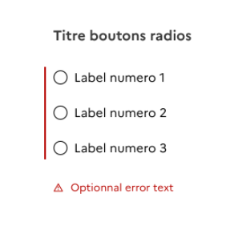

# Icône

Les icônes fonctionnelles sont des symboles visuels qui accompagnent l’utilisateur dans ses actions et qui aident à sa compréhension de l’interface.

:::dsfr-doc-tab-navigation

- Documentation
- [Recherche](./search/index.md)

:::

Nous mettons à votre disposition une sélection d’icônes, en grande partie issues de la librairie [Remix Icons](https://remixicon.com/) (libre de droits). Il s’agit, pour l’essentiel, des icônes utilisées par les composants du DSFR. Si l’icône recherchée est absente de notre sélection, vous pouvez compléter en recherchant d’abord dans [Remix Icons](https://remixicon.com/).

## Pour les designers

Les icônes sont disponibles dans les Fondamentaux des librairies Sketch et Figma (section icônes fonctionnelles).

## Pour les développeurs

Les icônes, placées dans **dist/icons**, sont utilisées via des classes CSS disponibles dans `utility/icons/icons.min.css`. Il est de ce fait possible d’utiliser des icônes en utilisant directement la classe CSS associée, reprenant le nom de l’icône SVG, précédée du préfixe `fr-icon`. Exemple : `.fr-icon-error-fill`.

Les icônes sont rangées en catégories (system, business, map…), avec un fichier css pour chacune. Il est donc possible d’importer uniquement les catégories d’icônes désirées pour alléger la CSS.

Le chargement des icônes se fait directement via l’ajout du fichier CSS. Ce fichier contient un chemin relatif vers les icônes SVG, qui sont placées dans le dossier `dist/icons`. Il conviendra de respecter cette structure de dossier pour que les icônes soient correctement chargées.

Il est ensuite possible d’utiliser les classes d’icônes correspondantes, **directement sur un composant** qui permet d’ajouter une icône, par exemple un bouton :

```HTML
<button class="fr-btn fr-icon-checkbox-circle-line fr-btn--icon-left">
  Label bouton MD
</button>
```

Il est aussi possible de les utiliser de manière autonome, au sein d'un texte, en utilisant de préférence une balise `<span>`. Exemple :

```HTML
<span class="fr-icon-error-fill" aria-hidden="true"></span>
```

L’ancienne nomenclature des classes en `fr-fi` (remplacée par `fr-icon`) est dépréciée mais toujours fonctionnelle.

**Ajout d'icônes personnalisées**

Pour ajouter une icône qui ne serait pas présente dans le DSFR, il est possible de créer un fichier SVG ou de le télécharger depuis la librairie Remixicon. Il faudra ensuite créer un fichier CSS pour associé une classe à cette icône, en suivant la nomenclature `fr-icon-[nom-de-l'icône]`. Par exemple, pour une icône nommée `custom-icon`, le fichier CSS contiendra :

```CSS
.fr-icon-custom-icon::before,
.fr-icon-custom-icon::after {
  -webkit-mask-image: url("../icons/custom-icon.svg");
  mask-image: url("../icons/custom-icon.svg");
}
```

[Facultatif] Pour fonctionner sur Internet Explorer 11, il faudra également ajouter, de préférence dans un autre fichier CSS, la règle suivante :

```CSS
@media screen and (min-width: 0\0) and (min-resolution: 72dpi) {
  .fr-icon-custom-icon::before,
  .fr-icon-custom-icon::after {
    background-image: url("../icons/custom-icon.svg");
  }
}
```

>[!NOTE]
>Ne pas modifier directement les fichiers CSS du DSFR, mais plutôt créer un fichier CSS personnalisé pour vos icônes. De cette manière, vous pourrez monter de version du DSFR sans perdre vos modifications.

## Tailles

Les icônes sont disponibles en quatre tailles. Il est possible de modifier la taille des icônes à l'aide de modifiers spécifiques

:::fr-table[Tailles]{valign=top multiline=true}

| **Taille** | **Token** | **Classe** | **Dimension** | **Contexte d’utilisation** |
| --- | --- | --- | --- | --- |
| XS | `$xs` | `.fr-icon--xs` | 12x12px - 0.75rem | À utiliser avec la typographie Extra Small (XS) |
| SM | `$sm` | `.fr-icon--sm` | 16x16px - 1rem | À utiliser avec la typographie Small (SM) |
| MD | `$md`| `.fr-icon` | 24x24px - 1.5rem | À utiliser avec la typographie Medium (MD)Taille par défaut, aucun modifiers |
| LG | `$lg` | `.fr-icon--lg` | 32x32px - 2rem | À utiliser avec la typographie Large (LG) |

:::

## Règles d’utilisation

Les icônes fonctionnelles sont des symboles visuels utilisés pour représenter des idées, des objets ou des actions.

Les icônes doivent être utilisées pour attirer l'attention sur les actions, les ensembles de contenus importants ou les zones clés, il faut éviter d’en utiliser trop sur une même page pour ne pas créer de confusion. Un concept doit être représenté par la même icône sur l'ensemble du site et de l'écosystème numérique de l'État.

### Couleur

La couleur choisie pour vos icônes doit être issue [des couleurs du DSFR](../color/index.md). Lorsqu’une icône est rattachée à un libellé, elle prend automatiquement la couleur de ce libellé.



### Alignement et marge

L’icône doit être alignée en hauteur par rapport au libellé qui l’accompagne. Pour les marges externes, vous pouvez consulter la documentation [espacements](../spacing/index.md).

### Accessibilité

Les icônes sont uniquement illustratives et ne doivent pas être utilisées seules, mais accompagnées d’un libellé explicite.

Exemples d’implémentations :

<a href="#"><span aria-hidden="true" class="fr-icon-info-line"></span>Information</a>

::fr-button[[Label bouton MD](#)]{icon='checkbox-circle-line' icon-place='left'}

```html
<a href="#">
  <span aria-hidden="true" class="fr-icon-info-line"></span> Plus Information
</a>

<button class="fr-btn fr-icon-checkbox-circle-line fr-btn--icon-left" title="Label bouton MD">
    Label bouton MD
</button>
```

Lorsqu'il est impossible d'avoir un libellé visible, il faut à minima proposer un libellé aux technologies d’assistance via un attribut `title` et un texte caché (par exemple avec la classe `sr-only`).

<a href="#" title="Imprimer">
  <span aria-hidden="true" class="fr-icon-printer-line"></span>
  <span class="sr-only">Imprimer</span>
</a>

```html
<a href="#" title="Imprimer">
  <span aria-hidden="true" class="fr-icon-printer-line"></span>
  <span class="sr-only">Imprimer</span>
</a>
```
