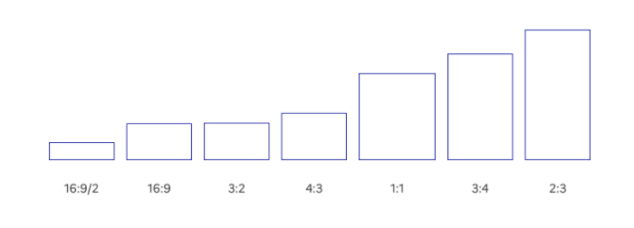

# Médias

Les médias sont des images ou des vidéos présents au sein des pages du site. Ils sont utilisés pour donner une information visuelle ou dans un but purement décoratif.

## Image

Les ratios d’images suivants peuvent être mis en place dans le respect de la grille responsive : 32:9, 16:9, 3:2, 4:3, 1:1, 3:4, 2:3.



Afin que votre image soit responsive, utilisez la classe `.fr-responsive-img`.

```html
<div>
    
        <!-- L’alternative de l’image (attribut alt) doit toujours être présent, sa valeur peut-être vide ou non selon votre contexte -->
</div>
```


Le ratio 16:9 est à privilégier pour intégrer un visuel au sein d’une page de contenu, voir [le composant média en contexte éditorial.](../../../../component/content/_part/doc/index.md)

## Vidéo

Les ratios de vidéos définis ci-dessous sont à utiliser dans le respect de la grille responsive :

- 16:9
- 4:3
- 1:1

Pour intégrer une vidéo au sein d’une page de contenu, voir [le composant contenu média en contexte éditorial.](../../../../component/content/_part/doc/index.md) Afin que votre vidéo soit responsive, utilisez la classe qui correspond à son format parmi les suivantes :

**Format 16/9 :** `.fr-responsive-vid`

```html
<div class="fr-responsive-vid">
    <iframe title="[A MODIFIER | titre de l’iframe]" class="fr-responsive-vid__player" src="https://www.youtube.com/embed/HyirpmPL43I" allow="accelerometer; autoplay; encrypted-media; gyroscope; picture-in-picture" allowfullscreen=""></iframe>
</div>
```

**Format 4/3 :** `.fr-responsive-vid.fr-responsive-vid--4x3`

```html
<div class="fr-responsive-vid fr-responsive-vid--4x3">
    <iframe title="[A MODIFIER | titre de l’iframe]" class="fr-responsive-vid__player" src="https://www.youtube.com/embed/HyirpmPL43I" allow="accelerometer; autoplay; encrypted-media; gyroscope; picture-in-picture" allowfullscreen=""></iframe>
</div>
```

**Format 1/1 :** `fr-responsive-vid.fr-responsive-vid--1x1`

## Règles d’utilisation

### Usages

- Utilisez des images et vidéos qui véhiculent un message clair.
- Veillez à homogénéiser le style graphique de vos images et vidéos.
- Utilisez exclusivement des images, photos et vidéos libres de droit ou veiller à vous acquitter des droits.

#### Traitement des alternatives

- Si l'image n'apporte pas d'information essentielle à la compréhension du contenu, utiliser une alternative vide (`alt=""`).
- Si l'image apporte une information essentielle à la compréhension du contenu, renseigner l'alternative avec l'information nécessaire (`alt="alternative de l'image"`).

### Accessibilité

#### Vidéo ou audio

- La lecture ne commence pas sans le contrôle de l’utilisateur
- Le lecteur est utilisable au clavier selon un ordre logique
- La transcription textuelle est pertinente, accessible et adjacente à l'élément vidéo ou audio.
- Les vidéos (hors direct) sont sous-titrées.

#### Image décorative

- Utiliser une alternative vide `` pour les images.
- Utiliser l'attribut `aria-hidden="true"` pour les SVG.

#### Image porteuse d’information (infographie, graphique, affiche, …)

- Chaque image possède un attribut `alt` qui contient l'information essentielle à la compréhension du contenu.
- Chaque image complexe a, si nécessaire, une description détaillée adjacente, via une transcription par exemple ([Voir exemple](https://www.vie-publique.fr/bd/272944-simone-veil-la-loi-sur-lavortement-episode-2))
- Dans le cas d'un SVG, utiliser l'attribut `aria-label` pour fournir une alternative textuelle.

Plus d’informations sur [http://pidila.gitlab.io/checklist-pidila/?Thématique=Contenus non textuels&Référentiel=RGAA](http://pidila.gitlab.io/checklist-pidila/?Th%C3%A9matique=Contenus%20non%20textuels&R%C3%A9f%C3%A9rentiel=RGAA)

### Contenus

Pour intégrer un média au sein d’un contenu éditorial, consultez [la section média en contexte éditorial](../../../../component/content/_part/doc/index.md).
