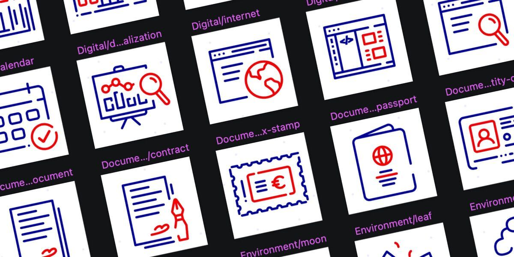
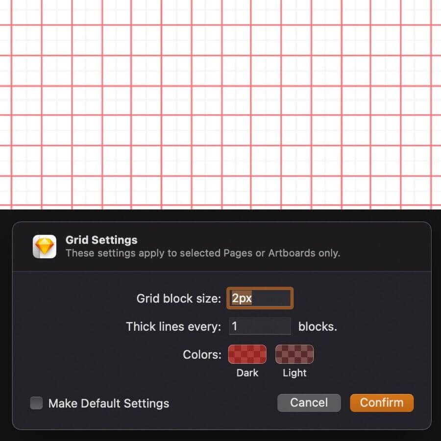
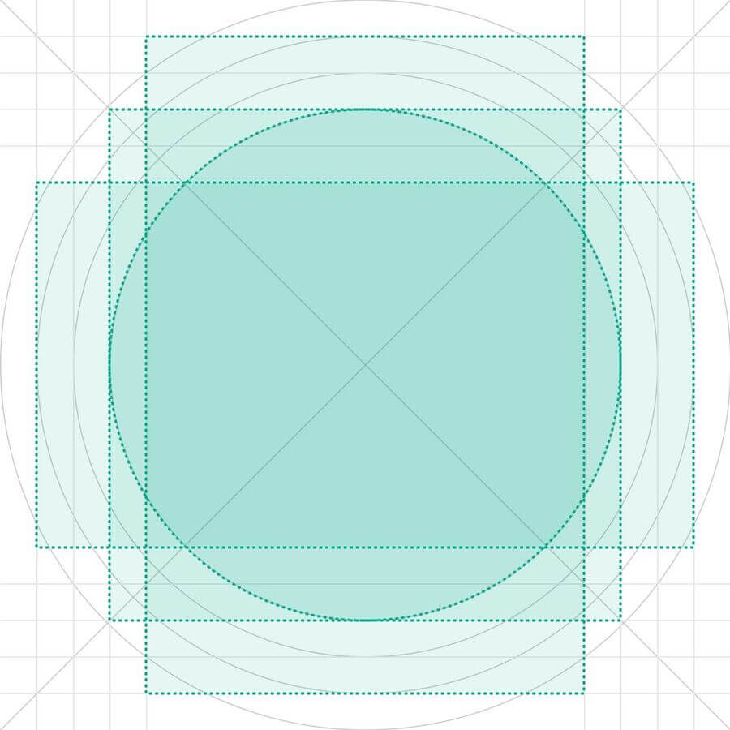
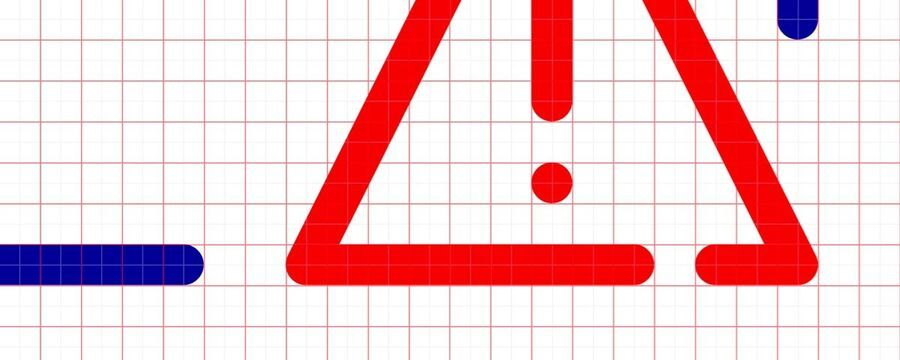
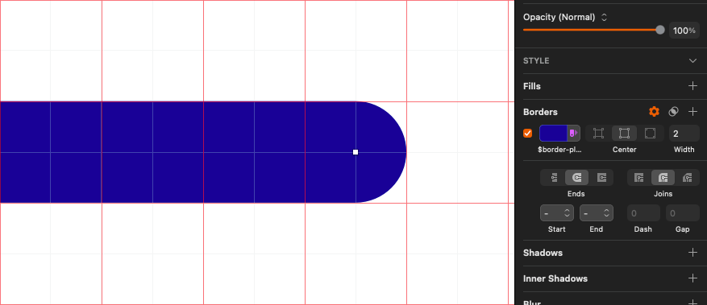
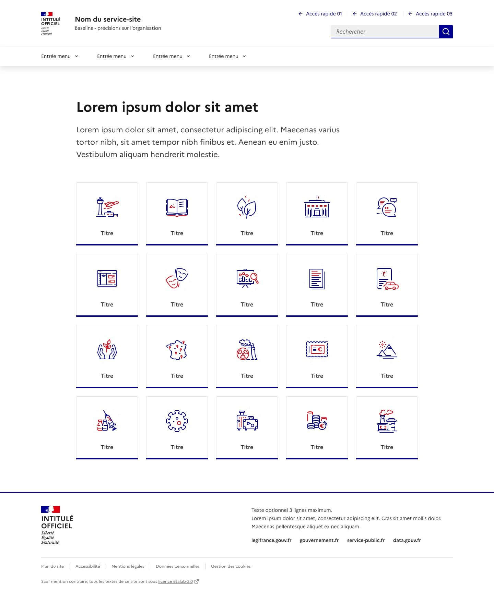
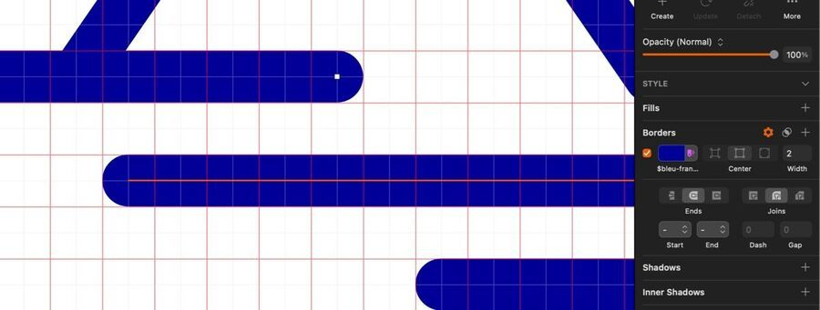

## Pictogramme

### La représentation visuelle
Porteur d’une signification, sa nature représentative même insinue qu’il “donne accès à…”. Un pictogramme est une représentation visuelle bénéficiant d’une reconnaissance immédiate dont il rend explicite un objet ou un message.

Il aide l’utilisateur à se repérer et à comprendre l’action, l’objet ou le message rapporté. La reconnaissance qu’offrent les pictogrammes permet aux utilisateurs de trouver l’information souhaitée sans perte de temps.



### Les grands principes
Les pictogrammes suivent les principes de design du Système de Design de l'État destinés à encadrer le travail de conception auquel viennent s’ajouter 3 principes additionnels.

Un pictogrammes se doit d'être : 
- **Explicite**: le pictogramme doit clairement évoquer un élément du monde réel ou une information. L’association entre le signifiant et le signifié doit être facile et immédiate ; pour cela, l’illustration doit être suffisamment détaillée mais comporter un minimum d'éléments superflus.
- **Cohérent**: le pictogramme doit s’insérer sans effort dans l’univers graphique du Système de Design de l'État, et plus particulièrement la collection existante. Pour cela, il suffit de reprendre les fondamentaux (formes et couleurs) et d’avoir une construction harmonieuse et équilibrée.
- **Rassurant**: un pictogramme se veut avenant, à travers l’utilisation de formes simples et familières ; il inspire doublement confiance : par la simplicité de sa signification, et son aspect agréable à l’œil via des formes arrondies et évocatrices.

### Les détails de construction

#### 📐 La grille
La grille est le support de création des pictogrammes. Elle permet de les équilibrer dans leurs masses et leurs détails, qu’ils aient des formes rondes, carrées, triangulaires ou rectangulaires. Par défaut, le symbole fait 80 x 80 pixels, mais la taille peut s’adapter sur la base des multiples de 8.



Sur un site, un pictogramme n’excède rarement 180 × 180 pixels en grande taille. Il doit également rester lisible en petite taille 40 × 40 pixels. Ils ont des formats dont la largeur est égale à la hauteur (ratio 1:1). Celle-ci est construite sur une base de 2 pixels pour un carré.

#### 🧰 Les formes
Les pictogrammes s’appuie sur des formes de bases issues de la géométrie (carré, rectangle, triangle, cercle…) alignées sur la grille. L’aération présente dans les pictogrammes fait partie intégrante de leur identité. Elle permet d’apporter de la lisibilité dans des représentations complexes de sorte à les rendre égales à celles comportants moins de détails.



L’espacement minimal à mettre en place est de 2 pixels, soit un carré. Dans la mesure du possible, il est recommandé de rester sur des multiples de 4 ou 8.



#### ✏️ Le style
Les pictogrammes du Système de Design de l'État est filaire et aérien. Ceux-ci sont dessinés sur une ligne de 2 pixels centrée.



Aussi, l’utilisation de radius est restreint. Néanmoins la fin des lignes et les jonctions sont rondes. Les éléments de détails peuvent avoir une forme remplie avec une taille définie en multiples de 4px. D’un pictogrammes à l’autre, il est fortement recommandé de garantir un niveau de détails identiques.

#### 🎨 Les couleurs

##### La cohabitation
Sur les trois couleurs présentes dans les pictogrammes, seule une demeure personnalisable avec la palette de couleurs d’illustration :
- **Couleur dominante** : couleur primaire marquant l’identité de l'État. Elle véhicule l’image de marque et attire l’attention de l’utilisateur sur un élément particulier. Occupant environ 60% de la surface du pictogramme, la personnalisation de cette couleur n’est pas autorisée.  
Token de décision : $artwork-major-blue-france  
Thème clair : $blue-france-113 / Thème sombre : $blue-france-625
- **Couleur subsidiaire** : couleur primaire marquant l’identité de l'État. À l’image du $blue-france-113, elle véhicule l’image de marque et attire l’attention de l’utilisateur sur un élément particulier. Toutefois, en raison de sa ressemblance à une des couleurs systèmes ($error-main-525), son utilisation notamment dans les composants doit demeurer discrète. Occupant quand à elle 30% de la surface, la personnalisation de cette couleur est autorisée en conservant l’indice -main utilisé.  
Token de décision : $artwork-minor-red-marianne  
Thème clair et sombre : $red-marianne-main-472
- **Couleur décorative** : couleur primaire marquant l’identité de l'État. À l’image du $blue-france-113, elle véhicule l’image de marque. Occupant quand à elle 10% de la surface, cette couleur est optionnelle et non personnalisable.  
Token de décision : $artwork-decorative-blue-france  
Thème clair : $blue-france-950 / Thème sombre : $blue-france-100

::::dsfr-doc-table[La personnalisation]{valign=top scroll=false vheaders=vertical caption=false}
| Description de l’usage | Token | Valeur(s) autorisée(s) |
|-----------------------|-------|-----------------------|
| Couleur dominante (60%) | $artwork-major-blue-france | Non personnalisable |
| Couleur subsidiaire (30%) | $artwork-minor-red-marianne | $[couleur]-main (thèmes clair / sombre). Exemples : $green-emeraude-main-632 $brown-caramel-main-648 |
| Couleur décorative (10%) | $artwork-decorative-blue-france | Non personnalisable, Optionnelle |
::::

### Les usages définis
Les pictogrammes s’utilisent : 
- dans les composants “Tuiles” et “Paramètre d’affichage”,
- dans un environnement illustratif (ex. Modèles de pages d’erreurs, Carte…).




### La prise en main

#### Les designers

##### ➡️  La librairie Sketch
Dans la librairie Sketch, les pictogrammes sont disponibles dans la libraire « Système de Design de l’État · Pictogrammes », sous forme de symboles. Ceux-ci ont trois overrides activés : 
- Couleur majeure (Non personnalisable)
- Couleur mineure [Indice -main] (Personnalisable en utilisant l’indice -main des couleurs d’illustrations)
- Couleur décorative (Non personnalisable mais optionnelle)

Pour passer les pictogrammes en thème sombre, il vous suffit d’utiliser les tokens portant le même nom dans la palette dédiée (Chemin d’accès : Dark > Decisions > Artwork).

##### ➡️  La librairie Figma
Sur Figma, les pictogrammes sont disponibles [dans un fichier à part du Community](https://www.figma.com/community/file/1098654384051611363).

Pour les utiliser, dupliquez le fichier puis publiez-le dans votre espace de travail. Vous pouvez ensuite insérer directement les pictogrammes dans vos designs. Leur personnalisation est possible via les “Selection colors” :
- Passage en thème sombre : remplacez les tokens par leur version “dark”
- Accentuation : remplacez la couleur du calque “🎨 Mineure (indice -main)” par une couleur illustrative d’indice main (par exemple : $purple-glycine-main-494)

> [!NOTE]
> De manière optionnelle, vous pouvez une fois le fichier “Pictogrammes” publié dans votre espace restaurer les liens existant entre les Composants et celui-ci (des pictogrammes sont utilisés par exemple pour le composant “Paramètres d’affichage”). Pour cela, la marche à suivre et la même que lors d’une mise à jour du DSFR 🔗.

> De même que les fondamentaux et les composants, le fichier des pictogrammes est mis à jour régulièrement. Il vous faudra alors procéder à sa mise à jour dans votre espace de travail de la même manière que pour les autres fichiers susnommés.

#### Les développeurs
Les pictogrammes sont des fichiers .svg structurés de façon à permettre l’utilisation des couleurs du dsfr et du mode sombre. Ils sont notamment divisés en 3 groupes de "path" (decorative, minor, major) permettant d’insérer indépendamment chaque couleur. 

La librairie de SVG se trouve dans **dist/artwork/pictograms**. 

> [!NOTE]
> Le chemin des pictogrammes light.svg, dark.svg et system.svg utilisés dans le composant paramètre d’affichage (display) est déprécié. Ces pictogrammes ont été déplacé dans leurs dossiers respectifs et renommés.<br>
> - artwork/light.svg → artwork/pictograms/environment/sun.svg<br>
> - artwork/dark.svg → artwork/pictograms/environment/moon.svg<br>
> - artwork/system.svg → artwork/pictograms/system/system.svg

##### Utilisation des pictogrammes
Pour intégrer ces pictogrammes, il convient d’utiliser une balise `<svg>` et d’importer à l’intérieur les 3 parties du svg. Chaque partie doit être insérée, à la manière des spritesheet, via une balise `<use>` et l’attribut href : 

<div class="dsfr-doc-preview">
    <svg class="fr-artwork" aria-hidden="true" viewBox="0 0 80 80" width="80px" height="80px">
        <use class="fr-artwork-decorative" xlink:href="/img/artwork/pictograms/city-hall.svg#artwork-decorative"></use>
        <use class="fr-artwork-minor" xlink:href="/img/artwork/pictograms/city-hall.svg#artwork-minor"></use>
        <use class="fr-artwork-major" xlink:href="/img/artwork/pictograms/city-hall.svg#artwork-major"></use>
    </svg>
</div>

:::fr-accordion[Extrait de code]{id='pictogram-accordion'}
```HTML
<svg class="fr-artwork" aria-hidden="true" viewBox="0 0 80 80" width="80px" height="80px">
  <use class="fr-artwork-decorative" xlink:href="/img/artwork/pictograms/city-hall.svg#artwork-decorative"></use>
  <use class="fr-artwork-minor" xlink:href="/img/artwork/pictograms/city-hall.svg#artwork-minor"></use>
  <use class="fr-artwork-major" xlink:href="/img/artwork/pictograms/city-hall.svg#artwork-major"></use>
</svg>
```
:::

- Le `<svg>` doit porter la classe fr-artwork et l’attribut aria-hidden="true".
- La taille du pictogramme est défini par les attributs width, height, et viewBox (viewBox = 0 0 width height).
- chaque `<use>` doit faire correspondre sa couleur, définie par sa classe (ex: fr-artwork-major), et son “path” importé via l’attribut xlink:href avec une valeur du type : 
-> chemin-relatif-vers/dist/artwork/pictograms/category/nom-picto.svg#artwork-id-de-la-couleur
- La couleur mineure (par défaut en red-marianne) peut être modifiée par une couleur d’accentuation en ajoutant un modificateur au niveau de fr-artwork (ex: “fr-artwork fr-artwork--green-emeraude”).

##### Ajout de pictogrammes dans la librairie
Les pictogrammes doivent d’abord passer l'étape de validation UI avant d'être ajoutés en code.

Les nouveau pictogrammes sont ajoutés dans src/core/asset/artwork/ avant d'être exportés au build dans dist/artwork/.

Il est nécessaire de retoucher le code des svg afin de les formater :
- Le svg doit posséder les attributs :  
  width="80px" height="80px" viewBox="0 0 80 80" xmlns="http://www.w3.org/2000/svg" xmlns:xlink="http://www.w3.org/1999/xlink"
- N’utiliser que 3 groupe de `<path>`, avec les id : artwork-decorative, artwork-minor, artwork-major et classes fr-artwork-decorative fr-artwork-minor fr-artwork-major
- Les path ne doivent pas contenir de remplissage de couleur “fill” ou “stroke”
- Ajouter une balise `<style></style>` au début du `<svg>` permet de définir les couleurs par défaut des 3 groupes, en cas d’utilisation hors dsfr.
- Le svg reste utilisable de façon autonome et peut être inséré via une balise ``. (Pratique à éviter pour la gestion du mode sombre).

Ainsi le svg d’un pictogramme doit correspondre à ce gabarit : 
```html
<svg width="80px" height="80px" viewBox="0 0 80 80" xmlns="http://www.w3.org/2000/svg" xmlns:xlink="http://www.w3.org/1999/xlink"> <style> .fr-artwork-decorative { fill: #ECECFF; } .fr-artwork-minor { fill: #E1000F; } .fr-artwork-major { fill: #000091; } </style> <g class="fr-artwork-decorative" id="artwork-decorative"> <path d="..."></path> </g> <g class="fr-artwork-minor" id="artwork-minor"> <path d="..."></path> </g> <g class="fr-artwork-major" id="artwork-major"> <path d="..."></path> </g> </svg>
```

### Le cas particulier

#### La couleur de fond
Dans le cas où l’on souhaiterait ajouter un élément en fond (background) sous un pictogramme. Il existe deux autres token $artwork-background et $artwork-motif permettant de créer des pictogrammes entièrement gris. 

::::dsfr-doc-table[La personnalisation]{valign=top scroll=false vheaders=vertical caption=false}
| Description de l’usage | Token | Valeur(s) autorisée(s) |
|-----------------------|-------|-----------------------|
| Couleur de fond (80%) | $artwork-background | Non personnalisable, $grey-975 $grey-75 |
| Couleur de motif (20%) | $artwork-motif | Non personnalisable, Optionnelle, $grey-925 $grey-125 |
::::

#### Utilisation des pictogrammes de fond
L’intégration des pictogrammes de fond se fait de la même manière que les pictogrammes. Il est possible de combiner les deux en un seul élément appelant, via des `<use>`, les différents calques de couleurs.

Utiliser les valeurs de width, height, et viewbox du pictogramme le plus grand (généralement le fond).  
Il est possible d’ajouter la classe fr-responsive-img sur l'élément pour que le pictogramme s'adapte à la taille de son conteneur.

Pour déplacer le pictogramme à l’intérieur de son fond plus grand, ajouter un groupe `<g>` avec l’attribut transform=”translate(x,y)”  
Pour centrer un pictogramme de 80x80 dans un fond de 160x200 : 
- x = (largeur conteneur - largeur contenu) / 2 = (160 - 80) / 2 = 40
- y = (hauteur conteneur - hauteur contenu) / 2 = (200 - 80) / 2 = 60

### La contribution
En tant qu’utilisateur, vous pouvez contribuer à la création de la librairie de pictogrammes illustratifs. Pour cela, rien de plus simple. Il vous suffit d’envoyer à l'équipe du Système de Design de l'État, un export de votre réalisation. Toutefois, l'équipe se réserve le droite de procéder à quelques ajustements en vue de l’intégration du pictogramme à la librairie.

#### Les spécifications du fichier
- **Nom du fichier** : il s’agit du nom de pictogramme en anglais qui désigne l’objet et/ou le message de la représentation visuelle.
- **Taille de la zone contenant le pictogramme** : 80 x 80 pixels
- **Format de l’export** : .svg

#### Les spécifications du pictogramme
- Conserver les traits de conception de sorte à ne pas vectoriser le pictogramme (par exemple sur Sketch, la fonctionnalité se nomme “Convert to Outlines”)



- Utiliser les tokens de décisions adaptés issus du Système de Design de l'État ($artwork-major-blue-france, $artwork-minor-red-marianne et $artwork-decorative-blue-france)

#### L’envoi du fichier
Un formulaire est disponible pour l’envoi de vos pictogrammes illustratifs ce qui nous permet de les centraliser. Vous pouvez créer une demande selon la procédure suivante en allant sur sur Jira Service Desk.

**Étape 1**  
Sélectionnez le type de demande associé :  Partager une illustration.

**Étape 2**  
Remplissez les champs du formulaire disponibles : 
  - Objet : résumé de votre demande en quelques mots
  - Description : indication des noms potentielles du pictogrammes, en anglais
  - Pièce jointe : ajout de votre fichier
  - Adresse email : suivi de l’avancement de la prise en charge de votre demande et d'interagir avec nos équipes

**Étape 3**  
Après la validation du formulaire, vous recevrez un email vous confirmant que votre demande a bien été créée.

**Étape 4**  
Dans les 48h ouvrées, vous recevrez un deuxième message électronique vous informant que votre demande a été prise en compte. Une fois que celle-ci a été prise en compte, le pictogramme peut être ajusté en vue de son intégration dans la librairie.