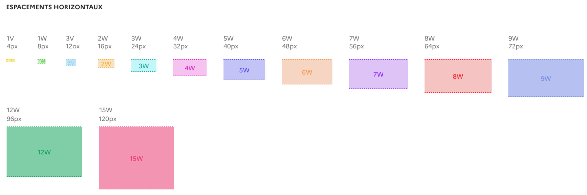
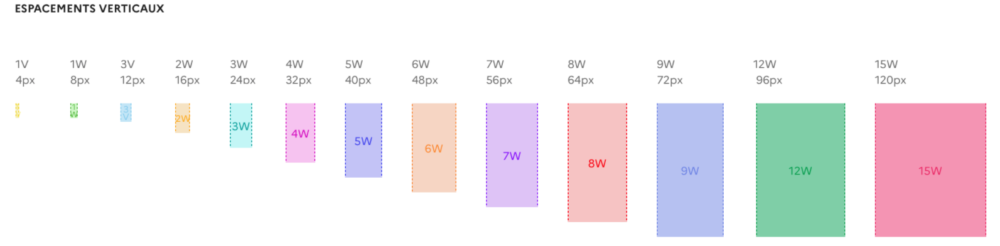

# Espacement

Le DSFR propose un système de dimension d'espacement et de marge qui s’appuie sur les multiples de 8 (le système “8 point grid”).

## Règles d’espacement 

Ce système d’espacement permet de garantir une homogénéité, cohérence et consistance des interfaces conçues. Cela dans le but d'améliorer l’UX et de faciliter la conception et le développement.

Nous utilisons des multiples de 8px pour définir les marges et padding, auxquels s’ajoutent les espacements de 4px, 12px et 20 px afin de gérer tous les cas de figure les plus courants.

## Espacement horizontaux 

## Espacement verticaux 

Dans le code, les espacements sont exprimés en Rem. Voici la correspondance des pixels en Rem. 

La nomenclature “v” indique un multiple de 4 et “w” un multiple de 8. 

::::dsfr-doc-table[Correspondance des espacements]{valign=top scroll=false vheaders=vertical caption=false}
| Nom (token) | Espace en rem | Espace en pixel |
|-------------|----------------|------------------|
| **0-5v**    | 0.125         | 2                |
| **1v**      | 0.25          | 4                |
| **1-5v**    | 0.375         | 6                |
| **7v**      | 1.75          | 28               |
| **8v**      | 2             | 32               |
| **9v**      | 2.25          | 36               |
| **10v**     | 2.5           | 40               |
| **11v**     | 2.75          | 44               |
| **12v**     | 3             | 48               |
| **13v**     | 3.25          | 52               |
| **14v**     | 3.5           | 56               |
| **15v**     | 3.75          | 60               |
| **16v**     | 4             | 64               |
| **17v**     | 4.25          | 68               |
| **18v**     | 4.5           | 72               |
| **19v**     | 4.75          | 76               |
| **20v**     | 5             | 80               |
| **21v**     | 5.25          | 84               |
| **22v**     | 5.5           | 88               |
| **23v**     | 5.75          | 92               |
| **24v**     | 6             | 96               |
| **25v**     | 6.25          | 100              |
| **26v**     | 6.5           | 104              |
| **27v**     | 6.75          | 108              |
| **28v**     | 7             | 112              |
| **29v**     | 7.25          | 116              |
| **30v**     | 7.5           | 120              |
| **31v**     | 7.75          | 124              |
| **32v**     | 8             | 128              |
::::

## Titres et paragraphes

Les espacements sous les titres et les paragraphes de texte - margin-bottom - sont  

::::dsfr-doc-table[]{valign=top scroll=false vheaders=vertical caption=false}
| éléments                   | Token / px / rem     |
|---------------------------|----------------------|
| **Titres (h1 - h6)**      | 3w / 24px / 1,5rem   |
| **Titres alternatifs**     | 4w / 32 px / 2rem    |
| **paragraphes de texte (xl - xs)** | 3w / 24px / 1,5rem   |
::::

[Voir le détail sur la documentation de la Typographie](../typography/index.md)

## Règles d’utilisation

### Espacement 

Chaque partie de l'interface utilisateur doit être intentionnellement conçue, y compris l'espace vide entre les éléments. Les espacements permettent de :

**Créer des relations**
- Utilisez des espacements faibles entre plusieurs composants pour signaler qu’ils sont liés, ou font partie d’un même groupe (exemple : champs de formulaire) ;
- Utilisez des espacements importants pour mettre en évidence un élément indépendant du reste de la page (exemple : call to action). 

**Créer des hiérarchies**
- Augmentez les espacements autour d’un composant clé de votre page permet d’améliorer sa visibilité.  

### Classes CSS

Des classes utilitaires sont présentes au sein du DSFR afin de mettre en place ces espacements de manière simplifiée. Il est de ce fait possible par exemple, d’ajouter un espacement en bas d’un bloc de 40 pixels par exemple, en utilisant la classe `.fr-mb-5w`.

Ces classes existent pour les propriétés de padding et de margin, pour les directions top, right, bottom et left.

- **Propriété de padding et margin** 

::::dsfr-doc-table[]{valign=top scroll=false vheaders=vertical caption=false}
| Valeur possible | Diminutif de la valeur | Exemple |
|----------------|------------------------|---------|
| **Margin**     | m                      | `fr-m-1w` correspond a une margin de 1w sur tous les cotés |
| **Padding**    | p                      | `fr-p-1w` correspond a un padding de 1w sur tous les cotés |
::::

- **Propriété de direction : top, bottom, right, left** 

::::dsfr-doc-table[]{valign=top scroll=false vheaders=vertical caption=false}
| Valeur possible | Diminutif de la valeur | Exemple |
|----------------|------------------------|---------|
| **Top**        | t                      | `fr-mt-1w` correspond a une margin top de 1w |
| **Bottom**     | b                      | `fr-mb-1w` correspond a une margin bottom de 1w |
| **Left**       | l                      | `fr-ml-1w` correspond a une margin left de 1w |
| **Right**      | r                      | `fr-mr-1w` correspond a une margin right de 1w |
| **Top + bottom**| y                     | `fr-my-1w` correspond a une margin top et bottom de 1w |
| **Left+right** | x                      | `fr-mx-1w` correspond a une margin left et right de 1w |
| **Top + Bottom + Left + Right** |  | `fr-m-1w` correspond a une margin de tous les coté de 1w |
::::

- **Propriété de point de rupture : md** 

::::dsfr-doc-table[]{valign=top scroll=false vheaders=vertical caption=false}
| Valeur possible | Diminutif de la valeur | Exemple |
|----------------|------------------------|---------|
| **md**        | md                     | `fr-mt-md-1w` correspond a une margin top de 1w  à partir du point de rupture md. |
::::

- **Valeurs complémentaires** 

::::dsfr-doc-table[Valeur possible]{valign=top scroll=false vheaders=vertical caption=false}
| Valeur possible | Diminutif de la valeur | Exemple |
|----------------|------------------------|---------|
| **n1v**       | négatif                | `fr-m-n1w` correspond a une margin négative de tous les cotés de 1w. `fr-mb-n1w` correspond a une margin bottom négatif de - 1w |
| **0**         |                        | `fr-m-0` correspond à une marge à 0 de tous les cotés. |
| **auto**      |                        | `fr-m-auto` correspond à une marge auto de tous les cotés. |
::::

### Besoin d’aide ?

> [!NOTE]
> **Besoin d'aide ?** 
> L'équipe du Système de Design de l'État est là pour vous aider. 
> Retrouvez-la sur : 
> - [la communauté Slack](https://gouvfr.slack.com/) pour poser vos questions, et échanger avec d'autres utilisateurs. Vous êtes agents de l'État et souhaitez accéder au Slack ? [Rejoignez la communauté](https://gouvfr.atlassian.net/servicedesk/customer/portal/1/group/1/create/9) dès maintenant ! 
> - [le centre de support](https://gouvfr.atlassian.net/servicedesk/customer/portals) pour envoyer vos demandes de correctifs et d'évolutions