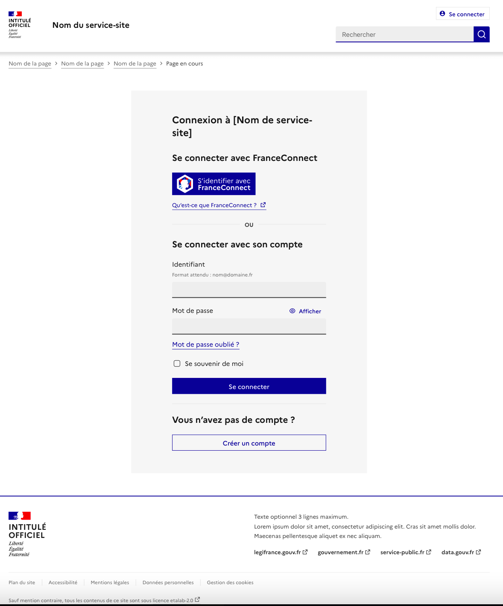

# Page de connexion

Le modèle de “page de connexion” permet de demander à l’utilisateur de se connecter à un service.

Il doit être utilisé lorsque vous souhaitez que l’utilisateur accède à un espace privé/personnel. Il doit être placé juste avant l’accès à cet espace.

De manière générale, permettez aux utilisateurs d'accéder à autant de services ou contenus possibles sans avoir à se connecter, les formulaires de connexion étant une barrière entre l’utilisateur et les contenus qu’il est souhaitable de limiter au maximum.

## Structure

Ce modèle propose une page de référence prête à l’emploi et directement réutilisable.

La page de connexion est composée des éléments suivants :
- Un header et un footer par défaut - obligatoires (à remplacer par le header et footer réels de votre site).
- Un titre et un chapô - obligatoires (à ajuster en fonction du contexte pour présenter et contextualiser ce à quoi permet d'accéder la session connectée).
- Le formulaire de connexion :
    - La connexion avec FranceConnect - obligatoire.
    - La connexion avec identifiants - obligatoire.
- Un accès à la connexion - obligatoire (textes à ajuster en fonction du contexte).



## Règles d’utilisation

### Structure du formulaire de connexion

L’ordre et la structure des modalités de connexion sont à respecter comme présenter dans le modèle :
- 1\) Le formulaire de connexion avec :
    - La connexion avec FranceConnect en premier
    - Le "ou"
    - La connexion avec identifiants en second
- 2\) L’accès à la connexion

:::fr-accordion[Extrait de code]{id=‘accordion-connexion’}
```html
<main class="fr-pt-md-14v" role="main" id="content">
    <div class="fr-container fr-container--fluid fr-mb-md-14v">
        <div class="fr-grid-row fr-grid-row-gutters fr-grid-row--center">
            <div class="fr-col-12 fr-col-md-8 fr-col-lg-6">
                <div class="fr-container fr-background-alt--grey fr-px-md-0 fr-py-10v fr-py-md-14v">
                    <div class="fr-grid-row fr-grid-row-gutters fr-grid-row--center">
                        <div class="fr-col-12 fr-col-md-9 fr-col-lg-8">
                            <h1>Connexion à [Nom de service-site]</h1>
                            <div class="fr-mb-6v">
                                <h2>Se connecter avec FranceConnect</h2>
                                <div class="fr-connect-group">
                                    <button class="fr-connect">
                                        <span class="fr-connect__login">S’identifier avec</span>
                                        <span class="fr-connect__brand">FranceConnect</span>
                                    </button>
                                    <p>
                                        <a href="https://franceconnect.gouv.fr/" target="_blank" rel="noopener" title="Qu’est ce que FranceConnect ? - nouvelle fenêtre">Qu’est ce que FranceConnect ?</a>
                                    </p>
                                </div>
                            </div>
                            <p class="fr-hr-or">ou</p>
                            <div>
                                <form id="login-1760">
                                    <fieldset class="fr-fieldset" id="login-1760-fieldset" aria-labelledby="login-1760-fieldset-legend login-1760-fieldset-messages">
                                        <legend class="fr-fieldset__legend" id="login-1760-fieldset-legend">
                                            <h2>Se connecter avec son compte</h2>
                                        </legend>
                                        <div class="fr-fieldset__element">
                                            <p class="fr-text--sm">Description — Lorem ipsum dolor sit amet, consectetur adipiscing elit.</p>
                                        </div>
                                        <div class="fr-fieldset__element">
                                            <fieldset class="fr-fieldset" id="credentials" aria-labelledby="credentials-messages">
                                                <div class="fr-fieldset__element">
                                                    <span class="fr-hint-text">Sauf mention contraire, tous les champs sont obligatoires.</span>
                                                </div>
                                                <div class="fr-fieldset__element">
                                                    <div class="fr-input-group">
                                                        <label class="fr-label" for="username-1757">
                                                            Identifiant
                                                            <span class="fr-hint-text">Format attendu : nom@domaine.fr</span>
                                                        </label>
                                                        <input class="fr-input" autocomplete="username" aria-required="true" aria-describedby="username-1757-messages" name="username" id="username-1757" type="text">
                                                        <div class="fr-messages-group" id="username-1757-messages" aria-live="assertive">
                                                        </div>
                                                    </div>
                                                </div>
                                                <div class="fr-fieldset__element">
                                                    <div class="fr-password" id="password-1758">
                                                        <label class="fr-label" for="password-1758-input">
                                                            Mot de passe
                                                        </label>
                                                        <div class="fr-input-wrap">
                                                            <input class="fr-password__input fr-input" aria-describedby="password-1758-input-messages" aria-required="true" name="password" autocomplete="current-password" id="password-1758-input" type="password">
                                                        </div>
                                                        <div class="fr-messages-group" id="password-1758-input-messages" aria-live="assertive">
                                                        </div>
                                                        <div class="fr-password__checkbox fr-checkbox-group fr-checkbox-group--sm">
                                                            <input aria-label="Afficher le mot de passe" id="password-1758-show" type="checkbox" aria-describedby="password-1758-show-messages">
                                                            <label class="fr-password__checkbox fr-label" for="password-1758-show">
                                                                Afficher
                                                            </label>
                                                            <div class="fr-messages-group" id="password-1758-show-messages" aria-live="assertive">
                                                            </div>
                                                        </div>
                                                        <p>
                                                            <a href="[À MODIFIER - url de la page de récupération]" class="fr-link">Mot de passe oublié ?</a>
                                                        </p>
                                                    </div>
                                                </div>
                                                <div class="fr-messages-group" id="credentials-messages" aria-live="assertive">
                                                </div>
                                            </fieldset>
                                        </div>
                                        <div class="fr-fieldset__element">
                                            <div class="fr-checkbox-group fr-checkbox-group--sm">
                                                <input name="remember" id="remember-1759" type="checkbox" aria-describedby="remember-1759-messages">
                                                <label class="fr-label" for="remember-1759">
                                                    Se souvenir de moi
                                                </label>
                                                <div class="fr-messages-group" id="remember-1759-messages" aria-live="assertive">
                                                </div>
                                            </div>
                                        </div>
                                        <div class="fr-fieldset__element">
                                            <ul class="fr-btns-group">
                                                <li>
                                                    <button class="fr-mt-2v fr-btn">
                                                        Se connecter
                                                    </button>
                                                </li>
                                            </ul>
                                        </div>
                                        <div class="fr-messages-group" id="login-1760-fieldset-messages" aria-live="assertive">
                                        </div>
                                    </fieldset>
                                </form>
                            </div>
                            <hr>
                            <h2>Vous n’avez pas de compte ?</h2>
                            <ul class="fr-btns-group">
                                <li>
                                    <button class="fr-btn fr-btn--secondary">
                                        Créer un compte
                                    </button>
                                </li>
                            </ul>
                        </div>
                    </div>
                </div>
            </div>
        </div>
    </div>
</main>
```
:::

#### Bloc de connexion FranceConnect

La connexion avec FranceConnect est un impératif pour tous les service de l’Etat. C’est la première modalité de connexion qui doit être présentée à l’utilisateur. Les éléments de connexion FranceConnect (textes, bouton, lien) sont à reprendre en l'état. La mise en place de l’identification FranceConnect doit suivre une implantation technique précise à mener directement avec le service FranceConnect via [leur plateforme ici](https://franceconnect.gouv.fr/partenaires)

#### Bloc de connexion par identifiants

- La connexion avec identifiants est proposée avec une structure minimale avec la demande du couple “adresse électronique” et “mot de passe”, et reprend le “modèle de demande d’adresse mail” et le “modèle de demande de mot passe”
- Si votre service nécessite de demander d’autres informations, des champs peuvent être ajoutés/remplacés les champs proposés.
- De manière générale, limiter le nombre d’information demandées lors de la connexion.
- Le lien “mot de passe oublié” doit rediriger vers le système de récupération de mot de passe de votre service.
- La récupération de mot de passe ne doit pas se faire par l’envoi en clair du mot de passe, mais par un système de réinitialisation.
- Éviter les questions secrètes pour récupérer le mot de passe.

#### Messages d'erreurs

- Dans le cas d’erreur de saisie, ne pas reprendre l’affichage d’erreur du champ input. En effet, le message d’erreur ne doit pas préciser directement si le mot de passe a été mal saisi.
- Il faut utiliser dans ce cas le bloc alerte et mettre un message spécifiant une erreur pour “le couple mot de passe/identifiant”.

### Bonnes pratiques

- Privilégier la demande d’adresse email plutôt qu’un identifiant pour la connexion avec identifiants. Les utilisateurs se rappellent plus facilement de leur email que d’un identifiant unique.
- Mettre en place un système de double authentification quand cela est nécessaire.

### Accessibilité

La structure des contenus de la page doit être cohérente et le code html conforme [aux standards](https://validator.w3.org/). Chaque composant du DSFR doit respecter les règles qui lui sont propres : contraste, intitulé, cohérence du contexte, pertinence, attributs aria, etc.

La page doit être structurée comme les autres pages correctement ([ARIA Authoring Practices Guide](https://www.w3.org/TR/wai-aria-practices/examples/landmarks/HTML5.html)) et avoir une hiérarchie de titre correcte.
