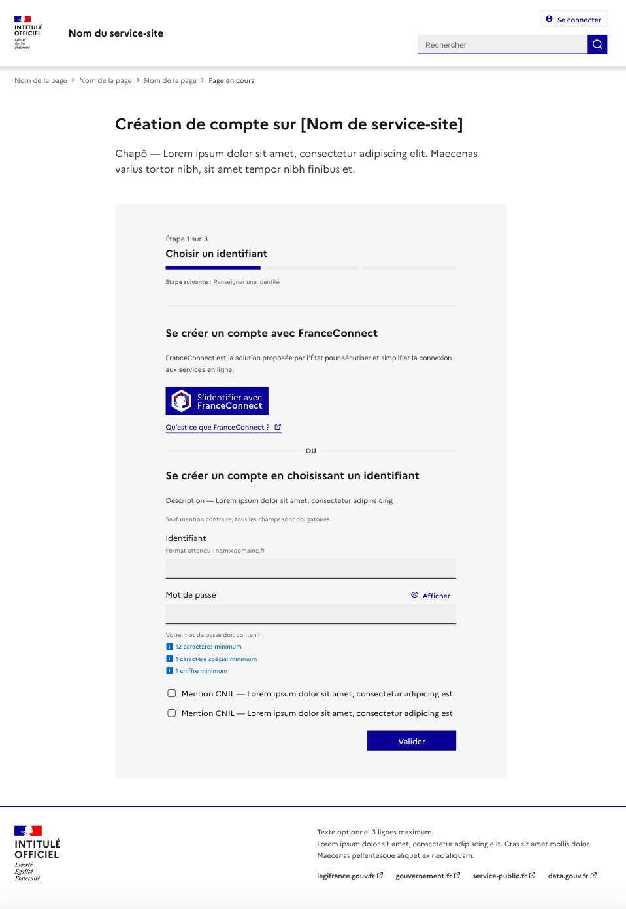
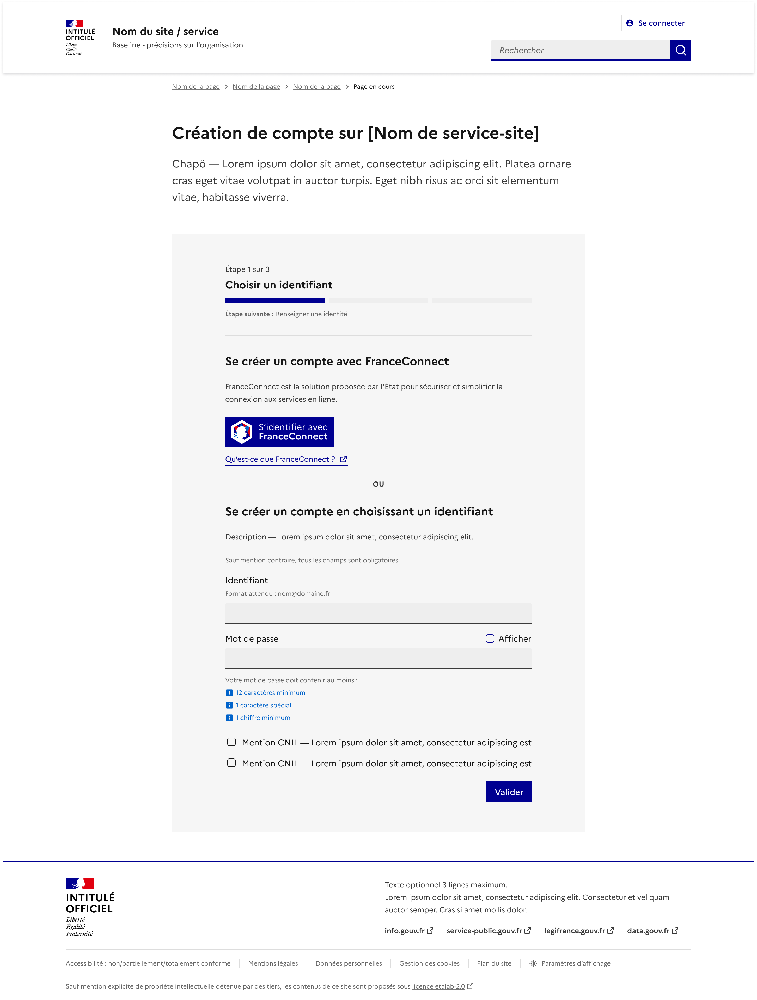
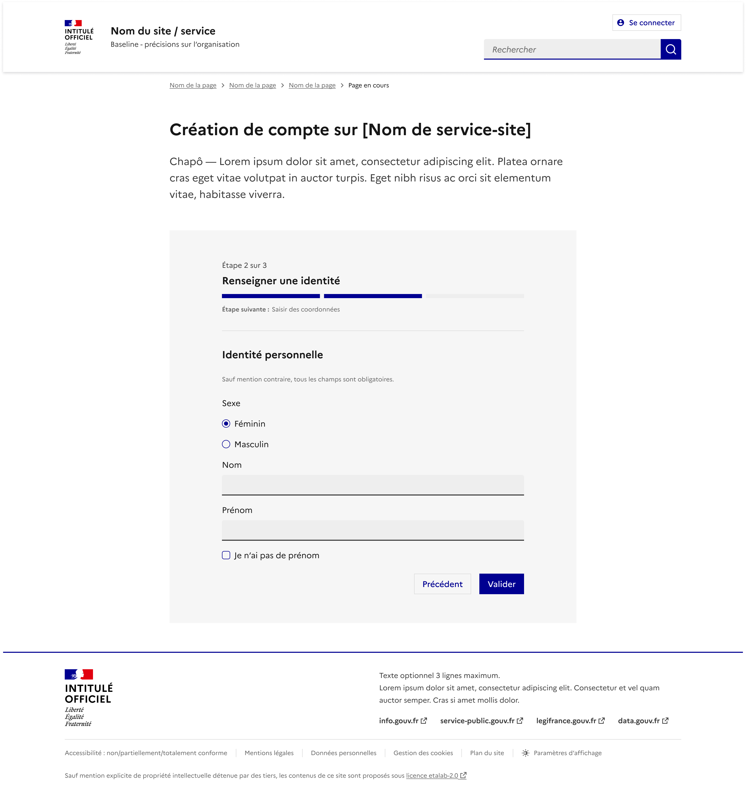
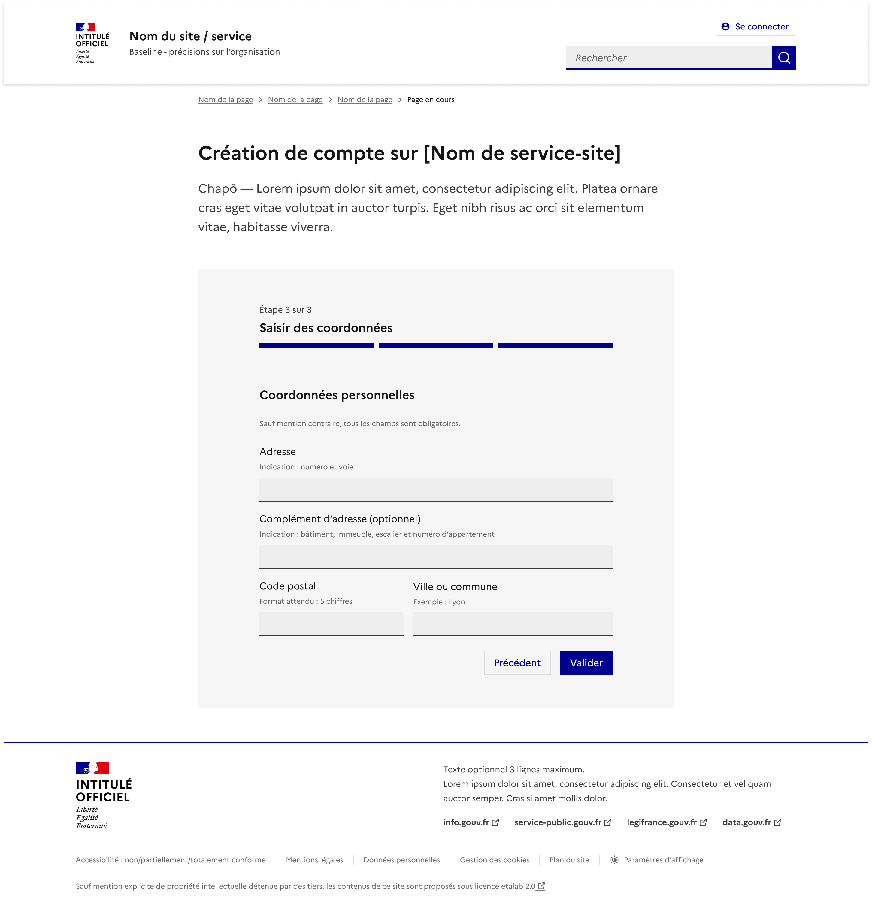

# Page de création de compte

Le modèle de “page de création de compte” permet de demander à l’utilisateur de créer un compte.

Ce modèle est à utiliser lorsque vous souhaitez que l’utilisateur se crée un compte. De manière générale, permettez aux utilisateurs d'accéder à autant de services ou contenus possibles sans avoir à se connecter, les formulaires de connexion étant une barrière entre l’utilisateur et les contenus qu’il est souhaitable de limiter au maximum.

## Structure

Ce modèle propose une page de référence prête à l’emploi et directement réutilisable.

La page de création de compte est composée des éléments suivants :

- Un header et un footer par défaut - obligatoires (à remplacer par le header et footer réels de votre site).
- Un titre et un chapô - obligatoires (à ajuster en fonction du contexte pour présenter et contextualiser la procédure de création de compte et les éventuelles pièces à fournir).
- Le formulaire de création de compte :
  - La création de compte avec FranceConnect - obligatoire.
  - La création de compte avec identifiants - obligatoire.
- Les actions : cases à cocher mentions CNIL + bouton “Créer un compte” - obligatoires.



:::fr-accordion[### Extrait de code]{id='accordion-account-creation'}
```html
<main role="main" id="content">
    <div class="fr-container fr-mt-8v fr-mt-md-14v fr-mb-2v fr-mb-md-8v">
        <div class="fr-grid-row fr-grid-row--gutters fr-grid-row--center">
            <div class="fr-col-12 fr-col-md-10 fr-col-lg-8">
                <h2>Création de compte sur [Nom de service-site]</h2>
                <p class="fr-text--lead">Chapô — Lorem ipsum dolor sit amet, consectetur adipiscing elit. Maecenas varius tortor nibh, sit amet tempor nibh finibus et.</p>
            </div>
        </div>
    </div>
    <div class="fr-container fr-container--fluid fr-mb-md-14v">
        <div class="fr-grid-row fr-grid-row-gutters fr-grid-row--center">
            <div class="fr-col-12 fr-col-md-10 fr-col-lg-8">
                <div class="fr-container fr-background-alt--grey fr-px-md-0 fr-py-10v fr-py-md-14v">
                    <div class="fr-grid-row fr-grid-row-gutters fr-grid-row--center">
                        <div class="fr-col-12 fr-col-md-10 fr-col-lg-9">
                            <div class="fr-mb-6v">
                                <h6>Se créer un compte avec FranceConnect</h6>
                                <p class="fr-text--sm fr">FranceConnect est la solution proposée par l’État pour sécuriser et simplifier la connexion aux services en ligne.</p>
                                <div class="fr-connect-group">
                                    <button class="fr-connect">
                                        <span class="fr-connect__login">S’identifier avec</span>
                                        <span class="fr-connect__brand">FranceConnect</span>
                                    </button>
                                    <p>
                                        <a href="https://franceconnect.gouv.fr/" target="_blank" rel="noopener" title="Qu’est ce que FranceConnect ? - nouvelle fenêtre">Qu’est ce que FranceConnect ?</a>
                                    </p>
                                </div>
                            </div>
                            <p class="fr-hr-or">ou</p>
                            <div>
                                <form class="fr-mb-0" id="login-1797">
                                    <fieldset class="fr-mb-0 fr-fieldset" id="login-1797-fieldset" aria-labelledby="login-1797-fieldset-legend login-1797-fieldset-messages">
                                        <legend class="fr-fieldset__legend" id="login-1797-fieldset-legend">
                                            <h6>Se créer un compte en choisissant un identifiant</h6>
                                        </legend>
                                        <div class="fr-fieldset__element">
                                            <p class="fr-text--sm">Description — Lorem ipsum dolor sit amet, consectetur adipiscing elit.</p>
                                        </div>
                                        <div class="fr-fieldset__element">
                                            <span class="fr-hint-text">Sauf mention contraire, tous les champs sont obligatoires.</span>
                                        </div>
                                        <div class="fr-fieldset__element">
                                            <div class="fr-input-group">
                                                <label class="fr-label" for="username-1793">
                                                    Identifiant
                                                    <span class="fr-hint-text">Format attendu : nom@domaine.fr</span>
                                                </label>
                                                <input class="fr-input" aria-describedby="username-1793-messages" name="username" id="username-1793" type="text">
                                                <div class="fr-messages-group" id="username-1793-messages" aria-live="assertive">
                                                </div>
                                            </div>
                                        </div>
                                        <div class="fr-fieldset__element">
                                            <div class="fr-password" id="password-1794">
                                                <label class="fr-label" for="password-1794-input">
                                                    Mot de passe
                                                </label>
                                                <div class="fr-input-wrap">
                                                    <input class="fr-password__input fr-input fr-password__input fr-input" aria-describedby="password-1794-input-messages" aria-required="true" name="password" autocomplete="new-password" id="password-1794-input" type="password">
                                                </div>
                                                <div class="fr-messages-group" id="password-1794-input-messages" aria-live="assertive">
                                                </div>
                                                <div class="fr-password__checkbox fr-checkbox-group fr-checkbox-group--sm">
                                                    <input aria-label="Afficher le mot de passe" id="password-1794-show" type="checkbox" aria-describedby="password-1794-show-messages">
                                                    <label class="fr-password__checkbox fr-label" for="password-1794-show">
                                                        Afficher
                                                    </label>
                                                    <div class="fr-messages-group" id="password-1794-show-messages" aria-live="assertive">
                                                    </div>
                                                </div>
                                            </div>
                                        </div>
                                        <div class="fr-fieldset__element">
                                            <div class="fr-checkbox-group fr-checkbox-group--sm">
                                                <input name="checkbox-cnil" id="checkbox-cnil-1795" type="checkbox" aria-describedby="checkbox-cnil-1795-messages">
                                                <label class="fr-label" for="checkbox-cnil-1795">
                                                    Mention CNIL — Lorem ipsum dolor sit amet, consectetur adipicing est
                                                </label>
                                                <div class="fr-messages-group" id="checkbox-cnil-1795-messages" aria-live="assertive">
                                                </div>
                                            </div>
                                        </div>
                                        <div class="fr-fieldset__element">
                                            <div class="fr-checkbox-group fr-checkbox-group--sm">
                                                <input name="checkbox-cnil" id="checkbox-cnil-1796" type="checkbox" aria-describedby="checkbox-cnil-1796-messages">
                                                <label class="fr-label" for="checkbox-cnil-1796">
                                                    Mention CNIL — Lorem ipsum dolor sit amet, consectetur adipicing est
                                                </label>
                                                <div class="fr-messages-group" id="checkbox-cnil-1796-messages" aria-live="assertive">
                                                </div>
                                            </div>
                                        </div>
                                        <div class="fr-fieldset__element">
                                            <ul class="fr-btns-group--right fr-btns-group fr-btns-group--inline fr-btns-group fr-btns-group--inline">
                                                <li>
                                                    <button class="fr-mt-2v fr-btn fr-btn" type="submit">
                                                        Valider
                                                    </button>
                                                </li>
                                            </ul>
                                        </div>
                                        <div class="fr-messages-group" id="login-1797-fieldset-messages" aria-live="assertive">
                                        </div>
                                    </fieldset>
                                </form>
                            </div>
                        </div>
                    </div>
                </div>
            </div>
        </div>
    </div>
</main>

```
:::

## Règles d’utilisation

**Structure du formulaire de création de compte :**

L’ordre et la structure des modalités de création de compte sont à respecter comme présentées dans le modèle :

- 1\) Le formulaire de création de compte avec :
  - La création de compte avec FranceConnect en premier
  - Le “ou”
  - La création de compte avec identifiants en second
- 2\) L’accès à la création de compte

**Création de compte avec FranceConnect :**

La connexion avec FranceConnect est un impératif pour tous les service de l’Etat. C’est la première modalité de connexion qui doit être présentée à l’utilisateur. Les éléments de connexion FranceConnect (textes, bouton, lien) sont à reprendre en l'état. La mise en place de l’identification FranceConnect doit suivre une implantation technique précise à mener directement avec le service FranceConnect via [leur plateforme ici](https://franceconnect.gouv.fr/partenaires)

- La création de compte avec identifiants est proposée dans une structure minimale avec la demande du couple “adresse électronique” et “mot de passe”, et reprend le “modèle de demande d’adresse mail” et le “modèle de demande de mot passe”.
- Si votre service nécessite de demander d’autres informations, des champs peuvent être ajoutés/remplacés les champs proposés.
- De manière générale, limiter le nombre d’informations demandées lors de la création de compte en les réduisant au strict nécessaire pour l’utilisation du service.

**Mentions CNIL**

Les mentions CNIL permettent de :

- Préciser comment seront utilisées les données recueillies auprès de l’utilisateur.
- Demander le consentement de l’utilisateur.

**Message d'erreur**

- Dans le cas d’erreur de saisie, afficher les erreurs directement au niveau de chaque champ input en reprenant le style de message d’erreur associé au champ input text.

**Étapes**
Si vous souhaitez demander des informations supplémentaires sur l’utilisateur dès la phase de création de compte, lors d’une phase de validation de compte, ou bien dans un espace connecté, vous pouvez “découper” le formulaire en plusieurs étapes, en utilisant l’indicateur d'étapes ainsi que des boutons de validation en bas de formulaire. Limitez vos demandes aux champs strictement nécessaires à vos traitements.

### Étape 1 - Identifiant



:::fr-accordion[### Extrait de code]{id=‘accordion-login’}
```html
<main role="main" id="content">
    <div class="fr-container fr-mt-8v fr-mt-md-14v fr-mb-2v fr-mb-md-8v">
        <div class="fr-grid-row fr-grid-row--gutters fr-grid-row--center">
            <div class="fr-col-12 fr-col-md-10 fr-col-lg-8">
                <h1 class="fr-h2">Création de compte sur [Nom de service-site]</h1>
                <p class="fr-text--lead">Chapô — Lorem ipsum dolor sit amet, consectetur adipiscing elit. Maecenas varius tortor nibh, sit amet tempor nibh finibus et.</p>
            </div>
        </div>
    </div>
    <div class="fr-container fr-container--fluid fr-mb-md-14v">
        <div class="fr-grid-row fr-grid-row--gutters fr-grid-row--center">
            <div class="fr-col-12 fr-col-md-10 fr-col-lg-8">
                <div class="fr-container fr-background-alt--grey fr-px-md-0 fr-pt-10v fr-pt-md-14v fr-pb-6v fr-pb-md-10v">
                    <div class="fr-grid-row fr-grid-row--gutters fr-grid-row--center">
                        <div class="fr-col-12 fr-col-md-10 fr-col-lg-9">
                            <div class="fr-stepper">
                                <h2 class="fr-stepper__title">
                                    Choisir un identifiant
                                    <span class="fr-stepper__state">Étape 1 sur 3</span>
                                </h2>
                                <div class="fr-stepper__steps" data-fr-current-step="1" data-fr-steps="3"></div>
                                <p class="fr-stepper__details">
                                    <span class="fr-text--bold">Étape suivante :</span> Renseigner une identité
                                </p>
                            </div>
                            <hr>
                            <div class="fr-mb-6v">
                                <h3 class="fr-h5">Se créer un compte avec FranceConnect</h3>
                                <p class="fr-text--sm">FranceConnect est la solution proposée par l’État pour sécuriser et simplifier la connexion aux services en ligne.</p>
                                <div class="fr-connect-group">
                                    <button class="fr-connect" id="connect-9350">
                                        <span class="fr-connect__login">S’identifier avec</span>
                                        <span class="fr-connect__brand">FranceConnect</span>
                                    </button>
                                    <p>
                                        <a href="https://franceconnect.gouv.fr/" id="connect-link-9359" target="_blank" rel="noopener" title="Qu’est-ce que FranceConnect ? - nouvelle fenêtre">Qu’est-ce que FranceConnect ?</a>
                                    </p>
                                </div>
                            </div>
                            <p class="fr-hr-or">ou</p>
                            <div>
                                <form class="fr-mb-0" id="login-9355">
                                    <fieldset class="fr-mb-0 fr-fieldset" id="login-9355-fieldset" aria-labelledby="login-9355-fieldset-legend login-9355-fieldset-messages">
                                        <legend class="fr-fieldset__legend" id="login-9355-fieldset-legend">
                                            <h3 class="fr-h5">Se créer un compte en choisissant un identifiant</h3>
                                        </legend>
                                        <div class="fr-fieldset__element">
                                            <p class="fr-text--sm">Description — Lorem ipsum dolor sit amet, consectetur adipiscing elit.</p>
                                        </div>
                                        <div class="fr-fieldset__element">
                                            <p class="fr-hint-text">Sauf mention contraire, tous les champs sont obligatoires.</p>
                                        </div>
                                        <div class="fr-fieldset__element">
                                            <div class="fr-input-group" id="input-group-9360">
                                                <label class="fr-label" for="username-9351">
                                                    Identifiant
                                                    <span class="fr-hint-text">Format attendu : nom@domaine.fr</span>
                                                </label>
                                                <input class="fr-input" autocapitalize="off" autocorrect="off" aria-describedby="username-9351-messages" name="username" id="username-9351" type="text">
                                                <div class="fr-messages-group" id="username-9351-messages" aria-live="polite">
                                                </div>
                                            </div>
                                        </div>
                                        <div class="fr-fieldset__element">
                                            <div class="fr-password" id="password-9352">
                                                <label class="fr-label" for="password-9352-input">
                                                    Mot de passe
                                                </label>
                                                <div class="fr-input-wrap">
                                                    <input class="fr-password__input fr-input fr-password__input fr-input" autocapitalize="off" autocorrect="off" aria-describedby="password-9352-input-messages" aria-required="true" name="password" autocomplete="new-password" id="password-9352-input" type="password">
                                                </div>
                                                <div class="fr-messages-group" id="password-9352-input-messages" aria-live="polite">
                                                    <p class="fr-message" id="password-9352-input-message">Votre mot de passe doit contenir :</p>
                                                    <p class="fr-message fr-message--info" id="password-9352-input-message-info">12 caractères minimum</p>
                                                    <p class="fr-message fr-message--info" id="password-9352-input-message-info-1">1 caractère spécial minimum</p>
                                                    <p class="fr-message fr-message--info" id="password-9352-input-message-info-2">1 chiffre minimum</p>
                                                </div>
                                                <div class="fr-password__checkbox fr-checkbox-group fr-checkbox-group--sm">
                                                    <input aria-label="Afficher le mot de passe" id="password-9352-show" type="checkbox">
                                                    <label class="fr--password__checkbox fr-label" for="password-9352-show">
                                                        Afficher
                                                    </label>
                                                </div>
                                            </div>
                                        </div>
                                        <div class="fr-fieldset__element">
                                            <div class="fr-checkbox-group fr-checkbox-group--sm">
                                                <input name="checkbox-cnil" id="checkbox-cnil-9353" type="checkbox" aria-describedby="checkbox-cnil-9353-messages">
                                                <label class="fr-label" for="checkbox-cnil-9353">
                                                    Mention CNIL — Lorem ipsum dolor sit amet, consectetur adipicing est
                                                </label>
                                                <div class="fr-messages-group" id="checkbox-cnil-9353-messages" aria-live="polite">
                                                </div>
                                            </div>
                                        </div>
                                        <div class="fr-fieldset__element">
                                            <div class="fr-checkbox-group fr-checkbox-group--sm">
                                                <input name="checkbox-cnil" id="checkbox-cnil-9354" type="checkbox" aria-describedby="checkbox-cnil-9354-messages">
                                                <label class="fr-label" for="checkbox-cnil-9354">
                                                    Mention CNIL — Lorem ipsum dolor sit amet, consectetur adipicing est
                                                </label>
                                                <div class="fr-messages-group" id="checkbox-cnil-9354-messages" aria-live="polite">
                                                </div>
                                            </div>
                                        </div>
                                        <div class="fr-fieldset__element">
                                            <ul class="fr-mt-2v fr-btns-group fr-btns-group--right fr-btns-group--inline-reverse fr-btns-group--inline-sm fr-btns-group fr-btns-group--right fr-btns-group--inline-reverse fr-btns-group--inline-sm">
                                                <li>
                                                    <button class="fr-btn" id="button-9361" type="submit">
                                                        Valider
                                                    </button>
                                                </li>
                                            </ul>
                                        </div>
                                        <div class="fr-messages-group" id="login-9355-fieldset-messages" aria-live="polite">
                                        </div>
                                    </fieldset>
                                </form>
                            </div>
                        </div>
                    </div>
                </div>
            </div>
        </div>
    </div>
</main>
```
:::

### Étape 2 - Identité



:::fr-accordion[### Extrait de code]{id=‘accordion-identify’}
```html
<main role="main" id="content">
    <div class="fr-container fr-mt-8v fr-mt-md-14v fr-mb-2v fr-mb-md-8v">
        <div class="fr-grid-row fr-grid-row--gutters fr-grid-row--center">
            <div class="fr-col-12 fr-col-md-10 fr-col-lg-8">
                <h1 class="fr-h2">Création de compte sur [Nom de service-site]</h1>
                <p class="fr-text--lead">Chapô — Lorem ipsum dolor sit amet, consectetur adipiscing elit. Maecenas varius tortor nibh, sit amet tempor nibh finibus et.</p>
            </div>
        </div>
    </div>
    <div class="fr-container fr-container--fluid fr-mb-md-14v">
        <div class="fr-grid-row fr-grid-row--gutters fr-grid-row--center">
            <div class="fr-col-12 fr-col-md-10 fr-col-lg-8">
                <div class="fr-container fr-background-alt--grey fr-px-md-0 fr-pt-10v fr-pt-md-14v fr-pb-6v fr-pb-md-10v">
                    <div class="fr-grid-row fr-grid-row--gutters fr-grid-row--center">
                        <div class="fr-col-12 fr-col-md-10 fr-col-lg-9">
                            <div class="fr-stepper">
                                <h2 class="fr-stepper__title">
                                    Renseigner une identité
                                    <span class="fr-stepper__state">Étape 2 sur 3</span>
                                </h2>
                                <div class="fr-stepper__steps" data-fr-current-step="2" data-fr-steps="3"></div>
                                <p class="fr-stepper__details">
                                    <span class="fr-text--bold">Étape suivante :</span> Saisir des coordonnées
                                </p>
                            </div>
                            <hr>
                            <div>
                                <form class="fr-mb-0" id="identity">
                                    <fieldset class="fr-mb-0 fr-fieldset" id="identity-fieldset" aria-labelledby="identity-fieldset-legend identity-fieldset-messages">
                                        <legend class="fr-fieldset__legend" id="identity-fieldset-legend">
                                            <h3 class="fr-h5">Identité personnelle</h3>
                                        </legend>
                                        <div class="fr-fieldset__element">
                                            <p class="fr-hint-text">Sauf mention contraire, tous les champs sont obligatoires.</p>
                                        </div>
                                        <div class="fr-fieldset__element">
                                            <fieldset class="fr-fieldset" id="sex-9533" aria-labelledby="sex-9533-legend sex-9533-messages">
                                                <legend class="fr-fieldset__legend--regular fr-fieldset__legend" id="sex-9533-legend">
                                                    Sexe
                                                </legend>
                                                <div class="fr-fieldset__element">
                                                    <div class="fr-radio-group fr-radio-group--sm">
                                                        <input type="radio" id="female-9534" name="sex">
                                                        <label class="fr-label" for="female-9534">
                                                            Feminin
                                                        </label>
                                                    </div>
                                                </div>
                                                <div class="fr-fieldset__element">
                                                    <div class="fr-radio-group fr-radio-group--sm">
                                                        <input type="radio" id="male-9535" name="sex">
                                                        <label class="fr-label" for="male-9535">
                                                            Masculin
                                                        </label>
                                                    </div>
                                                </div>
                                                <div class="fr-messages-group" id="sex-9533-messages" aria-live="polite">
                                                </div>
                                            </fieldset>
                                        </div>
                                        <div class="fr-fieldset__element">
                                            <fieldset class="fr-fieldset" id="name-9545" aria-labelledby="name-9545-legend name-9545-messages">
                                                <legend class="fr-sr-only" id="name-9545-legend">
                                                    Nom
                                                </legend>
                                                <div class="fr-fieldset__element">
                                                    <div class="fr-input-group" id="input-group-9550">
                                                        <label class="fr-label" for="family-name-9537">
                                                            Nom
                                                        </label>
                                                        <input class="fr-input" aria-describedby="family-name-9537-messages" name="family-name" autocomplete="family-name" id="family-name-9537" spellcheck="false" type="text">
                                                        <div class="fr-messages-group" id="family-name-9537-messages" aria-live="polite">
                                                        </div>
                                                    </div>
                                                </div>
                                                <div class="fr-fieldset__element">
                                                    <fieldset class="fr-mb-n4v fr-fieldset" id="firstname-fieldset-9543" aria-labelledby="firstname-fieldset-9543-legend firstname-fieldset-9543-messages">
                                                        <legend class="fr-sr-only" id="firstname-fieldset-9543-legend">
                                                            Prénom
                                                        </legend>
                                                        <div class="fr-fieldset__element">
                                                            <div class="fr-input-group" id="input-group-9551">
                                                                <label class="fr-label" for="given-9542">
                                                                    Prénom
                                                                </label>
                                                                <input class="fr-input" aria-describedby="given-9542-messages" name="given-name" autocomplete="given-name" id="given-9542" spellcheck="false" type="text">
                                                                <div class="fr-messages-group" id="given-9542-messages" aria-live="polite">
                                                                </div>
                                                            </div>
                                                        </div>
                                                        <div class="fr-messages-group" id="firstname-fieldset-9543-messages" aria-live="polite">
                                                        </div>
                                                    </fieldset>
                                                </div>
                                                <div class="fr-fieldset__element">
                                                    <div class="fr-checkbox-group fr-checkbox-group--sm">
                                                        <input onclick="toggleDisabled(this, 'firstname-fieldset-9543')" name="firstname-disabled" id="disabler-9544" type="checkbox" aria-describedby="disabler-9544-messages">
                                                        <label class="fr-label" for="disabler-9544">
                                                            Je n'ai pas de prénom
                                                        </label>
                                                        <div class="fr-messages-group" id="disabler-9544-messages" aria-live="polite">
                                                        </div>
                                                    </div>
                                                </div>
                                                <div class="fr-messages-group" id="name-9545-messages" aria-live="polite">
                                                </div>
                                            </fieldset>
                                        </div>
                                        <div class="fr-fieldset__element">
                                            <ul class="fr-mt-2v fr-btns-group fr-btns-group--right fr-btns-group--inline-reverse fr-btns-group--inline-sm fr-btns-group fr-btns-group--right fr-btns-group--inline-reverse fr-btns-group--inline-sm">
                                                <li>
                                                    <button class="fr-btn" id="button-9552" type="submit">
                                                        Valider
                                                    </button>
                                                </li>
                                                <li>
                                                    <button class="fr-btn fr-btn--secondary" id="button-9553">
                                                        Précédent
                                                    </button>
                                                </li>
                                            </ul>
                                        </div>
                                        <div class="fr-messages-group" id="identity-fieldset-messages" aria-live="polite">
                                        </div>
                                    </fieldset>
                                </form>
                            </div>
                        </div>
                    </div>
                </div>
            </div>
        </div>
    </div>
</main>
```
:::

### Étape 3 - Coordonnées



:::fr-accordion[### Extrait de code]{id=‘accordion-contact-details’}
```html
<main role="main" id="content">
    <div class="fr-container fr-mt-8v fr-mt-md-14v fr-mb-2v fr-mb-md-8v">
        <div class="fr-grid-row fr-grid-row--gutters fr-grid-row--center">
            <div class="fr-col-12 fr-col-md-10 fr-col-lg-8">
                <h1 class="fr-h2">Création de compte sur [Nom de service-site]</h1>
                <p class="fr-text--lead">Chapô — Lorem ipsum dolor sit amet, consectetur adipiscing elit. Maecenas varius tortor nibh, sit amet tempor nibh finibus et.</p>
            </div>
        </div>
    </div>
    <div class="fr-container fr-container--fluid fr-mb-md-14v">
        <div class="fr-grid-row fr-grid-row--gutters fr-grid-row--center">
            <div class="fr-col-12 fr-col-md-10 fr-col-lg-8">
                <div class="fr-container fr-background-alt--grey fr-px-md-0 fr-pt-10v fr-pt-md-14v fr-pb-6v fr-pb-md-10v">
                    <div class="fr-grid-row fr-grid-row--gutters fr-grid-row--center">
                        <div class="fr-col-12 fr-col-md-10 fr-col-lg-9">
                            <div class="fr-stepper">
                                <h2 class="fr-stepper__title">
                                    Saisir des coordonnées
                                    <span class="fr-stepper__state">Étape 3 sur 3</span>
                                </h2>
                                <div class="fr-stepper__steps" data-fr-current-step="3" data-fr-steps="3"></div>
                            </div>
                            <hr>
                            <div>
                                <form class="fr-mb-0" id="identity">
                                    <fieldset class="fr-mb-0 fr-fieldset" id="identity-fieldset" aria-labelledby="identity-fieldset-legend identity-fieldset-messages">
                                        <legend class="fr-fieldset__legend" id="identity-fieldset-legend">
                                            <h3 class="fr-h5">Coordonnées personnelles</h3>
                                        </legend>
                                        <div class="fr-fieldset__element">
                                            <p class="fr-hint-text">Sauf mention contraire, tous les champs sont obligatoires.</p>
                                        </div>
                                        <div class="fr-fieldset__element">
                                            <fieldset class="fr-fieldset" id="address-9729" aria-labelledby="address-9729-legend address-9729-messages">
                                                <legend class="fr-sr-only" id="address-9729-legend">
                                                    Adresse postale
                                                </legend>
                                                <div class="fr-fieldset__element">
                                                    <div class="fr-input-group" id="input-group-9736">
                                                        <label class="fr-label" for="address-9725">
                                                            Adresse
                                                            <span class="fr-hint-text">Indication : numéro et voie</span>
                                                        </label>
                                                        <input class="fr-input" aria-describedby="address-9725-messages" name="address-line1" autocomplete="address-line1" id="address-9725" type="text">
                                                        <div class="fr-messages-group" id="address-9725-messages" aria-live="polite">
                                                        </div>
                                                    </div>
                                                </div>
                                                <div class="fr-fieldset__element">
                                                    <div class="fr-input-group" id="input-group-9737">
                                                        <label class="fr-label" for="complement-9726">
                                                            Complément d’adresse (optionnel)
                                                            <span class="fr-hint-text">Indication : bâtiment, immeuble, escalier et numéro d’appartement</span>
                                                        </label>
                                                        <input class="fr-input" aria-describedby="complement-9726-messages" name="address-line2" autocomplete="address-line2" id="complement-9726" type="text">
                                                        <div class="fr-messages-group" id="complement-9726-messages" aria-live="polite">
                                                        </div>
                                                    </div>
                                                </div>
                                                <div class="fr-fieldset__element fr-fieldset__element--inline fr-fieldset__element--postal">
                                                    <div class="fr-input-group" id="input-group-9738">
                                                        <label class="fr-label" for="postal-9727">
                                                            Code postal
                                                            <span class="fr-hint-text">Format attendu : 5 chiffres</span>
                                                        </label>
                                                        <input class="fr-input" aria-describedby="postal-9727-messages" name="postal-code" autocomplete="postal-code" id="postal-9727" type="text">
                                                        <div class="fr-messages-group" id="postal-9727-messages" aria-live="polite">
                                                        </div>
                                                    </div>
                                                </div>
                                                <div class="fr-fieldset__element fr-fieldset__element--inline@md fr-fieldset__element--inline-grow">
                                                    <div class="fr-input-group" id="input-group-9739">
                                                        <label class="fr-label" for="city-9728">
                                                            Ville ou commune
                                                            <span class="fr-hint-text">Exemple : Montpellier</span>
                                                        </label>
                                                        <input class="fr-input" aria-describedby="city-9728-messages" name="address-level2" autocomplete="address-level2" id="city-9728" type="text">
                                                        <div class="fr-messages-group" id="city-9728-messages" aria-live="polite">
                                                        </div>
                                                    </div>
                                                </div>
                                                <div class="fr-messages-group" id="address-9729-messages" aria-live="polite">
                                                </div>
                                            </fieldset>
                                        </div>
                                        <div class="fr-fieldset__element">
                                            <ul class="fr-mt-2v fr-btns-group fr-btns-group--right fr-btns-group--inline-reverse fr-btns-group--inline-sm fr-btns-group fr-btns-group--right fr-btns-group--inline-reverse fr-btns-group--inline-sm">
                                                <li>
                                                    <button class="fr-btn" id="button-9740" type="submit">
                                                        Valider
                                                    </button>
                                                </li>
                                                <li>
                                                    <button class="fr-btn fr-btn--secondary" id="button-9741">
                                                        Précédent
                                                    </button>
                                                </li>
                                            </ul>
                                        </div>
                                        <div class="fr-messages-group" id="identity-fieldset-messages" aria-live="polite">
                                        </div>
                                    </fieldset>
                                </form>
                            </div>
                        </div>
                    </div>
                </div>
            </div>
        </div>
    </div>
</main>
```
:::

### Confirmation de création et d’activation

Un modèle de confirmation de création et d’activation de compte est aussi mis à disposition.

Le modèle est composé des composants suivant :

- Un header et un footer par défaut - obligatoires (à remplacer par les header et footer réels de votre site).
- Un titre et chapô - obligatoires.
- Un bloc gris contenant une alerte et un texte additionnel.

:::fr-accordion[### Extrait de code]{id=‘accordion-creation-activation-confirmation’}
```html
<main role="main" id="content">
    <div class="fr-container fr-mt-8v fr-mt-md-14v fr-mb-2v fr-mb-md-8v">
        <div class="fr-grid-row fr-grid-row--gutters fr-grid-row--center">
            <div class="fr-col-12 fr-col-md-10 fr-col-lg-8">
                <h1>Création de compte sur [Nom de service-site]</h1>
                <p class="fr-text--lead">Chapô — Lorem ipsum dolor sit amet, consectetur adipiscing elit. Maecenas varius tortor nibh, sit amet tempor nibh finibus et.</p>
            </div>
        </div>
    </div>
    <div class="fr-container fr-container--fluid fr-mb-md-14v">
        <div class="fr-grid-row fr-grid-row-gutters fr-grid-row--center">
            <div class="fr-col-12 fr-col-md-10 fr-col-lg-8">
                <div class="fr-container fr-background-alt--grey fr-px-md-0 fr-py-10v fr-py-md-14v">
                    <div class="fr-grid-row fr-grid-row-gutters fr-grid-row--center">
                        <div class="fr-col-12 fr-col-md-10 fr-col-lg-9">
                            <div>
                                <div class="fr-mb-6v fr-alert fr-alert--success fr-alert--sm">
                                    <p>Votre compte a bien été activé. Vous pouvez dès maintenant commencer à l’utiliser.</p>
                                </div>
                                <span class="fr-hint-text">Détail — Si vous n’avez pas reçu de courriel (n’hésitez pas à vérifier dans les indérisables), vous pouvez re saisir votre adresse électronique.</span>
                            </div>
                        </div>
                    </div>
                </div>
            </div>
        </div>
    </div>
</main>
```
:::

## Accessibilité

La structure des contenus de la page doit être cohérente et le code html conforme [aux standards](https://validator.w3.org/). Chaque composant du DSFR doit respecter les règles qui lui sont propres : contraste, intitulé, cohérence du contexte, pertinence, attributs aria, etc.

La page doit être structurée comme les autres pages correctement ([ARIA Authoring Practices Guide](https://www.w3.org/TR/wai-aria-practices/examples/landmarks/HTML5.html)) et avoir une hiérarchie de titre correcte.
