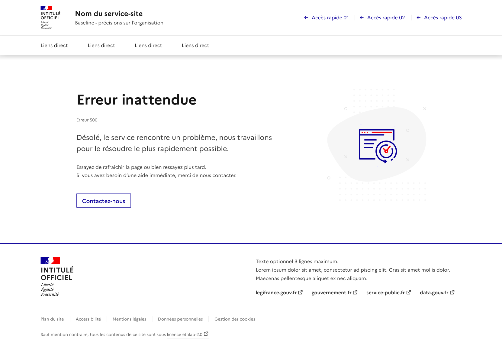

# Page d'erreurs

Les modèles de page d’erreur permettent d’informer l’utilisateur qu’un problème est rencontré sur le site pendant sa navigation.

Nous vous proposons 3 modèles de “page erreur” prêtes à l’emploi. Pour chaque variante, il existe un modèle de référence avec des contenus à adapter en fonction des cas rencontrés.

La structure peut être réutilisée pour les autres pages d’erreur non traitées par ces 3 modèles, à condition de respecter les bonnes pratiques préciser dans le paragraphe “Règles d’utilisation”.

## Erreur 404, Page non trouvée

Ce modèle permet d’informer l’utilisateur que la page qu’il recherche n’existe pas. Celui-ci, “Page non trouvée - Erreur 404” est le modèle de référence pour les erreurs 404, “Page non trouvée”.

La page d’erreur 404 est composée de :

- Une en-tête et un pied de page par défaut : à remplacer par l’en-tête et le pied de page réel du site
- Une navigation : si elle est présente sur l’ensemble des pages du site.
- Un titre : titre de la page 404, “Page non trouvée” (Texte fixe)
- Un sous titre : permet d’afficher le code d’erreur http, “Erreur 404”
- Un chapô : permet de s’excuser du problème rencontrée (Texte fixe)
- Un texte qui aide l’utilisateur à trouver des solutions pour trouver la page initialement recherché et qui lui propose des portes de sortie . Le texte proposé dans le modèle à réutiliser par défaut.Si pas de moteur de recherche : supprimer la mention “ou effectuer une recherche avec notre moteur de recherche en haut de page”Si pas de solution de contact : supprimer la mention “Sinon contactez-nous pour que l’on puisse vous rediriger vers la bonne information.”
- Si pas de moteur de recherche : supprimer la mention “ou effectuer une recherche avec notre moteur de recherche en haut de page”
- Si pas de solution de contact : supprimer la mention “Sinon contactez-nous pour que l’on puisse vous rediriger vers la bonne information.”
- Des boutons d’action qui mettent en avant les actions de sortie.
- Page d’accueil (redirection vers la page d’accueil)
- Contactez-nous : ouverture de la solution de contact si cette dernière existe.


:::fr-accordion[### Extrait de code]{id=‘accordion-404-error’}

```html
<main role="main" id="content">
    <div class="fr-container">
        <div class="fr-my-7w fr-mt-md-12w fr-mb-md-10w fr-grid-row fr-grid-row--gutters fr-grid-row--middle fr-grid-row--center">
            <div class="fr-py-0 fr-col-12 fr-col-md-6">
                <h1>Page non trouvée</h1>
                <p class="fr-text--sm fr-mb-3w">Erreur 404</p>
                <p class="fr-text--lead fr-mb-3w">La page que vous cherchez est introuvable. Excusez-nous pour la gène occasionnée.</p>
                <p class="fr-text--sm fr-mb-5w">
                    Si vous avez tapé l'adresse web dans le navigateur, vérifiez qu'elle est correcte. La page n’est peut-être plus disponible.
                    <br>Dans ce cas, pour continuer votre visite vous pouvez consulter notre page d’accueil, ou effectuer une recherche avec notre moteur de recherche en haut de page.
                    <br>Sinon contactez-nous pour que l’on puisse vous rediriger vers la bonne information.
                </p>
                <ul class="fr-btns-group fr-btns-group--inline-md">
                    <li>
                        <a class="fr-btn" href="/">
                            Page d'accueil
                        </a>
                    </li>
                    <li>
                        <a class="fr-btn fr-btn--secondary" href="[À MODIFIER - lien vers un formulaire de contact]">
                            Contactez-nous
                        </a>
                    </li>
                </ul>
            </div>
            <div class="fr-col-12 fr-col-md-3 fr-col-offset-md-1 fr-px-6w fr-px-md-0 fr-py-0">
                <svg xmlns="http://www.w3.org/2000/svg" class="fr-responsive-img fr-artwork" aria-hidden="true" width="160" height="200" viewBox="0 0 160 200">
                    <use class="fr-artwork-motif" href="[path]/ovoid.svg#artwork-motif"></use>
                    <use class="fr-artwork-background" href="[path]/ovoid.svg#artwork-background"></use>
                    <g transform="translate(40, 60)">
                        <use class="fr-artwork-decorative" href="[path]/technical-error.svg#artwork-decorative"></use>
                        <use class="fr-artwork-minor" href="[path]/technical-error.svg#artwork-minor"></use>
                        <use class="fr-artwork-major" href="[path]/technical-error.svg#artwork-major"></use>
                    </g>
                </svg>
            </div>
        </div>
    </div>
</main>
```

:::

## **Erreur 500, Erreur inattendue**

Ce modèle permet d’informer l’utilisateur que le service auquel il souhaite accéder rencontre un problème. Celui-ci “Erreur inattendue - Erreur 500” est le page de référence pour les erreurs 500.

La page d’erreur 500 est composée de :

- Une en-tête et un pied de page par défaut : à remplacer par l’en-tête et le pied de page réel du site
- Une navigation : si elle est présente sur l’ensemble des pages du site.
- Un titre : titre de la page erreur 500, “Erreur inattendue” (Texte fixe)
- Un sous titre : permet d’afficher le code d’erreur http, “Erreur 500”
- Un chapô : permet de s’excuser du problème rencontrée (Texte fixe)
- Un texte qui aide l’utilisateur à trouver des solutions pour trouver la page initialement recherchée et qui lui propose des portes de sortie Texte par défaut : “Essayez de rafraîchir la page, sinon merci de réessayer plus tard.”Si avec solution de contact ajouter : “Si vous avez besoin d’une aide immédiate, merci de nous contacter directement.”
- Texte par défaut : “Essayez de rafraîchir la page, sinon merci de réessayer plus tard.”
- Si avec solution de contact ajouter : “Si vous avez besoin d’une aide immédiate, merci de nous contacter directement.”
- Si solution de contact, un bouton “Contact” permettant l'ouverture de la solution de contact



:::fr-accordion[### Extrait de code]{id=‘accordion-500-error’}

```html
<main role="main" id="content">
    <div class="fr-container">
        <div class="fr-my-7w fr-mt-md-12w fr-mb-md-10w fr-grid-row fr-grid-row--gutters fr-grid-row--middle fr-grid-row--center">
            <div class="fr-py-0 fr-col-12 fr-col-md-6">
                <h1>Erreur inattendue</h1>
                <p class="fr-text--sm fr-mb-3w">Erreur 500</p>
                <p class="fr-text--sm fr-mb-5w">
                    Désolé, le service rencontre un problème, nous travaillons pour le résoudre le plus rapidement possible.
                </p>
                <p class="fr-text--lead fr-mb-3w">Essayez de rafraîchir la page ou bien ressayez plus tard.</p>
                <ul class="fr-btns-group fr-btns-group--inline-md">
                    <li>
                        <a class="fr-btn fr-btn--secondary" href="[À MODIFIER - lien vers un formulaire de contact]">
                            Contactez-nous
                        </a>
                    </li>
                </ul>
            </div>
            <div class="fr-col-12 fr-col-md-3 fr-col-offset-md-1 fr-px-6w fr-px-md-0 fr-py-0">
                <svg xmlns="http://www.w3.org/2000/svg" class="fr-responsive-img fr-artwork" aria-hidden="true" width="160" height="200" viewBox="0 0 160 200">
                    <use class="fr-artwork-motif" href="[path]/ovoid.svg#artwork-motif"></use>
                    <use class="fr-artwork-background" href="[path]/ovoid.svg#artwork-background"></use>
                    <g transform="translate(40, 60)">
                        <use class="fr-artwork-decorative" href="[path]/technical-error.svg#artwork-decorative"></use>
                        <use class="fr-artwork-minor" href="[path]/technical-error.svg#artwork-minor"></use>
                        <use class="fr-artwork-major" href="[path]/technical-error.svg#artwork-major"></use>
                    </g>
                </svg>
            </div>
        </div>
    </div>
</main>
```

:::

## Erreur 503, Service indisponible

Ce modèle permet d’informer l’utilisateur que le service est temporairement indisponible. Celui-ci, “Service indisponible - Erreur 503” est le modèle de référence pour les erreurs 503, quand le service est indisponible ou mis en maintenance.

La page 503 est composée de :

- Un titre : titre de la page erreur 503, “Service indisponible” (Texte fixe) ;
- Un chapo : qui permet de s’excuser du problème rencontré ;
- Un texte qui redirige l’utilisateur vers des solutons alternatives. Texte par défaut : “Merci de réessayer plus tard, vous serez en mesure de réutiliser le service très rapidement.” Texte si solution de contact : “Merci de réessayer plus tard, vous serez en mesure de réutiliser le service très rapidement. Si vous avez besoin d’une aide immédiate, merci de nous contacter directement.”
- Un ou plusieurs liens (ou boutons d'action tertiaires pour signifier l'aspect dégradé) pour rediriger l'utilisateur vers les solutions alternatives (formulaire de contact, réseaux sociaux, etc.).

Puisque cette page s'affiche en cas d'erreur serveur et que le DSFR ne peut être chargé dans ce cas de figure, cette page doit être une page statique : son contenu est disponible dans le dossier "standalone" à la racine du DSFR.


:::fr-accordion[### Extrait de code]{id=‘accordion-503-error’}

```html
<!doctype html>
<html lang="fr">

<head>
    <meta charset="utf-8">
    <meta name="viewport" content="width=device-width, initial-scale=1, shrink-to-fit=no">
    <title>Erreur serveur</title>
    <style>
        /*!
 * DSFR v1.10.2 | SPDX-License-Identifier: MIT | License-Filename: LICENSE.md | restricted use (see terms and conditions)
 */
        @charset "UTF-8";

        /* ¯¯¯¯¯¯¯¯¯ *\
  CONNECT
\* ˍˍˍˍˍˍˍˍˍ */
        html {
            height: 100%;
        }

        body {
            min-height: 100%;
            font-family: "Marianne", arial, sans-serif;
            text-rendering: optimizeLegibility;
            -webkit-font-smoothing: antialiased;
            -moz-osx-font-smoothing: grayscale;
            -webkit-text-size-adjust: 100%;
            margin: 0;
            padding: 0;
            font-size: 1rem;
            line-height: 1.5rem;
            box-sizing: border-box;
            display: flex;
            flex-direction: column;
            align-items: center;
            justify-content: center;
            background-color: #f5f5fe;
        }

        body::before,
        body::after {
            box-sizing: inherit;
        }

        body *,
        body *::before,
        body *::after {
            box-sizing: inherit;
        }

        main {
            display: flex;
            flex-direction: column;
            justify-content: space-between;
            flex: 1;
        }

        a {
            text-decoration: var(--text-decoration);
            outline-offset: 2px;
            outline-width: 2px;
            outline-color: #0a76f6;
        }

        *:focus-visible {
            z-index: 500;
            outline-style: solid;
        }

        .fr-container {
            width: 100%;
            max-width: 78rem;
            margin-left: auto;
            margin-right: auto;
            padding-left: 1rem;
            padding-right: 1rem;
            display: flex;
            flex-direction: row;
            align-items: center;
            flex: 1;
        }

        .fr-grid-row {
            display: flex;
            flex-direction: row;
            flex-wrap: wrap;
            margin: 0;
            padding: 0;
        }

        .fr-grid-row--center {
            justify-content: center;
            align-items: center;
        }

        .fr-grid-row--gutters {
            margin: -0.5rem;
        }

        .fr-grid-row--gutters>[class^=fr-col-],
        .fr-grid-row--gutters>[class*=" fr-col-"] {
            padding: 0.5rem;
        }

        .fr-col-12 {
            flex: 0 0 100%;
            width: 100%;
            max-width: 100%;
        }

        .fr-btns-group {
            list-style: none;
            padding: 0;
            margin-top: -0.5rem;
            margin-bottom: -0.5rem;
        }

        .fr-btns-group .fr-btn>span {
            display: inline-flex;
            flex-direction: row;
            align-items: center;
        }

        .fr-btns-group--inline {
            display: flex;
            flex-direction: row;
            flex-wrap: wrap;
            margin-left: -0.5rem;
            margin-right: -0.5rem;
        }

        .fr-btns-group--inline .fr-btn {
            margin-left: 0.5rem;
            margin-right: 0.5rem;
        }

        .fr-btns-group--sm .fr-btn {
            font-size: 0.875rem;
            line-height: 1.5rem;
        }

        .fr-btn {
            border-radius: 0;
            padding: 0.25rem 0.75rem;
            margin-top: 0.5rem;
            margin-bottom: 0.5rem;
            background-color: transparent;
            overflow: initial;
            max-width: 100%;
            max-height: none;
            font-weight: 500;
            display: inline-flex;
            flex-direction: row;
            align-items: center;
        }

        .fr-btn svg {
            width: 1rem;
            height: 1rem;
            margin-left: -0.125rem;
            margin-right: 0.5rem;
            fill: #000091;
        }

        .fr-server__body {
            margin-top: 3.5rem;
            margin-bottom: 3.5rem;
        }

        .fr-server__footer {
            margin-top: 3.5rem;
            margin-bottom: 2rem;
        }

        .fr-server__image {
            display: flex;
            flex-direction: row;
            align-items: center;
            justify-content: center;
            margin-bottom: 3.5rem;
        }

        .fr-server__image img {
            width: 13.25rem;
            margin: 0 auto;
        }

        .fr-h1 {
            font-size: 2rem;
            line-height: 2.5rem;
            margin-top: 0;
            margin-bottom: 1.5rem;
            font-weight: 700;
        }

        .fr-text--xl {
            font-size: 1.25rem;
            line-height: 2rem;
            margin-top: 0;
            margin-bottom: 1.5rem;
        }

        .fr-text--sm {
            font-size: 0.875rem;
            line-height: 1.5rem;
            margin-top: 0;
            margin-bottom: 1rem;
        }

        .fr-btn--tertiary {
            background-color: #f6f6f6;
            box-shadow: inset 0 0 0 1px #ddd;
            color: #000091;
        }

        .fr-btn--tertiary:hover {
            background-color: #dfdfdf;
        }

        .fr-btn--tertiary:active {
            background-color: #cfcfcf;
        }

        @media (min-width: 48em) {
            .fr-container {
                padding-left: 1.5rem;
                padding-right: 1.5rem;
            }

            .fr-col-offset-md-1 {
                margin-left: 8.3333333333%;
            }

            .fr-col-md-6 {
                flex: 0 0 50%;
                width: 50%;
                max-width: 50%;
            }

            .fr-col-md-3 {
                flex: 0 0 25%;
                width: 25%;
                max-width: 25%;
            }

            .fr-server__image {
                margin-top: 3.5rem;
                margin-bottom: 3.5rem;
            }

            .fr-server__image img {
                width: 100%;
            }

            .fr-h1 {
                font-size: 2.5rem;
                line-height: 3rem;
            }
        }

    </style>
</head>

<body>
    <main role="main" id="content">
        <div class="fr-container">
            <div class="fr-grid-row fr-grid-row--center fr-grid-row--gutters">
                <div class="fr-server__body fr-col-12 fr-col-md-6">
                    <h1 class="fr-h1">Service indisponible</h1>
                    <p class="fr-text--xl">Le service [Nom du site] rencontre un problème, nous travaillons pour le résoudre le plus rapidement possible.</p>
                    <p class="fr-text--sm">Merci de réessayer plus tard ou de vous rendre sur nos réseaux sociaux, vous serez bientôt en mesure de réutiliser le service.</p>
                    <ul class="fr-btns-group fr-btns-group--inline fr-btns-group--sm">
                        <li>
                            <a class="fr-btn fr-btn--tertiary" id="button-5" href="[À MODIFIER - https://facebook.com/]">
                                <span aria-hidden="true">
                                    <svg xmlns="http://www.w3.org/2000/svg" viewBox="0 0 24 24" width="24" height="24">
                                        <path d="M12 2C6.477 2 2 6.477 2 12c0 4.991 3.657 9.128 8.438 9.879V14.89h-2.54V12h2.54V9.797c0-2.506 1.492-3.89 3.777-3.89 1.094 0 2.238.195 2.238.195v2.46h-1.26c-1.243 0-1.63.771-1.63 1.562V12h2.773l-.443 2.89h-2.33v6.989C18.343 21.129 22 16.99 22 12c0-5.523-4.477-10-10-10Z" />
                                    </svg>
                                </span>Facebook
                            </a>
                        </li>
                        <li>
                            <a class="fr-btn fr-btn--tertiary" id="button-6" href="[À MODIFIER - https://twitter.com/]">
                                <span aria-hidden="true">
                                    <svg xmlns="http://www.w3.org/2000/svg" viewBox="0 0 24 24" width="24" height="24">
                                        <path d="M22.162 5.656a8.384 8.384 0 0 1-2.402.658A4.196 4.196 0 0 0 21.6 4c-.82.488-1.719.83-2.656 1.015a4.182 4.182 0 0 0-7.126 3.814 11.874 11.874 0 0 1-8.62-4.37 4.168 4.168 0 0 0-.566 2.103c0 1.45.738 2.731 1.86 3.481a4.168 4.168 0 0 1-1.894-.523v.052a4.185 4.185 0 0 0 3.355 4.101 4.21 4.21 0 0 1-1.89.072A4.185 4.185 0 0 0 7.97 16.65a8.394 8.394 0 0 1-6.191 1.732 11.83 11.83 0 0 0 6.41 1.88c7.693 0 11.9-6.373 11.9-11.9 0-.18-.005-.362-.013-.54a8.496 8.496 0 0 0 2.087-2.165l-.001-.001Z" />
                                    </svg>
                                </span>Twitter
                            </a>
                        </li>
                        <li>
                            <a class="fr-btn fr-btn--tertiary" id="button-7" href="[À MODIFIER - https://linkedin.com/]">
                                <span aria-hidden="true">
                                    <svg xmlns="http://www.w3.org/2000/svg" viewBox="0 0 24 24" width="24" height="24">
                                        <path d="M18.335 18.339H15.67v-4.177c0-.996-.02-2.278-1.39-2.278-1.389 0-1.601 1.084-1.601 2.205v4.25h-2.666V9.75h2.56v1.17h.035c.358-.674 1.228-1.387 2.528-1.387 2.7 0 3.2 1.778 3.2 4.091v4.715h-.001ZM7.003 8.575a1.546 1.546 0 0 1-1.548-1.549 1.548 1.548 0 1 1 1.547 1.549h.001Zm1.336 9.764H5.666V9.75H8.34v8.589h-.001ZM19.67 3H4.329C3.593 3 3 3.58 3 4.297v15.406C3 20.42 3.594 21 4.328 21h15.338C20.4 21 21 20.42 21 19.703V4.297C21 3.58 20.4 3 19.666 3h.004Z" />
                                    </svg>
                                </span>Linkedin
                            </a>
                        </li>
                    </ul>
                </div>
                <div class="fr-server__image fr-col-12 fr-col-md-3 fr-col-offset-md-1">
                    <svg xmlns="http://www.w3.org/2000/svg" xml:space="preserve" viewBox="0 0 282 320">
                        <g fill="none" fill-rule="evenodd">
                            <path fill="#E3E3FD" d="M36.2053962 315.1c1.2179 0 2.2053.985 2.2053 2.2 0 1.215-.9874 2.2-2.2053 2.2-1.218 0-2.2054-.985-2.2054-2.2 0-1.215.9874-2.2 2.2054-2.2Zm16.1726 0c1.218 0 2.2053.985 2.2053 2.2 0 1.215-.9873 2.2-2.2053 2.2s-2.2054-.985-2.2054-2.2c0-1.215.9874-2.2 2.2054-2.2Zm16.1726 0c1.218 0 2.2054.985 2.2054 2.2 0 1.215-.9874 2.2-2.2054 2.2s-2.2054-.985-2.2054-2.2c0-1.215.9874-2.2 2.2054-2.2Zm16.1726 0c1.218 0 2.2054.985 2.2054 2.2 0 1.215-.9874 2.2-2.2054 2.2s-2.2053-.985-2.2053-2.2c0-1.215.9873-2.2 2.2053-2.2Zm16.1727998 0c1.218 0 2.205.985 2.205 2.2 0 1.215-.987 2.2-2.205 2.2-1.2181998 0-2.2054998-.985-2.2054998-2.2 0-1.215.9873-2.2 2.2054998-2.2Zm16.172 0c1.218 0 2.206.985 2.206 2.2 0 1.215-.988 2.2-2.206 2.2s-2.205-.985-2.205-2.2c0-1.215.987-2.2 2.205-2.2Zm16.173 0c1.218 0 2.205.985 2.205 2.2 0 1.215-.987 2.2-2.205 2.2s-2.205-.985-2.205-2.2c0-1.215.987-2.2 2.205-2.2Zm16.173 0c1.218 0 2.205.985 2.205 2.2 0 1.215-.987 2.2-2.205 2.2s-2.206-.985-2.206-2.2c0-1.215.988-2.2 2.206-2.2Zm16.172 0c1.218 0 2.206.985 2.206 2.2 0 1.215-.988 2.2-2.206 2.2s-2.205-.985-2.205-2.2c0-1.215.987-2.2 2.205-2.2Zm16.173-.092c1.218 0 2.205.985 2.205 2.2 0 1.215-.987 2.2-2.205 2.2s-2.205-.985-2.205-2.2c0-1.215.987-2.2 2.205-2.2Zm16.173 0c1.218 0 2.205.985 2.205 2.2 0 1.215-.987 2.2-2.205 2.2s-2.206-.985-2.206-2.2c0-1.215.988-2.2 2.206-2.2Zm16.172 0c1.218 0 2.206.985 2.206 2.2 0 1.215-.988 2.2-2.206 2.2s-2.205-.985-2.205-2.2c0-1.215.987-2.2 2.205-2.2Zm16.173 0c1.218 0 2.205.985 2.205 2.2 0 1.215-.987 2.2-2.205 2.2s-2.206-.985-2.206-2.2c0-1.215.988-2.2 2.206-2.2Zm16.172 0c1.218 0 2.206.985 2.206 2.2 0 1.215-.988 2.2-2.206 2.2s-2.205-.985-2.205-2.2c0-1.215.987-2.2 2.205-2.2Zm16.173 0c1.218 0 2.205.985 2.205 2.2 0 1.215-.987 2.2-2.205 2.2s-2.205-.985-2.205-2.2c0-1.215.987-2.2 2.205-2.2Zm16.173 0c1.218 0 2.205.985 2.205 2.2 0 1.215-.987 2.2-2.205 2.2s-2.206-.985-2.206-2.2c0-1.215.988-2.2 2.206-2.2Zm-113.209-16.041c1.218 0 2.206.985 2.206 2.2 0 1.215-.988 2.2-2.206 2.2s-2.205-.985-2.205-2.2c0-1.215.987-2.2 2.205-2.2Zm16.173-.093c1.218 0 2.205.985 2.205 2.2 0 1.215-.987 2.2-2.205 2.2s-2.205-.985-2.205-2.2c0-1.215.987-2.2 2.205-2.2Zm16.173 0c1.218 0 2.205.985 2.205 2.2 0 1.215-.987 2.2-2.205 2.2s-2.206-.985-2.206-2.2c0-1.215.988-2.2 2.206-2.2Zm16.172 0c1.218 0 2.206.985 2.206 2.2 0 1.215-.988 2.2-2.206 2.2s-2.205-.985-2.205-2.2c0-1.215.987-2.2 2.205-2.2Zm-177.8985998.093c1.2179 0 2.2053.985 2.2053 2.2 0 1.215-.9874 2.2-2.2053 2.2-1.218 0-2.2054-.985-2.2054-2.2 0-1.215.9874-2.2 2.2054-2.2Zm32.3452 0c1.218 0 2.2054.985 2.2054 2.2 0 1.215-.9874 2.2-2.2054 2.2s-2.2054-.985-2.2054-2.2c0-1.215.9874-2.2 2.2054-2.2Zm32.3453998 0c1.218 0 2.205.985 2.205 2.2 0 1.215-.987 2.2-2.205 2.2-1.2181998 0-2.2054998-.985-2.2054998-2.2 0-1.215.9873-2.2 2.2054998-2.2Zm32.345 0c1.218 0 2.205.985 2.205 2.2 0 1.215-.987 2.2-2.205 2.2s-2.205-.985-2.205-2.2c0-1.215.987-2.2 2.205-2.2Zm16.173 0c1.218 0 2.205.985 2.205 2.2 0 1.215-.987 2.2-2.205 2.2s-2.206-.985-2.206-2.2c0-1.215.988-2.2 2.206-2.2Zm97.035-.093c1.218 0 2.206.985 2.206 2.2 0 1.215-.988 2.2-2.206 2.2s-2.205-.985-2.205-2.2c0-1.215.987-2.2 2.205-2.2Zm-194.0709998.093c1.218 0 2.2053.985 2.2053 2.2 0 1.215-.9873 2.2-2.2053 2.2s-2.2054-.985-2.2054-2.2c0-1.215.9874-2.2 2.2054-2.2Zm210.2439998-.093c1.218 0 2.205.985 2.205 2.2 0 1.215-.987 2.2-2.205 2.2s-2.205-.985-2.205-2.2c0-1.215.987-2.2 2.205-2.2Zm-177.8987998.093c1.218 0 2.2054.985 2.2054 2.2 0 1.215-.9874 2.2-2.2054 2.2s-2.2053-.985-2.2053-2.2c0-1.215.9873-2.2 2.2053-2.2Zm194.0717998-.093c1.218 0 2.205.985 2.205 2.2 0 1.215-.987 2.2-2.205 2.2s-2.206-.985-2.206-2.2c0-1.215.988-2.2 2.206-2.2Zm-161.727.093c1.218 0 2.206.985 2.206 2.2 0 1.215-.988 2.2-2.206 2.2s-2.205-.985-2.205-2.2c0-1.215.987-2.2 2.205-2.2Zm113.209-.093c1.218 0 2.205.985 2.205 2.2 0 1.215-.987 2.2-2.205 2.2s-2.206-.985-2.206-2.2c0-1.215.988-2.2 2.206-2.2ZM68.5505962 282.833c1.218 0 2.2054.985 2.2054 2.2 0 1.215-.9874 2.2-2.2054 2.2s-2.2054-.985-2.2054-2.2c0-1.215.9874-2.2 2.2054-2.2Zm32.3453998 0c1.218 0 2.205.985 2.205 2.2 0 1.215-.987 2.2-2.205 2.2-1.2181998 0-2.2054998-.985-2.2054998-2.2 0-1.215.9873-2.2 2.2054998-2.2Zm16.172 0c1.218 0 2.206.985 2.206 2.2 0 1.215-.988 2.2-2.206 2.2s-2.205-.985-2.205-2.2c0-1.215.987-2.2 2.205-2.2Zm16.173 0c1.218 0 2.205.985 2.205 2.2 0 1.215-.987 2.2-2.205 2.2s-2.205-.985-2.205-2.2c0-1.215.987-2.2 2.205-2.2Zm16.173 0c1.218 0 2.205.985 2.205 2.2 0 1.215-.987 2.2-2.205 2.2s-2.206-.985-2.206-2.2c0-1.215.988-2.2 2.206-2.2Zm-113.2085998 0c1.2179 0 2.2053.985 2.2053 2.2 0 1.215-.9874 2.2-2.2053 2.2-1.218 0-2.2054-.985-2.2054-2.2 0-1.215.9874-2.2 2.2054-2.2Zm16.1726 0c1.218 0 2.2053.985 2.2053 2.2 0 1.215-.9873 2.2-2.2053 2.2s-2.2054-.985-2.2054-2.2c0-1.215.9874-2.2 2.2054-2.2Zm32.3452 0c1.218 0 2.2054.985 2.2054 2.2 0 1.215-.9874 2.2-2.2054 2.2s-2.2053-.985-2.2053-2.2c0-1.215.9873-2.2 2.2053-2.2Zm80.8627998 0c1.218 0 2.206.985 2.206 2.2 0 1.215-.988 2.2-2.206 2.2s-2.205-.985-2.205-2.2c0-1.215.987-2.2 2.205-2.2Zm16.173-.092c1.218 0 2.205.985 2.205 2.2 0 1.215-.987 2.2-2.205 2.2s-2.205-.985-2.205-2.2c0-1.215.987-2.2 2.205-2.2Zm16.173 0c1.218 0 2.205.985 2.205 2.2 0 1.215-.987 2.2-2.205 2.2s-2.206-.985-2.206-2.2c0-1.215.988-2.2 2.206-2.2Zm16.172 0c1.218 0 2.206.985 2.206 2.2 0 1.215-.988 2.2-2.206 2.2s-2.205-.985-2.205-2.2c0-1.215.987-2.2 2.205-2.2Zm16.173 0c1.218 0 2.205.985 2.205 2.2 0 1.215-.987 2.2-2.205 2.2s-2.206-.985-2.206-2.2c0-1.215.988-2.2 2.206-2.2Zm16.172 0c1.218 0 2.206.985 2.206 2.2 0 1.215-.988 2.2-2.206 2.2s-2.205-.985-2.205-2.2c0-1.215.987-2.2 2.205-2.2Zm16.173 0c1.218 0 2.205.985 2.205 2.2 0 1.215-.987 2.2-2.205 2.2s-2.205-.985-2.205-2.2c0-1.215.987-2.2 2.205-2.2Zm16.173 0c1.218 0 2.205.985 2.205 2.2 0 1.215-.987 2.2-2.205 2.2s-2.206-.985-2.206-2.2c0-1.215.988-2.2 2.206-2.2ZM36.2053962 266.7c1.2179 0 2.2053.985 2.2053 2.2 0 1.215-.9874 2.2-2.2053 2.2-1.218 0-2.2054-.985-2.2054-2.2 0-1.215.9874-2.2 2.2054-2.2Zm16.1726 0c1.218 0 2.2053.985 2.2053 2.2 0 1.215-.9873 2.2-2.2053 2.2s-2.2054-.985-2.2054-2.2c0-1.215.9874-2.2 2.2054-2.2Zm16.1726 0c1.218 0 2.2054.985 2.2054 2.2 0 1.215-.9874 2.2-2.2054 2.2s-2.2054-.985-2.2054-2.2c0-1.215.9874-2.2 2.2054-2.2Zm16.1726 0c1.218 0 2.2054.985 2.2054 2.2 0 1.215-.9874 2.2-2.2054 2.2s-2.2053-.985-2.2053-2.2c0-1.215.9873-2.2 2.2053-2.2Zm16.1727998 0c1.218 0 2.205.985 2.205 2.2 0 1.215-.987 2.2-2.205 2.2-1.2181998 0-2.2054998-.985-2.2054998-2.2 0-1.215.9873-2.2 2.2054998-2.2Zm16.172 0c1.218 0 2.206.985 2.206 2.2 0 1.215-.988 2.2-2.206 2.2s-2.205-.985-2.205-2.2c0-1.215.987-2.2 2.205-2.2Zm16.173 0c1.218 0 2.205.985 2.205 2.2 0 1.215-.987 2.2-2.205 2.2s-2.205-.985-2.205-2.2c0-1.215.987-2.2 2.205-2.2Zm16.173 0c1.218 0 2.205.985 2.205 2.2 0 1.215-.987 2.2-2.205 2.2s-2.206-.985-2.206-2.2c0-1.215.988-2.2 2.206-2.2Zm16.172 0c1.218 0 2.206.985 2.206 2.2 0 1.215-.988 2.2-2.206 2.2s-2.205-.985-2.205-2.2c0-1.215.987-2.2 2.205-2.2Zm16.173-.092c1.218 0 2.205.985 2.205 2.2 0 1.215-.987 2.2-2.205 2.2s-2.205-.985-2.205-2.2c0-1.215.987-2.2 2.205-2.2Zm16.173 0c1.218 0 2.205.985 2.205 2.2 0 1.215-.987 2.2-2.205 2.2s-2.206-.985-2.206-2.2c0-1.215.988-2.2 2.206-2.2Zm16.172 0c1.218 0 2.206.985 2.206 2.2 0 1.215-.988 2.2-2.206 2.2s-2.205-.985-2.205-2.2c0-1.215.987-2.2 2.205-2.2Zm16.173 0c1.218 0 2.205.985 2.205 2.2 0 1.215-.987 2.2-2.205 2.2s-2.206-.985-2.206-2.2c0-1.215.988-2.2 2.206-2.2Zm16.172 0c1.218 0 2.206.985 2.206 2.2 0 1.215-.988 2.2-2.206 2.2s-2.205-.985-2.205-2.2c0-1.215.987-2.2 2.205-2.2Zm16.173 0c1.218 0 2.205.985 2.205 2.2 0 1.215-.987 2.2-2.205 2.2s-2.205-.985-2.205-2.2c0-1.215.987-2.2 2.205-2.2Zm16.173 0c1.218 0 2.205.985 2.205 2.2 0 1.215-.987 2.2-2.205 2.2s-2.206-.985-2.206-2.2c0-1.215.988-2.2 2.206-2.2ZM36.2053962 250.567c1.2179 0 2.2053.985 2.2053 2.2 0 1.215-.9874 2.2-2.2053 2.2-1.218 0-2.2054-.985-2.2054-2.2 0-1.215.9874-2.2 2.2054-2.2Zm16.1726 0c1.218 0 2.2053.985 2.2053 2.2 0 1.215-.9873 2.2-2.2053 2.2s-2.2054-.985-2.2054-2.2c0-1.215.9874-2.2 2.2054-2.2Zm16.1726 0c1.218 0 2.2054.985 2.2054 2.2 0 1.215-.9874 2.2-2.2054 2.2s-2.2054-.985-2.2054-2.2c0-1.215.9874-2.2 2.2054-2.2Zm16.1726 0c1.218 0 2.2054.985 2.2054 2.2 0 1.215-.9874 2.2-2.2054 2.2s-2.2053-.985-2.2053-2.2c0-1.215.9873-2.2 2.2053-2.2Zm16.1727998 0c1.218 0 2.205.985 2.205 2.2 0 1.215-.987 2.2-2.205 2.2-1.2181998 0-2.2054998-.985-2.2054998-2.2 0-1.215.9873-2.2 2.2054998-2.2Zm16.172 0c1.218 0 2.206.985 2.206 2.2 0 1.215-.988 2.2-2.206 2.2s-2.205-.985-2.205-2.2c0-1.215.987-2.2 2.205-2.2Zm16.173 0c1.218 0 2.205.985 2.205 2.2 0 1.215-.987 2.2-2.205 2.2s-2.205-.985-2.205-2.2c0-1.215.987-2.2 2.205-2.2Zm16.173 0c1.218 0 2.205.985 2.205 2.2 0 1.215-.987 2.2-2.205 2.2s-2.206-.985-2.206-2.2c0-1.215.988-2.2 2.206-2.2Zm16.172 0c1.218 0 2.206.985 2.206 2.2 0 1.215-.988 2.2-2.206 2.2s-2.205-.985-2.205-2.2c0-1.215.987-2.2 2.205-2.2ZM78.8422962 2.7c0 1.21503-.9874 2.2-2.2054 2.2s-2.2054-.98497-2.2054-2.2.9874-2.2 2.2054-2.2 2.2054.98497 2.2054 2.2Zm0 16.1333c0 1.2151-.9874 2.2-2.2054 2.2s-2.2054-.9849-2.2054-2.2c0-1.215.9874-2.2 2.2054-2.2s2.2054.985 2.2054 2.2Zm0 16.1334c0 1.215-.9874 2.2-2.2054 2.2s-2.2054-.985-2.2054-2.2c0-1.2151.9874-2.2 2.2054-2.2s2.2054.9849 2.2054 2.2Zm0 16.1333c0 1.215-.9874 2.2-2.2054 2.2s-2.2054-.985-2.2054-2.2c0-1.215.9874-2.2 2.2054-2.2s2.2054.985 2.2054 2.2Zm0 16.1333c0 1.2151-.9874 2.2-2.2054 2.2s-2.2054-.9849-2.2054-2.2c0-1.215.9874-2.2 2.2054-2.2s2.2054.985 2.2054 2.2Zm0 16.1334c0 1.215-.9874 2.2-2.2054 2.2s-2.2054-.985-2.2054-2.2c0-1.2151.9874-2.2 2.2054-2.2s2.2054.9849 2.2054 2.2Zm0 16.1333c0 1.215-.9874 2.2-2.2054 2.2s-2.2054-.985-2.2054-2.2c0-1.215.9874-2.2 2.2054-2.2s2.2054.985 2.2054 2.2Zm0 16.133c0 1.215-.9874 2.2-2.2054 2.2s-2.2054-.985-2.2054-2.2c0-1.215.9874-2.2 2.2054-2.2s2.2054.985 2.2054 2.2Zm0 16.134c0 1.215-.9874 2.2-2.2054 2.2s-2.2054-.985-2.2054-2.2c0-1.215.9874-2.2 2.2054-2.2s2.2054.985 2.2054 2.2Zm0 16.133c0 1.215-.9874 2.2-2.2054 2.2s-2.2054-.985-2.2054-2.2c0-1.215.9874-2.2 2.2054-2.2s2.2054.985 2.2054 2.2Zm0 16.133c0 1.215-.9874 2.2-2.2054 2.2s-2.2054-.985-2.2054-2.2c0-1.215.9874-2.2 2.2054-2.2s2.2054.985 2.2054 2.2Zm0 16.134c0 1.215-.9874 2.2-2.2054 2.2s-2.2054-.985-2.2054-2.2c0-1.215.9874-2.2 2.2054-2.2s2.2054.985 2.2054 2.2Zm0 16.133c0 1.215-.9874 2.2-2.2054 2.2s-2.2054-.985-2.2054-2.2c0-1.215.9874-2.2 2.2054-2.2s2.2054.985 2.2054 2.2Zm0 16.133c0 1.215-.9874 2.2-2.2054 2.2s-2.2054-.985-2.2054-2.2c0-1.215.9874-2.2 2.2054-2.2s2.2054.985 2.2054 2.2Zm16.1726-112.933c0 1.215-.9874 2.2-2.2054 2.2s-2.2053-.985-2.2053-2.2c0-1.215.9873-2.2 2.2053-2.2s2.2054.985 2.2054 2.2Zm0 16.133c0 1.215-.9874 2.2-2.2054 2.2s-2.2053-.985-2.2053-2.2c0-1.215.9873-2.2 2.2053-2.2s2.2054.985 2.2054 2.2Zm0 16.134c0 1.215-.9874 2.2-2.2054 2.2s-2.2053-.985-2.2053-2.2c0-1.215.9873-2.2 2.2053-2.2s2.2054.985 2.2054 2.2Zm0 16.133c0 1.215-.9874 2.2-2.2054 2.2s-2.2053-.985-2.2053-2.2c0-1.215.9873-2.2 2.2053-2.2s2.2054.985 2.2054 2.2Zm0-145.2c0 1.21503-.9874 2.2-2.2054 2.2s-2.2053-.98497-2.2053-2.2.9873-2.2 2.2053-2.2 2.2054.98497 2.2054 2.2Zm0 32.2667c0 1.215-.9874 2.2-2.2054 2.2s-2.2053-.985-2.2053-2.2c0-1.2151.9873-2.2 2.2053-2.2s2.2054.9849 2.2054 2.2Zm0 32.2666c0 1.2151-.9874 2.2-2.2054 2.2s-2.2053-.9849-2.2053-2.2c0-1.215.9873-2.2 2.2053-2.2s2.2054.985 2.2054 2.2Zm0 16.1334c0 1.215-.9874 2.2-2.2054 2.2s-2.2053-.985-2.2053-2.2c0-1.2151.9873-2.2 2.2053-2.2s2.2054.9849 2.2054 2.2Zm0 96.8003c0 1.215-.9874 2.2-2.2054 2.2s-2.2053-.985-2.2053-2.2c0-1.215.9873-2.2 2.2053-2.2s2.2054.985 2.2054 2.2Zm0 16.133c0 1.215-.9874 2.2-2.2054 2.2s-2.2053-.985-2.2053-2.2c0-1.215.9873-2.2 2.2053-2.2s2.2054.985 2.2054 2.2Zm0-177.4667c0 1.2151-.9874 2.2-2.2054 2.2s-2.2053-.9849-2.2053-2.2c0-1.215.9873-2.2 2.2053-2.2s2.2054.985 2.2054 2.2Zm0 193.5997c0 1.215-.9874 2.2-2.2054 2.2s-2.2053-.985-2.2053-2.2c0-1.215.9873-2.2 2.2053-2.2s2.2054.985 2.2054 2.2Zm0-161.333c0 1.215-.9874 2.2-2.2054 2.2s-2.2053-.985-2.2053-2.2c0-1.215.9873-2.2 2.2053-2.2s2.2054.985 2.2054 2.2Zm0 112.933c0 1.215-.9874 2.2-2.2054 2.2s-2.2053-.985-2.2053-2.2c0-1.215.9873-2.2 2.2053-2.2s2.2054.985 2.2054 2.2ZM111.187996 2.7c0 1.21503-.988 2.2-2.206 2.2s-2.205-.98497-2.205-2.2.987-2.2 2.205-2.2 2.206.98497 2.206 2.2Zm0 32.2667c0 1.215-.988 2.2-2.206 2.2s-2.205-.985-2.205-2.2c0-1.2151.987-2.2 2.205-2.2s2.206.9849 2.206 2.2Zm0 16.1333c0 1.215-.988 2.2-2.206 2.2s-2.205-.985-2.205-2.2c0-1.215.987-2.2 2.205-2.2s2.206.985 2.206 2.2Zm0 16.1333c0 1.2151-.988 2.2-2.206 2.2s-2.205-.9849-2.205-2.2c0-1.215.987-2.2 2.205-2.2s2.206.985 2.206 2.2Zm0 16.1334c0 1.215-.988 2.2-2.206 2.2s-2.205-.985-2.205-2.2c0-1.2151.987-2.2 2.205-2.2s2.206.9849 2.206 2.2Zm0-64.5334c0 1.2151-.988 2.2-2.206 2.2s-2.205-.9849-2.205-2.2c0-1.215.987-2.2 2.205-2.2s2.206.985 2.206 2.2Zm0 80.6667c0 1.215-.988 2.2-2.206 2.2s-2.205-.985-2.205-2.2c0-1.215.987-2.2 2.205-2.2s2.206.985 2.206 2.2Zm0 16.133c0 1.215-.988 2.2-2.206 2.2s-2.205-.985-2.205-2.2c0-1.215.987-2.2 2.205-2.2s2.206.985 2.206 2.2Zm0 16.134c0 1.215-.988 2.2-2.206 2.2s-2.205-.985-2.205-2.2c0-1.215.987-2.2 2.205-2.2s2.206.985 2.206 2.2Zm0 16.133c0 1.215-.988 2.2-2.206 2.2s-2.205-.985-2.205-2.2c0-1.215.987-2.2 2.205-2.2s2.206.985 2.206 2.2Zm0 16.133c0 1.215-.988 2.2-2.206 2.2s-2.205-.985-2.205-2.2c0-1.215.987-2.2 2.205-2.2s2.206.985 2.206 2.2Zm0 16.134c0 1.215-.988 2.2-2.206 2.2s-2.205-.985-2.205-2.2c0-1.215.987-2.2 2.205-2.2s2.206.985 2.206 2.2Zm0 16.133c0 1.215-.988 2.2-2.206 2.2s-2.205-.985-2.205-2.2c0-1.215.987-2.2 2.205-2.2s2.206.985 2.206 2.2Zm0 16.133c0 1.215-.988 2.2-2.206 2.2s-2.205-.985-2.205-2.2c0-1.215.987-2.2 2.205-2.2s2.206.985 2.206 2.2Zm16.172-209.733c0 1.21503-.987 2.2-2.205 2.2s-2.206-.98497-2.206-2.2.988-2.2 2.206-2.2 2.205.98497 2.205 2.2Zm0 16.1333c0 1.2151-.987 2.2-2.205 2.2s-2.206-.9849-2.206-2.2c0-1.215.988-2.2 2.206-2.2s2.205.985 2.205 2.2Zm0 16.1334c0 1.215-.987 2.2-2.205 2.2s-2.206-.985-2.206-2.2c0-1.2151.988-2.2 2.206-2.2s2.205.9849 2.205 2.2Zm0 16.1333c0 1.215-.987 2.2-2.205 2.2s-2.206-.985-2.206-2.2c0-1.215.988-2.2 2.206-2.2s2.205.985 2.205 2.2Zm0 16.1333c0 1.2151-.987 2.2-2.205 2.2s-2.206-.9849-2.206-2.2c0-1.215.988-2.2 2.206-2.2s2.205.985 2.205 2.2Zm0 16.1334c0 1.215-.987 2.2-2.205 2.2s-2.206-.985-2.206-2.2c0-1.2151.988-2.2 2.206-2.2s2.205.9849 2.205 2.2Zm0 16.1333c0 1.215-.987 2.2-2.205 2.2s-2.206-.985-2.206-2.2c0-1.215.988-2.2 2.206-2.2s2.205.985 2.205 2.2Zm0 16.133c0 1.215-.987 2.2-2.205 2.2s-2.206-.985-2.206-2.2c0-1.215.988-2.2 2.206-2.2s2.205.985 2.205 2.2Zm0 16.134c0 1.215-.987 2.2-2.205 2.2s-2.206-.985-2.206-2.2c0-1.215.988-2.2 2.206-2.2s2.205.985 2.205 2.2Zm0 16.133c0 1.215-.987 2.2-2.205 2.2s-2.206-.985-2.206-2.2c0-1.215.988-2.2 2.206-2.2s2.205.985 2.205 2.2Zm0 16.133c0 1.215-.987 2.2-2.205 2.2s-2.206-.985-2.206-2.2c0-1.215.988-2.2 2.206-2.2s2.205.985 2.205 2.2Zm0 16.134c0 1.215-.987 2.2-2.205 2.2s-2.206-.985-2.206-2.2c0-1.215.988-2.2 2.206-2.2s2.205.985 2.205 2.2Zm0 16.133c0 1.215-.987 2.2-2.205 2.2s-2.206-.985-2.206-2.2c0-1.215.988-2.2 2.206-2.2s2.205.985 2.205 2.2Zm0 16.133c0 1.215-.987 2.2-2.205 2.2s-2.206-.985-2.206-2.2c0-1.215.988-2.2 2.206-2.2s2.205.985 2.205 2.2Zm16.173-209.733c0 1.21503-.988 2.2-2.206 2.2s-2.205-.98497-2.205-2.2.987-2.2 2.205-2.2 2.206.98497 2.206 2.2Zm0 16.1333c0 1.2151-.988 2.2-2.206 2.2s-2.205-.9849-2.205-2.2c0-1.215.987-2.2 2.205-2.2s2.206.985 2.206 2.2Zm0 16.1334c0 1.215-.988 2.2-2.206 2.2s-2.205-.985-2.205-2.2c0-1.2151.987-2.2 2.205-2.2s2.206.9849 2.206 2.2Zm0 16.1333c0 1.215-.988 2.2-2.206 2.2s-2.205-.985-2.205-2.2c0-1.215.987-2.2 2.205-2.2s2.206.985 2.206 2.2Zm0 16.1333c0 1.2151-.988 2.2-2.206 2.2s-2.205-.9849-2.205-2.2c0-1.215.987-2.2 2.205-2.2s2.206.985 2.206 2.2Zm0 16.1334c0 1.215-.988 2.2-2.206 2.2s-2.205-.985-2.205-2.2c0-1.2151.987-2.2 2.205-2.2s2.206.9849 2.206 2.2Zm0 16.1333c0 1.215-.988 2.2-2.206 2.2s-2.205-.985-2.205-2.2c0-1.215.987-2.2 2.205-2.2s2.206.985 2.206 2.2Zm0 16.133c0 1.215-.988 2.2-2.206 2.2s-2.205-.985-2.205-2.2c0-1.215.987-2.2 2.205-2.2s2.206.985 2.206 2.2Zm0 16.134c0 1.215-.988 2.2-2.206 2.2s-2.205-.985-2.205-2.2c0-1.215.987-2.2 2.205-2.2s2.206.985 2.206 2.2Zm0 16.133c0 1.215-.988 2.2-2.206 2.2s-2.205-.985-2.205-2.2c0-1.215.987-2.2 2.205-2.2s2.206.985 2.206 2.2Zm0 16.133c0 1.215-.988 2.2-2.206 2.2s-2.205-.985-2.205-2.2c0-1.215.987-2.2 2.205-2.2s2.206.985 2.206 2.2Zm0 16.134c0 1.215-.988 2.2-2.206 2.2s-2.205-.985-2.205-2.2c0-1.215.987-2.2 2.205-2.2s2.206.985 2.206 2.2Zm0 16.133c0 1.215-.988 2.2-2.206 2.2s-2.205-.985-2.205-2.2c0-1.215.987-2.2 2.205-2.2s2.206.985 2.206 2.2Zm0 16.133c0 1.215-.988 2.2-2.206 2.2s-2.205-.985-2.205-2.2c0-1.215.987-2.2 2.205-2.2s2.206.985 2.206 2.2Zm16.172-209.733c0 1.21503-.987 2.2-2.205 2.2s-2.205-.98497-2.205-2.2.987-2.2 2.205-2.2 2.205.98497 2.205 2.2Zm0 16.1333c0 1.2151-.987 2.2-2.205 2.2s-2.205-.9849-2.205-2.2c0-1.215.987-2.2 2.205-2.2s2.205.985 2.205 2.2Zm0 16.1334c0 1.215-.987 2.2-2.205 2.2s-2.205-.985-2.205-2.2c0-1.2151.987-2.2 2.205-2.2s2.205.9849 2.205 2.2Zm0 16.1333c0 1.215-.987 2.2-2.205 2.2s-2.205-.985-2.205-2.2c0-1.215.987-2.2 2.205-2.2s2.205.985 2.205 2.2Zm0 16.1333c0 1.2151-.987 2.2-2.205 2.2s-2.205-.9849-2.205-2.2c0-1.215.987-2.2 2.205-2.2s2.205.985 2.205 2.2Zm0 16.1334c0 1.215-.987 2.2-2.205 2.2s-2.205-.985-2.205-2.2c0-1.2151.987-2.2 2.205-2.2s2.205.9849 2.205 2.2Zm0 16.1333c0 1.215-.987 2.2-2.205 2.2s-2.205-.985-2.205-2.2c0-1.215.987-2.2 2.205-2.2s2.205.985 2.205 2.2Zm0 16.133c0 1.215-.987 2.2-2.205 2.2s-2.205-.985-2.205-2.2c0-1.215.987-2.2 2.205-2.2s2.205.985 2.205 2.2Zm0 16.134c0 1.215-.987 2.2-2.205 2.2s-2.205-.985-2.205-2.2c0-1.215.987-2.2 2.205-2.2s2.205.985 2.205 2.2Zm0 16.133c0 1.215-.987 2.2-2.205 2.2s-2.205-.985-2.205-2.2c0-1.215.987-2.2 2.205-2.2s2.205.985 2.205 2.2Zm0 16.133c0 1.215-.987 2.2-2.205 2.2s-2.205-.985-2.205-2.2c0-1.215.987-2.2 2.205-2.2s2.205.985 2.205 2.2Zm0 16.134c0 1.215-.987 2.2-2.205 2.2s-2.205-.985-2.205-2.2c0-1.215.987-2.2 2.205-2.2s2.205.985 2.205 2.2Zm0 16.133c0 1.215-.987 2.2-2.205 2.2s-2.205-.985-2.205-2.2c0-1.215.987-2.2 2.205-2.2s2.205.985 2.205 2.2Zm0 16.133c0 1.215-.987 2.2-2.205 2.2s-2.205-.985-2.205-2.2c0-1.215.987-2.2 2.205-2.2s2.205.985 2.205 2.2Zm16.173-209.733c0 1.21503-.987 2.2-2.205 2.2s-2.206-.98497-2.206-2.2.988-2.2 2.206-2.2 2.205.98497 2.205 2.2Zm0 16.1333c0 1.2151-.987 2.2-2.205 2.2s-2.206-.9849-2.206-2.2c0-1.215.988-2.2 2.206-2.2s2.205.985 2.205 2.2Zm0 16.1334c0 1.215-.987 2.2-2.205 2.2s-2.206-.985-2.206-2.2c0-1.2151.988-2.2 2.206-2.2s2.205.9849 2.205 2.2Zm0 16.1333c0 1.215-.987 2.2-2.205 2.2s-2.206-.985-2.206-2.2c0-1.215.988-2.2 2.206-2.2s2.205.985 2.205 2.2Zm0 16.1333c0 1.2151-.987 2.2-2.205 2.2s-2.206-.9849-2.206-2.2c0-1.215.988-2.2 2.206-2.2s2.205.985 2.205 2.2Zm0 16.1334c0 1.215-.987 2.2-2.205 2.2s-2.206-.985-2.206-2.2c0-1.2151.988-2.2 2.206-2.2s2.205.9849 2.205 2.2Zm0 16.1333c0 1.215-.987 2.2-2.205 2.2s-2.206-.985-2.206-2.2c0-1.215.988-2.2 2.206-2.2s2.205.985 2.205 2.2Zm0 16.133c0 1.215-.987 2.2-2.205 2.2s-2.206-.985-2.206-2.2c0-1.215.988-2.2 2.206-2.2s2.205.985 2.205 2.2Zm0 16.134c0 1.215-.987 2.2-2.205 2.2s-2.206-.985-2.206-2.2c0-1.215.988-2.2 2.206-2.2s2.205.985 2.205 2.2Zm0 16.133c0 1.215-.987 2.2-2.205 2.2s-2.206-.985-2.206-2.2c0-1.215.988-2.2 2.206-2.2s2.205.985 2.205 2.2Zm0 16.133c0 1.215-.987 2.2-2.205 2.2s-2.206-.985-2.206-2.2c0-1.215.988-2.2 2.206-2.2s2.205.985 2.205 2.2Zm0 16.134c0 1.215-.987 2.2-2.205 2.2s-2.206-.985-2.206-2.2c0-1.215.988-2.2 2.206-2.2s2.205.985 2.205 2.2Zm0 16.133c0 1.215-.987 2.2-2.205 2.2s-2.206-.985-2.206-2.2c0-1.215.988-2.2 2.206-2.2s2.205.985 2.205 2.2Zm0 16.133c0 1.215-.987 2.2-2.205 2.2s-2.206-.985-2.206-2.2c0-1.215.988-2.2 2.206-2.2s2.205.985 2.205 2.2Zm16.173-209.733c0 1.21503-.988 2.2-2.206 2.2s-2.205-.98497-2.205-2.2.987-2.2 2.205-2.2 2.206.98497 2.206 2.2Zm0 16.1333c0 1.2151-.988 2.2-2.206 2.2s-2.205-.9849-2.205-2.2c0-1.215.987-2.2 2.205-2.2s2.206.985 2.206 2.2Zm0 16.1334c0 1.215-.988 2.2-2.206 2.2s-2.205-.985-2.205-2.2c0-1.2151.987-2.2 2.205-2.2s2.206.9849 2.206 2.2Zm0 16.1333c0 1.215-.988 2.2-2.206 2.2s-2.205-.985-2.205-2.2c0-1.215.987-2.2 2.205-2.2s2.206.985 2.206 2.2Zm0 16.1333c0 1.2151-.988 2.2-2.206 2.2s-2.205-.9849-2.205-2.2c0-1.215.987-2.2 2.205-2.2s2.206.985 2.206 2.2Zm0 16.1334c0 1.215-.988 2.2-2.206 2.2s-2.205-.985-2.205-2.2c0-1.2151.987-2.2 2.205-2.2s2.206.9849 2.206 2.2Zm0 16.1333c0 1.215-.988 2.2-2.206 2.2s-2.205-.985-2.205-2.2c0-1.215.987-2.2 2.205-2.2s2.206.985 2.206 2.2Zm0 16.133c0 1.215-.988 2.2-2.206 2.2s-2.205-.985-2.205-2.2c0-1.215.987-2.2 2.205-2.2s2.206.985 2.206 2.2Zm0 16.134c0 1.215-.988 2.2-2.206 2.2s-2.205-.985-2.205-2.2c0-1.215.987-2.2 2.205-2.2s2.206.985 2.206 2.2Zm0 16.133c0 1.215-.988 2.2-2.206 2.2s-2.205-.985-2.205-2.2c0-1.215.987-2.2 2.205-2.2s2.206.985 2.206 2.2Zm0 16.133c0 1.215-.988 2.2-2.206 2.2s-2.205-.985-2.205-2.2c0-1.215.987-2.2 2.205-2.2s2.206.985 2.206 2.2Zm0 16.134c0 1.215-.988 2.2-2.206 2.2s-2.205-.985-2.205-2.2c0-1.215.987-2.2 2.205-2.2s2.206.985 2.206 2.2Zm0 16.133c0 1.215-.988 2.2-2.206 2.2s-2.205-.985-2.205-2.2c0-1.215.987-2.2 2.205-2.2s2.206.985 2.206 2.2Zm0 16.133c0 1.215-.988 2.2-2.206 2.2s-2.205-.985-2.205-2.2c0-1.215.987-2.2 2.205-2.2s2.206.985 2.206 2.2Z" />
                            <path fill="#E3E3FD" d="M227.940996 59.6506c28.228 11.8838 48.093 40.1951 52.902 69.7294 4.809 29.535-5.646 60.293-26.346 82.138-20.701 21.845-51.648 34.952-83.431 43.69-31.992 8.913-64.821 13.457-89.9125998 4.195-25.0919-9.263-42.4471-32.506-57.5022-56.099-15.05516999-23.418-27.81021999-47.185-22.37363999-67.458 5.64567-20.272 29.27383999-36.8741 53.11113999-49.2821 23.8374-12.4081 47.4652998-20.7966 77.7852998-27.2628 30.319-6.6409 67.33-11.3595 95.767.3495Z" />
                            <path fill="#E3E3FD" d="M4.40624621 250.171c1.07679 0 2.05315.44 2.7604 1.148.70748.709 1.14585 1.687 1.14585 2.767 0 1.079-.43845 2.057-1.14601 2.766-.70723.709-1.68353 1.148-2.76024 1.148s-2.05301-.439-2.76024-1.148c-.707557-.709-1.14601-1.687-1.14601-2.766 0-1.08.438373-2.058 1.14585-2.767.70725-.708 1.68361-1.148 2.7604-1.148Zm0 .327c-.9874 0-1.88316.403-2.53191 1.053-.6483.649-1.04975 1.546-1.04975 2.535 0 .989.40145 1.885 1.04975 2.535.64875.65 1.54451 1.052 2.53191 1.052.9877 0 1.88336-.402 2.532-1.052.64831-.649 1.04966-1.546 1.04966-2.535 0-.989-.40135-1.886-1.04966-2.536-.64864-.649-1.5443-1.052-2.532-1.052ZM232.729996 198.671c.077 0 .153.03.213.09.059.059.088.136.088.213 0 .078-.029.156-.089.215l-3.391 3.396 3.391 3.398c.06.059.089.136.089.214 0 .078-.029.155-.089.215-.058.058-.135.088-.212.088-.077 0-.154-.03-.213-.088l-3.392-3.399-3.392 3.399c-.059.058-.136.088-.213.088-.077 0-.154-.03-.212-.088-.06-.06-.089-.137-.089-.215 0-.078.029-.155.089-.214l3.39-3.398-3.39-3.396c-.06-.059-.089-.137-.089-.215 0-.077.029-.154.089-.214.059-.059.135-.089.212-.089l3.605 3.486 3.392-3.397c.059-.059.136-.089.213-.089Zm-176.2503998-8.828c.0772 0 .1542.03.2131.089.059.059.0883.136.0883.214 0 .078-.0296.155-.0883.214l-3.3915 3.397 3.3911 3.397c.0592.059.0889.137.0889.214 0 .078-.0297.156-.0889.215-.0586.059-.1356.088-.2127.088-.077 0-.154-.029-.2127-.088l-3.3922-3.399-3.3916 3.399c-.0587.059-.1357.088-.2127.088-.0771 0-.1541-.029-.2127-.088-.0592-.059-.0889-.137-.0889-.215 0-.077.0297-.155.0889-.214l3.3905-3.397-3.3904-3.396c-.0592-.06-.0888-.137-.0888-.215 0-.078.0293-.155.0883-.214.0589-.059.1359-.089.2131-.089l3.6043 3.487 3.393-3.399c.0585-.059.1352-.088.2119-.088ZM229.124996 114.8c1.077 0 2.053.439 2.76 1.147.708.709 1.146 1.688 1.146 2.767s-.438 2.058-1.146 2.767c-.707.708-1.683 1.148-2.76 1.148-1.077 0-2.053-.44-2.76-1.148-.708-.709-1.146-1.688-1.146-2.767s.438-2.058 1.146-2.766c.707-.709 1.683-1.148 2.76-1.148Zm0 .327c-.988 0-1.883.402-2.532 1.052-.648.649-1.05 1.546-1.05 2.535 0 .989.402 1.886 1.05 2.535.649.65 1.544 1.053 2.532 1.053.987 0 1.883-.403 2.532-1.053.648-.649 1.05-1.546 1.05-2.535 0-.989-.402-1.886-1.05-2.535-.649-.65-1.545-1.052-2.532-1.052Zm52.074-62.127c.077 0 .153.0293.212.0881.059.0593.089.137.089.2147 0 .0774-.03.1548-.089.2142l-3.391 3.397 3.391 3.3972c.059.0593.089.1368.089.2144 0 .0777-.03.1552-.089.2145-.059.0588-.136.0885-.213.0885-.077 0-.154-.0297-.212-.0885l-3.393-3.3989-3.391 3.3989c-.059.0588-.136.0885-.213.0885-.077 0-.154-.0297-.213-.0885-.059-.0593-.088-.1368-.088-.2145 0-.0776.029-.1551.088-.2144l3.391-3.3972-3.391-3.3975c-.059-.0589-.088-.1363-.088-.2137 0-.0777.029-.1554.088-.2147.059-.0588.136-.0881.213-.0881l3.604 3.4857 3.392-3.3972c.059-.0589.136-.0885.214-.0885Zm-225.7441998.972c.8094.7126 1.2538 1.6889 1.3183 2.6894.0644 1.0006-.251 2.0258-.9624 2.8365-.6856.7817-1.633 1.2511-2.6692 1.321567-1.2071.005433-2.1202-.327567-2.8443-.965867-.7841-.6897-1.2526-1.6442-1.3202-2.6884-.0669-1.0434.2754-2.0509.9652-2.8368.7108-.8105 1.6845-1.2557 2.6826-1.3202.9982-.0645 2.0209.2515 2.83.9638Zm-2.5767-.6451c-.9954 0-1.986.4121-2.6934 1.218-.6312.7203-.9452 1.6431-.8829 2.5999.0616.9556.4911 1.8306 1.2091 2.4628.7196.6337 1.6436.9509 2.5972.886.9537-.0615 1.8275-.4926 2.4588-1.2122.6517-.7427.9414-1.6818.8824-2.5986-.0589-.9169-.4664-1.8112-1.2079-2.4646-.6795-.5974-1.5233-.8913-2.3633-.8913Z" />
                            <path fill="#ECECFE" d="M190.699996 110.076c-.979 0-1.775-.796-1.775-1.775 0-.979.796-1.775 1.775-1.775.979 0 1.775.796 1.775 1.775 0 .979-.796 1.775-1.775 1.775Zm-47.925 111.825c-.979 0-1.775-.797-1.775-1.775 0-.979.796-1.775 1.775-1.775.979 0 1.775.796 1.775 1.775 0 .978-.796 1.775-1.775 1.775Zm-46.1499998-117.15c-.9788 0-1.775-.797-1.775-1.775 0-.979.7962-1.775 1.775-1.775.9787 0 1.775.796 1.775 1.775 0 .978-.7963 1.775-1.775 1.775Z" />
                            <path fill="#6A6AF4" d="M166.036996 158.982c.62-1.24 2.328-1.305 3.063-.196l.113.196 21.3 42.6c.559 1.118-.182 2.423-1.384 2.557l-.204.011h-7.1c-.98 0-1.775-.794-1.775-1.775 0-.91.685-1.66 1.568-1.763l.207-.012h4.226l-18.426-36.856-18.428 36.856h25.528c.91 0 1.661.686 1.763 1.568l.012.207c0 .911-.685 1.661-1.568 1.764l-.207.011h-28.4c-1.25 0-2.086-1.246-1.669-2.38l.081-.188 21.3-42.6Z" />
                            <path fill="#6A6AF4" d="M167.624996 175.75c.98 0 1.775.795 1.775 1.775v10.65c0 .981-.795 1.775-1.775 1.775-.98 0-1.775-.794-1.775-1.775v-10.65c0-.98.795-1.775 1.775-1.775Zm1.775 19.525c0-.98-.795-1.775-1.775-1.775-.98 0-1.775.795-1.775 1.775 0 .981.795 1.775 1.775 1.775.98 0 1.775-.794 1.775-1.775Z" />
                            <path fill="#000091" d="M190.687996 120.519c-.102-.883-.853-1.568-1.763-1.568H93.0749962l-.207.012c-.8828.102-1.568.852-1.568 1.763v81.65l.0119.207c.1026.882.8528 1.568 1.7631 1.568h42.5999998l.207-.012c.883-.103 1.568-.853 1.568-1.763l-.012-.207c-.102-.883-.853-1.568-1.763-1.568H94.8499962v-63.9h65.6749998l.207-.012c.883-.103 1.568-.853 1.568-1.763 0-.981-.795-1.775-1.775-1.775H94.8499962v-10.65h92.2999998v10.65h-15.975l-.207.012c-.883.102-1.568.852-1.568 1.763 0 .98.795 1.775 1.775 1.775h15.975v44.375l.012.207c.102.882.853 1.568 1.763 1.568.98 0 1.775-.795 1.775-1.775v-60.35l-.012-.207Z" />
                            <path fill="#000091" d="M100.174996 129.601c-.9786998 0-1.7749998-.797-1.7749998-1.775 0-.979.7963-1.775 1.7749998-1.775.979 0 1.775.796 1.775 1.775 0 .978-.796 1.775-1.775 1.775Zm5.325-1.775c0 .978.796 1.775 1.775 1.775.979 0 1.775-.797 1.775-1.775 0-.979-.796-1.775-1.775-1.775-.979 0-1.775.796-1.775 1.775Zm8.875 1.775c-.979 0-1.775-.797-1.775-1.775 0-.979.796-1.775 1.775-1.775.979 0 1.775.796 1.775 1.775 0 .978-.796 1.775-1.775 1.775Zm67.45-3.55c.98 0 1.775.794 1.775 1.775 0 .91-.685 1.66-1.568 1.763l-.207.012h-53.25c-.98 0-1.775-.795-1.775-1.775 0-.911.685-1.661 1.568-1.763l.207-.012h53.25Zm-30.175 23.075c0-.981-.795-1.775-1.775-1.775h-42.6l-.207.012c-.883.102-1.568.852-1.568 1.763 0 .98.795 1.775 1.775 1.775h42.6l.207-.012c.883-.103 1.568-.853 1.568-1.763Zm-8.875 8.875c.98 0 1.775.794 1.775 1.775 0 .91-.685 1.66-1.568 1.763l-.207.012h-35.5c-.98 0-1.775-.795-1.775-1.775 0-.911.685-1.661 1.568-1.763l.207-.012h35.5Zm-8.875 12.425c0-.981-.795-1.775-1.775-1.775h-24.85l-.207.012c-.883.102-1.568.852-1.568 1.763 0 .98.795 1.775 1.775 1.775h24.85l.207-.012c.883-.103 1.568-.853 1.568-1.763Z" />
                        </g>
                    </svg>
                </div>
            </div>
        </div>
        <div class="fr-server__footer">
            <div class="fr-grid-row fr-grid-row--center">
                
            </div>
        </div>
    </main>
</body>

</html>
```

:::

## Règles d’utilisation

Lorsqu’une erreur est rencontrée par un utilisateur, il est important :

- d’utiliser un langage clair pour expliquer ce qu’il se passe et donc éviter le jargon technique
- d'être précis pour définir clairement ce qui ne va pas
- de proposer un contenu constructif qui permet accompagner l’utilisateur vers une solution et ne pas le laisser dans l’impasse

Concrètement il s’agit pour les pages d’erreur :

- d’afficher les éléments de navigation sur les pages d’erreur pour éviter aux utilisateurs les ruptures de navigation et l'arrivée sur des pages cul-de-sac ou l'obligation. L’en-tête et le pied de page doivent ainsi être présents, ainsi que des liens dans le contenu de la page d’erreur vers des contenus/fonctionnalités adaptés à la nature de l’erreur.
- d’informer sur la nature de l’erreur de décrire le fonctionnement du service et lever le doute sur un éventuel problème lié à sa connexion.

## Accessibilité

- La page doit être structurée correctement comme les autres pages ([ARIA Authoring Practices Guide](https://www.w3.org/WAI/ARIA/apg/)) et avoir une hiérarchie de titre correcte.

Exemple :

```html
<title>Page non trouvée - Nom du site</title>
<h1>Page non trouvée</h1>
```

- Les éventuels “boutons” pointant vers les pages d’accueil et de contact doivent être des balises `<a>` utilisant les classes `.fr-btn`.
- La structure des contenus de la page doit être cohérente et le code html conforme aux standards. Chaque composant du DSFR doit respecter les règles qui lui sont propres : contraste, intitulé, cohérence du contexte, pertinence, attributs aria, etc.
